# Differential Mechanics

## Why Another Mechanics?

Lagrangian Mechanics already gives us a remarkably deep way to do
physics. We write down an invariant quantity, extremize it, and recover
the physical path. The particle, we may say, has "learned" what the
right trajectory is by solving an optimization problem. While this
global perspective perhaps feels less orthodox in physics than the local
differential-equation perspective, only it suggests an answer to the
question of why dynamical laws exist. Hamiltonian Mechanics approaches
the same physics from the local side. Instead of selecting a whole
history at once, it treats motion as a law on instantaneous state:
given the state and the conserved structure governing it, the theory
returns the next infinitesimal step. In that sense it is the fully
differential and kinematical formulation of mechanics.

We will discuss Hamiltonian Mechanics for two reasons. First, it lays
bare the local structure of motion in phase space. Second, once that
structure is in hand, it reveals a less obvious fact: conservative
evolution preserves the information embodied in ensembles of states.
That same kinematic structure can then be repackaged as a generator
algebra, which later provides a bridge to quantum mechanics.

## Information Evolution in Physical Systems

One might justifiably think that the content of our physical laws is
limited to predicting future histories from initial conditions. Yet in
conservative systems, where energy is never given off to a heat bath but
is instead continuously traded between potential and kinetic form, our
laws make the additional implication that the information encoded in the
arrangement of the probability density over possible instantaneous
states is never lost. This is a categorically different kind of claim.
It is not about one particle's specific initial conditions and its
future, but about the information-theoretic behavior of a statistical
ensemble of initial conditions drawn from a distribution. How can laws
that seem wholly oriented toward initial states and future trajectories
contain implications about ensembles, whose members, by definition,
follow independent trajectories? The answer we will arrive at lies in
the structural relationship between paired position and momentum, which
defines a measure of information content, and in the way a conservative
system preserves that measure.

### Example -- Set Permutation

We can get a feel for this kind of structure in the example of permuting
a set. Take a deck of three cards labeled `A`, `B`, and `C`. The exact
possible states are the six deck orders

```text
ABC, ACB, BAC, BCA, CAB, CBA.
```

Now choose one specific permutation of these states, for example: move
the top card to the bottom. Then

```text
ABC -> BCA
BCA -> CAB
CAB -> ABC
ACB -> CBA
CBA -> BAC
BAC -> ACB
```

And assign a probability distribution on these six exact states. For
example,

```text
P(ABC) = 1/2
P(BAC) = 1/3
P(CBA) = 1/6
```

with all other states assigned probability `0`. After applying the
permutation to all arrangements consistent with the distribution, the
distribution becomes

```text
P(BCA) = 1/2
P(ACB) = 1/3
P(BAC) = 1/6
```

with all other states still assigned probability `0`. The same
probability weights are still present. They have only been reassigned to
different exact states.

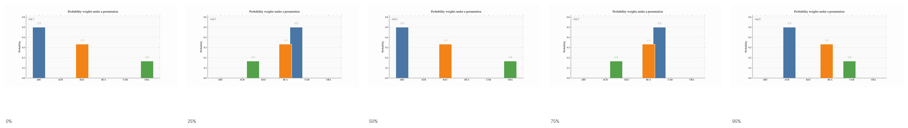

[Animation file](animations/liouville-permutation-3card.mp4)

Let's make a few observations about this example:
1. An initial arrangement is unique.
2. Under a given permutation rule, a new arrangement is dictated by the previous arrangement.
3. We can run the permutation in reverse and recover the original arrangement.
4. Two arrangements under the same number of permutations remain distinct.

These properties, which we will show exist in physical situations, are
what we mean by "determinism" and "reversibility" and, following from
these, by "distinguishability" of the ensemble under time evolution.

We can map the elements of our card deck to Hamiltonian mechanics, in
which "phase space" is position/momentum space for one body, or the
product of such for multiple bodies.

1. An arrangement -> an \(instantaneous\) state
2. All possible arrangements -> phase space
3. The count of distinct arrangements in a collection -> phase space area

The last of these elements is what we call a "measure" on the space. A
measure has a role analogous to a metric, though it does something
different. A metric measures separation. A measure assigns size to
regions or collections. In the present case, what matters is that when
such a quantity is preserved under transformation, it encodes some
regularity or structure in the space. Conservative systems bestow an
"incompressibility" on phase space. In our card deck, the discrete
analogue is already built in by the fact that the law is a permutation,
so collections of arrangements are rearranged without losing or gaining
members.

### Example -- Mass on a Spring

We see this same structure in physical systems. Consider a mass on a
spring. To speak experimentally about a probability distribution over
initial conditions, we need an ensemble, that is, many runs of the same
system, prepared by the same procedure, with initial position and
momentum drawn from some distribution around an average starting state.
At the initial time, measurements across the ensemble reveal that
distribution. We then let each member of the ensemble evolve under the
same conservative law, and at some later time we again measure position
and momentum across the ensemble. Those later measurements reveal a new
distribution.

At the full position/velocity space level, we observe, again, that the
distribution is not flattened or sharpened by the dynamics. Rather, each
exact initial state in the ensemble is carried to one exact later state,
so the later distribution is the earlier one transported by the law of
motion. In a dissipative system, nearby runs can truly be driven
together, so distinctions among initial conditions are washed out. The
extreme example of such a dissipative system is one in which all initial
conditions end at rest. But in a conservative system, such distributions
are not washed out. They are transported onto new ensembles.

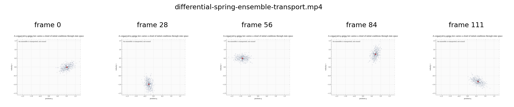

[Animation file](animations/differential-spring-ensemble-transport.mp4)

As promised, this is the direct analogue of the permutation example.
There, the state space was a finite set, the natural measure was
counting measure, and the law was a permutation. Here, the state space
is continuous, the natural measure is phase-space measure, and the law
is a Hamiltonian flow generated by conservative forces. A permutation
rearranges exact states without merging them. A Hamiltonian flow does
the same for a continuum of exact states, with phase-space measure
playing the role that counting measure played before. In conservative
physical systems, this behavior is known as Liouville's theorem.

### Information as an Incompressible Fluid

In the set permutation and physical ensembles example, we looked at
spaces of possible arrangements. We might imagine that these spaces
behave like incompressible fluids, and indeed we can see this same
structure in real fluid flows. Imagine marking out a connected patch of
an ideal incompressible fluid and then simply tracking that same patch
as the fluid moves. The patch may be stretched into a long filament,
bent, folded, or sheared almost beyond recognition. But it does not
tear, it does not split, and it does not lose its area. It remains the
same material patch, carried along by the flow.

In our card example, exact states were permuted. In the ensemble
example, exact initial conditions were carried by a Hamiltonian flow.
Here, a material patch is carried by the velocity field of the fluid. In
all three cases, the same structural fact is present that the dynamics
moves possibilities around without changing their identity as defined by
the information they encode.

One can see the beginning of that geometry in the mathematics of
ordinary incompressible flow. In two dimensions, if the velocity field
is

```math
\frac{dx}{dt} = u(x,y),\qquad \frac{dy}{dt} = v(x,y),
```

then incompressibility means

```math
\frac{\partial u}{\partial x} + \frac{\partial v}{\partial y} = 0.
```

This condition says that a small material patch does not locally
compress or expand. In two dimensions it has a powerful consequence.
There exists a scalar function \(\psi(x,y)\) such that

```math
u = \frac{\partial \psi}{\partial y},
\qquad
v = -\frac{\partial \psi}{\partial x}.
```

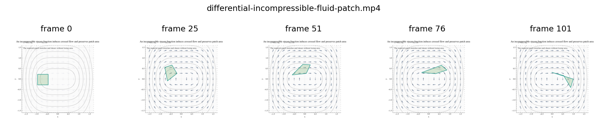

[Animation file](animations/differential-incompressible-fluid-patch.mp4)

So incompressibility forces the motion into a crossed form. Change in
one direction is generated by variation in the other. This is not yet
Hamiltonian Mechanics, because we have not yet said what the relevant
variables are. But it is the pattern Hamiltonian Mechanics will
formalize. The geometry of incompressible flow already hints that the
state of a system may come with paired directions, and that the law of
motion may preserve not lengths, but oriented area.

### Information Embodied in States

We have talked about systems that preserve the structure of
distributions. Let us now express this briefly in the language of
information theory.

How much information does a penny showing heads contain? A good way to
think about this is as a question about surprise. If a coin were
weighted so that heads always appeared, seeing heads would contain no
information at all. If it showed heads 90% of the time, seeing heads
would confirm what I already expected, and would therefore contain only
a small amount of information. But if it came up tails, it would force a
revision of my expectations. That is the sense in which it would be
informative. Let us call this quantity "surprisal." We want surprisal to
go up as probability goes down.

We also want information to add as independent systems are combined. If
I show you two independent coins that are heads, the probabilities
multiply. For a 50/50 coin, the probability of seeing two heads is 0.25.
But the information should add. In an 8-bit computer, it is natural to
say that it holds 8 bits of information rather than to characterize it
by the \(2^8\) possible bit strings it can realize. These two
requirements are met by defining the information content of an outcome
using a base-2 logarithm:

```math
I(H) = -\log_2 P(H),
```

When the probability of heads is 50%, this is exactly 1 bit. If the
probability increases, it goes down. If it decreases, it goes up.
Moreover, the information from 2 heads adds:

```math
I(HH) = -\log_2\big(P(H)P(H)\big) = -\log_2 P(H) - \log_2 P(H) = 2I(H).
```

This quantity describes the information associated with one realized
outcome. When we turn from one outcome to an ensemble, the natural
scalar quantity is the average surprisal over the whole distribution.
That is what Shannon entropy is.

There is nothing essentially different between our coin example and an
ensemble of initial conditions in a physical system. Rather than a
discrete number of possibilities, there is a continuous set, so we must
deal in probability densities rather than probabilities. With this
change, the expression for the ensemble entropy becomes:

```math
H[\rho] = -\int \rho(x)\log_2 \rho(x)\,d\mu,
```

where \(d\mu\) is the natural measure on the space of states. In this
precise sense, an ensemble is information-bearing, and the amount of
information it carries is exactly quantifiable.

Liouville's theorem implies that this fine-grained entropy is preserved
in ideal conservative evolution. That alone is not yet the full
strength of the theorem. Different probability densities can have the
same entropy while encoding different distinctions among possible
states. The informational identity of an ensemble therefore lies not
merely in the scalar \(H[\rho]\), but in the full fine-grained
arrangement of its density \(\rho(x)\) over the state space. The key
point we want to emphasize here is that the structure Hamiltonian
Mechanics illuminates pertains to the embodiment and preservation of
information in physical systems.

### The Importance of the Information Perspective

Liouville's theorem and the information-theoretic implications of
conservative systems are at the heart of statistical mechanics, in which
the exact microscopic initial conditions of the constituent bodies are
never knowable precisely, both because one cannot know the exact state
of any one particle in a continuous phase space and because the number
of combinations of microscopic states is unfathomably large, even if one
were to divide phase space into a finite number of parcels. The laws of
thermodynamics, expressing how temperature, volume, pressure, and number
of particles relate, would be impossible without understanding this
preservation of information. But even more deeply, when we move to
quantum mechanics and individual bodies give way to distributions over
possible measurements, physics must be expressed as the evolution of
distributions, for distributions are all there is.

## From the Geometry of Phase Space to Hamilton's Equations of Motion

The function that encodes flow in phase space, the flow of state through
time is the formulation's eponymous function, the Hamiltonian. Let's see
how we can arrive at its form and the equation.

### Phase Space

Phase space, or position/momentum space is the arena for Hamiltonian
Mechanics. To appreciate the theory, we need to understand the nature of
this space.

#### From histories to states

The objects in Hamiltonian Mechanics -- the state variables and the
Hamiltonian function on those variables are obtained from Lagrangian
Mechanics. We know that Lagrangian mechanics selects whole paths from
path space by extremizing action. The task we thus need to perform is to
somehow extract the essential objects of a local theory of instantaneous
state from the Lagrangian global theory.

The impact of instantaneous state displacements on action appears when
the action is varied. After integrating by parts, the variation
separates into a "bulk" term and a "boundary" term. The bulk term
determines which paths satisfy the Euler-Lagrange equations. The
boundary term, on the other hand, records how the action changes when
the endpoint state is infinitesimally changed. Isolating the boundary
term's contribution to the variation "factors out" the contribution of
state displacements from that of the full path history.

To see this explicitly, start with the expression for the action:

```math
S[q] = \int_{t_1}^{t_2} L(q,\dot q,t)\,dt.
```

Now vary the path $q(t)\to q(t)+\delta q(t)$. Because the Lagrangian
depends on both $q$ and $\dot q$, varying the path also varies the
velocity: $\dot q(t)\to \dot q(t)+\delta \dot q(t)$. The first-order
change in $L$ is therefore just the multivariable chain rule applied to
those two arguments. Then

```math
\delta S
=
\int_{t_1}^{t_2}
\left(
\frac{\partial L}{\partial q^i}\,\delta q^i
+
\frac{\partial L}{\partial \dot q^i}\,\delta \dot q^i
\right)dt.
```

The second term contains $\delta \dot q^i$ rather than $\delta q^i$, so
integrate it by parts:

```math
\int_{t_1}^{t_2}
\frac{\partial L}{\partial \dot q^i}\,\delta \dot q^i\,dt
=
\left.
\frac{\partial L}{\partial \dot q^i}\,\delta q^i
\right|_{t_1}^{t_2}
-
\int_{t_1}^{t_2}
\frac{d}{dt}\!\left(\frac{\partial L}{\partial \dot q^i}\right)\delta q^i\,dt.
```

Substituting this back in gives

```math
\delta S
=
\int_{t_1}^{t_2}
\left(
\frac{\partial L}{\partial q^i}
-
\frac{d}{dt}\frac{\partial L}{\partial \dot q^i}
\right)\delta q^i\,dt
+
\left.
\frac{\partial L}{\partial \dot q^i}\,\delta q^i
\right|_{t_1}^{t_2}.
```

As advertised, we see that the variation separates into the bulk term,
which governs the equations of motion, and the boundary term, which
governs the action's sensitivity to endpoint configuration displacement
on a time slice.

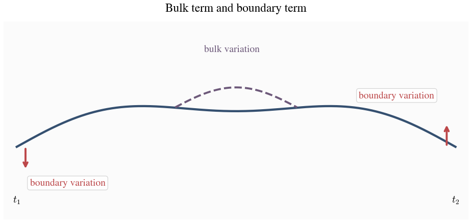

#### The Definition of Momentum

The boundary term has the form $p_i\,\delta q^i$, with

```math
p_i := \frac{\partial L}{\partial \dot q^i}.
```

This tells us what quantity is paired with an infinitesimal change in
the state at a moment. That quantity is not, in general, the velocity.
Velocity answers the question of how configuration changes along a path.
The boundary variation answers a different question: if the endpoint
state is nudged in the $q^i$ direction, what coefficient measures the
first-order change in the action? The answer is $p_i$.

The functional form of the momentum is determined by the form of the
Lagrangian function. In a free system, in which only the kinetic term
appears in the Lagrangian, $p$ arises inevitably from the theory's
kinematics. In the Newtonian free-particle theory, the kinetic term is
proportional to the square of the velocity, a fact that can be shown to
follow from Galilean symmetry, so

```math
L = \frac{1}{2}m\dot q^2,
\qquad
p = \frac{\partial L}{\partial \dot q} = m\dot q.
```

In that setting the familiar formula $p=mv$ is inherited from the
kinetic term. In a relativistic theory, by contrast, the free kinematics
is constrained by Minkowski structure and the mass-shell relation

```math
E^2 = p^2 + m^2
```

in units with $c=1$. The corresponding free Lagrangian then yields the
relativistic momentum instead.

Relativity makes this same structure visible from another angle. For a
free relativistic particle, the action is built from spacetime length,

```math
S = -m\int ds.
```

Varying an endpoint of the worldline gives a boundary term of the form

```math
\delta S_{\partial} = p_\mu\,\delta x^\mu.
```

So four-momentum is already the covector paired with spacetime
displacement in the variation of the action. If we choose a time
coordinate, this pairing splits into spatial and temporal pieces,

```math
p_\mu\,\delta x^\mu = p_i\,\delta q^i - E\,\delta t,
```

up to sign convention. Holding endpoint time fixed leaves precisely the
spatial boundary pairing $p_i\,\delta q^i$. Thus the Hamiltonian pairing
is not a new structure invented after Lagrangian mechanics. It is the
time-sliced form of a relation that relativistic mechanics displays
directly among action, displacement, and momentum.

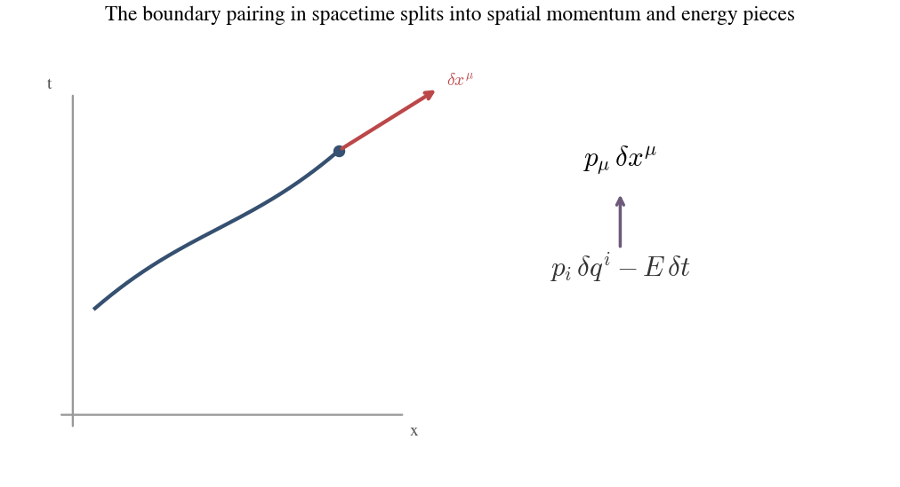

So far, however, this is still a statement about how the action responds
when one state is infinitesimally displaced. Liouville's theorem
concerns not one state, but patches of nearby states. For that we need
an object that measures phase-space area rather than endpoint
sensitivity.

#### From the one-form to the two-form

Thus far, the action has identified $q$ and $p$ as the correct paired
variables for specifying instantaneous state. But the pairing
$p_i\,\delta q^i$ is a one-form statement: it acts on one
infinitesimal displacement of one state and returns the first-order
change in the action. Liouville's theorem and the information story ask
a different question. They concern patches of nearby states in phase
space, not one displaced state at a time.

Once the action has identified $q^i$ and $p_i$ as conjugate variables,
the natural oriented area element on their space is the two-form

```math
dq^i \wedge dp_i.
```

It takes in two tangent directions and returns an oriented area.
Integrating it over a region of phase space measures the
"count," or "amount" of states in the region. Once we have the 2-form,
we can see the job of Hamiltonian mechanics as finding flows under which
the area measured by the 2-form is invariant.

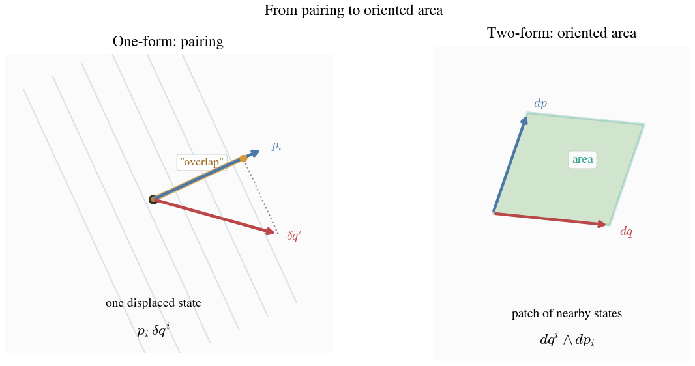

There is also a deeper reason this two-form, rather than the boundary
one-form itself, is the intrinsic object. The equations of motion are
determined by the bulk term in the action and are unchanged if the
Lagrangian is modified by an endpoint-only term. Such a modification
shifts the boundary one-form, but leaves the two-form unchanged. This
matches the physics: Hamiltonian flows will preserve area in phase
space, not any notion of length or absolute endpoint accounting.

We derive this below, though this can be skipped if desired. Add a total
time derivative to the Lagrangian:

```math
L' = L + \frac{dF(q,t)}{dt}.
```

This changes the action by an endpoint term:

```math
S'
=
\int_{t_1}^{t_2} L'\,dt
=
S + F(q(t_2),t_2)-F(q(t_1),t_1).
```

Intuitively, this is like adding "final elevation minus initial
elevation" to the cost of a hike with fixed endpoints. It changes the
endpoint accounting, but it does not change which interior route
extremizes the cost.

The boundary one-form shifts by the differential of that added endpoint
function:

```math
\theta' = \theta + dF.
```

Here

```math
\theta = p_i\,dq^i.
```

But the two-form is built by taking the exterior derivative of the
one-form:

```math
\omega = d\theta.
```

So after the shift,

```math
\omega'
=
d\theta'
=
d(\theta + dF)
=
d\theta + d(dF)
=
d\theta
=
\omega.
```

#### What Phase Space Is

We are now able to define phase space. It is the space whose points are
instantaneous states expressed in the paired, or conjugate, variables
selected by the action. For one degree of freedom, a point is $(q,p)$.
For many degrees of freedom, a point is
$(q^1,\dots,q^n,p_1,\dots,p_n)$. Phase space is a reorganization of
what counts as an instantaneous state with respect to action
extremization. Once the boundary variation has told us what variable is
paired with $q$, the state is no longer most naturally described by
$(q,\dot q)$, but by $(q,p)$.

### Hamiltonian Flows

Compare phase space plots to spacetime diagrams \(Galilean or
Minkowskian\). There, motion is baked into the shape of the worldline.
The history is contained in a static plot. In phase space, there is no
motion, no history, until a point or region begins to flow. Our next
task, then, is to describe the flows that characterize conservative
physical systems. The function that encodes flow in phase space, the
flow of state through time, is the formulation's eponymous function, the
Hamiltonian. Let's see how we can arrive at its form and the equation.

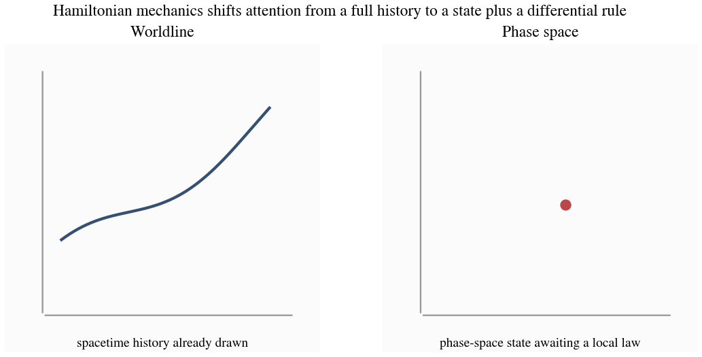

#### Functions on phase space

We have already seen in our example of an incompressible fluid that any
flow can be encoded by a generating function. Let's spell this out more
carefully and put it in the arena of phase space.

Picture a contour map on the $q,p$ plane. The value of a function,
$F(q(t),p(t))$, assigns a height to each point. This 3-dimensional
"hilly" picture can, as with topographic maps, be represented in 2
dimensions with contours, or level sets. Now, we have a rule that the
denser the level sets are, equivalently, the steeper the surface is, the
faster the flow along that contour. This flow can then be represented as
a vector field, that is, a phase-space velocity arrow at every point.

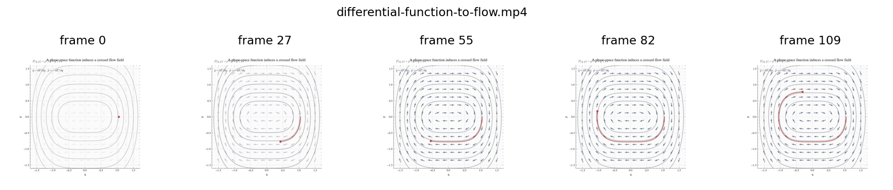

[Animation file](animations/differential-function-to-flow.mp4)

The way to turn $F$'s level set density into such a vector field is:

```math
\dot q^i = \frac{\partial F}{\partial p_i},
\qquad
\dot p_i = -\frac{\partial F}{\partial q^i}.
```

These cross-coupled equations are the dynamical face of the same
pairing that appeared geometrically as $dq^i \wedge dp_i$. What there
showed up as an oriented area form here shows up as motion in one
direction driven by variation in the other.

One can work through this visually step by step to convince themselves
it works, but the way it works can be thought of simply as taking the
function gradient vector and turning it 90 degrees to create the flow.

In phase space with one degree of freedom, if the vector field is

```math
\dot q = \frac{\partial F}{\partial p},
\qquad
\dot p = -\frac{\partial F}{\partial q},
```

then we can solve these differential equations for $q(t)$ and $p(t)$ to
find the flow.

A trivial example is $F=p$. Then

```math
\dot q = 1,
\qquad
\dot p = 0.
```

And integrating gives

```math
q(t) = q_0 + t,
\qquad
p(t) = p_0.
```

We see in these cross-coupled differential equations the shadow of
symplectic area preservation:

```math
\omega = dq^i \wedge dp_i
```

Change of $F$ in the $p_i$ direction determines motion in the $q^i$
direction. Change of $F$ in the $q^i$ direction determines motion in the
$p_i$ direction, with a minus sign.

We can define a flow this way for any two variables, but it only has a
physical interpretation in the kinds of cases we've discussed, like
fluid flow, that is, in cases where the area form is preserved.

#### Preservation of the Symplectic Area Form

Let's now show a bit more rigorously that such a flow does in fact
preserve the symplectic 2-form. In one degree of freedom, preserving
$\omega$ means preserving the area of phase-space patches. A small
quadrilateral may shear, stretch, or rotate, but its area must not
change.

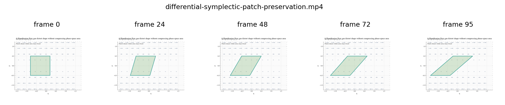

[Animation file](animations/differential-symplectic-patch-preservation.mp4)

Let's first be precise in saying what $\omega$ is. It is a measure of
the count of states. If we imagine phase space as a discrete lattice, it
counts the number of nodes in a patch. If we were to "squeeze" that
patch, the node count would stay the same, thus the 2-form would measure
the same area. (If we think of the continuous case as a lattice with
infinite node density, then "squeezing" becomes impossible, and our area
measure becomes, in fact, a measure of area on a plot of phase space.)
Thus the only way for an area patch to increase is for states to enter
or exit it, that is, for there to be some source or sink of states,
which in turn implies that the flow generated by $F$ has a non-zero
divergence. But we can see that this flow has zero divergence. For the
flow generated by $F$,

```math
\frac{\partial \dot q^i}{\partial q^i}
+
\frac{\partial \dot p_i}{\partial p_i}
=
\frac{\partial}{\partial q^i}\left(\frac{\partial F}{\partial p_i}\right)
-
\frac{\partial}{\partial p_i}\left(\frac{\partial F}{\partial q^i}\right).
```

Since mixed partial derivatives agree,

```math
\frac{\partial^2 F}{\partial q^i \partial p_i}
-
\frac{\partial^2 F}{\partial p_i \partial q^i}
=
0.
```

The divergence vanishes:

```math
\frac{\partial \dot q^i}{\partial q^i}
+
\frac{\partial \dot p_i}{\partial p_i}
=
0.
```

Thus, any smooth function on phase space preserves our area 2-form,
which, as we have discussed, is the condition for maintaining the
information structure of an ensemble.

We should note that we have shown this by choosing a set of coordinates
first, describing flows, then showing these preserve our 2-form. This is
a bit unsatisfying for two reasons. First, logically, we would prefer to
show that having a conserved 2-form defines Hamiltonian flows because
our procedure for defining the flows tacitly presupposed symplectic
geometry. Second, to demonstrate consistency of a flow with the
preservation of the 2-form, we had to commit to a coordinate system,
whereas one can show Hamiltonian flows arise from the 2-form without
choosing coordinates. The approach of defining flows from the area form
is readily doable, but makes the geometric intuition more opaque and
requires learning some dedicated language from differential geometry.

#### The Hamiltonian as Energy

We have already seen the deep connection between energy and time in
Relativity. In relativity, the action for a free particle is built from
spacetime length:

```math
S = -m \int ds = -\int E\,dt + \int p_x\,dx + \int \cdots
```

In this picture, 4-momentum is the covector, or 1-form, that measures
the contribution of a displacement in spacetime to action. And energy is
the component that measures the contribution of a time displacement.

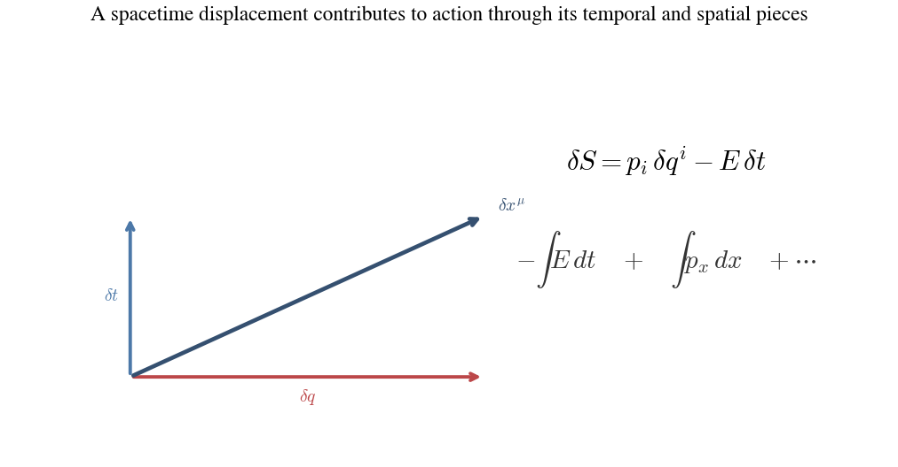

We are attempting to find the function to generate the flow in phase
space that represents time evolution. Since that evolution is dictated
by an action extremization principle, we may suspect this function would
be related to the form that measures the effect of a time displacement
on action accumulation.

In fact this is exactly right. Ignoring important exceptions that don't
change the spirit of the structure, the Hamiltonian function we wish to
find is the energy function. One may say somewhat poetically "energy
generates time."

#### Hamilton's Equations of Motion from the Legendre Transform

Once the variables $(q,p)$ have been identified, the next task is to
find the function on phase space that generates the physical
time-evolution flow. The Lagrangian is not yet that function. It is
written as

```math
L(q,\dot q),
```

so it still treats velocity as an independent variable. The function we
want must instead be written on phase space:

```math
H(q,p).
```

The Legendre transform is the operation that performs this trade. It
uses the momentum relation we have established:

```math
p_i = \frac{\partial L}{\partial \dot q^i}
```

to replace the velocity variables by their conjugate momenta, while
carrying the position variables along. The transformed function is

```math
H(q,p) = p_i\dot q^i - L(q,\dot q),
```

with $\dot q$ understood, when possible, as a function of $(q,p,t)$
determined by the momentum equation above.

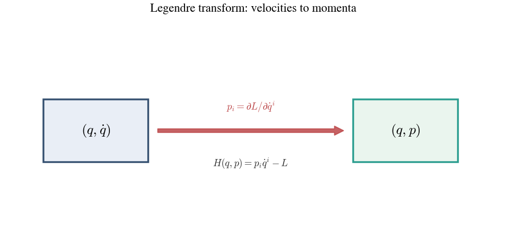

We can do a quick test that $H$ is indeed the total energy by looking at
a free particle.

For a non-relativistic free particle,

```math
L(q,\dot q) = \frac{1}{2}m\dot q^2.
```

The conjugate momentum is therefore

```math
p = \frac{\partial L}{\partial \dot q} = m\dot q,
```

so

```math
\dot q = \frac{p}{m}.
```

Substituting this into the Legendre transform gives

```math
H(q,p) = p\dot q - L(q,\dot q)
= p\left(\frac{p}{m}\right) - \frac{1}{2}m\left(\frac{p}{m}\right)^2
= \frac{p^2}{m} - \frac{p^2}{2m}
= \frac{p^2}{2m}.
```

But this is exactly the kinetic energy of the particle. So in this
simplest case, the Legendre transform gives the energy function
directly.

The importance of this construction is not only that it rewrites the
function in the desired variables. In the earlier phase-space
discussion, we saw what differential structure a function must have if
it is to generate a flow. We now want to see that the
Legendre-transformed function has exactly that structure. Taking the
differential of $H$ gives

```math
dH
=
\dot q^i\,dp_i
+
p_i\,d\dot q^i
-
\frac{\partial L}{\partial q^i}\,dq^i
-
\frac{\partial L}{\partial \dot q^i}\,d\dot q^i
```

Now use the definition

```math
p_i = \frac{\partial L}{\partial \dot q^i}.
```

The $d\dot q^i$ terms cancel. What remains is

```math
dH
=
\dot q^i\,dp_i
-
\frac{\partial L}{\partial q^i}\,dq^i
```

At this stage the transform has done its essential job. Velocity is no
longer appearing as an independent differential. The theory has been
rewritten in phase-space terms.

To connect this with the original dynamics, use the Euler-Lagrange
equations:

```math
\frac{d}{dt}\frac{\partial L}{\partial \dot q^i}
=
\frac{\partial L}{\partial q^i}.
```

Since $p_i = \partial L/\partial \dot q^i$, this becomes

```math
\dot p_i = \frac{\partial L}{\partial q^i}.
```

Substituting this into the expression for $dH$ gives

```math
dH
=
\dot q^i\,dp_i
-
\dot p_i\,dq^i
```

But because $H$ is now a function of $(q,p)$, its differential is also

```math
dH
=
\frac{\partial H}{\partial q^i}\,dq^i
+
\frac{\partial H}{\partial p_i}\,dp_i
```

Matching coefficients then yields the actual point of Hamiltonian
mechanics for solving classical physics problems, Hamilton's equations
of motion:

```math
\dot q^i = \frac{\partial H}{\partial p_i},
\qquad
\dot p_i = -\frac{\partial H}{\partial q^i}.
```

We can check this works using the example of a simple harmonic
oscillator.

The total energy, and thus the Hamiltonian is:

```math
H(q,p) = T + V = \frac{p^2}{2m} + \frac{1}{2}kq^2.
```

Hamilton's equations then give:

```math
\dot q = \frac{\partial H}{\partial p} = \frac{p}{m},
\qquad
\dot p = -\frac{\partial H}{\partial q} = -kq.
```

Using $p = m\dot q$, this becomes:

```math
m\ddot q = -kq,
```

or

```math
\ddot q + \frac{k}{m}q = 0.
```

At this point we have the local differential formulation of mechanics
in hand. The next step is not to change that mechanics, but to rewrite
the same structure in a new language. The flow picture we have just
developed can also be expressed as an algebra of functions on phase
space, and that repackaging will make further structure visible.

## Lie Algebra of Phase Space

### What we mean by an algebra

We can now re-express Hamiltonian mechanics as an algebra of functions
on phase space. To say this clearly, we should first say what an
algebra is. An
algebra begins with some class of objects and then specifies two things:
what operations may be performed on those objects, and what laws those
operations satisfy. Different algebras may involve different objects,
different operations, and different laws, but these differences still
fall into a common taxonomy. Numbers with addition and multiplication
are the familiar schoolroom example. Let us first examine that taxonomy,
and then turn to the specific algebra relevant here.

#### Taxonomy of operations

| Category | Meaning | Example |
|---|---|---|
| Unary | Takes one input | Negation: $x \mapsto -x$ |
| Binary | Takes two inputs | Addition: $(x,y) \mapsto x+y$ |
| Internal | Takes allowed objects as input and returns another allowed object of the same kind | Sum of two functions is a function |
| External | Combines an allowed object with something outside the class | Scalar multiplication |

Algebras are "closed," meaning that when allowed objects are combined,
the result is again an allowed object of the same kind.

#### Taxonomy of laws

| Category | Meaning | Example |
|---|---|---|
| Symmetry law | Governs what happens when inputs are swapped | Commutativity, antisymmetry |
| Grouping law | Governs what happens when an operation is repeated | Associativity |
| Linearity law | Governs behavior under sums and scalar multiples | Linearity, bilinearity |
| Compatibility law | Governs how two different operations interact | Distributive law, Leibniz rule |
| Consistency law | Governs deeper structural coherence | Jacobi identity |

### Poisson Algebra

We can now turn from this general taxonomy to the specific algebra built
from functions on phase space called Poisson algebra. This does not
replace the flow picture just developed. It reorganizes that same
mechanics into algebraic form. In Hamiltonian mechanics, the objects
will be smooth functions on phase space. These
include the familiar physical quantities position, momentum, energy, and
angular momentum, but also arbitrary smooth functions with no associated
physical observable. At the same time, these functions define vector
fields on phase space under which the variation of any other function
can be found. Through the algebraic lens, one may study not only the
motion of states through phase space, but also the relationships in the
full space of functions defined on it. The "Poisson" algebra is the
structure that organizes these functions.

A Poisson algebra belongs to the broader class of Lie algebras. In the
usual symmetry setting, the finite objects are transformations that
preserve some invariant quantity. For example, planar rotations preserve
the Euclidean length $x^2+y^2$, and may be written as a one-parameter
family of matrices $R_{\theta}$. The infinitesimal objects are the
generator matrices $A$ from which the finite transformations are built.
In that setting one writes

```math
R_\theta = e^{\theta A},
```

so exponentiation turns an infinitesimal generator into a parameterized
family of finite transformations.

The Hamiltonian case has the same broad architecture, but with
different objects. The finite objects are canonical transformations,
meaning transformations of phase space that preserve the symplectic
form. If we write one such family as $\phi_t$, then for each fixed
value of $t$ the map $\phi_t$ is one canonical transformation, while the
whole family $t \mapsto \phi_t$ is the flow. The infinitesimal objects
are vector fields on phase space. Integrating such a vector field gives
the corresponding flow. In this setting, integration of a differential
equation plays the same structural role that exponentiation played in
the matrix example: it turns an infinitesimal generator into a finite
transformation.

Poisson algebra has one extra layer not usually visible in the standard
matrix picture. We do not usually write the infinitesimal generators
directly as vector fields. Instead, we write functions on phase space.
Each smooth function $f$ determines a vector field $X_f$, and that
vector field in turn determines a flow of canonical transformations.
The word "generate" is therefore being used in two nearby senses:
functions determine vector fields, and vector fields determine flows.
The chain of objects is

```text
function -> vector field -> flow -> canonical transformations.
```

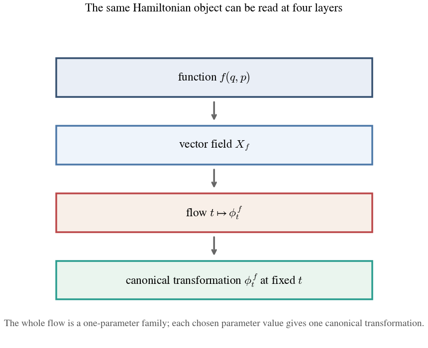

This is the sense in which functions participate in a Lie algebra. The
bridge between the vector-field level and the function level is

```math
[X_f,X_g] = X_{\{f,g\}},
```

up to sign convention. The bracket on the left is the Lie bracket of
vector fields. The bracket on the right is the Poisson bracket of
functions. This identity says that the Lie algebra of infinitesimal
canonical transformations persists when one passes from vector fields to
the functions that encode them.

The payoff is that one can work in the flat space of infinitesimal
generators rather than in the curved space of finite transformations.
That is what makes an algebra possible here, and it is what makes
relations and theorems available through algebraic manipulation.

#### The operations of the algebra

The objects of Poisson algebra are smooth functions on phase space. The
first operations on this space are the obvious ones:

| Operation | Type | Specific operation | Result |
|---|---|---|---|
| $f+g$ | Binary, internal | Addition of functions | Another smooth function |
| $cf$ | Binary, external | Scalar multiplication | Another smooth function |
| $fg$ | Binary, internal | Pointwise multiplication of functions | Another smooth function |

These operations already make smooth functions into a familiar algebraic
object. Hamiltonian mechanics adds one more binary internal operation,
the Poisson bracket:

```math
\{f,g\}
=
\frac{\partial f}{\partial q^i}\frac{\partial g}{\partial p_i}
-
\frac{\partial f}{\partial p_i}\frac{\partial g}{\partial q^i}.
```

With $f$ held fixed, $\{f,g\}$ is the infinitesimal change of $g$ when
the state is moved along the phase-space vector field determined by $f$.
The result is again a smooth function on phase space, so the function
space is closed under the bracket.

#### The laws of the algebra

The Poisson bracket is not an arbitrary new operation. It satisfies the
laws that make the function space into a Lie algebra:

```math
\{af_1 + bf_2,g\}
=
a\{f_1,g\}+b\{f_2,g\},
```

and likewise in the second slot, so the bracket is bilinear.

It is antisymmetric:

```math
\{f,g\} = -\{g,f\}.
```

And it satisfies the Jacobi identity:

```math
\{f,\{g,h\}\}+\{g,\{h,f\}\}+\{h,\{f,g\}\}=0.
```

This is the Lie-bracket analogue of the kind of coherence that
associativity gives in ordinary multiplication. It does not say that
different nestings are equal. It says instead that the failure of the
bracket to associate is controlled in a consistent way.

In addition, because the objects are still ordinary functions, the
bracket is compatible with function multiplication through the Leibniz,
or product, rule:

```math
\{f,gh\}=\{f,g\}h+g\{f,h\}.
```

This is the familiar product rule from calculus in a new setting. With
$f$ held fixed, the operation $g \mapsto \{f,g\}$ behaves like a
derivative acting on functions. The bracket does not treat the product
$gh$ as an opaque whole. It acts on one factor and then on the other.

#### Physical Relationships Illuminated by Poisson Algebra

Once the Poisson bracket is in hand, physical relationships that
previously had to be written as separate differential statements can be
compressed into algebraic ones. The simplest example is the canonical
pairing itself:

```math
\{q,p\}=1,
\qquad
\{p,q\}=-1.
```

This says that position and momentum are not just two coordinates placed
side by side. They are paired in a specific algebraic way. The sign flip
under reversal reflects the antisymmetry of the bracket.

The master dynamical statement is that, for any smooth function $f$ on
phase space,

```math
\dot f = \{f,H\},
```

assuming $f$ has no explicit time dependence. In this form, time
evolution itself becomes a bracket relation. Hamilton's equations are
the special cases obtained by taking $f=q$ and $f=p$:

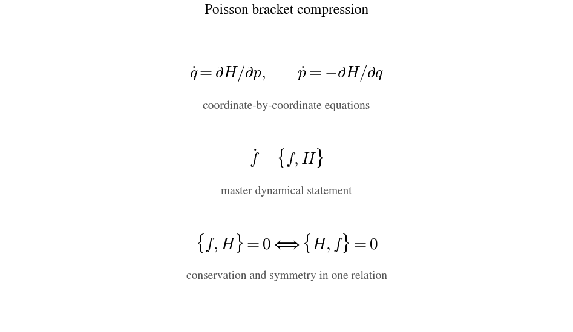

```math
\dot q = \{q,H\} = \frac{\partial H}{\partial p},
\qquad
\dot p = \{p,H\} = -\frac{\partial H}{\partial q}.
```

Conservation laws also become algebraic statements. If

```math
\{p,H\}=0,
```

then $\dot p=0$, so momentum is conserved along the Hamiltonian
evolution. More generally, if

```math
\{f,H\}=0,
```

then the quantity $f$ is conserved in time.

Because the bracket is antisymmetric, the same vanishing relation may be
read in reverse:

```math
\{f,H\}=0
\qquad \Longleftrightarrow \qquad
\{H,f\}=0.
```

This is the compact meeting point of the two Noether directions. Read
one way, it says that $f$ is conserved under the time evolution
generated by $H$. Read the other way, it says that the transformation
generated by $f$ leaves $H$ unchanged. Conservation and symmetry thus
appear as two readings of the same algebraic relation.

#### Look Ahead to Quantum Mechanics

This algebraic viewpoint provides a bridge from Hamiltonian mechanics
into quantum mechanics. There, the classical geometry of states as
points moving through phase space no longer carries over in the same
direct form, and much of the new theory remains to be understood on its
own terms. What does carry over cleanly is the algebraic structure of
observables, generators, and their bracket relations. By replacing
functions with operators and Poisson brackets with commutators, one can
lift a large part of Hamiltonian structure forward before learning the
geometry native to the quantum theory. The geometry changes, but the
algebra transports.

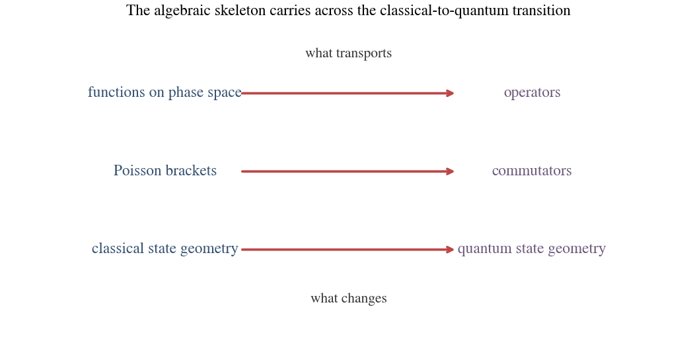
