# Differential Mechanics

Lagrangian Mechanics gives us a foundational way to formulate the laws of motion. We write down an invariant quantity in a spacetime geometry, extremize it, and recover the physical path. The particle, we may say, has "learned" what the right trajectory is by solving an optimization problem. The global formulation is conceptually prior to the local formulation in the strict sense that the central objects of the differential formulation, the quantities that will become momentum and energy in the local theory, are derived from the global formulation. 

"Hamiltonian Mechanics" is the name we give to the modern version of the local, differential perspective. Instead of selecting a whole history at once, it treats motion as the flow in time of one instantaneous state to the next. Hamiltonian mechanics is an elegant formulation of classical mechanics, but if elegance were all it provided, it would not belong here in our treatment of the conceptual foundations of physics. In fact, it does more than recast Lagrangian Mechanics in local form. It makes visible statistical and algebraic structure that is difficult to see in Lagrangian form and that later becomes essential to quantum mechanics. First, it reveals how statistical ensembles evolve in ways not visible from individual trajectories. Second, by encoding laws of global trajectories into the local geometry of infinitesimal state changes, it allows those laws to be expressed in an algebra of generators.

## The Evolution of Ensembles in Physical Systems

At face value, the role of physical laws appears to be to predict individual trajectories from initial conditions. Yet in conservative systems, where energy is not dissipated into inaccessible microscopic degrees of freedom, the laws guiding the evolution of single states additionally imply that the information encoded in a distribution of states is preserved. This is a categorically different kind of claim, not about one particle's initial conditions and its future, but about the collective behavior of an ensemble. The key to this emergent structure is that deterministic, reversible evolution keeps distinct initial states distinct. Once that is true, an ensemble can move through state space without losing the measure of how many states it contains.

### Example: Preserved Information in a Permutation

We can get a feel for this kind of information-preserving evolution with a simple discrete example. Take a deck of three cards labeled `A`, `B`, and `C`. The exact possible states are the six deck orders

```text
ABC, ACB, BAC, BCA, CAB, CBA.
```

Now choose one specific permutation of these states, for example, move the top card to the bottom. Then

```text
ABC -> BCA
BCA -> CAB
CAB -> ABC
ACB -> CBA
CBA -> BAC
BAC -> ACB
```

Now assign a probability distribution on these six exact states. For example,

```text
P(ABC) = 1/2
P(BAC) = 1/3
P(CBA) = 1/6
```

with all other states assigned probability `0`. After applying the permutation to all arrangements consistent with the distribution, the distribution becomes

```text
P(BCA) = 1/2
P(ACB) = 1/3
P(BAC) = 1/6
```

with all other states still assigned probability `0`. The same probability weights are still present. They have only been reassigned to different exact states.


*The law changes which arrangement carries each probability weight, but the weights themselves are only rearranged.*

[Open MP4: liouville-permutation-3card.mp4](animations/liouville-permutation-3card.mp4)

A few structural facts are worth making explicit:
1. An initial arrangement is unique.
2. Under a given permutation rule, a new arrangement is dictated by the previous arrangement.
3. We can run the permutation in reverse and recover the original arrangement.
4. Two arrangements under the same number of permutations remain distinct.

These properties, which we will show exist in physical situations, are what we mean by "determinism" and "reversibility" and, following from these, by "distinguishability" of the ensemble under time evolution.

We can map the elements of the card deck to Hamiltonian mechanics. There, the relevant state space is the space of positions and momenta together. This is phase space. For one body, it is position/momentum space. For many bodies, it is the product of such spaces.

1. An arrangement -> an instantaneous state
2. All possible arrangements -> phase space
3. The count of distinct arrangements in a collection -> phase space area

The last of these elements is what we call a "measure" on the space. A measure has a role analogous to a metric, though it does something different. A metric measures separation. A measure assigns size to regions or collections. What matters here is whether that size is preserved as the system evolves. In the card deck, preservation is built in. The law is a permutation, so a collection of arrangements can be rearranged, but it cannot gain or lose members.

### Example: Preserved Information in a Physical Ensemble

We see this same structure in conservative physical systems such as the ideal pendulum. Prepare many runs with slightly different initial angles and momenta. At the initial time, measurements across the ensemble reveal a distribution in phase space. We then let each member of the ensemble evolve under the same conservative law, and at some later time we again measure position and momentum across the ensemble. Those later measurements reveal a new distribution that has the same features as the original. Each exact initial state in the ensemble is carried to one exact later state, so the later distribution is the earlier one transported by a deterministic, reversible rule. In a dissipative system, nearby runs can truly be driven together, so distinctions among initial conditions are washed out, the extreme case being when all initial conditions end at rest. But in a conservative system, such distributions are not washed out. They are transported to new regions of state space.

The first animation below shows how nearby initial conditions can end in different regimes of motion. The second animation shows that even as an area patch is deformed to follow states in these different regimes, the area is preserved.


*Small changes in initial state can carry the pendulum into different regimes while the motion remains deterministic.*

[Open MP4: differential-pendulum-regimes.mp4](animations/differential-pendulum-regimes.mp4)


*A small cloud of nearby initial conditions is stretched and transported without being collapsed into a single state.*

[Open MP4: differential-pendulum-ensemble-phase-space.mp4](animations/differential-pendulum-ensemble-phase-space.mp4)

The pendulum is an analogue of the permutation example. There, the state space was a finite set, the natural measure was counting measure, and the law was a permutation. Here, the state space is continuous. Its points are instantaneous angle/momentum states, its natural measure is a measure of area on state space, and its law of motion is a Hamiltonian flow. A permutation rearranges exact states without merging them. A Hamiltonian flow does the same for a continuum of exact states. Area in state space plays the role that counting measure played before. In conservative physical systems, this behavior is known as Liouville's theorem. Formally, if $\Phi_t$ is the Hamiltonian time-evolution map and $A$ is any measurable region of phase space, then

```math
\mu(\Phi_t(A)) = \mu(A),
```

where $\mu$ is the natural measure on phase space.

### Information as an Incompressible Fluid

In the examples above, we looked at spaces of possible arrangements. A useful analogy is a planar incompressible flow. Imagine marking out a connected patch in the plane and then tracking that same patch as it is carried by the flow. The patch may be stretched, folded, or sheared, but it does not split or change its area. It remains the same material patch, carried along by the flow.

In the card example, exact states were permuted. In the pendulum ensemble example, exact initial conditions were carried by a Hamiltonian flow. Here, a material patch is carried by the velocity field of the fluid. In all three cases, a rule transports a structured object without erasing its structure.

Fluids make the geometric character of this structure easier to see. A planar flow is described by a velocity field. If a point at position $(x,y)$ has velocity $(u(x,y),v(x,y))$, then its motion is governed by

```math
\frac{dx}{dt} = u(x,y),\qquad \frac{dy}{dt} = v(x,y),
```

and incompressibility means

```math
\frac{\partial u}{\partial x} + \frac{\partial v}{\partial y} = 0.
```

The two terms measure the rate at which a small material patch carried by the flow expands or contracts along the two coordinate directions. If their sum is zero, any expansion in one direction is exactly balanced by contraction in the other, so a small material patch does not locally change area. In two dimensions this condition has a powerful consequence. There exists a scalar function $\psi(x,y)$ such that

```math
u = \frac{\partial \psi}{\partial y},
\qquad
v = -\frac{\partial \psi}{\partial x}.
```

In two dimensions, incompressibility lets the velocity field be generated from this single scalar function in a cross-coupled form. Motion in the $x$ direction is determined by how the scalar function $\psi$ varies in the $y$ direction, and motion in the $y$ direction is determined by how $\psi$ varies in the $x$ direction. Hamiltonian Mechanics shares this cross-coupled differential structure.


*The marked patch changes shape under the planar flow while preserving its area.*

[Open MP4: differential-incompressible-fluid-patch.mp4](animations/differential-incompressible-fluid-patch.mp4)

### Embodied Information
We have described how systems preserve information as they evolve. Information cannot exist without some embodiment, be that in switches in a computer or molecules in a gas. To appreciate how physical systems embody information, we need to understand a bit about information theory itself.

How much information does a penny showing heads contain? A good way to think about this is as a question about surprise. If a coin were weighted so that heads always appeared, seeing heads would contain no information at all. If it showed heads 90% of the time, seeing heads would largely confirm expectations, and would therefore contain only a small amount of information. But if it came up tails, it would force a revision of expectations. Let us call this quantity "surprisal." We want surprisal to go up as probability goes down.

We also want information to count independent distinctions additively. If one fair coin toss resolves one binary uncertainty, then two independent fair coin tosses resolve two such uncertainties. We do not want to say that the second coin makes the information four times larger simply because the joint probability of two heads is $1/4$. The number of possible outcomes multiplies, but the number of independent binary distinctions adds. An 8-bit register is said to hold 8 bits, even though it can realize $2^8$ possible bit strings. These two requirements are met by defining the information content of an outcome using a base-2 logarithm:

```math
I(H) = -\log_2 P(H),
```

When the probability of heads is 50%, this is exactly 1 bit. If the probability increases, it goes down. If it decreases, it goes up. Moreover, the information from 2 heads adds:

```math
I(HH) = -\log_2\big(P(H)P(H)\big) = -\log_2 P(H) - \log_2 P(H) = 2I(H).
```

This quantity describes the information associated with one realized outcome. When we turn from one outcome to an ensemble, the natural scalar quantity is the average surprisal over the whole distribution. This is Shannon entropy.

This same idea applies to an ensemble of initial conditions in a physical system. Rather than a discrete number of possibilities, there is a continuous set, so we must deal in probability densities rather than probabilities. With this change, the expression for the ensemble entropy becomes:

```math
H[\rho] = -\int \rho(x)\log_2 \rho(x)\,d\mu,
```

where $d\mu$ is the natural measure on the space of states. In this sense, a physical ensemble contains a quantifiable amount of information.

Liouville's theorem implies that this entropy is preserved in ideal conservative evolution. But entropy is only a scalar summary of a distribution. Different densities can have the same entropy while assigning probability to different regions of state space. The stronger statement is that Hamiltonian evolution transports the density itself. If $\rho_0$ is the initial density, then the later density is the same probability structure carried forward by the flow. The information is embodied not merely in the number $H[\rho]$, but in the full distribution over possible states.

The information-theoretic implications of conservative systems are central to statistical mechanics. There, the exact microscopic state of a system is not practically knowable. A gas, for example, has too many microscopic degrees of freedom to track directly, and even a finite partition of phase space would leave an unfathomably large number of possible microscopic arrangements. Statistical mechanics works by replacing exact microscopic knowledge with distributions over possible states, and then asking how those distributions evolve. Macroscopic quantities such as temperature, pressure, volume, and particle density are then understood statistically without requiring knowledge of specific states.

More fundamentally, the role of distribution will be promoted to the state itself in quantum mechanics, where physics is no longer organized around definite classical states, but around probability distributions over possible measurement outcomes.

## Phase Space

Phase space, or position/momentum space, is the arena for Hamiltonian Mechanics. To appreciate the theory, we need to understand the origin, geometry, and role of this space.

### From Histories to States

The objects in Hamiltonian Mechanics -- the state variables and the Hamiltonian function on those variables are obtained from Lagrangian Mechanics. We know that Lagrangian mechanics selects whole paths from path space by extremizing action. The task we thus need to perform is to extract the essential objects of a local theory of instantaneous state from the Lagrangian global theory.

The impact of instantaneous state displacements on action appears when the action is varied. After integrating the Lagrangian by parts, the variation separates into a bulk term and a boundary term. The bulk term concerns what happens in the interior of the path. Since the interior is what the path does between its endpoints, requiring the bulk contribution to vanish for arbitrary interior variations gives the Euler-Lagrange equations. That is, the equations of motion must be consistent with the path taken once we know the endpoints. The boundary term in contrast concerns how a segment of history meets a time slice, that is, how an infinitesimal change to an instantaneous state affects the action. If we imagine chopping a path into smaller and smaller pieces, in a sense all that is left is a series of boundary terms, each corresponding to successive instantaneous states. The boundary term records how the action changes when that state is infinitesimally displaced, and its coefficient will become the momentum.

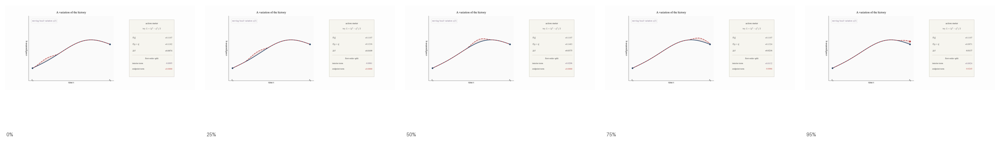

*A path variation separates into an interior condition on the path and a boundary contribution at the time slice.*

[Open MP4: differential-bulk-boundary-variation.mp4](animations/differential-bulk-boundary-variation.mp4)

To see this explicitly, start with the expression for the action:

```math
S[q] = \int_{t_1}^{t_2} L(q,\dot q,t)\,dt.
```

Now vary the path $q(t)\to q(t)+\delta q(t)$. Because the Lagrangian depends on both $q$ and $\dot q$, varying the path also varies the velocity: $\dot q(t)\to \dot q(t)+\delta \dot q(t)$. The first-order change in $L$ is therefore just the multivariable chain rule applied to those two arguments. Then

```math
\delta S
=
\int_{t_1}^{t_2}
\left(
\frac{\partial L}{\partial q^i}\,\delta q^i
+
\frac{\partial L}{\partial \dot q^i}\,\delta \dot q^i
\right)dt.
```

The second term contains $\delta \dot q^i$ rather than $\delta q^i$. But the velocity variation is not independent. It is the time derivative of the path variation, $\delta \dot q^i = \frac{d}{dt}\delta q^i$. Since the path displacement $\delta q^i$ is the arbitrary object, integrate by parts to move that time derivative off the variation.

```math
\int_{t_1}^{t_2}
\frac{\partial L}{\partial \dot q^i}\,\delta \dot q^i\,dt
=
\left.
\frac{\partial L}{\partial \dot q^i}\,\delta q^i
\right|_{t_1}^{t_2}
-
\int_{t_1}^{t_2}
\frac{d}{dt}\!\left(\frac{\partial L}{\partial \dot q^i}\right)\delta q^i\,dt.
```

Substituting this back in gives

```math
\delta S
=
\int_{t_1}^{t_2}
\left(
\frac{\partial L}{\partial q^i}
-
\frac{d}{dt}\frac{\partial L}{\partial \dot q^i}
\right)\delta q^i\,dt
+
\left.
\frac{\partial L}{\partial \dot q^i}\,\delta q^i
\right|_{t_1}^{t_2}.
```

The variation separates into the bulk term, which governs the equations of motion, and the boundary term, which governs the action's sensitivity to endpoint configuration displacement on a time slice.

### The Definition of Momentum

The boundary term has the form $p_i\,\delta q^i$, with

```math
p_i := \frac{\partial L}{\partial \dot q^i}.
```

This tells us what quantity pairs with an infinitesimal displacement of the state to measure its contribution to the change in action. That is, momentum, or more precisely conjugate momentum, is the gradient of the action with respect to configuration displacement at the boundary.

The functional form of the momentum is determined by the functional form of the Lagrangian. In a free system, in which only the kinetic term appears in the Lagrangian, $p$ arises inevitably from the theory's kinematics. In the Newtonian free-particle theory, the kinetic term is proportional to the square of the velocity, a fact that can be shown, with some work we won't do here, to follow from Galilean symmetry.

```math
L = \frac{1}{2}m\dot q^2,
\qquad
p = \frac{\partial L}{\partial \dot q} = m\dot q.
```

In that setting the familiar formula $p=mv$ is inherited from the kinetic term. In a relativistic theory, by contrast, the free kinematics is constrained by Minkowski structure and the mass-shell relation

```math
E^2 = p^2 + m^2
```

in units with $c=1$. The corresponding free Lagrangian then yields the relativistic momentum.

#### Momentum in Relativity

For a free relativistic particle, in which there is no potential and no preferred frame, the action should be built from the worldline itself. Action is the scalar functional whose stationary value selects the physical path, so in a relativistic theory it should not depend on the inertial frame used to describe that path. Unlike Galilean geometry, Minkowski geometry combines space and time into a single invariant interval. A worldline therefore has an invariant spacetime length, rather than separate spatial and temporal measures. For a free particle, that length is the only available Lorentz-invariant quantity that distinguishes one candidate worldline from another. This also has the right physical consequence: between fixed events, the free path is the straight worldline, the path of extremal path length. The free-particle action is therefore taken to be a constant multiple of spacetime length:

```math
S = -\alpha\int ds.
```

The constant $\alpha$ supplies the physical scale of the action. The geometry determines what is being measured along the worldline. The coefficient determines how that measurement enters the action.

Let $s$ measure spacetime length along the worldline, and write the unit tangent as

```math
u^\mu = \frac{dx^\mu}{ds}.
```

Varying an endpoint of the worldline changes the length, to first order, by pairing the endpoint displacement with the tangent covector. Since the action is $-\alpha$ times that length, the boundary part of the variation has the form

```math
\delta S_{\partial} \sim -\alpha u_\mu\,\delta x^\mu.
```

where the subscript $\partial$ means "boundary," so $\delta S_{\partial}$ is the boundary part of $\delta S$. The coefficient of $\delta x^\mu$ is the boundary covector:

```math
p_\mu = -\alpha u_\mu.
```

The coefficient $\alpha$ is then identified internally. The four-velocity has invariant norm

```math
u_\mu u^\mu = 1
```

so the momentum covector satisfies

```math
p_\mu p^\mu = \alpha^2
```

Thus $\alpha$ is the invariant magnitude of four-momentum. That invariant magnitude is the definition relativity gives to mass, so we write $\alpha=m$.

Choosing a time coordinate splits the spacetime displacement into temporal and spatial pieces. In that split,

```math
p_\mu\,\delta x^\mu = p_i\,\delta q^i - E\,\delta t,
```

If the endpoint time is held fixed, then $\delta t=0$, and the spatial part remains:

```math
p_i\,\delta q^i.
```

This is the same boundary pairing that appeared in the Lagrangian derivation of ordinary momentum. The relativistic free-particle action shows the larger spacetime form of that pairing before a time coordinate is chosen.

The mass-shell relation is the same statement written after the coefficient has been named:

```math
p_\mu p^\mu = m^2,
```

In the familiar energy-momentum split this becomes

```math
E^2 = \mathbf p^2 + m^2
```

in units with $c=1$.

By shifting to a unified spacetime, relativity ties action to worldline length, with the consequence that momentum appears as the covector paired with displacement along the worldline.

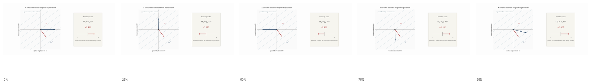

*Momentum measures how an endpoint displacement changes the action to first order.*

[Open MP4: differential-endpoint-covector-measurement.mp4](animations/differential-endpoint-covector-measurement.mp4)

### From the One-Form to the Two-Form

Thus far, the action has identified $q$ and $p$ as the correct paired variables for specifying instantaneous state. But the pairing $p_i\,\delta q^i$ is a one-form statement. It acts on one infinitesimal displacement of one state and returns the first-order change in the action. The information perspective requires a different type of mathematical object, one that measures an "amount of states," not the action of a single history.

Once the action has identified $q^i$ and $p_i$ as conjugate variables, the natural oriented area element on their space is the two-form. Let us call it $\omega$:

```math
\omega := dq^i \wedge dp_i.
```

It takes in two tangent directions and returns an oriented area. This area is the continuous analogue of counting states. If phase space were replaced by a fine lattice, a patch would contain some number of lattice points. Making the lattice finer turns that count into a measure. In continuous phase space, the "amount of states" in a patch is measured by its phase-space area. With more degrees of freedom, the corresponding volume measure is built from repeated products of $\omega$.

Once we have $\omega$, we can see the job of Hamiltonian mechanics as finding flows under which the area measured by the two-form is invariant. This is the geometric form of information preservation. Remarkably, the "overlap" of two vectors and the "area" the same two vectors span lead to descriptions of entirely different categories of behavior.

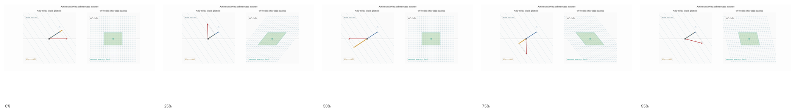

*The one-form measures one displacement against action; the two-form measures oriented area spanned by paired phase-space directions.*

[Open MP4: differential-one-form-to-two-form.mp4](animations/differential-one-form-to-two-form.mp4)

There is a second reason the two-form is a candidate invariant structure on phase space. The one-form is not uniquely determined by the physics. Different Lagrangians can describe the same physical system when their actions differ only by a term that depends on the endpoints. That freedom can shift the boundary one-form, since the one-form records endpoint sensitivity. The two-form, however, is unchanged by this redundancy.

To see this more concretely, we have to work through a bit of math. This can be skipped if desired without losing the main thread. Formally, such an endpoint-only change is produced by adding a total time derivative to the Lagrangian:

```math
L' = L + \frac{dF(q,t)}{dt}.
```

This changes the action by an endpoint term:

```math
S'
=
\int_{t_1}^{t_2} L'\,dt
=
S + F(q(t_2),t_2)-F(q(t_1),t_1).
```

Intuitively, this is like adding "final elevation minus initial elevation" to the cost of a hike with fixed endpoints. It changes the endpoint accounting, but it does not change which interior route extremizes the cost.

The boundary one-form shifts by the differential of that added endpoint function:

```math
\theta' = \theta + dF.
```

Here

```math
\theta = p_i\,dq^i.
```

But the two-form is built, with the orientation chosen above, by taking the negative exterior derivative of the one-form:

```math
\omega = -d\theta.
```

So after the shift,

```math
\omega'
=
-d\theta'
=
-d(\theta + dF)
=
-d\theta - d(dF)
=
-d\theta
=
\omega.
```

The two-form therefore keeps the part of the boundary structure that is independent of this Lagrangian redundancy. A geometry equipped with such a form is called symplectic geometry.

### Defining Phase Space

Phase space is the set of possible instantaneous states of a system described by generalized position coordinates and their conjugate momenta, as selected by the action. For one degree of freedom, a point in phase space is $(q,p)$. For many degrees of freedom, a point is $(q^1,\dots,q^n,p_1,\dots,p_n)$.

The space is equipped with the two-form

```math
\omega = dq^i \wedge dp_i,
```

which measures the local amount of states and gives phase space its invariant symplectic structure. Phase space is therefore the instantaneous state space organized by conjugate variables and the area structure they determine.

## Generating Time Evolution

Compare phase-space plots to spacetime diagrams. In a spacetime diagram, motion is baked into the shape of the worldline. The history is contained in a static plot. In the phase-space picture, there is no physical motion, no history, until a point or region of phase space begins to flow. Our next task, then, is to describe the flows that characterize conservative physical systems. In such systems, the Hamiltonian is the function that generates the physical time-evolution flow on phase space.

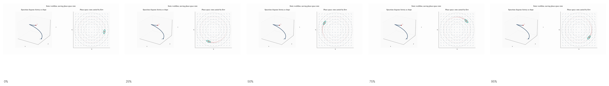

*A spacetime history is static until phase-space time evolution turns instantaneous states into a flow.*

[Open MP4: differential-worldline-phase-space-bridge.mp4](animations/differential-worldline-phase-space-bridge.mp4)

### Generating Flows on Phase Space

We have already seen in our example of an incompressible fluid that any flow can be encoded by a generating function. Let's spell this out more carefully and put it in the arena of phase space.

Picture a contour map on the $q,p$ plane. The value of a function, $F(q,p)$, assigns a height to each point. This three-dimensional "hilly" picture can, as with topographic maps, be represented in two dimensions with contours, or level sets. The rule is that the denser the level sets are, or equivalently, the steeper the surface is, the faster the flow along that contour. This flow can then be represented as a vector field, that is, a phase-space velocity arrow at every point.

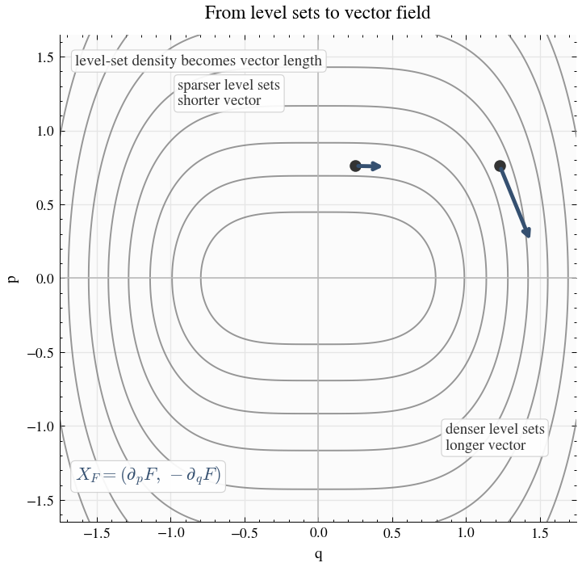

*Closer level sets mean a steeper function, and therefore a longer phase-space velocity arrow.*


*A function on phase space determines level sets, a vector field, and then a flow along those level sets.*

[Open MP4: differential-function-to-flow.mp4](animations/differential-function-to-flow.mp4)

The way to turn $F$'s level-set structure into a vector field is:

```math
\dot q^i = \frac{\partial F}{\partial p_i},
\qquad
\dot p_i = -\frac{\partial F}{\partial q^i}.
```

These cross-coupled equations are the dynamical face of the geometric coupling that preserves the area form. Solving them for $q(t)$ and $p(t)$ gives the flow. Flows generated by functions in this way are called Hamiltonian flows.

A trivial example is $F=p$. Then

```math
\dot q = 1,
\qquad
\dot p = 0.
```

And integrating gives

```math
q(t) = q_0 + t,
\qquad
p(t) = p_0.
```

This construction can be written down for any two variables. In mechanics, however, the variables are conjugate state variables selected by the action, so the resulting flow acts on physical state space.

#### Preservation of the Symplectic Area

Now that we have a procedure for generating a flow from a function, we can check that the flow generated by any smooth function preserves the area form.


*Hamiltonian flow can stretch and shear a patch, but it preserves the area measured by the symplectic form.*

[Open MP4: differential-symplectic-patch-preservation.mp4](animations/differential-symplectic-patch-preservation.mp4)

To see the preservation, we ask what would have to happen for a patch of phase space to gain or lose area. States would have to flow into or out of the patch through a source or sink. In vector-field language, local sources and sinks are measured by divergence. Thus, in one degree of freedom, it is enough to compute the divergence of the flow generated by $F$.

```math
\frac{\partial \dot q^i}{\partial q^i}
+
\frac{\partial \dot p_i}{\partial p_i}
=
\frac{\partial}{\partial q^i}\left(\frac{\partial F}{\partial p_i}\right)
-
\frac{\partial}{\partial p_i}\left(\frac{\partial F}{\partial q^i}\right).
```

Since mixed partial derivatives agree,

```math
\frac{\partial^2 F}{\partial q^i \partial p_i}
-
\frac{\partial^2 F}{\partial p_i \partial q^i}
=
0.
```

The divergence vanishes:

```math
\frac{\partial \dot q^i}{\partial q^i}
+
\frac{\partial \dot p_i}{\partial p_i}
=
0.
```

Thus, the flow generated by any smooth function on phase space preserves the area 2-form, which is the condition for preserving the information structure of an ensemble.

### Energy Generates Time

We have already seen the pairing of energy and time in relativity. The action for a free particle is proportional to the spacetime length of the worldline, and its terms pair energy with time and momentum with position:

```math
S = -m \int ds = -\int E\,dt + \int p_x\,dx + \int \cdots
```

4-momentum is the covector that measures the contribution of a displacement in spacetime to action. Energy is the component that measures the contribution of a time displacement.


*The spacetime action pairing splits into spatial momentum terms and a temporal energy term.*

Hamiltonian mechanics now asks for the function that generates time evolution on phase space. The relativistic decomposition suggests what that function should be. If energy is the coefficient paired with time displacement in the action, then the generator of time evolution should be energy.

And indeed, for conservative systems, the Hamiltonian is the energy. Energy generates time.

### Hamiltonian Mechanics

We now know the geometry of phase space, we know we are looking for a function on it, and we know that function should be energy in the sense suggested by relativity. What remains is to derive that function from the Lagrangian. This requires a change of variables, because the Lagrangian is written as

```math
L(q,\dot q),
```

so it still treats velocity as an independent variable. The function we want must instead be written on phase space:

```math
H(q,p).
```

#### The Legendre Transform

The Legendre transform performs this trade by rewriting a function in terms of tangent-line data. Holding $q$ fixed, regard $L$ as a function of the velocity $\dot q$. Its slope in the velocity direction is

```math
p_i = \frac{\partial L}{\partial \dot q^i}
```

which is precisely the conjugate momentum. Trading velocity for this slope does not discard the rest of the tangent-line information. The remaining vertical information is encoded by $p_i\dot q^i-L$. The transformed function is

```math
H(q,p) = p_i\dot q^i - L(q,\dot q),
```

with $\dot q$ understood as the function of $(q,p)$ determined by the momentum equation above. 

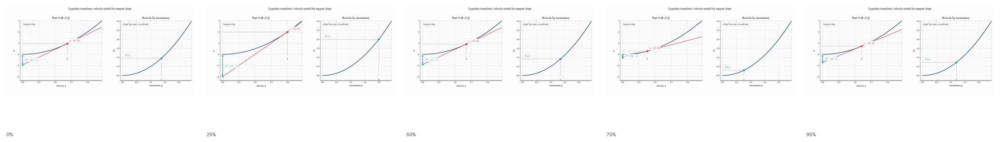

*The Legendre transform trades velocity for momentum while keeping the tangent information needed to recover the dynamics.*

[Open MP4: differential-legendre-transform-tangent.mp4](animations/differential-legendre-transform-tangent.mp4)


We can do a quick test that $H$ is indeed the total energy by looking at a free particle.

For a non-relativistic free particle,

```math
L(q,\dot q) = \frac{1}{2}m\dot q^2.
```

The conjugate momentum is therefore

```math
p = \frac{\partial L}{\partial \dot q} = m\dot q,
```

so

```math
\dot q = \frac{p}{m}.
```

Substituting this into the Legendre transform gives

```math
H(q,p) = p\dot q - L(q,\dot q)
= p\left(\frac{p}{m}\right) - \frac{1}{2}m\left(\frac{p}{m}\right)^2
= \frac{p^2}{m} - \frac{p^2}{2m}
= \frac{p^2}{2m}.
```

But this is exactly the kinetic energy of the particle. So in this simplest case, the Legendre transform gives the energy function directly.

#### Hamilton's Equations of Motion

The Legendre transform does more than rewrite energy in the desired variables. It produces the specific phase-space function whose generated flow reproduces the Euler-Lagrange motion. To see this, take the differential of $H$. In the coordinates we are using, this is the gradient-like object that will be turned 90 degrees to form the vector field generated by $H$:

```math
dH
=
\dot q^i\,dp_i
+
p_i\,d\dot q^i
-
\frac{\partial L}{\partial q^i}\,dq^i
-
\frac{\partial L}{\partial \dot q^i}\,d\dot q^i
```

Now use the momentum definition

```math
p_i = \frac{\partial L}{\partial \dot q^i}.
```

The $d\dot q^i$ terms cancel. What remains is

```math
dH
=
\dot q^i\,dp_i
-
\frac{\partial L}{\partial q^i}\,dq^i
```

At this stage the transform has done its essential job. The velocity direction no longer appears in the differential as an independent variation. The theory has been rewritten in phase-space terms.

To connect this with the original dynamics, use the Euler-Lagrange equations. The remaining Lagrangian derivative is not just a leftover term. It is the generalized force term. Since momentum was defined by $p_i=\partial L/\partial \dot q^i$, the Euler-Lagrange equation says that the derivative of $L$ in the $q^i$ direction is the time derivative of momentum:

```math
\frac{d}{dt}\frac{\partial L}{\partial \dot q^i}
=
\frac{\partial L}{\partial q^i}.
```

Since $p_i = \partial L/\partial \dot q^i$, this becomes

```math
\dot p_i = \frac{\partial L}{\partial q^i}.
```

This is where the dynamics selected by the action enters the phase-space expression. In ordinary mechanics, force is $dp/dt$; here the same idea appears as $\dot p_i$. Substituting this into the expression for $dH$ gives

```math
dH
=
\dot q^i\,dp_i
-
\dot p_i\,dq^i
```

But because $H$ is now a function of $(q,p)$, its differential is also

```math
dH
=
\frac{\partial H}{\partial q^i}\,dq^i
+
\frac{\partial H}{\partial p_i}\,dp_i
```

Match coefficients and, voila, we have the beautiful and useful Hamilton's equations of motion:

```math
\dot q^i = \frac{\partial H}{\partial p_i},
\qquad
\dot p_i = -\frac{\partial H}{\partial q^i}.
```

We can check this works using the example of a simple harmonic oscillator.

The total energy, and thus the Hamiltonian, is:

```math
H(q,p) = T + V = \frac{p^2}{2m} + \frac{1}{2}kq^2.
```

Hamilton's equations then give:

```math
\dot q = \frac{\partial H}{\partial p} = \frac{p}{m},
\qquad
\dot p = -\frac{\partial H}{\partial q} = -kq.
```

Using $p = m\dot q$, this becomes:

```math
m\ddot q = -kq,
```

or

```math
\ddot q + \frac{k}{m}q = 0.
```

At this point we have the local differential formulation of mechanics in hand. The next step is not to change that mechanics, but to rewrite the same structure in a new language. The flow picture we have just developed can also be expressed as an algebra of functions on phase space, and that repackaging will make further structure visible.

## The Algebra of Hamiltonian Mechanics
Given two functions $f$ and $g$ on phase space, we can ask how $f$ changes along the flow generated by $g$ or how $g$ changes along the flow generated by $f$.

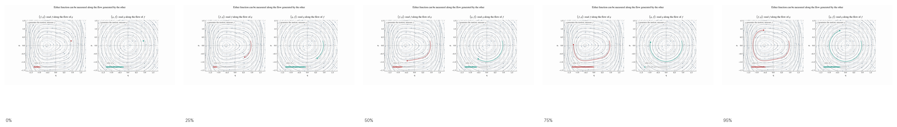

*Either function can be read along the flow generated by the other.*

[Open MP4: differential-poisson-bidirectional-flow.mp4](animations/differential-poisson-bidirectional-flow.mp4)

As any two numbers can be combined via addition or multiplication to produce a new number, so any two functions on phase space can be combined to produce a new function. When the rule of combination reflects the flow/evolution relationship between functions, we get the algebra of Hamiltonian mechanics, called Poisson algebra. In that algebra, Hamilton's equations, conservation laws, and other structural relationships become visible as algebraic identities.

### What We Mean by an Algebra

Before exploring Poisson algebra specifically, we all know algebra, but it is worth reminding ourselves what that word actually means. An algebra begins with some class of objects and then specifies what operations may be performed on those objects and what properties those operations satisfy. Numbers with addition and multiplication and associativity and commutativity are the familiar example. Different algebras may involve different objects, operations, and properties, but these differences fall into a common taxonomy. 

#### Taxonomy of Operations

| Category | Meaning | Example |
|---|---|---|
| Unary | Takes one input | Negation: $x \mapsto -x$ |
| Binary | Takes two inputs | Addition: $(x,y) \mapsto x+y$ |
| Internal | Takes allowed objects as input and returns another allowed object of the same kind | Sum of two functions is a function |
| External | Combines an allowed object with something outside the class | Scalar multiplication |

Algebras are "closed," meaning that when allowed objects are combined, the result is again an allowed object of the same kind.

#### Taxonomy of Properties

| Category | Meaning | Example |
|---|---|---|
| Symmetry property | Governs what happens when inputs are swapped | Commutativity, antisymmetry |
| Grouping property | Governs what happens when an operation is repeated | Associativity |
| Linearity property | Governs behavior under sums and scalar multiples | Linearity, bilinearity |
| Compatibility property | Governs how two different operations interact | Distributive law, Leibniz rule |
| Consistency property | Governs deeper structural coherence | Jacobi identity |

### Poisson Algebra as a Lie Algebra

With this framing in mind, we can now turn to Poisson algebra. Before discussing the specific operations and properties that form the Poisson algebra notation, let's first look at its geometric interpretation. A Poisson algebra belongs to the broader class of Lie algebras, in which we represent a finite transformation on a manifold by an infinitesimal displacement tangent to the transformation.

This picture is captured schematically as a differential equation that represents the action of an infinitesimal generator on a finite transformation. In rough visual terms, the generator acts on the current transformation to produce its next infinitesimal change.

```math
\frac{d}{dt}G(t) = X\,G(t).
```

Here $G(t)$ is a one-parameter family of finite transformations, and $X$ is the infinitesimal generator, an element of the Lie algebra. The equation says that the finite transformation changes at each instant according to the infinitesimal generator. Repeating that infinitesimal step produces the finite transformation. In this sense, there is an exponential map from the generator to the transformation.

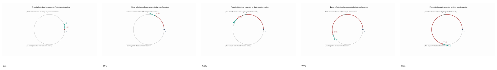

*The fixed generator $X$ at the identity induces the tangent $XG(t)$ at each finite transformation.*

[Open MP4: differential-lie-generator-tangent-flow.mp4](animations/differential-lie-generator-tangent-flow.mp4)

For matrix groups, this becomes

```math
\frac{d}{dt}M(t)=A M(t),
```

where $M(t)$ is the finite transformation matrix and $A$ is the infinitesimal generator matrix. Its solution is

```math
M(t)=e^{tA}.
```

The matrix form appears when a transformation can be represented by one linear rule acting on a vector space, such as a rotation, boost, or internal symmetry transformation. The same matrix acts everywhere, taking each vector to its transformed vector.

For a flow on phase space, the finite transformation is better understood as a map from phase space to itself generated by local instructions. The vector field assigns a direction to each point of phase space, and different points may be assigned different directions and speeds. It is therefore easier to write the same idea in terms of a moving point


```math
z(t)=\phi_t(z_0),
```

where $z_0$ is the initial phase-space point and $\phi_t$ is the finite transformation at parameter value $t$. The differential equation is

```math
\frac{d}{dt}z(t)=X_f(z(t)),
```

where $X_f$ is the vector field generated by the function $f$. In words, the phase-space point moves at each instant in the direction assigned by $X_f$ at the point's current location.

In the matrix case, the infinitesimal generator gives a single rule acting across the vector space. In the Hamiltonian case, the generator must determine a vector field on phase space. It assigns an infinitesimal direction to each point, with the whole field constrained by the symplectic form. The object that encodes this field is a function on phase space. Each smooth function $f$ determines a vector field $X_f$, and that vector field determines a flow of canonical transformations.

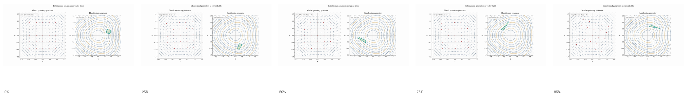

*A matrix generator gives one rule across a vector space. A Hamiltonian generator encodes a vector field on phase space.*

[Open MP4: differential-generator-vector-field-contrast.mp4](animations/differential-generator-vector-field-contrast.mp4)

The chain of objects is

```text
function -> vector field -> flow -> canonical transformations.
```

One may refer somewhat ambiguously to either the functions or the vector fields as the generator of the flow. Before writing the Poisson bracket in coordinates, we can say what it has to do geometrically. If $f$ and $g$ determine vector fields $X_f$ and $X_g$, those vector fields have their own Lie bracket, $[X_f,X_g]$. The Poisson bracket $\{f,g\}$ is the function whose vector field corresponds to that vector-field bracket:

```math
[X_f,X_g] = -X_{\{f,g\}},
```

This identity says that the Lie algebra of infinitesimal canonical transformations persists when one passes from vector fields to the functions that encode them.

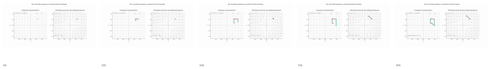

*The commutator of Hamiltonian vector fields is mirrored by the Poisson bracket of their generating functions.*

[Open MP4: differential-poisson-bracket-vectorfield-identity.mp4](animations/differential-poisson-bracket-vectorfield-identity.mp4)

The payoff is that one can work in the Lie algebra of infinitesimal generating functions rather than directly in the Lie group of finite transformations. The space of finite transformations can be pictured as a curved surface of transformations, where composition is the native operation. Infinitesimal generators live in a linear space tangent to the group at the identity, where objects can be added, scaled, and bracketed. That is what makes an algebra possible here, and it is what makes insights and theorems visible in algebraic identities.

#### The Operations of the Algebra

The objects of Poisson algebra are smooth functions on phase space. The more elementary operations on this space are:

| Operation | Type | Specific operation | Result |
|---|---|---|---|
| $f+g$ | Binary, internal | Addition of functions | Another smooth function |
| $cf$ | Binary, external | Scalar multiplication | Another smooth function |
| $fg$ | Binary, internal | Pointwise multiplication of functions | Another smooth function |

Hamiltonian mechanics adds an additional operation, the Poisson bracket:

```math
\{f,g\}
=
\frac{\partial f}{\partial q^i}\frac{\partial g}{\partial p_i}
-
\frac{\partial f}{\partial p_i}\frac{\partial g}{\partial q^i}.
```

With $g$ held fixed, $\{f,g\}$ is the change of $f$ when the state is moved along the vector field determined by $g$. The result is another smooth function on phase space. It goes to zero when $f$ does not change along that flow.

#### The Properties of Poisson Algebra

The Poisson bracket is an operation that satisfies the properties that make the function space into a Lie algebra.

Bilinearity:

```math
\{af_1 + bf_2,g\}
=
a\{f_1,g\}+b\{f_2,g\},
```

and likewise in the second slot.

Antisymmetry:

```math
\{f,g\} = -\{g,f\}.
```

This sign flip is the algebraic form of oriented area. Swapping the inputs reverses the orientation.

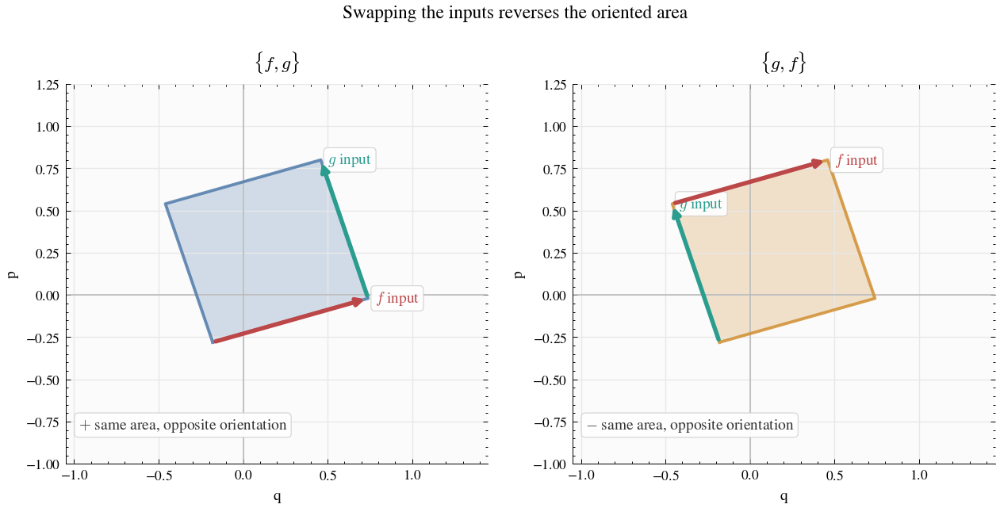

*Swapping the order reverses the oriented area, giving the sign flip in the bracket.*

Associativity:

Operating on numbers moves a number line back and forth. It is visually obvious that no matter how one groups operations, the end placement of the number line is the same. When an algebra's objects are pictured as living in a plane, only cyclic permutations of the operands move the plane to the same location. Thus there is a kind of associativity, but it is more restrictive. This is the Jacobi identity:

```math
\{f,\{g,h\}\}+\{g,\{h,f\}\}+\{h,\{f,g\}\}=0.
```

It does not say that different nestings are equal. It says that the cyclic sum closes to zero.

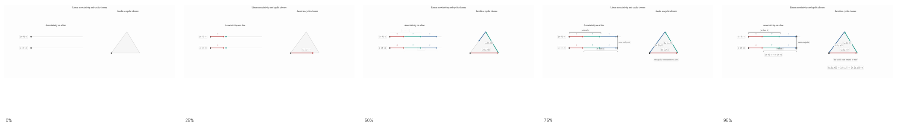

*The cyclic terms are named on the left and shown closing to zero on the right.*

[Open MP4: differential-poisson-jacobi-identity.mp4](animations/differential-poisson-jacobi-identity.mp4)


Product Rule:

Poisson brackets act on products of functions as derivatives do in calculus. This is expected because, with one input held fixed, the Poisson bracket differentiates the other input along the corresponding Hamiltonian flow:

```math
\{f,gh\}=\{f,g\}h+g\{f,h\}.
```

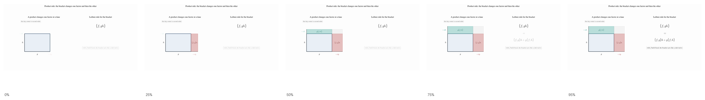

*Holding one input fixed, the bracket differentiates a product one factor at a time.*

[Open MP4: differential-poisson-product-rule.mp4](animations/differential-poisson-product-rule.mp4)

#### Physical Relationships Illuminated by Poisson Algebra

Once the Poisson bracket is in hand, physical relationships that previously had to be written as separate differential statements can be compressed into algebraic ones. 

##### The Canonical Pairing of Position and Momentum

```math
\{q,p\}=1,
\qquad
\{p,q\}=-1.
```

We can read these equations in shorthand as "momentum generates position translations" and "position generates momentum translations." 

At this point the questioning reader may scratch their head. From relativity and Noether’s theorem, we expect momentum to be paired with position displacement, and in Hamiltonian language we expect momentum to generate position translations. But what could it mean for position to generate momentum? Momentum symmetry? Conserved position? Not quite. The answer is that position and momentum are reciprocally paired as generators of canonical transformations, not as generators of physical symmetries. A shift in position may be a symmetry of the physical system. A shift in momentum usually is not. The reciprocal generator relation is instead part of the phase-space structure that preserves information density. There is nonetheless a physical intuition behind it.

Imagine a downhill skier. The mountain's incline determines how their momentum changes, and that incline is a function of position. So $\dot p$ is determined by position. This example is illustrative because it realizes the idea of a potential gradient as an actual hill. Whatever the details of the system, if we choose $p$ and $q$ so that $H = K(p) + V(q)$, then the more $H$ changes with respect to $q$, the greater the rate of change of momentum. This is what is meant, dynamically, by saying that $q$ generates $p$.

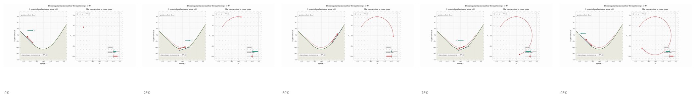

*Position selects the local slope of the potential; that slope changes momentum.*

[Open MP4: differential-skier-position-generates-momentum.mp4](animations/differential-skier-position-generates-momentum.mp4)

That distinction will matter later. Quantum mechanics realizes the position/momentum pairing in the representation of translations on waves. There, the classical relation $\{q,p\}=1$ becomes the commutator relation $[\hat q,\hat p]=i\hbar$.

::: sidebar
#### Fourier Phase and the Quantum Lift

While position/momentum pairing does not belong to the symmetries of classical physics, it does appear in the symmetry space of wavefunctions (if we associate wave number with momentum). The Fourier transform exchanges the two. Shifting in $x$ corresponds to multiplying by a $k$-phase, while multiplying by an $x$-phase shifts $k$. In that setting, $k$ generates translations in $x$, and $x$ generates translations in $k$. Quantum mechanics will turn this reciprocal Fourier symmetry into the canonical commutation relation, which underlies many aspects of quantum theory, including the structure of the Schrödinger equation and the Heisenberg uncertainty principle.

The similarity of wave function symmetry to symplectic geometry is not coincidental. In classical phase space, a position displacement and a momentum displacement can be represented by vectors such as $(a,0)$ and $(0,b)$. As we have seen, the symplectic form measures their oriented phase-space area:

```math
\omega((a,0),(0,b)) = ab.
```

Classically, these translations commute as motions of points. Moving a point by $a$ in position and then by $b$ in momentum reaches the same final point as doing the operations in the reverse order. But when the analogous transformations are represented on waves, the order matters. A position shift acts as

```math
(T_a\psi)(x)=\psi(x-a),
```

In wave-number space, a momentum shift is just a translation of the Fourier profile:

```math
\hat\psi(k) \mapsto \hat\psi(k-b).
```

But in position space, the same operation appears as multiplication by a position-dependent phase:

```math
(M_b\psi)(x)=e^{ibx}\psi(x).
```

Thus, multiplying a Fourier component by $e^{ibx}$ changes

```math
e^{ikx}
\mapsto
e^{i(k+b)x}.
```

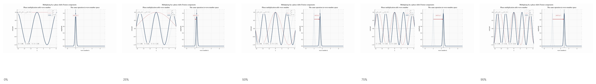

*Multiplying by a position-dependent phase shifts the wave number of each Fourier component.*

[Open MP4: differential-fourier-phase-shift-mechanism.mp4](animations/differential-fourier-phase-shift-mechanism.mp4)

Applying them in opposite orders gives

```math
M_bT_a\psi(x)=e^{ibx}\psi(x-a),
```

while

```math
T_aM_b\psi(x)=e^{ib(x-a)}\psi(x-a).
```

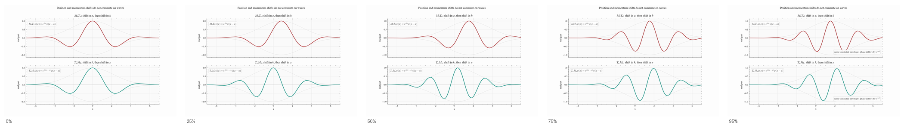

*Applying position and momentum shifts in opposite orders leaves a residual phase.*

[Open MP4: differential-weyl-order-phase.mp4](animations/differential-weyl-order-phase.mp4)

Thus

```math
M_bT_a = e^{iab}T_aM_b,
```

The phase factor is controlled by the same product $ab$ measured by the symplectic form:

```math
e^{iab}=e^{i\omega((a,0),(0,b))}.
```

With physical units restored, this becomes

```math
e^{\frac{i}{\hbar}\omega(v,w)}.
```

Thus the classical area pairing becomes, in wave mechanics, a phase relation. The symplectic form measures the failure of the corresponding wave transformations to commute. This is the Weyl-Heisenberg structure behind the canonical commutation relation. The Poisson bracket tells us classically that $q$ and $p$ are conjugate, while Fourier duality shows how that conjugacy acts on waves. Quantum mechanics then, as we will see, turns it into the operator identity:

```math
[\hat q,\hat p]=i\hbar.
```

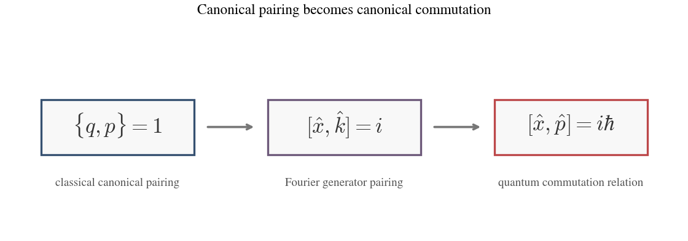

*The classical canonical pairing becomes a Fourier phase relation and then the quantum commutator.*
:::

##### Hamiltonian Dynamics
The master dynamical statement is that, for any smooth function $f$ on phase space,

```math
\dot f = \{f,H\},
```

assuming $f$ has no explicit time dependence. In this form, time evolution itself becomes a bracket relation. Hamilton's equations are the special cases obtained by taking $f=q$ and $f=p$:

```math
\dot q = \{q,H\} = \frac{\partial H}{\partial p},
\qquad
\dot p = \{p,H\} = -\frac{\partial H}{\partial q}.
```


*The Poisson bracket packages Hamilton's equations, canonical pairing, and conservation into one algebraic operation.*

##### Conservation and Noether's Theorem (Forward and Backward)

Conservation laws also become algebraic statements. If

```math
\{p,H\}=0,
```

then $\dot p=0$, so momentum is conserved along the Hamiltonian evolution. More generally, if

```math
\{f,H\}=0,
```

then the quantity $f$ is conserved in time.

Because the bracket is antisymmetric, the same vanishing relation may be read in reverse:

```math
\{f,H\}=0
\qquad \Longleftrightarrow \qquad
\{H,f\}=0.
```

This is the compact meeting point of the two Noether directions. Read one way, it says that $f$ is conserved under the time evolution generated by $H$. Read the other way, it says that the transformation generated by $f$ leaves $H$ unchanged. Conservation and symmetry thus appear as two readings of the same algebraic relation.

#### Looking Ahead to Quantum Mechanics

This algebraic viewpoint provides a bridge from Hamiltonian mechanics into quantum mechanics. There, the classical geometry of states as points moving through phase space no longer carries over in the same direct form, and much of the new theory remains to be understood on its own terms. What does carry over cleanly is the algebraic structure of observables, generators, and their bracket relations. By replacing functions with operators and Poisson brackets with commutators, one can lift a large part of Hamiltonian structure forward before learning the geometry native to the quantum theory. The geometry changes, but the algebra transports.
