# The Principle of Least Action
Relativity builds the geometry of spacetime from transformations that preserve the symmetry nature exhibits, specifies the objects that inhabit this geometry, and articulates the implications this structure has on causality. We can now turn our attention to how, under these constraints, physical systems evolve in practice.

Imagine the possible paths between some endpoints in a time vs position plot.

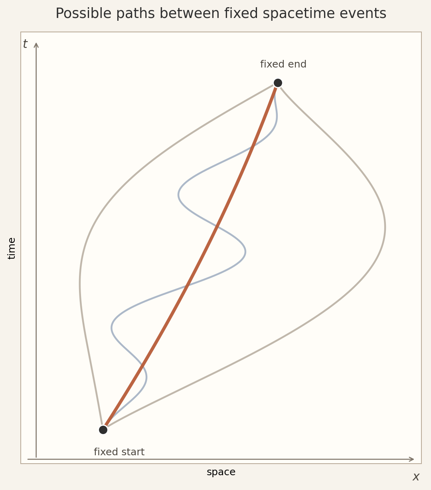

Without any training in physics, could we guess which path is the physical one? Einstein is purported to have said that "the difference between genius and stupidity is that genius has its limits." If we think nature has a certain genius, and notice that simple or elegant paths are the rarest among all possible paths, we might suspect that nature chooses the most elegant. We cannot take this too literally. In complicated systems, physical paths can be complicated. But the intuition is essentially on target. Whatever the physical path is for a given system, it is the one that, when all constraints are taken into account, is the most "something." We don't need to characterize this ineffable "something" -- simple, elegant, short, lazy, relaxed, efficient, obvious -- but only define it as a function such that the physical history corresponds to a characteristic feature of the function. This is the "principle of least action." Action is the quantity assigned to possible paths, and the physical path is the one whose action is "stationary," or unchanged under first-order perturbations, typically where it is a minimum or maximum.

The simplest example of the principle is that of a free particle that moves at constant velocity so that its path in a spacetime diagram is a straight line. A slightly more interesting case is that of an object falling in uniform gravity which traces a parabola in spacetime. We can see the pattern that the complexity of the path scales to the complexity of the constraints.

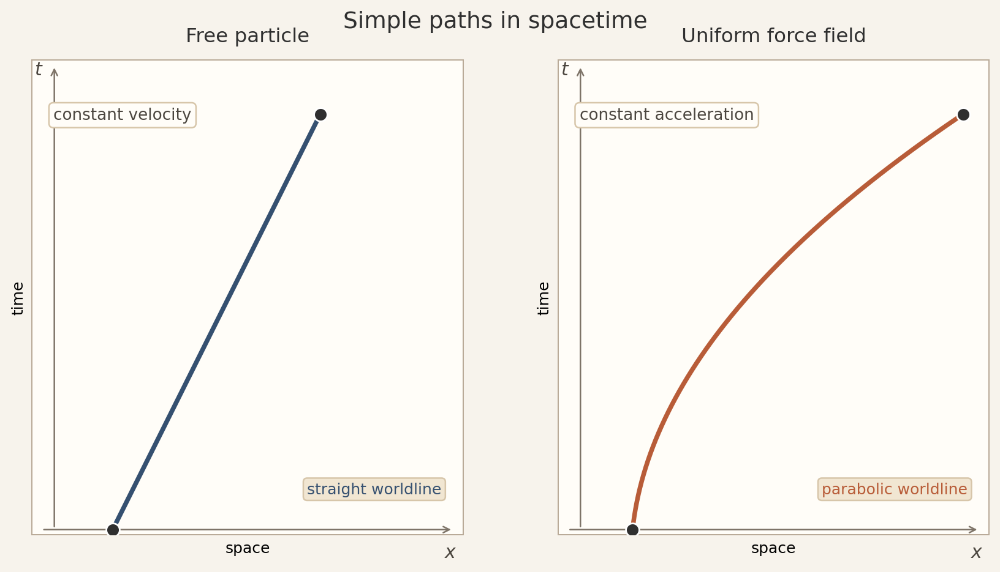


## The Lagrangian Function
How would we go about putting these ideas on a mathematical footing? We can map paths, just as we could the members of any set, to numbers.

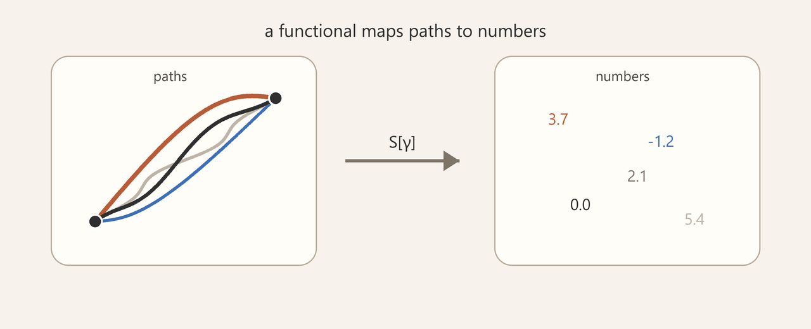

We call this map a "functional" (a map from functions to numbers, as opposed to a "function," which is a map from numbers to numbers). Now, we could map a path to a number as follows.

```math
F[x]=x(t_2)-x(t_1).
```

This is a perfectly valid functional, but it won't do for physics. Why? Because it ignores everything that happens between the endpoints, and that is exactly where the physics happens! We need a functional that accounts for each infinitesimal step. A path integral does this by assigning a contribution to each segment of the path and adding those contributions into one number.

There are three layers here: the path $\gamma$, the local rule $L$, and the total number $S[\gamma]$.

$S[\gamma]=\int_\gamma dS$

When we use $t$ to parameterize the path, each infinitesimal contribution can be written as some function times $dt$.

$dS=L\,dt$

$L$ is called the Lagrangian. Since the action is built locally along a path, the local weighting must be able to see the infinitesimal piece of path being added. The minimal geometric data to specify the state of that infinitesimal piece are the point $\gamma(t)$, the tangent $\dot{\gamma}(t)$, and the parameter value $t$. Thus we write

$L=L(\gamma(t),\dot{\gamma}(t),t)$

and therefore

$dS=L(\gamma(t),\dot{\gamma}(t),t)\,dt$

Integrating these contributions from $t_1$ to $t_2$ gives

$S[\gamma]=\int_{t_1}^{t_2}L(\gamma(t),\dot{\gamma}(t),t)\,dt$

### Stationary Points

The action functional behaves like a smooth function when the local function $L$ is smooth. If we choose one allowed wiggle shape $\eta(t)$ and scale it by a number $\epsilon$, then

```math
\gamma_\epsilon(t)=\gamma_0(t)+\epsilon\,\eta(t)
```

turns the action into an ordinary one-variable function. This is a subtle move worth pausing over. We are free to choose $\eta(t)$ to be any allowed function. Once we choose it, the shape of the variation is fixed, and we can test its impact on the action with the single parameter $\epsilon$.

```math
S(\epsilon)=S[\gamma_\epsilon].
```

The original path $\gamma_0$ is stationary along this chosen wiggle when $dS/d\epsilon=0$ at $\epsilon=0$. For $\gamma_0$ to be a stationary path, this must hold for every allowed wiggle $\eta(t)$.

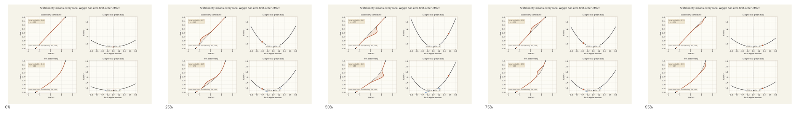

*A local wiggle slides along the path. The orange dot follows the chosen wiggle amplitude, while the tangent at $\epsilon=0$ tests stationarity.*

[Open MP4: lm-one-parameter-variation-slice.mp4](animations/lm-one-parameter-variation-slice.mp4)


### Spacetime Invariance
If the action encodes the physical path, the action must be spacetime invariant. That is, if all observers agree on the same physical behavior, and if that behavior extremizes the action for all observers, then all observers must agree on the action. We typically write the action, as we have above, in terms of coordinate time since that is what observers directly measure. But we are free to compute the action in any frame, including the local rest frame along the path, where we can integrate over proper time.

```math
S=\int_{\tau_1}^{\tau_2}L\,d\tau
```

When we do so, since the proper time differential is a Lorentz invariant, the Lagrangian must be as well so that the entire integral is invariant. In the simplest case without any cancellation between terms, the Lagrangian's individual terms must be invariant as well. Candidate invariants are

```math
x^\mu x_\mu,\qquad u^\mu u_\mu .
```

The former cannot be physically relevant since empty spacetime has no preferred origin, and the latter reduces to $c^2$ (or 1 in natural units). We can scale an invariant, certainly when it is just $1$, as it is here. Thus the action for a free particle in spacetime is

```math
S=-\alpha\int_{\tau_1}^{\tau_2}d\tau .
```

From here until stated otherwise, we use natural units where $c=1$, so mass and rest energy are measured in the same units. We define mass as this scale factor.

```math
S=-m\int_{\tau_1}^{\tau_2}d\tau .
```
## Curvature and the Relativistic Source of Acceleration
We may now ask what happens to "non-free" particles, those that undergo acceleration or are acted upon by some "force." We typically think of a force as the position-dependent gradient of a potential field. But this immediately runs into trouble with relativity, as it implies a shared time coordinate at different spatial coordinates. That is:

```math
V(\Delta\mathbf{x})
=
V(\mathbf{x}_2(t)-\mathbf{x}_1(t)).
```

But $\Delta\mathbf{x}$ is defined by comparing positions at the same coordinate time $t$, and there is no frame-independent shared $t$ for separated events.

If a traditional instantaneous, separation-dependent potential is not the source of acceleration, what is? The answer that current physical theory gives to this question is the complete geometry of the system. At a general level, dynamics, that is acceleration, force, or compulsion, occurs due to curvature somewhere in that complete geometry. We highlight "complete geometry" here because, when we allow new degrees of freedom in the field values, systems live in a composite geometry of spacetime and the way the basis for internal degrees of freedom varies over spacetime. For gravity this curvature is curvature of spacetime itself, while for other interactions it belongs to the additional geometric structure that lives over spacetime. We can most easily see how geometry manifests as dynamics in the case of gravity, where spacetime itself is curved such that it bends toward massive objects. Bodies then only need to follow a geodesic in spacetime to appear in every way to be attracted by gravitational force.

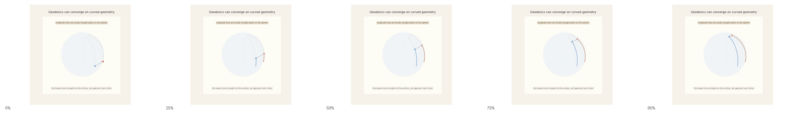

*Longitude lines are straight paths on the sphere, yet beads following them approach each other.*

[Open MP4: lm-geodesic-convergence.mp4](animations/lm-geodesic-convergence.mp4)


## Using Variational Calculus to Find Geodesics
We have argued that the Lagrangian for a free particle is made from scaling the spacetime path length and suggested that more complicated systems can be similarly viewed as following geodesics in an appropriate generalized space. We can then see how the variational method works, and model physical problems, by working through two geometric examples -- finding the shortest path between points on a flat surface and doing the same for points on a spherical surface. What follows is admittedly mathematically detailed, but to build on the ideas of the path-variation method, we need a hands-on appreciation of results that require working through these details.

### Straight Line in Flat Space

We want to find the path that minimizes distance between two points in the plane. We do this by considering all possible paths and finding the one where the variation of the length vanishes to first order. 


Figure 53 - Minimizing a curve in the plane

#### Parameterize the Path

In order to compare paths, we write them in the $(x,y)$ plane in parametric form

```math
\gamma:\lambda\mapsto (x(\lambda),y(\lambda)).
```

with fixed endpoints

```math
(x(\lambda_1),y(\lambda_1))=(x_1,y_1),
\qquad
(x(\lambda_2),y(\lambda_2))=(x_2,y_2).
```

In the Euclidean plane, the infinitesimal distance between nearby points is

```math
ds^2=dx^2+dy^2.
```

Along the parameterized curve,

```math
dx=\frac{dx}{d\lambda}\,d\lambda,
\qquad
dy=\frac{dy}{d\lambda}\,d\lambda.
```

Substituting into the Euclidean distance formula gives

```math
ds
=
\sqrt{
\left(\frac{dx}{d\lambda}\right)^2
+
\left(\frac{dy}{d\lambda}\right)^2
}\,d\lambda.
```

The length of such a curve is

```math
\ell[\gamma]
=
\int_\gamma ds
=
\int_{\lambda_1}^{\lambda_2}
\sqrt{
\left(\frac{dx}{d\lambda}\right)^2
+
\left(\frac{dy}{d\lambda}\right)^2
}\,d\lambda .
```


Defining

```math
x'=\frac{dx}{d\lambda},
\qquad
y'=\frac{dy}{d\lambda},
\qquad
R=\sqrt{{x'}^2+{y'}^2}=\frac{ds}{d\lambda}.
```

where $R$ is the rate of change of length with respect to the parameter $\lambda$, we have: 

```math
\ell[\gamma]
=
\int_{\lambda_1}^{\lambda_2}R\,d\lambda .
```

#### Apply the Variational Procedure to Extremize Length 

With the parameterized path integral set up, we now come to the clever move in the variational procedure. We require that this functional be stationary under small variations of the curve that keep the endpoints fixed.

Let

```math
x(\lambda)\rightarrow x(\lambda)+\varepsilon\eta(\lambda),
\qquad
y(\lambda)\rightarrow y(\lambda)+\varepsilon\xi(\lambda).
```

Here $\eta(\lambda)$ and $\xi(\lambda)$ are arbitrary test functions that vanish at the endpoints, so the endpoints stay fixed.

```math
\eta(\lambda_1)=\eta(\lambda_2)=0,
\qquad
\xi(\lambda_1)=\xi(\lambda_2)=0.
```

The number $\varepsilon$ controls the size of the change.

Then

```math
x'\rightarrow x'+\varepsilon\eta',
\qquad
y'\rightarrow y'+\varepsilon\xi'.
```

The varied length is

```math
\ell(\varepsilon)
=
\int_{\lambda_1}^{\lambda_2}
\sqrt{
(x'+\varepsilon\eta')^2
+
(y'+\varepsilon\xi')^2
}\,d\lambda .
```

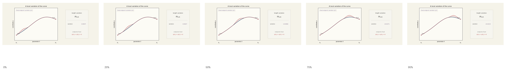

[Open MP4: lm-fixed-endpoint-length-variation.mp4](animations/lm-fixed-endpoint-length-variation.mp4)

Differentiate with respect to $\varepsilon$ and evaluate at $\varepsilon=0$.

```math
\left.\frac{d\ell}{d\varepsilon}\right|_{\varepsilon=0}
=
\int_{\lambda_1}^{\lambda_2}
\frac{x'\eta'+y'\xi'}{R}\,d\lambda .
```

Stationarity requires

```math
\left.\frac{d\ell}{d\varepsilon}\right|_{\varepsilon=0}=0.
```

For a chosen test curve and endpoint-fixed variation, $\ell(\varepsilon)$ is now an ordinary function of $\varepsilon$. The original curve corresponds to $\varepsilon=0$. If the original curve is stationary, this derivative must vanish for every allowed endpoint-fixed variation.

Now integrate this by parts, leading to an integrand containing only $\eta$ and $\xi$, not their derivatives.

```math
\int_{\lambda_1}^{\lambda_2}\frac{x'\eta'}{R}\,d\lambda
=
\left[\frac{x'}{R}\eta\right]_{\lambda_1}^{\lambda_2}
-
\int_{\lambda_1}^{\lambda_2}
\frac{d}{d\lambda}\left(\frac{x'}{R}\right)\eta\,d\lambda .
```

The boundary term vanishes because $\eta(\lambda_1)=\eta(\lambda_2)=0$.

This is the structural split we will keep using: the interior term determines the path, while the boundary term measures the endpoint response.

And similarly for $y$. 

Therefore the stationarity condition becomes

```math
\int_{\lambda_1}^{\lambda_2}
\left[
-
\frac{d}{d\lambda}\left(\frac{x'}{R}\right)\eta
-
\frac{d}{d\lambda}\left(\frac{y'}{R}\right)\xi
\right]d\lambda
=
0.
```

Because $\eta$ and $\xi$ can be any functions that vanish at the endpoints, the only way the integral can be zero for all such choices is for the coefficients of $\eta$ and $\xi$ to vanish pointwise.

```math
\frac{d}{d\lambda}\left(\frac{x'}{R}\right)=0,
\qquad
\frac{d}{d\lambda}\left(\frac{y'}{R}\right)=0.
```

Since $R=ds/d\lambda$,

```math
\frac{x'}{R}
=
\frac{dx/d\lambda}{ds/d\lambda}
=
\frac{dx}{ds},
\qquad
\frac{y'}{R}
=
\frac{dy/d\lambda}{ds/d\lambda}
=
\frac{dy}{ds}.
```

Now define dots with respect to arc length.

```math
\dot{x}:=\frac{dx}{ds},
\qquad
\dot{y}:=\frac{dy}{ds}.
```

The equations above therefore say

```math
\dot{x}=A,
\qquad
\dot{y}=B,
```

where $A$ and $B$ are constants. The tangent vector has constant components, so the path that minimizes the length is straight.

### From Path Length to Action

The calculation above used a length functional for a curve in the Euclidean plane. The free relativistic particle uses the same structure with a different geometric interval and a constant scale factor.

For the plane curve, the functional was

```math
\ell[\gamma]
=
\int_\gamma ds.
```

For a free relativistic particle, the path is a worldline,

```math
\gamma:\lambda\mapsto x^\mu(\lambda),
```

and the invariant interval along that worldline is

```math
c\,d\tau
=
\sqrt{-\eta_{\mu\nu}dx^\mu dx^\nu}.
```

Here $\eta_{\mu\nu}$ is the Minkowski metric. Using the arbitrary parameter $\lambda$,

```math
c\,d\tau
=
\sqrt{
-\eta_{\mu\nu}{x'}^\mu{x'}^\nu
}\,d\lambda.
```

Thus the action for a free relativistic particle, following the procedure above for the path in a plane, is

```math
S[\gamma]
=
-mc^2\int_\gamma d\tau
=
-mc
\int_{\lambda_1}^{\lambda_2}
\sqrt{
-\eta_{\mu\nu}{x'}^\mu{x'}^\nu
}\,d\lambda.
```

This is the same variational pattern as the plane example. The replacements are

```math
\ell[\gamma]\longrightarrow S[\gamma],
\qquad
ds\longrightarrow c\,d\tau,
\qquad
(x,y)\longrightarrow x^\mu,
\qquad
dx^2+dy^2\longrightarrow -\eta_{\mu\nu}dx^\mu dx^\nu.
```

The constant factor $-mc$ does not change which path is stationary. It only changes the scale and sign of the functional.

Repeating the variational procedure with these substitutions gives

```math
\frac{d}{d\lambda}
\left(
\frac{\eta_{\mu\nu}{x'}^\nu}
{\sqrt{-\eta_{\alpha\beta}{x'}^\alpha{x'}^\beta}}
\right)
=0.
```

This is the spacetime version of the plane result that the tangent direction is constant. If we use proper time as the path parameter, this becomes

```math
\frac{dx^\mu}{d\tau}=u^\mu=\text{constant}.
```

So the free relativistic particle follows a straight worldline,

```math
x^\mu(\tau)=x_0^\mu+u^\mu\tau.
```

The plane example showed how extremizing accumulated distance selects a straight path. The relativistic action repeats the same idea with accumulated proper time.


### Minimizing Length on Sphere

Let's sketch how we would modify the procedure above to show that geodesics on a sphere are the shortest possible paths on that surface.


Figure 54 - Geodesics on a sphere

The calculation is the same as for paths in flat space, except that the invariant distance changes from

```math
ds^{2} = dx^{2} + dy^{2}
```

to

```math
ds^{2} = \mathcal R^{2}\left( d\theta^{2}+\sin^2\theta\,d\phi^{2} \right)
```

Use path length $s$ as the parameter along the curve, so dots denote derivatives with respect to $s$. Carrying out the same variational procedure on the spherical length functional gives

```math
\ddot{\theta}
-
\sin\theta\cos\theta\,\dot{\phi}^{2}
=
0,
\qquad
\ddot{\phi}
+
2\cot\theta\,\dot{\theta}\dot{\phi}
=
0.
```

These are the equations for a geodesic on a sphere. What can we see in their structure? In the flat case, stationarity said that the tangent direction stays constant. On the sphere, the tangent still stays as straight as the surface permits, but the coordinates must change in a way that accounts for the curvature of the surface. That curvature appears in the extra terms involving $\sin\theta\cos\theta$ and $\cot\theta$. In particular, the geodesic is specified by differential equations involving second derivatives of the coordinates along the path. Thus, we see the mathematical bridge between what appears as acceleration in flat space and motion along a geodesic in an appropriately curved space. 

### Euler-Lagrange Equations
In the examples above, the functional $\ell[\gamma]$ only depended on $x'$ and $y'$. In general, a functional may depend on the coordinate itself as well as its derivative. Doing this for a single variable $q$, write

```math
I[q]=\int_{\lambda_1}^{\lambda_2}L(q,q')\,d\lambda.
```

Vary $q$ by an endpoint-fixed test function.

```math
q\rightarrow q+\varepsilon\eta,
\qquad
\eta(\lambda_1)=\eta(\lambda_2)=0.
```

Then

```math
\left.\frac{dI}{d\varepsilon}\right|_{\varepsilon=0}
=
\int_{\lambda_1}^{\lambda_2}
\left(
\frac{\partial L}{\partial q}\eta
+
\frac{\partial L}{\partial q'}\eta'
\right)d\lambda.
```

Integrate the second term by parts.

```math
\int_{\lambda_1}^{\lambda_2}
\frac{\partial L}{\partial q'}\eta'\,d\lambda
=
\left[
\frac{\partial L}{\partial q'}\eta
\right]_{\lambda_1}^{\lambda_2}
-
\int_{\lambda_1}^{\lambda_2}
\frac{d}{d\lambda}
\left(
\frac{\partial L}{\partial q'}
\right)\eta\,d\lambda.
```

Schematically,

```math
\delta I
=
\underbrace{
\left[
\frac{\partial L}{\partial q'}\eta
\right]_{\lambda_1}^{\lambda_2}
}_{\text{boundary term - endpoint response}}
-
\underbrace{
\int_{\lambda_1}^{\lambda_2}
\frac{d}{d\lambda}
\left(
\frac{\partial L}{\partial q'}
\right)\eta\,d\lambda
}_{\text{bulk term - equations of motion}}.
```

The boundary term vanishes, so stationarity gives

```math
\int_{\lambda_1}^{\lambda_2}
\left[
\frac{\partial L}{\partial q}
-
\frac{d}{d\lambda}
\left(
\frac{\partial L}{\partial q'}
\right)
\right]\eta\,d\lambda
=
0.
```

Since $\eta$ is arbitrary, the coefficient of $\eta$ must vanish.

```math
\frac{\partial L}{\partial q}
-
\frac{d}{d\lambda}
\left(
\frac{\partial L}{\partial q'}
\right)
=0.
```

These are the Euler-Lagrange equations. They are differential equations of motion that play the same role as Newton's famous $F=ma$. 

## From Action to Momentum and Energy
Thus far, we have shown how to pick a path by varying the action, and we have avoided defining the action other than operationally as "the thing that is stationary on physical paths." We have gotten this far with no mention of momentum or energy, which we can now define in terms of action.

We know from the Lie algebra that translations have a generator, and in relativity we call this generator momentum:

```math
\hat P^\mu:=\frac{\partial}{\partial x_\mu}.
```

Splitting time and position, this becomes

```math
\hat P^\mu
=
\left(
\frac{\partial}{\partial t},
-\frac{\partial}{\partial x},
-\frac{\partial}{\partial y},
-\frac{\partial}{\partial z}
\right)
=
(\hat E,\hat P_x,\hat P_y,\hat P_z).
```

Poincare symmetry also tells us that the norm of momentum gives an invariant value:

```math
P_\mu P^\mu=m^2,
```

in natural units where $c=1$. This invariant value is what we call mass. In ordinary energy-momentum variables this is the mass-shell condition

```math
m^2=E^2-\mathbf{P}^2.
```

Here $\mathbf{P}$ denotes the spatial momentum.

This gives us the abstract structure. Momentum is the translation generator, and its invariant norm defines the mass shell. What Poincare symmetry does not give us is the actual momentum value carried by a particular physical path. For that, we need the action.

### Action Variation at the Endpoints
The action evaluated along the physically valid path ending at $x$ is a function on spacetime. We write it as $S_{\text{phys}}(x)$. This is the function the momentum operator acts on to return the momentum function:

```math
\hat P_\mu S_{\text{phys}}(x)=\frac{\partial S_{\text{phys}}}{\partial x^\mu}=P_\mu(x).
```

As we have seen, varying the action separates its first-order change into an interior term and a boundary term:

```math
\delta S
=
\int_{\lambda_1}^{\lambda_2}
\left(
\frac{\partial L}{\partial x^\mu}
-
\frac{d}{d\lambda}\frac{\partial L}{\partial \dot x^\mu}
\right)\delta x^\mu\,d\lambda
+
\left[
\frac{\partial L}{\partial \dot x^\mu}\delta x^\mu
\right]_{\lambda_1}^{\lambda_2}.
```

The interior term gives the equations of motion. The boundary term gives the endpoint-gradient of the action:

```math
P_\mu:=\frac{\partial L}{\partial \dot x^\mu}.
```

On the physically valid path, the interior term vanishes. If one endpoint is displaced along the physically available path, then

```math
dS=P_\mu dx^\mu=E\,dt-\mathbf{P}\cdot d\mathbf{x}.
```

Thus, the abstract generator supplied by Poincare symmetry is filled in by the gradient of the action along the physical path:

```math
\text{translation generator}
\quad\longleftrightarrow\quad
\text{endpoint gradient of physical action}.
```

### Momentum as Worldline Tangent
Now we may ask whether this definition of momentum matches our intuitive expectation that momentum "points" in the direction of the next step along the path in spacetime. Let's examine this by considering the free particle, whose action is proportional to proper time:

```math
S=-\alpha\int d\tau .
```

Since proper time accumulates along a physical history, the action accumulates as well. The corresponding action-gradient is

```math
\partial_\mu S=-\alpha u_\mu.
```

Thus, in the free proper-time case, the endpoint-gradient of the action carries the same directional information as the tangent to the worldline, scaled by $\alpha$. This is the precise sense in which momentum points in the direction of the next step through spacetime.

We can loosen the free-particle assumption by allowing the scale that converts proper time into action to depend on position:

```math
S=-\int \alpha(x)\,d\tau .
```

This is equivalent to introducing a position-dependent effective mass, or a scalar background whose gradient acts like a force. As long as the action remains a position-dependent scale times $d\tau$, the same directional relation holds locally:

```math
\partial_\mu S=-\alpha(x)u_\mu.
```

The action is no longer pure proper time, but weighted proper time. The physical path therefore does not simply maximize proper time. It extremizes the weighted proper time supplied by the action. Once that path departs from the free inertial path between the same endpoints, the unweighted proper time along it is smaller than along the free path. This is the same geometric fact behind the twin paradox, now appearing through the action.

There are cases, most famously that of a magnetic force acting on a moving charge, in which the force has a velocity dependence and momentum is *not* simply tangent to the worldline. In those cases, the action-gradient still defines momentum, but the gradient now includes more than the proper-time contribution. It also includes the way the additional field changes the action under endpoint displacement. Thus the definition of momentum in terms of the action remains intact, while the interpretation of momentum as tangent to the worldline is generalized.

### Rest Energy
As we have seen, for a free particle, the proper-time action is

```math
S=-\alpha\int d\tau=-\alpha\int dt_{\text{rest}}=-mc^2\int dt_{\text{rest}}.
```

Since energy is the generator conjugate to time translation,

```math
E_{\text{rest}}=-\frac{\partial S}{\partial t_{\text{rest}}}.
```

This gives the Promethean result:

```math
E=mc^2
```

### The Non-relativistic Lagrangian
Consider the case in which the proper-time scale depends on position:

```math
\alpha(x)=mc^2+V(x).
```

The action is

```math
S=-\int (mc^2+V(x))\,d\tau .
```

and so the proper-time Lagrangian is:

```math
L_\tau=-(mc^2+V(x)).
```

After writing $d\tau$ in coordinate time:

```math
d\tau=dt\sqrt{1-\frac{v^2}{c^2}}.
```

We have:

```math
L=-(mc^2+V(x))\sqrt{1-\frac{v^2}{c^2}}.
```

For $v\ll c$,

```math
\sqrt{1-\frac{v^2}{c^2}}
\approx
1-\frac{v^2}{2c^2}.
```

Therefore

```math
L
\approx
-(mc^2+V)
\left(1-\frac{v^2}{2c^2}\right)
=
-mc^2
-V
+
\frac{1}{2}mv^2
+
\frac{Vv^2}{2c^2}.
```

Dropping the constant term $-mc^2$ as it does not appear in the pre-relativistic understanding of mechanics, and ignoring the small correction $Vv^2/(2c^2)$, we have:

```math
L\approx \frac{1}{2}mv^2-V.
```

Thus, the non-relativistic lab-frame Lagrangian is

```math
L=T-V.
```
This is the familiar starting point for non-relativistic Lagrangian mechanics some readers may have seen. One can try to puzzle out why $\int (T-V)dt$ should be the quantity the physical path minimizes. Working through examples one can convince themselves of the intuition that the path is "trading off" potential for kinetic "as economically as possible." To minimize the action, a falling ball gradually gains speed, it doesn't levitate then race to the ground.

#### An Example

In practice, especially with classical systems, one bypasses the variational procedure and simply uses the Euler-Lagrange equations. For the simple harmonic oscillator we have

```math
L=T-V.
```

The kinetic energy is

```math
T=\frac12m\dot{x}^2.
```

This term measures the energy associated with motion. The potential energy is

```math
V=\frac12kx^2.
```

This term measures the energy stored in the spring when the mass is displaced from equilibrium. Therefore

```math
L
=
\frac12m\dot{x}^2
-
\frac12kx^2.
```

The Euler-Lagrange equation is

```math
\frac{\partial L}{\partial x}
-
\frac{d}{dt}
\left(
\frac{\partial L}{\partial \dot{x}}
\right)
=
0.
```

For this Lagrangian,

```math
\frac{\partial L}{\partial x}
=
-kx,
\qquad
\frac{\partial L}{\partial \dot{x}}
=
m\dot{x}.
```

Substituting gives

```math
-kx
-
\frac{d}{dt}(m\dot{x})
=
0,
```

or

```math
m\ddot{x}+kx=0.
```

Writing

```math
\omega=\sqrt{\frac{k}{m}},
```

the equation becomes

```math
\ddot{x}+\omega^2x=0.
```

The path is therefore

```math
x(t)=A\cos(\omega t)+B\sin(\omega t),
```

where $A$ and $B$ are fixed by the initial position and velocity.

### Noether's Theorem in which Symmetry Implies Conservation

The Euler-Lagrange equations do more than let us solve for paths. They also reveal when a quantity must be conserved. This is the content of Noether's theorem in its simplest mechanical form.

For a single coordinate $q(t)$, the action is

```math
S[q]=\int_{t_1}^{t_2}L(q,\dot q,t)\,dt .
```

The Euler-Lagrange equation is

```math
\frac{\partial L}{\partial q}
-
\frac{d}{dt}
\left(
\frac{\partial L}{\partial \dot q}
\right)
=
0.
```

Define the momentum conjugate to $q$ by

```math
p_q:=\frac{\partial L}{\partial \dot q}.
```

Then the Euler-Lagrange equation becomes

```math
\frac{dp_q}{dt}
=
\frac{\partial L}{\partial q}.
```

This is a concrete instance of Noether's theorem. If the Lagrangian does not depend on $q$, then

```math
\frac{\partial L}{\partial q}=0,
```

and therefore

```math
\frac{dp_q}{dt}=0.
```

So if shifting $q$ leaves the Lagrangian unchanged, the momentum conjugate to $q$ is conserved. Symmetry under translation in a coordinate gives conservation of the generator of that translation. In the case where momentum is proportional to velocity, this result confirms our intuition that if the system is symmetric in position translations, there is no reason for the velocity to change.

The same idea applies to time. If the Lagrangian has no explicit time dependence, then the conserved quantity is

```math
E
=
\dot q\frac{\partial L}{\partial\dot q}
-
L.
```

Indeed,

```math
\frac{dE}{dt}
=
-
\frac{\partial L}{\partial t}.
```

So if $L$ does not depend explicitly on $t$,

```math
\frac{dE}{dt}=0.
```

Time-translation symmetry gives conservation of energy.

The lesson generalizes immediately. If a coordinate is absent from the Lagrangian, the conjugate momentum is conserved. This gives the familiar conservation laws from familiar symmetries.

```math
\text{spatial translation symmetry}
\quad\Rightarrow\quad
\text{momentum conservation},
```

```math
\text{time translation symmetry}
\quad\Rightarrow\quad
\text{energy conservation},
```

```math
\text{rotational symmetry}
\quad\Rightarrow\quad
\text{angular momentum conservation}.
```

For example, a particle moving in a radial potential has

```math
L
=
\frac12m\left(\dot r^2+r^2\dot\theta^2\right)
-
V(r).
```

The angle $\theta$ does not appear in $L$, so

```math
p_\theta
=
\frac{\partial L}{\partial\dot\theta}
=
mr^2\dot\theta
```

is conserved. This is angular momentum. The potential breaks full spacetime symmetry, but because it is radial it preserves rotational symmetry, and Noether's theorem identifies the corresponding conserved quantity.

These examples presume the coordinates have been chosen such that the system's symmetry can be reflected in the absence of certain coordinates. In general, however, a symmetry may be present and have an associated conserved quantity, whether or not the coordinates were chosen to reflect the symmetry.

#### The General Proof of Noether's Theorem

The examples above all fit a common pattern. Suppose the system has coordinates $q^i(t)$ and Lagrangian

```math
L(q^i,\dot q^i).
```

A continuous symmetry is a family of transformations labeled by a parameter $\epsilon$:

```math
q^i\rightarrow \Phi_\epsilon^i(q).
```

When $\epsilon=0$, this transformation does nothing:

```math
\Phi_0^i(q)=q^i.
```

For small $\epsilon$, Taylor expand the transformed coordinate around $\epsilon=0$:

```math
\Phi_\epsilon^i(q)
=
\Phi_0^i(q)
+
\epsilon
\left.
\frac{\partial \Phi_\epsilon^i}{\partial\epsilon}
\right|_{\epsilon=0}
+
O(\epsilon^2).
```

Since $\Phi_0^i(q)=q^i$, this becomes

```math
\Phi_\epsilon^i(q)
=
q^i+\epsilon R^i(q)+O(\epsilon^2),
```

where

```math
R^i(q)
:=
\left.
\frac{\partial \Phi_\epsilon^i}{\partial\epsilon}
\right|_{\epsilon=0}.
```

Thus the infinitesimal change in the coordinate is

```math
\delta q^i=\epsilon R^i(q).
```

This to say that R is the symmetry generator for whatever the Lagrangian's symmetry is. 

The velocity changes accordingly:

```math
\delta\dot q^i
=
\frac{d}{dt}(\delta q^i)
=
\epsilon\frac{dR^i}{dt}.
```

Now vary the Lagrangian:

```math
\delta L
=
\frac{\partial L}{\partial q^i}\delta q^i
+
\frac{\partial L}{\partial\dot q^i}\delta\dot q^i.
```

Substituting the infinitesimal symmetry gives

```math
\delta L
=
\epsilon
\left(
\frac{\partial L}{\partial q^i}R^i
+
\frac{\partial L}{\partial\dot q^i}
\frac{dR^i}{dt}
\right).
```

Define the conjugate momenta

```math
p_i:=\frac{\partial L}{\partial\dot q^i}.
```

Then

```math
\delta L
=
\epsilon
\left(
\frac{\partial L}{\partial q^i}R^i
+
p_i\frac{dR^i}{dt}
\right).
```

On a physical path, the Euler-Lagrange equations say

```math
\frac{dp_i}{dt}
=
\frac{\partial L}{\partial q^i}.
```

Therefore

```math
\delta L
=
\epsilon
\left(
\frac{dp_i}{dt}R^i
+
p_i\frac{dR^i}{dt}
\right)
=
\epsilon
\frac{d}{dt}(p_iR^i).
```

If the transformation is a symmetry, the Lagrangian is unchanged:

```math
\delta L=0.
```

Comparing the two expressions for $\delta L$ gives

```math
\frac{d}{dt}(p_iR^i)
=
0.
```

The conserved Noether quantity is therefore

```math
Q=p_iR^i.
```

In the examples above, because the coordinates were chosen so that a symmetry removed them from the Lagrangian, $R=1$, and the conserved quantity was simply the conjugate momentum $p_i$. But this need not be the case. Consider again a particle in the plane moving under a radial potential, but now work in Cartesian coordinates where the symmetry does not manifest as a missing coordinate:

```math
L
=
\frac12m(\dot x^2+\dot y^2)
-
V\!\left(\sqrt{x^2+y^2}\right).
```

This Lagrangian is unchanged by rotations. A small rotation by $\epsilon$ gives

```math
x\rightarrow x-\epsilon y,
\qquad
y\rightarrow y+\epsilon x.
```

So the infinitesimal changes are

```math
\delta x=-\epsilon y,
\qquad
\delta y=\epsilon x,
```

which means

```math
R^x=-y,
\qquad
R^y=x.
```

The conjugate momenta are

```math
p_x=m\dot x,
\qquad
p_y=m\dot y.
```

Therefore Noether's formula gives

```math
Q
=
p_xR^x+p_yR^y
=
-yp_x+xp_y
=
xp_y-yp_x.
```

Noether's theorem has practical applicability, in that, if one chooses the coordinates wisely, they can read off conserved quantities, which can then be used to solve many real-world problems. But at the fundamental level in which spacetime symmetry frames allowed motion, Noether seems to just tell us what we already know, matching symmetries to their generators. However, when we move from paths of rigid bodies to histories of field configurations, the same Noether procedure, as we will see, gives rise to a new structure of currents.

## Fermat's Theorem

Long before the invention of Lagrangian mechanics, Fermat proposed a different variational result that states that light takes the path between two points that minimizes the travel time, even when it has to bend to account for passing through media with different propagation speeds.

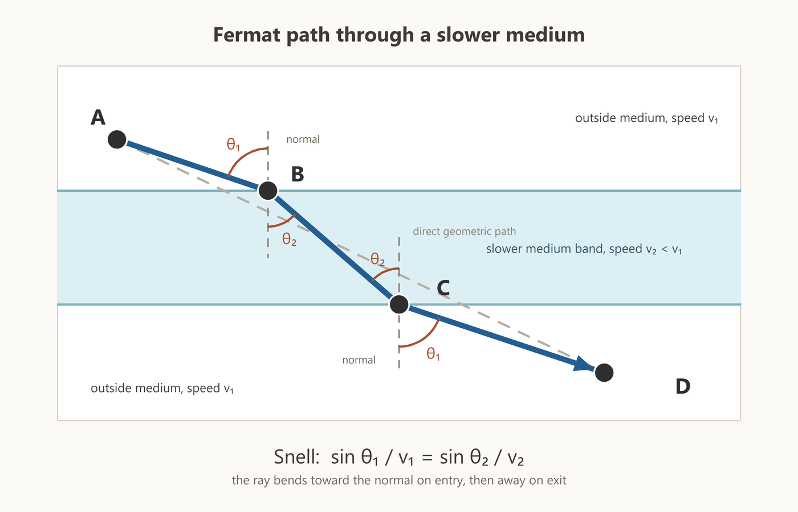

This requirement fixes the bending angle through Snell's law:

```math
\frac{\sin\theta_{\text{incidence}}}{v_{\text{incident}}}
=
\frac{\sin\theta_{\text{refraction}}}{v_{\text{refracted}}}
```

We will skip the proof, but the intuition is exactly that of any time-optimized route-finding. Say a person were running a race that required swimming slowly across a body of water. To optimize their time, they would balance taking the shortest swim against taking the shortest total route. In the case of running a race, we would say that the racer calculated all this beforehand and chose the optimal route. But how does light do this? Does it "peek ahead"? It certainly can't see the future.

Light's optimization of travel time is a specific case of action extremization. While showing this requires material we have not yet covered, what we care about here is not solving the specific variational problem but exploring the mechanism by which path optimization seems somehow to "look ahead." Any variational problem entails the same seeming paradox, for it is the entirety of the integrated path that is extremized. One could argue that there is no mystery here for the full path is generated from the local equations of motion, but those equations provide a description of the local rules that give rise to the next step of the path, not a reason for those rules, not to mention that, in the Lagrangian formulation, the local equations of motion follow from the variational procedure.

The solution to light's ability to find the optimal path was given by Huygens' principle in the 1600s. The principle states that every point on a wavefront emits spherical wavelets whose envelope is the next wavefront, where the wavelets interfere constructively. Elsewhere, they are out of phase and the wavelets interfere destructively.

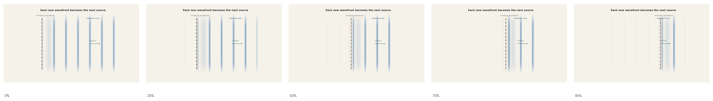

[Open MP4: lm-huygens-transverse-interference-cascade.mp4](animations/lm-huygens-transverse-interference-cascade.mp4)

Now, when we apply this to a light ray impinging on a new medium, the wavefront pivots due to the difference in propagation speed in the new medium.

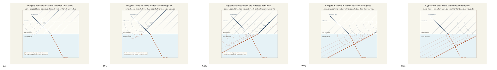

[Open MP4: lm-huygens-snell-symmetric-reference.mp4](animations/lm-huygens-snell-symmetric-reference.mp4)

The secondary wavelet expands at the wave speed of the medium it enters. After the same elapsed time,

```math
\text{wavelet radius}=v_{\text{medium}}\Delta t .
```

::: details Visual proof of Snell's law

From this we can construct a visual proof of Snell's law.

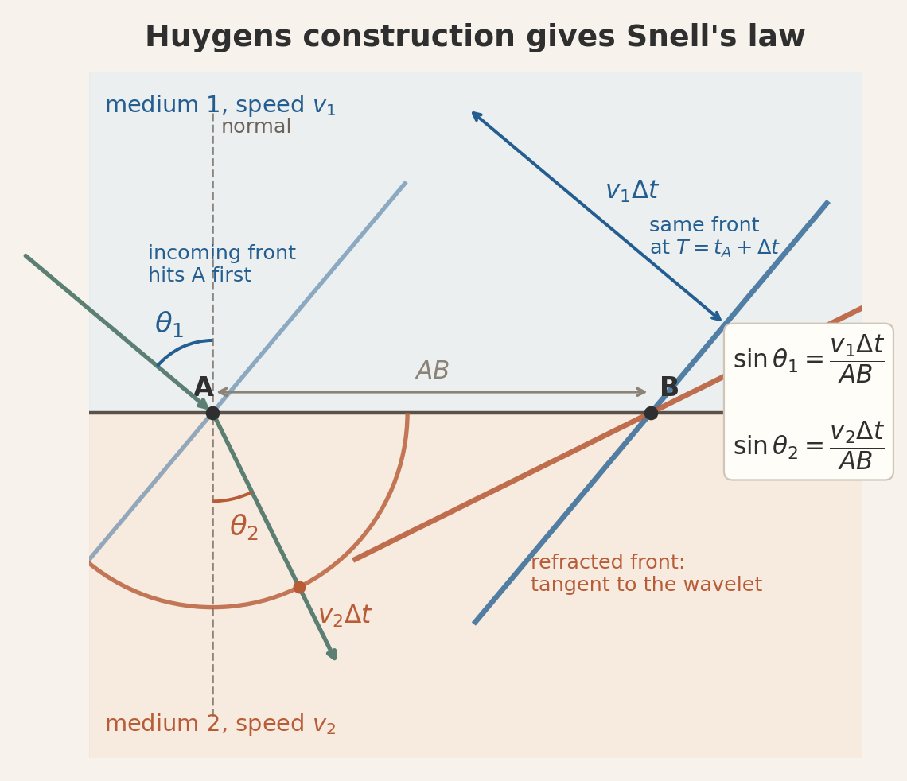

Point A is hit first. After a time $\Delta t$, the incoming wavefront reaches B. During that same time, the incoming wavefront has advanced a distance $v_1\Delta t$ in the first medium. Also during that same time, the wavelet from A has expanded to radius $v_2\Delta t$ in the second medium.

Now both pieces use the same boundary distance $AB$. For the incoming side,

```math
\sin\theta_1=\frac{v_1\Delta t}{AB}.
```

For the refracted side,

```math
\sin\theta_2=\frac{v_2\Delta t}{AB}.
```

Therefore,

```math
\frac{\sin\theta_1}{v_1}
=
\frac{\sin\theta_2}{v_2}.
```

:::

This is Snell's law, or equivalently Fermat's theorem that light optimizes its travel time.

What has happened here? If we focus on the light ray rather than the wave, it seems to have "peeked ahead" and found the optimal path. If we focus on the wave instead, the mystery changes. The wave does not choose a path in advance, it sends contributions through the available possibilities, and the contributions away from the travel-time optimum cancel by destructive interference. Huygens' principle provides a mechanism by which, so to speak, "nature solves" the variational problem to find the optimal path.

Would we ever see those interfering contributions before the cancellation has narrowed into a clean ray? Yes, when the wavelength is long compared to the region over which the wavefront is being reflected or refracted. A long-wavelength radio wave reflecting from a narrow mirror, for example, would not produce a sharp reflected ray. The cancellation would be incomplete, and the reflected signal would spread into a diffraction pattern.

As we will see, quantum mechanics keeps this wave mathematics but changes what the wave means. The wavefunction carries the phase information whose interference determines the probabilities of particle observations. In the macroscopic limit, where the wavelength of the quantum wavefunction is very small compared to the scale over which the path is varied, contributions away from the classical path cancel by destructive interference.

Feynman's path integral formulation then pushes the same phase-cancellation idea one step further. Rather than evolving a wavefront directly, it assigns a phase to every possible path. This is natural in quantum mechanics because, as we will see, phase is proportional to action. Paths whose phases fail to line up contribute little to the final amplitude, while paths near the stationary path reinforce.

## Lagrangians of Fields
We have focused on using the variational approach to find paths, or worldlines. However, modern fundamental physical theories, in accordance with the idea of local causality, are built from fields, which place some object, be it a real- or complex-valued scalar, vector, or spinor at each point on spacetime. We can then talk about "histories" of "configurations" rather than "paths" of "bodies." Making this shift, we write the action as:

```math
S[\phi]
=
\int_{\Omega}
\mathcal L\left(\phi(x),\partial_\mu\phi(x)\right)\,d^4x .
```

Here $\mathcal L$ is now the Lagrangian density, and we integrate over a spacetime volume $d^4x$.

To see what kind of dynamics this produces, consider the simplest case of a single real scalar field $\phi(x)$. Locality says that the Lagrangian density at a point should be built from the field and its derivatives at that same point. Lorentz invariance says that spacetime indices must be contracted in accordance with the Minkowski metric. The simplest derivative term is therefore

```math
\partial_\mu\phi\,\partial^\mu\phi .
```

$\phi^2$ is the simplest term to track "displacement" of the field value away from its equilibrium value. Thus a reasonable first free-field Lagrangian density is

```math
\mathcal L
=
-\frac12\,\partial_\mu\phi\,\partial^\mu\phi
-\frac12\,\kappa^2\phi^2 .
```

We will justify this field Lagrangian more concretely with a spring lattice model later. For now, we will say only that it is reasonable and Lorentz invariant.

The field version of the Euler-Lagrange equation is

```math
\frac{\partial\mathcal L}{\partial\phi}
-
\partial_\mu
\left(
\frac{\partial\mathcal L}{\partial(\partial_\mu\phi)}
\right)
=
0.
```

For the Lagrangian density above, this gives

```math
\frac{1}{c^2}\frac{\partial^2\phi}{\partial t^2}
-
\nabla^2\phi
+
\kappa^2\phi
=
0.
```

When $\kappa=0$, this is the ordinary wave equation.

```math
\frac{1}{c^2}\frac{\partial^2\phi}{\partial t^2}
-
\nabla^2\phi
=
0.
```
This leads to the insight that relativistic field evolution manifests as waves propagating through spacetime. Such waves are the fundamental "stuff" of modern physical theories, in which the building blocks are not blocks but excitations.

### Noether Currents and Charges

For a single particle, Noether's theorem gives conserved quantities along a path. For fields, the same idea becomes richer because the conserved quantity can be distributed across space and can flow from one region to another. The result is not only a conserved quantity, but a conserved current.

The complete derivation is below, but we can work through the gist of the argument without working through the details. As we have seen, conservation comes from the boundary term after integrating the action variation by parts. For a symmetry variation on a physical path, the action does not change and the bulk term vanishes. What remains is the boundary contribution. Since the boundary of a path consists of two endpoints, the boundary contribution at the final endpoint must cancel the boundary contribution at the initial endpoint. That is conservation.

For fields, the Lagrangian density is integrated over a spacetime region. The boundary of *that region* is not two endpoints, but a hypersurface surrounding the region. The same boundary-cancellation statement therefore becomes a flux statement through that hypersurface:

```math
\int_{\partial\Omega}j^\mu\,d\Sigma_\mu=0.
```

The object $j^\mu$ is called a current because it is the local object whose flux through the boundary is being added up by this surface integral.

If the total flux through the boundary of every spacetime region is zero, then the current has no local source or sink. The divergence theorem expresses this as

```math
\int_{\partial\Omega} j^\mu\,d\Sigma_\mu
=
\int_\Omega \partial_\mu j^\mu\,d^4x
=
0
\quad\Rightarrow\quad
\partial_\mu j^\mu=0
\quad\Rightarrow\quad
\frac{\partial j^0}{\partial t}
=
-
\nabla\cdot\mathbf j.
```

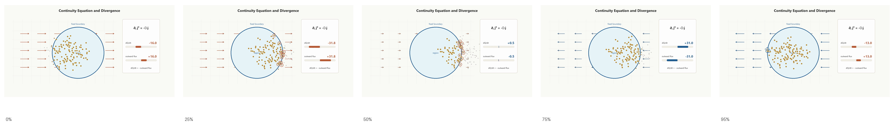

[Open MP4: lm-noether-flux-continuity.mp4](animations/lm-noether-flux-continuity.mp4)

Charge is then defined as the total inventory of this current on a spatial slice:

```math
Q
=
\int_\Sigma j^\mu\,d\Sigma_\mu
=
\int j^0\,d^3x.
```
The local equation $\partial_\mu j^\mu=0$ is the continuity equation for Noether current. In time-plus-space form, it says that a change in the local inventory $j^0$ must be accounted for by a flow $\mathbf j$ into or out of the neighboring region. Charge conservation is the integrated version of this local statement.


::: details Derivation of the Noether current

Let the action for fields $\phi^A(x)$ be

```math
S[\phi]
=
\int_\Omega
\mathcal L(\phi^A,\partial_\mu\phi^A)\,d^4x.
```

Here $A$ labels the fields or field components. Under an arbitrary variation,

```math
\phi^A\rightarrow \phi^A+\delta\phi^A,
```

the first-order variation of the action is

```math
\delta S
=
\int_\Omega
\left[
\frac{\partial\mathcal L}{\partial\phi^A}\delta\phi^A
+
\frac{\partial\mathcal L}{\partial(\partial_\mu\phi^A)}
\partial_\mu(\delta\phi^A)
\right]d^4x.
```

The second term contains a derivative of the variation. Integrating it by parts gives

```math
\delta S
=
\int_\Omega
\left[
\frac{\partial\mathcal L}{\partial\phi^A}
-
\partial_\mu
\left(
\frac{\partial\mathcal L}{\partial(\partial_\mu\phi^A)}
\right)
\right]\delta\phi^A\,d^4x
+
\int_{\partial\Omega}
\frac{\partial\mathcal L}{\partial(\partial_\mu\phi^A)}
\delta\phi^A\,d\Sigma_\mu.
```

Here $d\Sigma_\mu$ is the oriented surface element of the boundary $\partial\Omega$. It is the spacetime version of the outward-pointing area element $d\mathbf A$ in ordinary flux integrals. Thus a term like $j^\mu d\Sigma_\mu$ measures the amount of current flowing through a small piece of the boundary. 

The first term is the bulk term. It gives the field Euler-Lagrange equations:

```math
\frac{\partial\mathcal L}{\partial\phi^A}
-
\partial_\mu
\left(
\frac{\partial\mathcal L}{\partial(\partial_\mu\phi^A)}
\right)
=
0.
```

The second term is the boundary term. This is where currents enter.

Suppose the theory has a continuous global symmetry. This means there is a transformation with a constant parameter $\epsilon$ such that

```math
\delta\phi^A=\epsilon R^A(\phi),
```

and the action is unchanged. For example, a complex field may have a global phase symmetry,

```math
\psi(x)\rightarrow e^{i\epsilon}\psi(x),
```

so for small $\epsilon$,

```math
\delta\psi=i\epsilon\psi.
```

For the symmetry variation, and on physical field configurations, the bulk term vanishes because the field equations hold. The variation of the action is therefore reduced to the boundary term:

```math
0
=
\epsilon
\int_{\partial\Omega}
\frac{\partial\mathcal L}{\partial(\partial_\mu\phi^A)}
R^A\,d\Sigma_\mu.
```

This identifies the Noether current:

```math
j^\mu
=
\frac{\partial\mathcal L}{\partial(\partial_\mu\phi^A)}
R^A.
```

Since the boundary flux of this current vanishes for any spacetime region $\Omega$,

```math
\int_{\partial\Omega}j^\mu\,d\Sigma_\mu=0.
```

By the divergence theorem,

```math
\int_\Omega \partial_\mu j^\mu\,d^4x=0.
```

Since this holds for arbitrary $\Omega$, the current obeys the local continuity equation:

```math
\partial_\mu j^\mu=0.
```

In time-plus-space language this is

```math
\frac{\partial j^0}{\partial t}
+
\nabla\cdot\mathbf j
=
0.
```

The time component $j^0$ is the charge density, and the spatial components $\mathbf j$ describe the flow of that charge. The total charge is

```math
Q=\int j^0\,d^3x.
```

The continuity equation says that $Q$ can change in a region only if current flows through the boundary of that region. If no current flows out through the boundary, then

```math
\frac{dQ}{dt}=0.
```

Thus, global symmetry gives local current conservation, and local current conservation gives a globally conserved charge.

:::

For spacetime translations, the Noether current is the stress-energy tensor $T^{\mu\nu}$. The conserved charges are the total energy and momentum:

```math
P^\nu
=
\int T^{0\nu}\,d^3x.
```

The additional rank here comes from the fact that energy-momentum already has components. The first index tells which spacetime direction the current crosses, and the second tells which component of energy-momentum is being carried. Thus $T^{00}$ is energy density, $T^{0i}$ is momentum density, and $T^{i\nu}$ is the flux of the $\nu$ component of energy-momentum through an $i$-directed surface.

In particle mechanics, translation symmetry gives a conserved momentum along one path, while in field theory, translation symmetry gives an energy-momentum current through spacetime. In practice, modern physical theories often proceed as follows. Identify the system's symmetry. Using the invariants of the symmetry, make an educated guess of a candidate Lagrangian. From the Lagrangian, infer currents. Test the predicted currents experimentally.  
