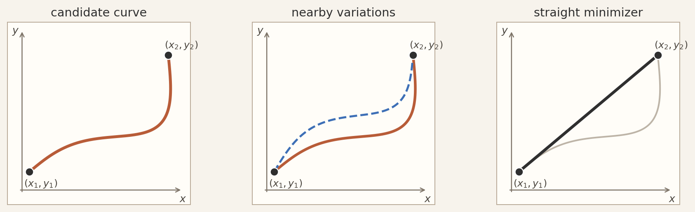
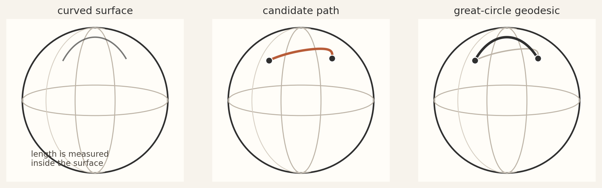

# LM Draft
Now that we know the geometry of spacetime in which motion takes place, we can move to describing how objects move and influence one another.  

## Paths
imagine path between fixed points. ask: could we assign a number to the path. what conditions would need to be met. (diagram of path alternatives). paths would have to belong to a set, which they clearly do. knowing that, we can map each member of the set to a number. Now, the path (let's say our physical a system is a single particle moving about) *is* the physics, for the path in spacetime tells us where the particle will be at any time in the past or future. thus (between fixed endpoints), we can assign a number to all "possible physics." All observers agree on "the physics." This is the essence of physical symmetries. Everyone agrees how pool balls move on the table. Therefore, the number we associate with the path has to be a spactime invariant. There is only one such invariant for us to work with given only that path, and that is proper time (dtau) or proper path length (ds). Therefore our "path number" will have to be proper time up to some scale factor. So we could figure out "the physics" if we could pick from among these numbers. How might we do so? Note that we now have a functional: f[path] = <value>. (Since a path is itself a function, we call this a "functional" rather than a "function.") Something we know about functions from high school calculus is that they have certain special points where they are  minimum, maximum, or on a saddle. (diagram). We also know from high school calculus how to find these points for functions, but not for functionals. If we -could- find the functional minimum (technically "stationary point"), would that be the right number to represent the physics? Well, we are free to choose any input function we like, therefore, we are free to find just the right function so that when we do minimize it, the corresponding path is the physical one. The worldlines that emerge from this clever and principled procedure are somehow architectural -- lines, curves, other immediately comprehended patterns. These observable regularities map to the theory's symmetry.


### Using Extremization to Find Geodesics

Let's start with a straight line in flat space.

#### Straight Line in Flat Space\
\
\
\



Figure 53 - Minimizing a curve in the plane

We can write any curve in the (x,y) plane in parametric form

``` math
\lambda \mapsto (x(\lambda),y(\lambda)),
```

with fixed endpoints

``` math
\left( x\left( \lambda_{1} \right),y\left( \lambda_{1} \right) \right) = \left( x_{1},y_{1} \right),\ \ \ \ \ \ (x(\lambda_{2}),y(\lambda_{2})) = (x_{2},y_{2}).
```

The length of such a curve is

``` math
L\lbrack x,y\rbrack = \int_{\lambda_{1}}^{\lambda_{2}}\sqrt{\left( \frac{dx}{d\lambda} \right)^{2} + \left( \frac{dy}{d\lambda} \right)^{2}}\,d\lambda.
```

Define

``` math
\dot{x} = \frac{dx}{d\lambda},\dot{y} = \frac{dy}{d\lambda},\ \ \ \ \ \ R = \sqrt{{\dot{x}}^{\,2} + {\dot{y}}^{\,2}}.
```

Then

``` math
L\lbrack x,y\rbrack = \int_{\lambda_{1}}^{\lambda_{2}}{R\,d\lambda.}
```

Now require that this functional (function of functions) be stationary under small variations of the curve that keep the endpoints fixed.

Let

``` math
x(\lambda) \rightarrow x(\lambda) + \varepsilon\,\eta(\lambda),\ \ \ \ \ y(\lambda) \rightarrow y(\lambda) + \varepsilon\,\xi(\lambda),
```

Here:

- $`\eta(\lambda)`$ and $`\xi(\lambda)`$ are arbitrary test functions that vanishe at the endpoints\
  (so the endpoints stay fixed: $`\eta\left( \lambda_{1} \right) = \eta\left( \lambda_{2} \right) = 0,\ \ \ \ \xi(\lambda_{1}) = \xi(\lambda_{2}) = 0`$)

- $`\varepsilon`$ is an infinitesimal number that controls the size of the change

Then

``` math
\dot{x} \rightarrow \dot{x} + \varepsilon\,\dot{\eta},\dot{y} \rightarrow \dot{y} + \varepsilon\,\dot{\xi}.
```

The varied length is

``` math
L(\varepsilon) = \int_{\lambda_{1}}^{\lambda_{2}}\sqrt{\left( \dot{x} + \varepsilon\dot{\eta})^{2} + (\dot{y} + \varepsilon\dot{\xi})^{2} \right.\ }\text{\:\,}d\lambda.
```

Differentiate with respect to $`\varepsilon`$ and evaluate at $`\varepsilon = 0`$:

``` math
{\frac{dL}{d\varepsilon} \mid}_{\varepsilon = 0} = \int_{\lambda_{1}}^{\lambda_{2}}\frac{\dot{x}\,\dot{\eta} + \dot{y}\,\dot{\xi}}{\sqrt{{\dot{x}}^{\,2} + {\dot{y}}^{\,2}}}\text{\:\,}d\lambda.
```

Stationarity requires

``` math
{{\frac{dL}{d\varepsilon} \mid}_{\varepsilon = 0} = 0.
}
{That\ is:}
```

1.  Take some original test curve and test end-point vanishing functions.

2.  Now L($`\varepsilon)`$ is function of $`\varepsilon`$ only.

3.  Thus, for this test curve, epsilon is 0, and if and only if $`{\frac{dL}{d\varepsilon} \mid}_{\varepsilon = 0} = 0`$, the test path is an extremum (stationary point).

Now integrate this by parts, leading to an integrand containing only $`\eta`$ and $`\xi`$ (not their derivatives) and x, y and their derivatives.

``` math
\int_{\lambda_{1}}^{\lambda_{2}}\frac{\dot{x}\,\dot{\eta}}{R}\,d\lambda = \left\lbrack \frac{\dot{x}}{R}\eta \right\rbrack_{\lambda_{1}}^{\lambda_{2}} - \int_{\lambda_{1}}^{\lambda_{2}}\frac{d}{d\lambda}\left( \frac{\dot{x}}{R} \right)\eta\,d\lambda.
```

The boundary term vanishes because $`\eta(\lambda_{1}) = \eta(\lambda_{2}) = 0`$.

Similarly for $`y`$. Therefore the stationarity condition becomes

``` math
\int_{\lambda_{1}}^{\lambda_{2}}\left\lbrack - \frac{d}{d\lambda}\left( \frac{\dot{x}}{R} \right)\eta - \frac{d}{d\lambda}\left( \frac{\dot{y}}{R} \right)\xi \right\rbrack d\lambda = 0.
```

Because $`\eta`$ and $`\xi`$ can be any functions that vanish at the endpoints, the only way the integral can be zero for all such choices is for the coefficients of $`\eta`$ and $`\xi`$ to vanish pointwise. $`\frac{d}{d\lambda}\left( \frac{\dot{x}}{R} \right) = 0,\ \ \ \ \frac{d}{d\lambda}\left( \frac{\dot{y}}{R} \right) = 0.`$*\*

Define $`A,B`$:

``` math
\frac{\dot{x}}{\sqrt{{\dot{x}}^{\,2} + {\dot{y}}^{\,2}}} = A,\ \ \ \ \frac{\dot{y}}{\sqrt{{\dot{x}}^{\,2} + {\dot{y}}^{\,2}}} = B.
```

Square and add:

``` math
A^{2} + B^{2} = 1.
```

From the first equation,

``` math
\dot{x} = A\sqrt{{\dot{x}}^{\,2} + {\dot{y}}^{\,2}}.
```

This implies that the ratio $`\dot{y}/\dot{x}`$ is constant. Indeed,

``` math
\frac{\dot{y}}{\dot{x}} = \frac{B}{A} = \text{constant}.
```

Therefore both $`\dot{x}`$ and $`\dot{y}`$ are constant up to an overall multiplicative factor. Integrating,

``` math
x(\lambda) = a\lambda + b,\ \ \ \ \ \ \ y(\lambda) = c\lambda + d,
```

for constants $`a,b,c,d`$.

The curves that make the length functional stationary are precisely functions of the form:

``` math
(x(\lambda),y(\lambda)) = (a\lambda + b,\text{\:\,}c\lambda + d),
```

which are straight lines.

#### Minimizing Length on Sphere

Let's sketch how we would modify the procedure above to show that geodesics on a sphere are the shortest possible paths in that space.



Figure 54 - Geodesics on a sphere

The procedure proceeds just as for a line in flat space except that our invariant metric change from:
```math
ds^{2} = dx^{2} + dy^{2}
```

to:
``` math
ds^{2} = R^{2}\left( d\theta^{2}+{\sin}^{2}\theta\,d\phi^{2} \right)
```

After carrying out the procedure, we find that:\
\
``` math
{\ddot{\theta} - \sin{\theta\cos{\theta\,{\dot{\phi}}^{2}}} = 0,\ \ \ \ \ \ \ \ \ddot{\phi} + 2\cot\theta\,\dot{\theta}\,\dot{\phi} = 0
}
{which\ are\ the\ equations\ for\ a\ geodesic\ on\ a\ sphere.\ 
}
```

### From Geometry to Physics

A few observations are evident from this discussion. First, the description of curves in terms parameterized equations and their derivatives is the exact same machinery we use for describing physical trajectories. Second, we see that in flat space "acceleration" (second derivative) is zero, while it is non-zero in curved space. Third, the extremization approach we used is identical to the approach used in "Lagrangian Mechanics." The path length is equivalent to the "Lagrangian," the differential equations are equivalent to the "Euler Lagrange" equations, and the invariant distance is equivalent to the invariant Minkowski metric on spacetime.\
\
We can now simply reappropriate this approach to find that a inertial path in spacetime is a straight world line. First, we write down the Lagrangian. For a free particle in spacetime, take the Lagrangian proportional to the invariant interval:

``` math
L = - mc\,\sqrt{- \,\eta_{\mu\nu}\,{\dot{x}}^{\mu}{\dot{x}}^{\nu}}
```

Treat $`x^{\mu}(\tau)`$ as generalized coordinates and apply

``` math
\frac{d}{d\tau}\left( \frac{\partial L}{\partial{\dot{x}}^{\mu}} \right) - \frac{\partial L}{\partial x^{\mu}} = 0.
```

Because $`L`$does not depend explicitly on $`x^{\mu}`$,

``` math
\frac{\partial L}{\partial x^{\mu}} = 0,
```

so we get

``` math
\frac{d}{d\tau}\left( \frac{\partial L}{\partial{\dot{x}}^{\mu}} \right) = 0.
```

Compute the momentum-like term:

``` math
\frac{\partial L}{\partial{\dot{x}}^{\mu}} = \frac{m\,\eta_{\mu\nu}{\dot{x}}^{\nu}}{\sqrt{- \eta_{\alpha\beta}{\dot{x}}^{\alpha}{\dot{x}}^{\beta}}}.
```

With proper time parametrization the denominator is constant, giving

``` math
\frac{d^{2}x^{\mu}}{d\tau^{2}} = 0.
```

This is precisely the statement that in flat spacetime, a free particle follows a straight worldline. We will now see how extending this procedure to curved spacetime leads to General Relativity and its explanation of gravity.

