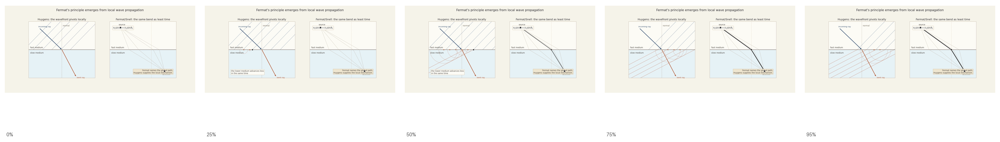

# LM Draft
We have discussed the symmetries that characterize the world we live in, the invariants that define spacetime geometry and the associated transformations that map any observer’s coordinate measurements to these invariants, the mathematical objects that carry those transformations, and the constraints this structure places on motion and causality. We can now turn our attention to how physical systems, under these constraints, actually evolve in spacetime.

## The Principal of Least Action
[take1] imagine path between fixed points. ask: could we assign a number to the path. what conditions would need to be met. (diagram of path alternatives). paths would have to belong to a set, which they clearly do. knowing that, we can map each member of the set to a number. Now, the path (let's say our physical a system is a single particle moving about) *is* the physics, for the path in spacetime tells us where the particle will be at any time in the past or future. thus (between fixed endpoints), we can assign a number to all "possible physics." All observers agree on "the physics." This is the essence of physical symmetries. Everyone agrees how pool balls move on the table. Therefore, the number we associate with the path has to be a spactime invariant. There is only one such invariant for us to work with given only that path, and that is proper time (dtau) or proper path length (ds). Therefore our "path number" will have to be proper time up to some scale factor. So we could figure out "the physics" if we could pick from among these numbers. How might we do so? Note that we now have a functional: f[path] = <value>. (Since a path is itself a function, we call this a "functional" rather than a "function.") Something we know about functions from high school calculus is that they have certain special points where they are  minimum, maximum, or on a saddle. (diagram). We also know from high school calculus how to find these points for functions, but not for functionals. If we -could- find the functional minimum (technically "stationary point"), would that be the right number to represent the physics?


Well, we are free to choose any input function we like, therefore, we are free to find just the right function so that when we do minimize it, the corresponding path is the physical one. The worldlines that emerge from this clever and principled procedure are somehow architectural -- lines, curves, other immediately comprehended patterns. These observable regularities map to the theory's symmetry.

[take2]There are two things to say here. first, functionals made from integrating quadratic functions of local variables over a parameter typically does output a function with stationary points. second, the paths that characterize our world's physics have an architectural obviousness to them. this hints that the physics reflects the architecture of spacetime -- the obviousness of line representing uninfluenced motion or a parabola mathching a simple force field. it is then not entirely surprising that the functional we need is integrating a local function over proper time and that local function, which must, again, be invariant is, happily, built from just those invariants which thus passes spacetime's architecture to physics. norm being a quadratic function helps further by giving us minima and maxima.[/]

 [idea] maybe chop this up into sections, one of which is "physics is invariant".[/]

[note] when do you say prinicpal of least action? say LM]
[talk about fermat]

[take4]
Imagine the possible paths between some endpoints in a time vs position plot. [diagram].


Without knowing anything training in physics, could we guess which path is the most is the "physical" one? Einstein is purpoted to have said that "the difference between genius and stupidity is that genius has its limits." If we think nature has a certain genius and we note that the set of simple, or elegant, paths is smaller than the set of "stupid" paths, we might think nature ingeniously chooses the more the elegant.  We can't take this too literally, in many complicated systems paths will be complicated, but the intuition is essentially correct. Whatever the physical path is for a given system, it is "the one" that is, when all constraints are taken into account, the most "something." What we will learn is that we don't need to know what that ineffable "something" is -- simple, elegant, short, lazy, relaxed, efficient -- but only that whatever it is nature "optimizes" it. This is "the principle of least action," from which the "laws of physics" follow. The "action" is the quantity the physical paths "extremize" (minimize, maximize, or isolate some other stationary point). Action is something like energy over time, but this is putting the horse before cart, because energy is defined in terms of action, and action has no definition prior to "that which" nature optimizes. 

Without any training in physics, could we guess which path is the physical one? Einstein is purported to have said that ‘the difference between genius and stupidity is that genius has its limits.’ If we think nature has a certain genius, and notice that simple or elegant paths are exceptional among all possible paths, we might suspect that nature chooses the more elegant one. We cannot take this too literally. In complicated systems, physical paths can be complicated. But the intuition is essentially on target. Whatever the physical path is for a given system, it is the one that, when all constraints are taken into account, is the most "something." What we will learn is that we don't need to know what that ineffable "something" is -- simple, elegant, short, lazy, relaxed, efficient -- but only that, whatever it is, nature "optimizes" it. This is the "principle of least action, from which the "laws of physics" follows. Action is the quantity assigned to possible paths, and the physical path is the one whose action is stationary.”

It says the physical path is the one the minimizes a functional (function of a function) of possible paths. (Pedantically, "minimize" is a specific case of a more general condition, as we will see.). A free particle moves as constant velocity, so it's path in a spacetime diagram is a straight line. An object falling in uniform gravity traces a parabola in spacetime. [diagram]


We will make this precise shortly, but the intuition that nature chooses the path that is "as simple as it can be" fair. 

Fermat made this rigorous for light. Light takes the path that minimizes the time to get from one point to another. If it enters a medium where it travels more slowly it will bend to spend less time time that medium and bend back when it exits, just as, if you were planning a route with biking then swimming then biking, you adapt your path to spend less time in the water, even while that added to your total distance. You can plan ahead to do this, but how does the light "plan ahead"? It's mysterious. If we think of light not as ray but as a wave, we can understand the phenomenon in term Huyghen's principle. <....bunch more writing here...>.



*The wavefront turns locally at the boundary; the resulting ray is the same path Fermat describes as stationary travel time.*

[Open MP4: lm-fermat-snell-huygens.mp4](animations/lm-fermat-snell-huygens.mp4)

How would we go about makeing these ideas mathematically well defined? consider out path between fixed points. ask: could we assign a number to the path. what conditions would need to be met. (diagram of path alternatives). paths would have to belong to a set, which they clearly do. knowing that, we can map each member of the set to a number. Now, the path (let's say our physical a system is a single particle moving about) *is* the physics, for the path in a spacetime plot tells us where the particle will be at any time in the past or future. thus (between fixed endpoints), we can assign a number to all "possible physics." All observers agree on "the physics." This is the essence of physical symmetries. Everyone agrees how pool balls move on the table. Therefore, the number we associate with the path has to be a spactime invariant. There is only one such invariant for us to work with given only that path, and that is proper time (dtau) or proper path length (ds). Therefore our "path number" will have to be proper time up to some scale factor. So we could figure out "the physics" if we could pick from among these numbers. How might we do so? Note that we now have a functional: f[path] = <value>. (Since a path is itself a function, we call this a "functional" rather than a "function.") Something we know about functions from high school calculus is that they have certain special "stationary" points where they are  minimum, maximum, or on a saddle. (diagram). We also know from high school calculus how to find these points for functions, but not for functionals. If we -could- find the functional minimum (technically "stationary point"), would that be the right number to represent the physics?


Well, we are free to choose any input function we like, therefore, we are free to find just the right function so that when we do minimize it, the corresponding path is the physical one. The worldlines that emerge from this clever and principled procedure are somehow architectural -- lines, curves, other immediately comprehended patterns. These observable regularities map to the theory's symmetry.

[outline]
1. intro - from rel to dynamics
2. POLA - define action
2.1 the general intuition of POLA
2.2. intuition examples
2.3. putting POLO on a math footing definitionally, including defining  and the 
Lagrangian
2.4 fermat as harbinger
2.5 Variational examples
2.6 definition of 4-momentum
2.7 recovering T - V in lab frame.

### Using Variational Calculus to Find Geodesics

Let's start with a straight line in flat space.

[take2] this will be too vague without an example. we can start with the example of finding the shortest path in euclidean space between two points.

[take3 - take your time] Before we get into how the mechanical world actually works, we need to get grounded in some math or the physics will be unintelligible. The math for mapping functions to numbers and finding the stationary functions (minimum, maximum, saddle, etc., whereever the first order variation vanishes (diagram of first order variation vanishing)) is "variational calculus." We are saying here that a functional maps a function to a number, but let's not get hung up on the concrete idea of a function. The fact is, in physics we are mapping paths to numbers, and a functional acts perfectly well on paths. To use variational calculus we have to treat paths as functions, which is obviously quite doable, but we do well to remind ourselves that the actual objects we care about are paths, or, more generally, histories. Now, we could map a path to a number as follows. <number = endpoint - beginpoint>. This is a perfectly valid functional, but it won't do for physics. Why? Because it ignores everything that happens between the end and begin points. We know in physics every next step must follow from the previous step, therefore we need a functional that accounts for each step. This is, in a word, an integral along the path. What is the simplest possible such integral? It is the the path length, and, if the velocity along the path is constant, it is simply the  the value of the path parameter. If a path is x-bar(lambda), the path length is simply lambda. If we want to find the shortest path length, we need to find the path that minimizes the path length. If we want to find the shortest path length under some constraint, for example, on a curved surface, we need to some function of the lambda that incorporates the constraint. The difference between the purely geometric problems and physical ones resides only applying some unitful scale factor to obtain action. In the simplest case, it is no more than multiplying proper time by mass. In more involved cases, we can think of there being some position-dependent "effective mass" if we assume some external potential, but we have the liberty to represent external potentials in terms of some curved space in which the potential is absorbed into the space's curvatures. All this applies to individual particles following trajectories, but when we (as we will) dispense with particles as fundamental objects and move to fields, there will be new lorentz invariants associated with field histories, our integration parameter will become a spacetime volume, and different fields can interact, giving rise to a picture in which field configuration histories replace paths as the objects to be mapped to action, and spacetime volume replaces proper time as the parameter of integration. When these changes are in place the idea that action is scaled path length will gave way to richer ways construct action. In any case, the math we need to understand can be understood by simply finding the shortest path length in different geomerties, and, for the particle picture, this is actually the heart of finding the action itself.

[Cover 1. shortest path flat and 2. sphere, 3. simple case of free action, 4. case of action in potential and how this looks like effective mass or curved surface]

[zooming out:
-invariance of physics requires lorentz invariants and motivation for action and variational method
-POLA, sipmle example, fermat  
-path lengths to get the math and b/c they really are what you work with
-ways to build action from path length with simple examples
-fields, lagrangian density, configurations, histories, representations, new invariants
-GR
-gauge]

#### Straight Line in Flat Space\
\
\
\


Figure 53 - Minimizing a curve in the plane

We can write any curve in the (x,y) plane in parametric form

``` math
\lambda \mapsto (x(\lambda),y(\lambda)),
```

with fixed endpoints

``` math
\left( x\left( \lambda_{1} \right),y\left( \lambda_{1} \right) \right) = \left( x_{1},y_{1} \right),\ \ \ \ \ \ (x(\lambda_{2}),y(\lambda_{2})) = (x_{2},y_{2}).
```

The length of such a curve is

``` math
L\lbrack x,y\rbrack = \int_{\lambda_{1}}^{\lambda_{2}}\sqrt{\left( \frac{dx}{d\lambda} \right)^{2} + \left( \frac{dy}{d\lambda} \right)^{2}}\,d\lambda.
```

Define

``` math
\dot{x} = \frac{dx}{d\lambda},\dot{y} = \frac{dy}{d\lambda},\ \ \ \ \ \ R = \sqrt{{\dot{x}}^{\,2} + {\dot{y}}^{\,2}}.
```

Then

``` math
L\lbrack x,y\rbrack = \int_{\lambda_{1}}^{\lambda_{2}}{R\,d\lambda.}
```

Now require that this functional (function of functions) be stationary under small variations of the curve that keep the endpoints fixed.

Let

``` math
x(\lambda) \rightarrow x(\lambda) + \varepsilon\,\eta(\lambda),\ \ \ \ \ y(\lambda) \rightarrow y(\lambda) + \varepsilon\,\xi(\lambda),
```

Here:

- $`\eta(\lambda)`$ and $`\xi(\lambda)`$ are arbitrary test functions that vanishe at the endpoints\
  (so the endpoints stay fixed: $`\eta\left( \lambda_{1} \right) = \eta\left( \lambda_{2} \right) = 0,\ \ \ \ \xi(\lambda_{1}) = \xi(\lambda_{2}) = 0`$)

- $`\varepsilon`$ is an infinitesimal number that controls the size of the change

Then

``` math
\dot{x} \rightarrow \dot{x} + \varepsilon\,\dot{\eta},\dot{y} \rightarrow \dot{y} + \varepsilon\,\dot{\xi}.
```

The varied length is

``` math
L(\varepsilon) = \int_{\lambda_{1}}^{\lambda_{2}}\sqrt{\left( \dot{x} + \varepsilon\dot{\eta})^{2} + (\dot{y} + \varepsilon\dot{\xi})^{2} \right.\ }\text{\:\,}d\lambda.
```

Differentiate with respect to $`\varepsilon`$ and evaluate at $`\varepsilon = 0`$:

``` math
{\frac{dL}{d\varepsilon} \mid}_{\varepsilon = 0} = \int_{\lambda_{1}}^{\lambda_{2}}\frac{\dot{x}\,\dot{\eta} + \dot{y}\,\dot{\xi}}{\sqrt{{\dot{x}}^{\,2} + {\dot{y}}^{\,2}}}\text{\:\,}d\lambda.
```

Stationarity requires

``` math
{{\frac{dL}{d\varepsilon} \mid}_{\varepsilon = 0} = 0.
}
{That\ is:}
```

1.  Take some original test curve and test end-point vanishing functions.

2.  Now L($`\varepsilon)`$ is function of $`\varepsilon`$ only.

3.  Thus, for this test curve, epsilon is 0, and if and only if $`{\frac{dL}{d\varepsilon} \mid}_{\varepsilon = 0} = 0`$, the test path is an extremum (stationary point).

Now integrate this by parts, leading to an integrand containing only $`\eta`$ and $`\xi`$ (not their derivatives) and x, y and their derivatives.

``` math
\int_{\lambda_{1}}^{\lambda_{2}}\frac{\dot{x}\,\dot{\eta}}{R}\,d\lambda = \left\lbrack \frac{\dot{x}}{R}\eta \right\rbrack_{\lambda_{1}}^{\lambda_{2}} - \int_{\lambda_{1}}^{\lambda_{2}}\frac{d}{d\lambda}\left( \frac{\dot{x}}{R} \right)\eta\,d\lambda.
```

The boundary term vanishes because $`\eta(\lambda_{1}) = \eta(\lambda_{2}) = 0`$.

Similarly for $`y`$. Therefore the stationarity condition becomes

``` math
\int_{\lambda_{1}}^{\lambda_{2}}\left\lbrack - \frac{d}{d\lambda}\left( \frac{\dot{x}}{R} \right)\eta - \frac{d}{d\lambda}\left( \frac{\dot{y}}{R} \right)\xi \right\rbrack d\lambda = 0.
```

Because $`\eta`$ and $`\xi`$ can be any functions that vanish at the endpoints, the only way the integral can be zero for all such choices is for the coefficients of $`\eta`$ and $`\xi`$ to vanish pointwise. $`\frac{d}{d\lambda}\left( \frac{\dot{x}}{R} \right) = 0,\ \ \ \ \frac{d}{d\lambda}\left( \frac{\dot{y}}{R} \right) = 0.`$*\*

Define $`A,B`$:

``` math
\frac{\dot{x}}{\sqrt{{\dot{x}}^{\,2} + {\dot{y}}^{\,2}}} = A,\ \ \ \ \frac{\dot{y}}{\sqrt{{\dot{x}}^{\,2} + {\dot{y}}^{\,2}}} = B.
```

Square and add:

``` math
A^{2} + B^{2} = 1.
```

From the first equation,

``` math
\dot{x} = A\sqrt{{\dot{x}}^{\,2} + {\dot{y}}^{\,2}}.
```

This implies that the ratio $`\dot{y}/\dot{x}`$ is constant. Indeed,

``` math
\frac{\dot{y}}{\dot{x}} = \frac{B}{A} = \text{constant}.
```

Therefore both $`\dot{x}`$ and $`\dot{y}`$ are constant up to an overall multiplicative factor. Integrating,

``` math
x(\lambda) = a\lambda + b,\ \ \ \ \ \ \ y(\lambda) = c\lambda + d,
```

for constants $`a,b,c,d`$.

The curves that make the length functional stationary are precisely functions of the form:

``` math
(x(\lambda),y(\lambda)) = (a\lambda + b,\text{\:\,}c\lambda + d),
```

which are straight lines.

#### Minimizing Length on Sphere

Let's sketch how we would modify the procedure above to show that geodesics on a sphere are the shortest possible paths in that space.


Figure 54 - Geodesics on a sphere

The procedure proceeds just as for a line in flat space except that our invariant metric change from:
```math
ds^{2} = dx^{2} + dy^{2}
```

to:
``` math
ds^{2} = R^{2}\left( d\theta^{2}+{\sin}^{2}\theta\,d\phi^{2} \right)
```

After carrying out the procedure, we find that:\
\
``` math
{\ddot{\theta} - \sin{\theta\cos{\theta\,{\dot{\phi}}^{2}}} = 0,\ \ \ \ \ \ \ \ \ddot{\phi} + 2\cot\theta\,\dot{\theta}\,\dot{\phi} = 0
}
{which\ are\ the\ equations\ for\ a\ geodesic\ on\ a\ sphere.\ 
}
```

### From Geometry to Physics

A few observations are evident from this discussion. First, the description of curves in terms parameterized equations and their derivatives is the exact same machinery we use for describing physical trajectories. Second, we see that in flat space "acceleration" (second derivative) is zero, while it is non-zero in curved space. Third, the extremization approach we used is identical to the approach used in "Lagrangian Mechanics." The path length is equivalent to the "Lagrangian," the differential equations are equivalent to the "Euler Lagrange" equations, and the invariant distance is equivalent to the invariant Minkowski metric on spacetime.\
\
We can now simply reappropriate this approach to find that a inertial path in spacetime is a straight world line. First, we write down the Lagrangian. For a free particle in spacetime, take the Lagrangian proportional to the invariant interval:

``` math
L = - mc\,\sqrt{- \,\eta_{\mu\nu}\,{\dot{x}}^{\mu}{\dot{x}}^{\nu}}
```

Treat $`x^{\mu}(\tau)`$ as generalized coordinates and apply

``` math
\frac{d}{d\tau}\left( \frac{\partial L}{\partial{\dot{x}}^{\mu}} \right) - \frac{\partial L}{\partial x^{\mu}} = 0.
```

Because $`L`$does not depend explicitly on $`x^{\mu}`$,

``` math
\frac{\partial L}{\partial x^{\mu}} = 0,
```

so we get

``` math
\frac{d}{d\tau}\left( \frac{\partial L}{\partial{\dot{x}}^{\mu}} \right) = 0.
```

Compute the momentum-like term:

``` math
\frac{\partial L}{\partial{\dot{x}}^{\mu}} = \frac{m\,\eta_{\mu\nu}{\dot{x}}^{\nu}}{\sqrt{- \eta_{\alpha\beta}{\dot{x}}^{\alpha}{\dot{x}}^{\beta}}}.
```

With proper time parametrization the denominator is constant, giving

``` math
\frac{d^{2}x^{\mu}}{d\tau^{2}} = 0.
```

This is precisely the statement that in flat spacetime, a free particle follows a straight worldline. We will now see how extending this procedure to curved spacetime leads to General Relativity and its explanation of gravity.

