# Symmetry
Strike a pool ball with a cue, and the balls move in an expected way. Move the table over a few feet, and the balls move in recognizably the same way. Wait a few minutes, and the balls move in the same way. Turn the pool table a few degrees, and the balls still move the same way. Put the pool table on a train at constant velocity, and, again, the balls move in the same way. These are the manifest "symmetries" of the world we live in -- position and time translation, rotation, and velocity "boosts."


[Open MP4: symmetry-pool-table.mp4](animations/symmetry-pool-table.mp4)

*Symmetry transforms don't change how pool balls behave*

Our pool game illustrates what we mean by symmetries of physical behavior, but why should we start our story here? We will argue that symmetry constrains both the laws that govern physical evolution and the classification of the objects that undergo that evolution. The term "symmetry" in this context may not at first glance seem like the same concept as, say, a triangle's symmetry, but it precisely is, as we will see. Let's then start with the humble triangle and build up the vocabulary about symmetry we need to tell the rest of our story.

## Discrete symmetries
Consider a triangle:

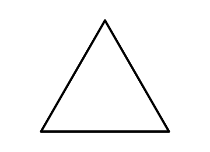

*An equilateral triangle*

We can see its obvious symmetry. To categorize its symmetry we can write down all the actions that leave it unchanged:
1. Do nothing
2. Rotate 120°
3. Rotate 240°
4. Flip along an axis
5. Flip then rotate 120°
6. Flip then rotate 240°

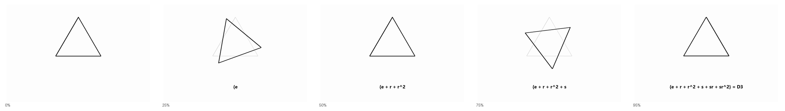

[Open MP4: symmetry-triangle-actions.mp4](animations/symmetry-triangle-actions.mp4)

*A triangle's symmetries*

We say the triangle "belongs to the $D_3$ symmetry **group**." Any number of objects possess $D_3$ symmetry.

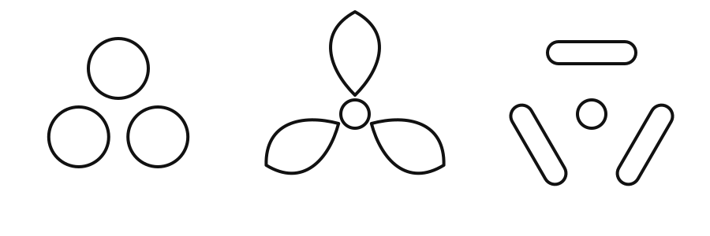

*$D_3 is more general than triangles*

We tend to think of a "triangle's symmetry" not the "symmetry of two rotations and flips about 3 axes," but this latter way of thinking in terms of symmetry groups is more general and is the definition of symmetry used in physics, where we ask not "what symmetry does this or that object have?" but "what mathematical objects realize the actions of a symmetry group?"

### Representations
We can plainly "see" the symmetry of the triangle, but what if we want to write it down mathematically? Specifically, what if we want to write group actions in terms of how they transform labels on an object? For example, suppose we label our triangle's vertices \(A, B, C\) and ask, if we rotate twice, flip once, then rotate again, where is vertex \(A\) sent? Recognizing that the triangle's state has three ordered components, we might guess that we could represent the triangle as a vector with 3 components. We could then represent 120° rotations as **transformations** of the labels that permute the vertices in accordance with the symmetry group actions. 

There is nothing special about the vertices here, we could just as easily have chosen the midpoint of the edges or any other triplet of points on the triangle, and the same matrix that permutes the vertices would permute those vectors. That is, the group actions are represented as **linear** transformations. A **representation** of a symmetry group is a vector space and set of linear transformations that compose in the same way as the group actions:

$$
D(g_1g_2)=D(g_1)D(g_2).
$$

where $g_1$ and $g_2$ are group actions, such as a rotation and a flip, and $D(g_n)$ is the matrix representing the $g_n$ action, and $D$ itself is the map from symmetry actions to matrices in the representation. This says that the matrix for the composed action \($g_2$ followed by $g_1$\) is the product of the matrices for the separate actions.

To construct a 3-dimensional representation of $D_3$, we map the 3 vertices to components of a vector.

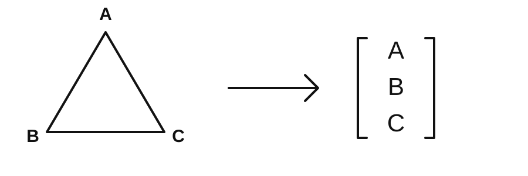

We can represent rotations and flips, respectively, with the following matrices:

Rotation:
$$
\begin{pmatrix}
0 & 0 & 1\\
1 & 0 & 0\\
0 & 1 & 0
\end{pmatrix}
$$

Flip:
$$
\begin{pmatrix}
1 & 0 & 0\\
0 & 0 & 1\\
0 & 1 & 0
\end{pmatrix}
$$

For example, a single rotation would be represented as:

$$
\begin{pmatrix}
0 & 0 & 1\\
1 & 0 & 0\\
0 & 1 & 0
\end{pmatrix}
\begin{pmatrix}
1\\
3\\
5
\end{pmatrix}
=
\begin{pmatrix}
5\\
1\\
3
\end{pmatrix}
$$

The matrices that provide a set of transformations from which all other operations can be constructed are the symmetry's **generators**. For example, in the 3-dimensional representation of $D_3$, all operations can be constructed from one rotation matrix and 3 flip matrices, one for each axis.. 

Visually, permutations that correspond to rotations of the triangle are 120-degree rotations about a diagonal axis in this vector space, while those that correspond to flips are flips about planes that contain the diagonal axis.

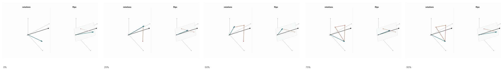

[Open MP4: symmetry-d3-rotations-vs-flips.mp4](animations/symmetry-d3-rotations-vs-flips.mp4)

*$D_3$ in 3-dimensional representation*

Now, we can notice something about these visualizations. The transformation of any vector lies in a plane, and all such planes are parallel to one another. Thus, if we subtract off the average of the vectors, that is, if we move the point where the plane intersects the axis of rotation to the origin, we preserve the permutation structure of the transformations. We thus see that the $D_3$ symmetry is just as well represented as 120-degree rotations in the subspace of a 2-dimensional plane.

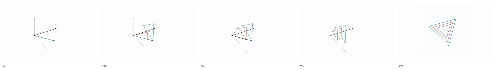

[Open MP4: symmetry-d3-irrep-collapse.mp4](animations/symmetry-d3-irrep-collapse.mp4)

*Reducing 3-dimensional representation to 2-dimensional*

We also notice that vectors that lie on the axis of rotation itself are left unchanged by the transformation. A way to think of this is to allow the triangle's vertices to store some information, like a number or any numerical quantity. If the value they store is the same for all vertices, the symmetry actions have no effect, whereas if they are different, the actions permute those values in a way that can be represented in a 2-dimensional vector space. The 3-dimensional representation space we began with is thus decomposable into 2 subspaces, one 1-dimensional, the other 2-dimensional. These cannot be decomposed further. That is, there is no lower-dimensional space such that an allowable transformation of any state remains in that space. The 1-dimensional and 2-dimensional representations are called **irreducible representations** or **irreps** for short. This is admittedly heavy math. Why do we bother? In the story we have to tell of quantum physics, where constituents of matter must abide the symmetry of nature, each constituent, each type of particle such as electron or photon, corresponds to an irreducible representation of nature's symmetry. A particular state of the particle is encoded in an element in the corresponding irrep.

### Invariants
Once we have chosen a representation for a symmetry, we might well ask, how do we know our transformations preserve the symmetry? If we look at a triangle and rotate by 100 degrees we can "see" that doesn't preserve the symmetry. In a representation, we need some set of mathematical expressions that say "this transformation left the triangle the same." We call these the **invariants** of the transformation. 

In our 2-dimensional irrep of $D_3$, we only need to check how a transformation acts on a single vector. The question "does the triangle overlay itself" becomes "is an arbitrary vector rotated by 120 degrees or flipped along a given axis." And this has a precise answer. Given the coordinates of a vector a transformation cannot change these invariants:

```math
r^2=x^2+y^2
\qquad\text{(the squared length of the vector),}
```

```math
u=x^3-3xy^2=r^3\cos(3\theta)
\qquad\text{(its orientation relative to reference).}
```

These exact invariants are not important. They are obscure without seeing the derivation, but what is important is that we can write an expression in terms of coordinates that must not change under the symmetry transformation. 

Why should we care about invariants? As we will see later, a system’s characteristic physical behavior, the "sameness" of the pool ball’s behavior, so to speak, can be found by assigning a number to each possible "history," each way the pool balls might have moved, and using a procedure called variational calculus to find the path that makes that number "stationary," such as at a minimum or maximum. When using the spacetime structure provided by relativity, which we will learn about in the next chapter, this number is the same for every observer in an **inertial reference frame**, that is, a perspective distinguished by a symmetry transformation. (This raises a point we glossed over earlier. In our introductory pool table example, we discussed reorienting the table. But we can just as well reorient the observer. We can move the table a few feet to the right or the observer a few feet to the left. When discussing invariants, we often think in terms of what "observers agree on.")

## Continuous symmetries
What rotations return a circle to itself? All of them! Similarly, all translations return a line to itself. The symmetries of space and time are continuous and can therefore be represented as transformations that depend on continuously varying parameters. 

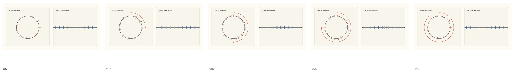

[Open MP4: symmetry-continuous-so2-translation.mp4](animations/symmetry-continuous-so2-translation.mp4)

*Continuous symmetries*

### Infinitesimal Generators
As we saw, in the $D_3$ symmetry group, we can build any action from a combination of the elemental actions of rotations and flips about an axis. Now let us ask the question, what is the generator of a continuous transformation? Let's say we want to rotate a circle by 10°. We could compose 10 1° rotations. But what if we want to rotate by 1°. We can see where this is going. The generators must be infinitesimal rotations. Noting that if we zoom in enough, any curved surface appears flat, we see that a continuous symmetry's infinitesimal generators are the vectors in the tangent plane to the symmetry's action. 

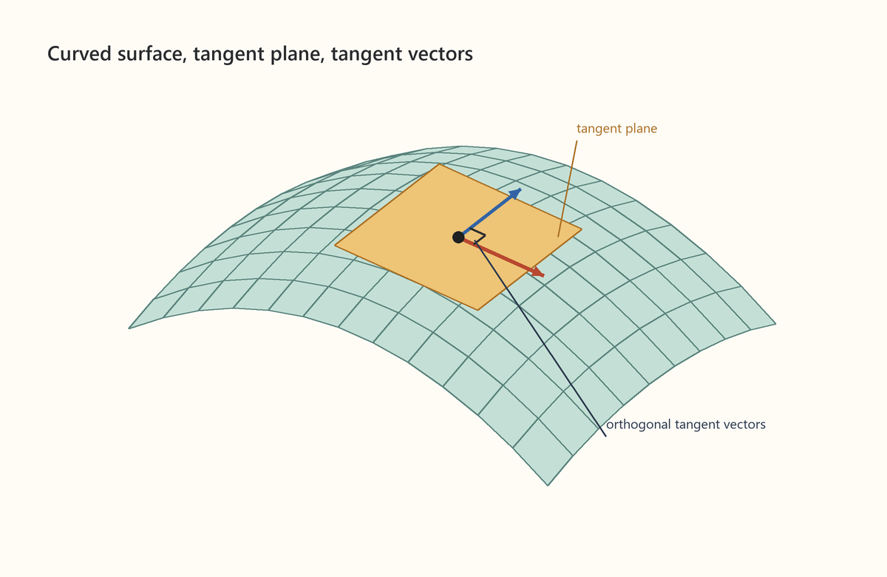

*Infinitesimal generators are vectors in the plane tangent to the space of symmetry transformations*

As every high school calculus student learns, a derivative of a function is the tangent slope to that function. In the case of a circle, in the 2-dimensional representation, we have a single variable that parameterizes the operator matrix:

```math
R(\theta)
=
\begin{pmatrix}
\cos\theta & -\sin\theta\\
\sin\theta & \cos\theta
\end{pmatrix}.
```

We can take the derivative of the matrix valued function of $\theta$. This is:

```math
\frac{dR}{d\theta}
=
\begin{pmatrix}
-\sin\theta & -\cos\theta\\
\cos\theta & -\sin\theta
\end{pmatrix}.
```

To obtain a single matrix representing this infinitesimal nudge, we evaluate the derivative at $\theta=0$, where $R(0)=I$ is the identity transformation. In that case:

```math
\left.\frac{dR}{d\theta}\right|_{\theta=0}
=
\begin{pmatrix}
-\sin 0 & -\cos 0\\
\cos 0 & -\sin 0
\end{pmatrix}
=
\begin{pmatrix}
0 & -1\\
1 & 0
\end{pmatrix}.
```

This is the infinitesimal generator matrix:

```math
J
=
\begin{pmatrix}
0 & -1\\
1 & 0
\end{pmatrix}.
```

Now apply this tangential nudge to a state vector

```math
\mathbf v(\theta)
=
\begin{pmatrix}
x(\theta)\\
y(\theta)
\end{pmatrix}.
```


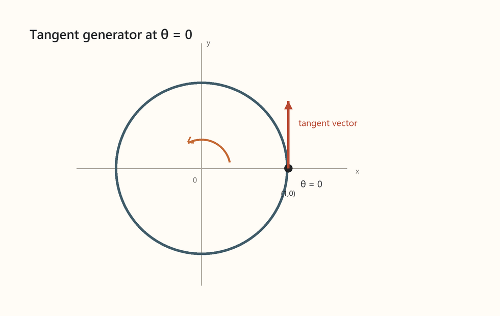

*The generator matrix \(J\) acts on the point \((1,0)\) to produce the tangent vector \((0,1)\) shown here.*

$J$ acts on any point on the circle to produce the tangent vector at that point. Putting this into calculus notation:

```math
\frac{d\mathbf v}{d\theta}
=
J\mathbf v.
```

We now have a differential equation for the transformation that uses the generator. We found this by starting with a known transformation and deducing its generator. But we can just as well go in the opposite direction. Given this differential equation, we can find the transformation:

```math
\mathbf v(\theta)
=
e^{\theta J}\mathbf v(0).
```

The exponential of a matrix is defined in terms of the Taylor expansion for an exponential:

```math
e^{\theta J}
=
I
+
\theta J
+
\frac{\theta^2}{2!}J^2
+
\frac{\theta^3}{3!}J^3
+
\cdots .
```

Now we notice something. Since:

```math
J^2=-I,
```

the even powers of $J$ become powers of $I$, while the odd powers become powers of $J$. Therefore

```math
e^{\theta J}
=
\left(
1-\frac{\theta^2}{2!}+\frac{\theta^4}{4!}-\cdots
\right)I
+
\left(
\theta-\frac{\theta^3}{3!}+\frac{\theta^5}{5!}-\cdots
\right)J.
```

These are the Taylor series for sine and cosine:

```math
e^{\theta J}
=
\cos\theta\,I
+
\sin\theta\,J.
```

Substituting in $J$ gives

```math
e^{\theta J}
=
\begin{pmatrix}
\cos\theta & -\sin\theta\\
\sin\theta & \cos\theta
\end{pmatrix}
=
R(\theta).
```

This is an **exponential map**. It takes the infinitesimal generator $J$ and returns the finite symmetry transformation $R(\theta)$. Physics aside, exponential maps are just cool. They give what one would think is the familiar purely algebraic quality of exponentiation a rich geometric interpretation.

#### Symmetry Flows

We can think of a symmetry transform as a "uniform looking" vector field, as illustrated below:

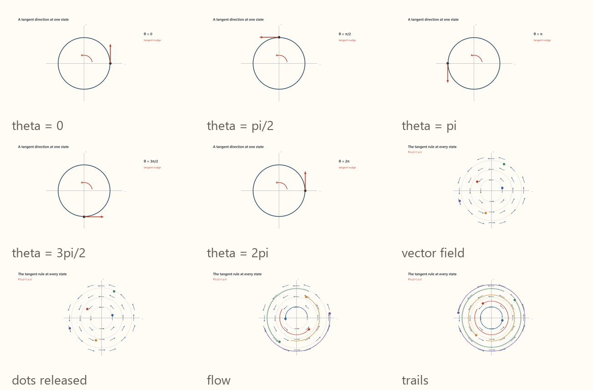

[Open MP4: symmetry-so2-vector-field-flow.mp4](animations/symmetry-so2-vector-field-flow.mp4)

*Symmetry flows provide a rich picture of symmetry transformations*

Here we ask not what happens when the transformation is applied to a single set of starting conditions, but what the transformation does to all starting conditions. This view lends itself to seeing the structure in the evolution of a collection of nearby states.

#### Invariants and Metrics
What is the invariant of rotation in this representation? It is just the length of vectors and the angles between them.

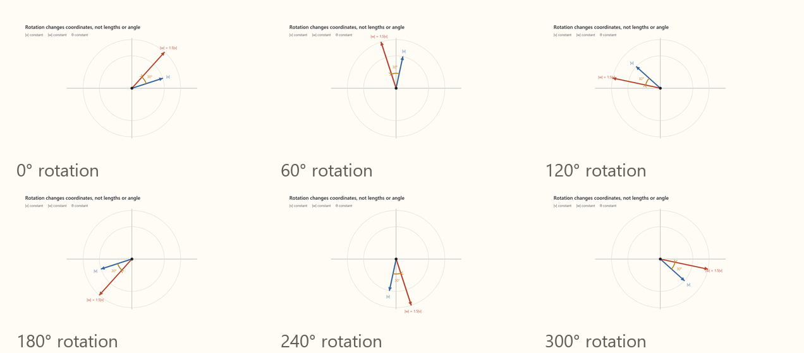

[Open MP4: symmetry-rotation-vector-invariants.mp4](animations/symmetry-rotation-vector-invariants.mp4)

*Metric structure*

These relationships are expressed by a single invariant, the dot product.

```math
\mathbf u\cdot\mathbf v
=
u_xv_x+u_yv_y.
```

An invariant of this sort, that fixes some notion of placing reliable rulers on the space, is a **metric**. For normal rotations and translations, these relationships are intuitive, but a symmetry may preserve a less intuitive metric. If we define invariant length not as \(x^2+y^2\) but as \(t^2-\mathbf{x}^2\), we have a "hyperbolic rotation." Separation between points stretches out to infinity as the rotation approaches its asymptotes, leaving the invariant interval unchanged even though the separation appears to grow using our everyday notion of distance. Such a hyperbolic metric, as we will see, encodes the asymptotic limit of light speed in the relativistic geometry **spacetime**.

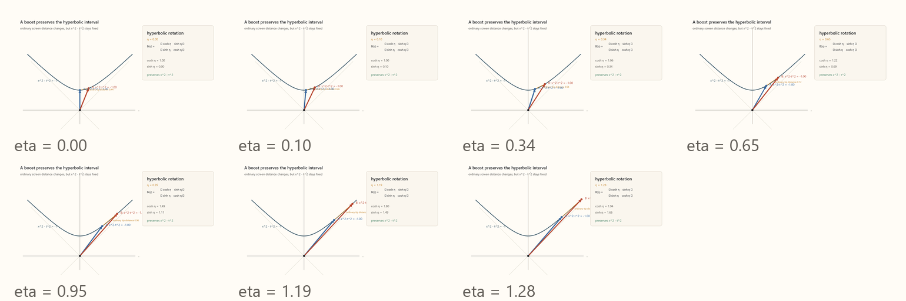

[Open MP4: symmetry-hyperbolic-rotation.mp4](animations/symmetry-hyperbolic-rotation.mp4)

*Hyperbolic rotations*

### Commutators
In the case of a single continuous symmetry transformation, the generator combined with a parameter, like angle in the case of rotation, specifies an arbitrary transformation. However, when there are multiple independent transformations that can be composed to form a multi-dimensional group, the order of the composition must also be taken into account because it produces different resultant states. For example, in the 3-dimensional rotation group, called $SO(3)$, rotating about the $x$-axis then the $y$-axis leaves a sphere in a different state than applying the same actions in the opposite order.

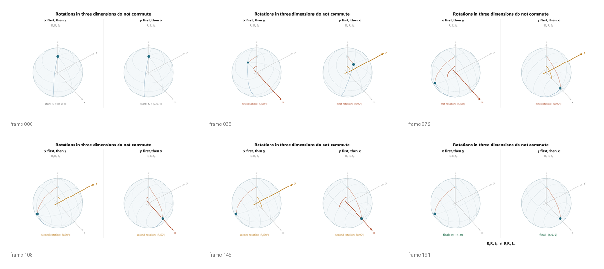

[Open MP4: symmetry-so3-rotation-order.mp4](animations/symmetry-so3-rotation-order.mp4)

*Non-commuting operations of $SO_3$*

This order-dependence is expressed by the **commutator**:

```math
[X,Y]
=
XY-YX.
```

For example, for $\mathfrak{so}(3)$, the commutators are:

```math
[J_x,J_y]=J_z,
\qquad
[J_y,J_z]=J_x,
\qquad
[J_z,J_x]=J_y.
```
In $SO(3)$, then, we know that rotating about $x$ rotates the $y$ axis into $z$. We would write such a composite action as a product of exponential maps:

```math
e^{aJ_x}e^{bJ_y}.
```

How then do we write this as a single exponential in terms of $J_x$ and $J_y$? For ordinary numbers, and for commuting operators:

```math
e^Ae^B=e^{A+B}.
```

But this identity does *not* hold for noncommuting generators.

```math
e^{aJ_x+bJ_y}
```

generates a rotation about a single axis in the $x$-$y$ plane, which is not the same as performing the two rotations sequentially.

How can we correct the exponent so that the product can again be written as a single exponential? To the lowest nontrivial order, which, by definition, is the order of the generator space:

```math
e^{aJ_x}e^{bJ_y}
=
\exp\!\left(
aJ_x+bJ_y+\frac12ab[J_x,J_y]+\cdots
\right)
=
\exp\!\left(
aJ_x+bJ_y+\frac12abJ_z+\cdots
\right).
```

The commutator supplies $J_z$.

The commutator can be thought of as a measure of curvature. On a flat plane, the $x$- and $y$-translation generators commute: moving in $x$, then $y$, then undoing each movement returns us exactly to where we began. On a sphere of radius $R$, the corresponding sequence leaves a small rotational gap:

```math
[T_x,T_y]
=
\frac{1}{R^2}\left(xT_y-yT_x\right).
```

The expression $xT_y-yT_x$ generates rotation within the $x$-$y$ plane—the same rotation that an embedding-space description would call rotation about $z$. The factor $1/R^2$ is the curvature, so the gap vanishes as the sphere flattens.

#### Lie Algebra

Taken together, the dimension of the symmetry group and the commutators specify a **Lie algebra** that contains the structure of the symmetry group, up to global topological features -- such as a symmetry group wrapping around onto itself such as a plane wrapped around a cylinder -- that are invisible to local structure. This algebra consists of the group generators, linear combinations of them, and their commutator. Every representation must preserve this commutator structure. Therefore, if we know the Lie algebra, we can use it to assess if a representation is valid.

#### Invariants and Casimir operators

Lie algebra provides a procedure for finding invariant operators. If we can construct an operator from the generators that commutes with all the algebra's generators, we then know that the operator is an invariant under the symmetry. As an illustration, in 3-dimensional rotation, with generators denoted $L_i$ for angular momentum, we can see that the square of the rotation generators is invariant:

```math
L_i=i\hbar J_i,
\qquad
[L_x,L_y]=i\hbar L_z
\quad\text{(cyclically)},
\qquad
L^2=L_x^2+L_y^2+L_z^2.
```

```math
\begin{aligned}
[L^2,L_x]
&=[L_y^2,L_x]+[L_z^2,L_x]\\
&=L_y[L_y,L_x]+[L_y,L_x]L_y
+L_z[L_z,L_x]+[L_z,L_x]L_z\\
&=i\hbar(-L_yL_z-L_zL_y+L_zL_y+L_yL_z)\\
&=0.
\end{aligned}
```

By the same calculation,

```math
[L^2,L_y]=[L^2,L_z]=0.
```

This is common sense. The magnitude of angular momentum is independent of the direction of the axis.

An invariant constructed this way is a **Casimir operator**, and Casimir eigenvalues are crucial in physics because their values classify representations of a symmetry. For example, (as we will see in detail later), the invariant mass of a particle is the eigenvalue of a Casimir operator built from the generators of time and space translations. In the **Standard Model** of particle physics, particles are expressed as representations of symmetry, and the Casimir eigenvalues identify the representation to which a particle state belongs -- an "electron" inhabits a specific irreducible representation of the same symmetry our pool game exhibits.

### Translations and Function Representation
Translation is, to the eye, the simplest possible symmetry. It would be natural to think the ideal representation space for a translation is simply a one dimensional vector space, where points move via "sliding a number line." But there is a problem. If an operation is to move $x$ by some amount $a$

```math
x\mapsto x+a,
```

then $0$ is moved to $a$, but the origin must remain fixed in a linear vector space. This is a special case of the rule for linearity. A linear operation $T$ must preserve linear combinations:

```math
T(\alpha u+\beta v)
=
\alpha T(u)+\beta T(v).
```

For translation of points on the number line, the candidate operator is

```math
T_a(x)=x+a.
```

But this does not preserve addition. For two points $x_1$ and $x_2$,

```math
T_a(x_1+x_2)
=
x_1+x_2+a,
```

while

```math
T_a(x_1)+T_a(x_2)
=
(x_1+a)+(x_2+a)
=
x_1+x_2+2a.
```

These are not equal unless $a=0$. Translation does act sensibly on a number line, but it is not a linear operation when acting on this space.


[Open MP4: symmetry-translation-point-linearity-failure.mp4](animations/symmetry-translation-point-linearity-failure.mp4)

*Shifting a number line is not a linear operation*

On the other hand, the space of functions on a number line does form a linear representation. Instead of translating the point $x$, we translate a function by shifting its argument:

```math
(T_a f)(x)=f(x-a).
```

Now the state is the whole function $f$, and $T_a$ is an **operator** on the vector space of functions. An operator is a generalization of a matrix when applied to continuous functions. A continuous function is as an infinite-dimensional vector, in which its domain values are "axes," or component labels, and its range values are the component values. We can transform one function to another with an infinite dimensional matrix, but in practice, we can condense this into a well-known operation, such as the derivative operation.

Linearity works because function addition is pointwise:

```math
T_a(f+g)(x)
=
(f+g)(x-a)
=
f(x-a)+g(x-a)
=
(T_a f)(x)+(T_a g)(x).
```

So

```math
T_a(f+g)
=
T_a f+T_a g.
```

The zero function is also fixed:

```math
T_a0=0.
```


[Open MP4: symmetry-translation-function-linearity.mp4](animations/symmetry-translation-function-linearity.mp4)

*A function representation is linear*

This makes sense. Translational symmetry needs an object to translate, just as $D_3$ symmetry needs a triangly thing to translate. We can think of the function as a shape. If there is translational symmetry, that shape is preserved.


[Open MP4: symmetry-function-translation-shape.mp4](animations/symmetry-function-translation-shape.mp4)

*Translation of functions preserves their shape*

Indeed, this representation is completely analogous to our 3 dimensional representation of $D_3$. There a vertex contained a component value, here an input value does. Indeed, the $D_3$ representation is itself a function representation, with a domain that contains only three members and is cyclic. 
   
#### Generator of Translations
We have a function representation. Now we want to find an infinitesimal generator that acts on functions to produce a translation. We can do so by considering what happens to a function's value under "tiny" displacements. In that case, the new value $f(x-a)$ is close to the old value $f(x)$, and correction is given, in the infinitesimal limit, by the slope at $x$. This is the same idea that any curve becomes flat when zoomed in sufficiently:

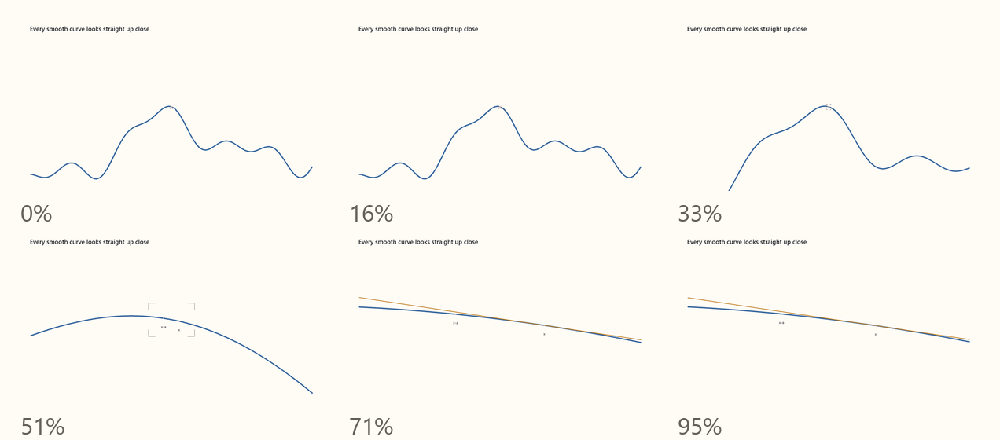

[Open MP4: symmetry-translation-tangent-zoom.mp4](animations/symmetry-translation-tangent-zoom.mp4)

*A function value is translated by the function's slope*

That is the visual version of the first-order **Taylor expansion** that relates a function's derivatives to its value under translation:

```math
f(x-a)
=
f(x)
-
a\frac{df}{dx}
+
O(a^2).
```
As $a$ approaches $0$, the higher order terms vanish and the shift in $f's$ values is produced by the operator $d/dx$:

```math
-i\hat K
=
-
\frac{d}{dx},
\qquad
\hat K=-i\frac{d}{dx},
\qquad
T_a=e^{-ia\hat K}.
```

#### Eigenfunctions 
Let's take a brief detour from symmetry to discuss the idea of eigenfunctions. When we return to translational symmetry, we will see these are central to our story. Imagine a rubber sheet. We pull on its corners. What does this do to the $x$- and $y$-axes? It rotates them toward each other while stretching them. Now, instead choose $x$ and $y$ to be diagonal axes. Now, when we stretch, the long axis is stretched but not rotated and the short axis is compressed but not rotated. The action of this stretching action on these axes is now simple scalar multiplication of the original vector. Once the basis vectors no longer mix, any other vector, that is, any linear combination of the basis vectors, transforms by having its components scaled independently:


Letting $s$ be the factor by which the long-axis component is stretched, we can see how the transformation of an arbitrary vector $\mathbf{r}$ simplifies using the system's natural basis:

| $(x,y)$ basis: components mix | $(u,v)$ basis: components do not mix |
|---|---|
| $\displaystyle \begin{aligned}\mathbf r&=\frac12\begin{pmatrix}s+s^{-1}&s-s^{-1}\\s-s^{-1}&s+s^{-1}\end{pmatrix}\mathbf r_{\mathrm{in}}\\&=\frac12\left[(s+s^{-1})x+(s-s^{-1})y\right]\hat{\mathbf x}\\&\quad+\frac12\left[(s-s^{-1})x+(s+s^{-1})y\right]\hat{\mathbf y}\end{aligned}$ | $\displaystyle \begin{aligned}\mathbf r&=\begin{pmatrix}s&0\\0&s^{-1}\end{pmatrix}\mathbf r_{\mathrm{in}}\\&=su\hat{\mathbf u}+s^{-1}v\hat{\mathbf v}\end{aligned}$ |

This is readily understood visually:

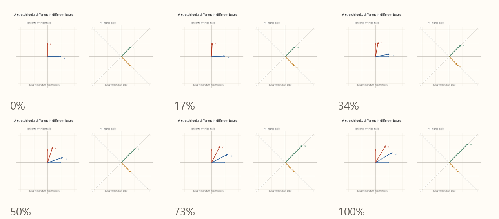

[Open MP4: symmetry-eigenbasis-stretch.mp4](../../content/drafts/animations/symmetry-eigenbasis-stretch.mp4)

*Eigenvectors pictured*

Now for a bunch of terminology. The "natural" basis vectors are the **eigenvectors**, the values a transformation scales these by are the **eigenvalues** and the basis they form is called the **eigenbasis**. When the "vectors" are functions, we call them **eigenfunctions**. As the transformation matrix is diagonal in the eigenbasis, the procedure for finding an eigenbasis is typically called **diagonalization**. 

#### Eigenfunctions of Translational Symmetry
Since a function is but an infinite-dimensional vector, and the generator $d/dx$ is a way of writing an infinite-dimensional matrix, we can solve a similar eigenvalue equation here, which now takes the form of a differential equation.

The eigenvalue equation is

```math
\frac{d}{dx}f(x)
=
\lambda f(x).
```

This says we are looking for a function whose derivative returns the same function, scaled by a single number. The solution is

```math
f(x)=Ce^{\lambda x}.
```

The exponent can be, and in most of what we discuss, will be, imaginary. The mystery of $i^2=-1$ is less mysterious when we recall that the rotation operator in the two-dimensional representation had the same property:

```math
J^2=-I.
```

In both the cases of real and complex exponents, the scale factor is the eigenvalue of the translation operator. Both cases generate rotation, hyperbolic in the real case and circular in the imaginary case. 

Both real and imaginary exponential functions can act as a translation eigenfunctions, but if we are to have a metric space in which some inner product \(the generalization of a dot product\) measures the similarity of functions, the translation operation must preserve the inner product. This condition is called **unitarity**, and translation is not unitary on the span of nonconstant real exponentials. The condition of **unitarity** cannot be overstated. It is a property that ensures different states remain equally *distinguishable* under symmetry transformations and that those transformations are *reversible*. Suppose

```math
\begin{gathered}
f_k(x)=e^{kx},\qquad g_l(x)=e^{lx},\qquad k,l\in\mathbb R,\\
0<\langle f_k,f_k\rangle<\infty,\qquad
0<\langle g_l,g_l\rangle<\infty.
\end{gathered}
```

Under translation,

```math
(T_a f_k)(x)
=
f_k(x-a)
=
e^{-ka}f_k(x),
```

and

```math
(T_a g_l)(x)
=
g_l(x-a)
=
e^{-la}g_l(x).
```

Therefore

```math
\begin{aligned}
\langle T_a f_k,T_a f_k\rangle
&=e^{-2ka}\langle f_k,f_k\rangle,\\
\langle T_a g_l,T_a g_l\rangle
&=e^{-2la}\langle g_l,g_l\rangle.
\end{aligned}
```

This equals the original inner product only when

```math
e^{-2ka}=e^{-2la}=1
\quad(\forall a\in\mathbb R)
\quad\Longleftrightarrow\quad k=l=0.
```

For real $k$ and $l$, this is not generally true. Thus nonconstant real exponentials are eigenfunctions of translation, but they are not compatible with translation as an inner-product-preserving symmetry. Complex exponentials encode circular motion, and, when acted upon by a translation symmetry operator, encode waves. Let's see how this works.

::: details Complex exponentials and waves
We asserted above that the complex exponential function describes a plane wave. Let's explain that and generally build some intuition around the complex exponential function. A single parameter complex exponential, $e^{i\theta}$, describes a circle. It is a way to repackage the rotation operator we have already seen:

```math
e^{i\theta}
\quad\longleftrightarrow\quad
e^{\theta J}
=
R(\theta)
=
\begin{pmatrix}
\cos\theta & -\sin\theta\\
\sin\theta & \cos\theta
\end{pmatrix},
\qquad
J
=
\begin{pmatrix}
0 & -1\\
1 & 0
\end{pmatrix}.
```

$i$ is the generator of rotation in this 1-dimensional complex representation and plays the role $J$ did in the 2-dimensional representation:

```math
i^2=-1
\quad\longleftrightarrow\quad
J^2
=
\begin{pmatrix}
0 & -1\\
1 & 0
\end{pmatrix}^{\!2}
=
-I.
```
How is it possible to replace a $2x2$ matrix with a single number $i$? The answer is that $z$ has two real-number degrees of freedom. That is, we define a complex number $z$:

```math
z:=x+iy,
```

thus a complex number is mapped to a vector in the complex plane.

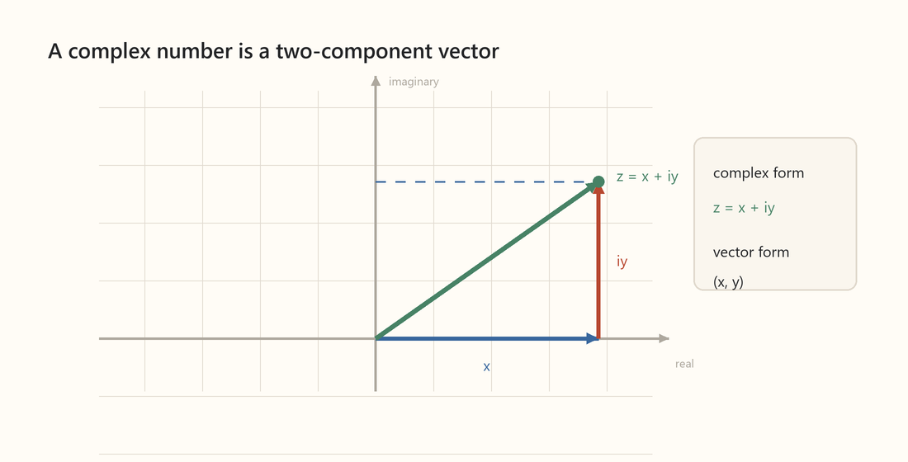

*The complex plane*

What action does multiplication by $i$ have at the identity vector $1$.

Here:

```math
\begin{aligned}
z&=1=1+0i\\
z_{\mathrm{tan}}&=zi=1\cdot i=i=0+1i
\end{aligned}
```

This is a vector in the complex plane that is perpendicular to the identity.

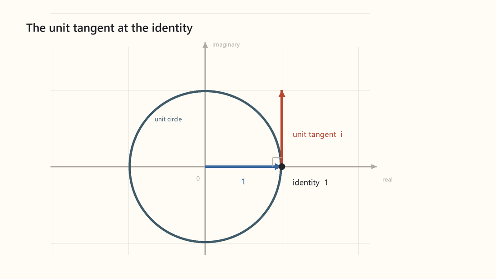

*The action of $i$*

This is exactly the action the $J$ matrix generator had in 2-dimensions, which we already argued exponentiates to rotation. Let's redo that argument here, as it leads to a gratifying result. Since multiplication by $i$ produces the tangent vector at every point and the tangent vector is the geometric version of the derivative, we have:

```math
\frac{dz}{d\theta}=i\,z(\theta)
```

With $z(0)=1$, solving this differential equation we then have:

```math
z(\theta)=e^{i\theta}
```

At $\theta=\pi$, halfway around the unit circle, we then have:
```math
e^{i\pi}=-1
```

This is Euler's identity, satisfyingly relating three of nature's most fundamental constants. As Sal Khan said, "if this does not blow your mind, you really have no emotion."

We can map $z$ back to $x,y$ coordinates and obtain Euler's formula:

```math
e^{i\theta}=\cos\theta+i\sin\theta
```

Engineers often represent real sinusoidal waves with complex exponentials using this formula and reading off the real part as multiplying exponentials is algebraically simpler than multiplying trigonometric functions.

Now let us turn from circular motion to a travelling complex wave. Let the phase vary with position $x$ and time $t$:

```math
\theta(x,t)=kx-\omega t,
\qquad
z(x,t)=Ae^{i(kx-\omega t)}.
```

Here $A$ is the wave's amplitude, $\lambda$ is its wavelength, $k=2\pi/\lambda$ is its **wave number**, and $\omega$ sets how quickly the phase changes with time.

In the animation, position runs along the helix. The other two directions show the real and imaginary parts of the complex value at each position. As time advances, these values rotate and the wave pattern travels along $x$.

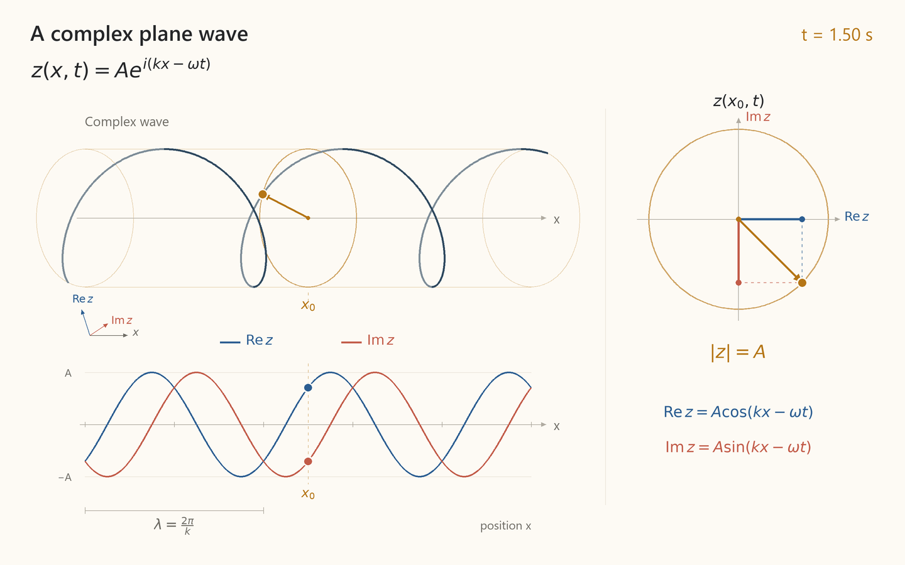

[Open MP4: symmetry-complex-plane-wave-v2.mp4](animations/symmetry-complex-plane-wave-v2.mp4)

*The complex value rotates while its length stays fixed.*

The two components are $A\cos\theta$ and $A\sin\theta$. Their values oscillate, while the length of the complex value stays fixed:

```math
|z|=\sqrt{A^2\cos^2\theta+A^2\sin^2\theta}=A.
```

Translating this wave multiplies it by a phase factor:

```math
z(x-a,t)=e^{-ika}z(x,t).
```

The eigenvalue $e^{-ika}$ has magnitude one. This is the phase-only scaling allowed by unitarity.

:::

#### The Importance of Eigenfunctions of Operators in Physics
Why should we care about eigenfunctions of operators? Often, a rote procedure can diagonalize a matrix, making subsequent matrix multiplication problems computationally tractable. This approach is pervasive in countless areas of engineering and data analysis due to its computational efficiency, but our interest is different. As we will discuss in detail later, in quantum mechanics, an ideal measurement results in a state "collapsing" to an eigenstate, and the value of the measurement is the corresponding eigenvalue.

To get a feel for this, consider rolling a die. As it tumbles in the air, the value is unknown until the "reveal operator" is applied and the die settles into a single face up. We can represent our "ignorance" by assigning equal probabilities to the six possible faces:

$$
\mathbf p=(p_1,p_2,p_3,p_4,p_5,p_6)
=\left(\frac16,\frac16,\frac16,\frac16,\frac16,\frac16\right).
$$

Next we can define an observable whose eigenvectors represent the possible faces and whose eigenvalues are their numerical values. Writing $|n\rangle$ for the basis vector associated with face $n$:

$$
\hat D=\sum_{n=1}^{6}n|n\rangle\langle n|
=\operatorname{diag}(1,2,3,4,5,6),
\qquad \hat D|n\rangle=n|n\rangle.
$$

The projector associated with outcome $n$ is $P_n=|n\rangle\langle n|$, while the probability of that outcome is simply the corresponding entry in our probability list:

$$
\Pr(n)=p_n=\frac16.
$$

The faces of the die are the eigenvectors of this operator and their values are the eigenvalues. 

This is surely an odd way to describe such a statistical situation, but it is, in fact, the way quantum mechanics formulates its predictions. There, the state is a complex-valued function over the eigenvalues of a given observable \(whose squared magnitude is the probability distribution over that observable.\) The difference between this theory and that of the die is that in the case of the die, thinking of the state as a superposition of possibilities was just a proxy for our ignorance about the "actual" state, whereas, in quantum mechanics, the notion that there is a physically definite state hidden by our ignorance is not the case in any ordinary sense similar to our die. The arguments for this are subtle and spectacular, and we will be best served to wait until we turn to quantum mechanics to give them their due, but if we take this idea of "existing in a superposition" on faith for the time being, then we have a compelling reason to study the eigenfunctions of operators in symmetry representations. 

We've asserted that things that can be observed take the eigenvalues of operators on representations of nature's complete symmetry. This tells us several things. First, the only admissible questions the theory addresses are those that are represented by operators in a symmetry representation space. We can ask for a state's coordinate value in a symmetry representation and its generator value. Other "physical" questions, say, "is this liquid or solid?" are emergent properties of complex systems. Second, the eigenfunctions of a given operator are a basis for the distribution of amplitudes over possible outcomes. Thus to know that the eigenfunction of the translation operator is a plane wave is to understand the essence of the very state that physics examines evolving over time. If someone were to ask "what is physics about?" we might reply "predicting the future from the current state." If then pressed, "state of what?" our answer would be "the state of a superposition of plane waves." Third, the referent of that state, **particles**, are categorized by eigenvalues of operators that are invariant under symmetry transformation in a given irreducible representation. That is, to be an "electron" is to inhabit an irreducible representation of nature's complete symmetry that is labeled by the eigenvalues of Casimir operators (which manifest as characteristic features of the wave packets and their evolution.\) This expresses the truism that, in a theory that only answers questions that can be posed as operators on a symmetry representation, the kind of object something is must be invariant under that symmetry.


####  The Fourier Structure of Waves
Once we have a function representation of translational symmetry, we might be clever and notice that we can translate a function in wave number, $k$, just as well as we can in position, $x$. While shifting the wave number isn't a translation in the familiar physical space we live in, from a mathematical perspective, $k$-space is the dual, or equivalent up to role reversal, of $x$-space. If we want to understand the group generated by these translations and the implications it has, we would be wise to take this observation seriously.

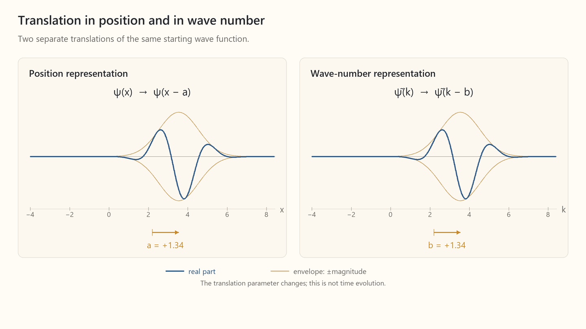

[Open MP4: symmetry-ccr-x-k-translations-symmetric.mp4](../../content/drafts/animations/symmetry-ccr-x-k-translations-symmetric.mp4)

*Wave Packet translated in position and momentum space*

By now, we know that a symmetry is defined by what it leaves invariant. We've seen that translations in $x$ leave the inner product of complex wave functions -- intuitively, their "overlap" -- unchanged. We noted that mathematicians call this invariance "unitarity." Translation in $k$-space shares this invariant.

```math
\begin{gathered}
\text{Translation by }a\text{ in }x\\[0.5em]
\langle T_x(a)\psi,T_x(a)\chi\rangle\\
=\langle\psi,\chi\rangle
\end{gathered}
\qquad
\begin{gathered}
\text{Translation by }b\text{ in }k\\[0.5em]
\langle T_k(b)\psi,T_k(b)\chi\rangle\\
=\langle\psi,\chi\rangle
\end{gathered}
```

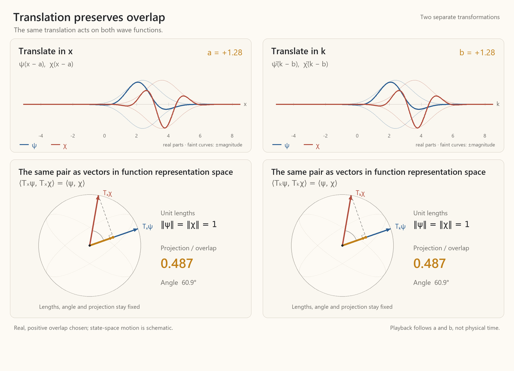

[Open MP4: symmetry-ccr-unitarity.mp4](../../content/drafts/animations/symmetry-ccr-unitarity.mp4)

*Unitarity of position and wave-number translations*

In addition to position and wave number, waves have a third independent way of changing. A wave's **phase**, $\phi$, refers to where it is in its cyclic pattern. For example, a phase shift of $2\pi$, or one full "cycle," returns the wave to its exact initial state. We need to be a bit careful here. For a pure mode, shifting its position is indistinguishable from shifting its phase, somewhat in the way the turning of a barbershop sign appears as though its stripes are moving up and down. We might, then, be tempted to think there is no difference between position and phase shifts. But the single mode is an idealization. In the general case, in which the wave function is a packet composed of modes, position translation shifts the entire function. Phase translation shifts each mode by the same fraction of its cycle, changing the function while leaving its magnitude envelope unchanged.

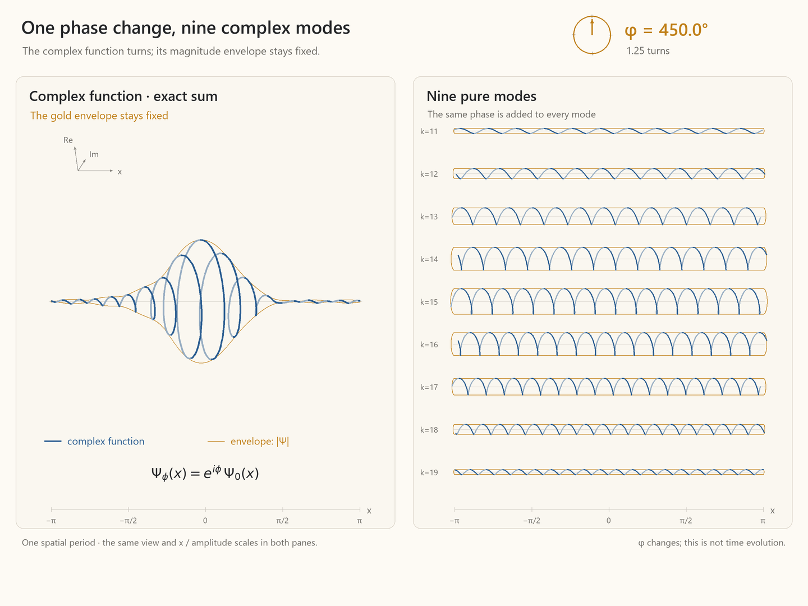

[Open MP4: symmetry-complex-phase-modes.mp4](../../content/drafts/animations/symmetry-complex-phase-modes.mp4)

*Visualizing Phase Change*

We can also discover and define phase directly from our symmetry group's commutation relations, which gives us a useful algebraic packaging of the group structure. Let's ask the question:

```math
[\hat X, \hat K] = \; ?
```

If the commutator is non-zero (and linearly independent of $\hat X$ and $\hat K$), there must be a third kind of transformation in the complete symmetry group. To find the commutator, we follow the usual procedure of translating the function around a loop in $x$-$k$ space and asking if the function changes. If it does, $?$ is nonzero, the commutator is the generator of that change, and the action will be identifiably that of a phase shift.

First, write a single mode in the $x$ and $k$ representations:

```math
\psi_{k_0}(x)
=
e^{ik_0x}.
```

```math
\begin{gathered}
\tilde{\psi}_{k_0}(k)=2\pi\,\delta(k-k_0),\\[0.5em]
\text{where }\delta\text{ is a spike at }k_0\text{ that integrates to }1.
\end{gathered}
```

Define the $x$ and $k$ translation operators in their respective representations:

```math
(T_x(a)\psi_{k_0})(x)
=
\left(e^{-ia\hat K}\psi_{k_0}\right)(x)
=
\psi_{k_0}(x-a).
```

```math
(T_k(b)\widetilde\psi_{k_0})(k)
=
\widetilde\psi_{k_0}(k-b).
```

Working in the position basis:

```math
(T_k(b)\psi)(x)
=
\left(e^{ib\hat X}\psi\right)(x)
=
e^{ibx}\psi(x).
```

$\hat X$ generates translation in $k$-space just as $\hat K$ generated translations in $x$-space. In $x$-space, it multiplies $\psi$ by $x$ as it weights each component of $\psi$ by its position coordinate.

We can construct a loop by first translating the function by $b$ in $k$ and by $a$ in $x$, then by $-b$ in $k$ and by $-a$ in $x$.

```math
(T_x(a)T_k(b)\psi_{k_0})(x)
=
e^{i(k_0+b)(x-a)},
```

```math
(T_k(b)T_x(a)\psi_{k_0})(x)
=
e^{ibx}e^{ik_0(x-a)}.
```

```math
\bigl(T_x(-a)T_k(-b)T_x(a)T_k(b)\psi_{k_0}\bigr)(x)
=
e^{-ib(x+a)}e^{i(k_0+b)x}
=
e^{-ab[\hat X,\hat K]}\psi_{k_0}(x)
=
e^{-iab}\psi_{k_0}(x).
```

The two shifts fail to commute by the factor $e^{-iab}$. Writing $\phi=-ab$, the loop multiplies the function by $e^{i\phi}$. But this is precisely a phase shift, a rotation in the complex plane that “turns” the whole "spiral" of the wave function.

Because this factor is independent of $k_0$, the same phase shift applies to every mode in a superposition.

Phase translation, then, is a third translation symmetry, whose invariant is the inner product under its unitary action, rounding out the group of $x$, $k$, and $\phi$ coupled through their **Fourier** structure:

```math
\langle T_x(a)\psi,T_x(a)\chi\rangle
=
\langle\psi,\chi\rangle.
```

```math
\langle T_k(b)\psi,T_k(b)\chi\rangle
=
\langle\psi,\chi\rangle.
```

```math
\langle T_\phi(\beta)\psi,T_\phi(\beta)\chi\rangle
=
\langle\psi,\chi\rangle.
```

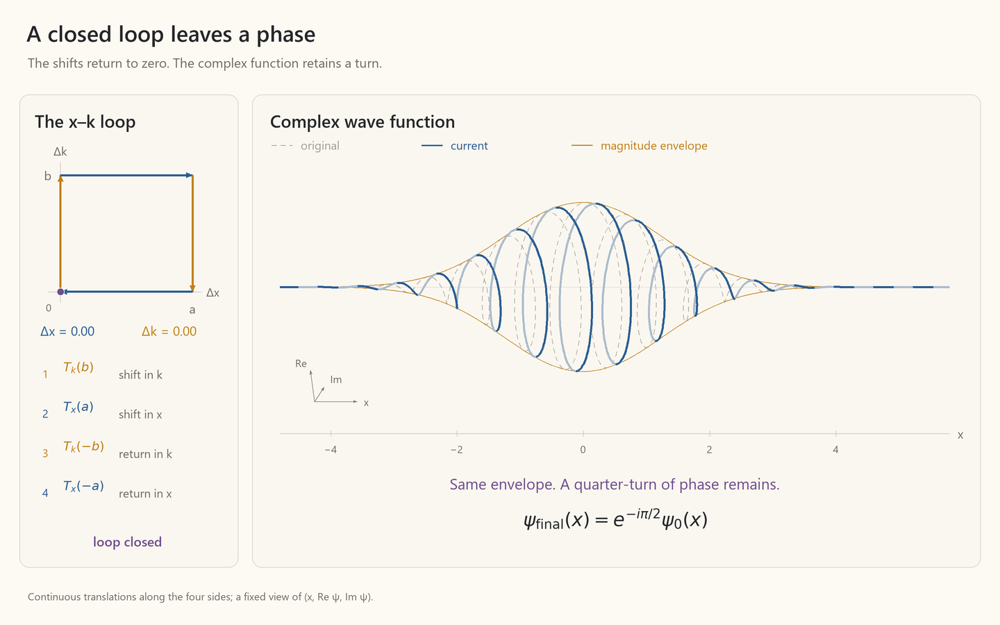

[Open MP4: symmetry-ccr-loop-complex.mp4](../../content/drafts/animations/symmetry-ccr-loop-complex.mp4)

*Phase as the $[\hat X,\hat K]$ commutator*

The infinitesimal closed $x$-$k$ loop is generated by $[\hat X,\hat K]$. Because the finite loop leaves a phase translation, and phase translations are generated by $iI$, we have:

```math
[\hat X,\hat K]
=
iI.
```

Mathematicians love to name groups. Just as we have encountered $D_3$ and $SO(2)$, our new group has a name, the three-dimensional Heisenberg group, or $H_3$. With $n$ spatial dimensions, the group has $2n+1$ dimensions, where the $+1$ is due to the fact that there is only one phase regardless of the number of spatial dimensions.

Before we close out here, a small amount of house cleaning is needed. First, we have not shown explicitly that changes in $\phi$ are linearly independent of changes in $x$ and $k$. They are, as evidenced by the fact that shifts in $\phi$ can leave the wave function's position and wave number unchanged. We also did not show that there are *only* 3 generators in $H_3$. This is done by showing that the generators close under commutation:

```math
[i\hat X,-i\hat K]=iI,
\qquad
[i\hat X,iI]=[-i\hat K,iI]=0.
```

#####  Position / Wave Number Uncertainty
As we know, a single-mode wave function has a single wave number. But what position does it have? There is no way to answer this as the wave is uniform over all position space. The same statement holds in reverse. A wave packet ideally localized at one position is uniform over all $k$-space. Anywhere in between these extremes, as a wave packet is more localized in one space, it is more spread out in the dual space. 

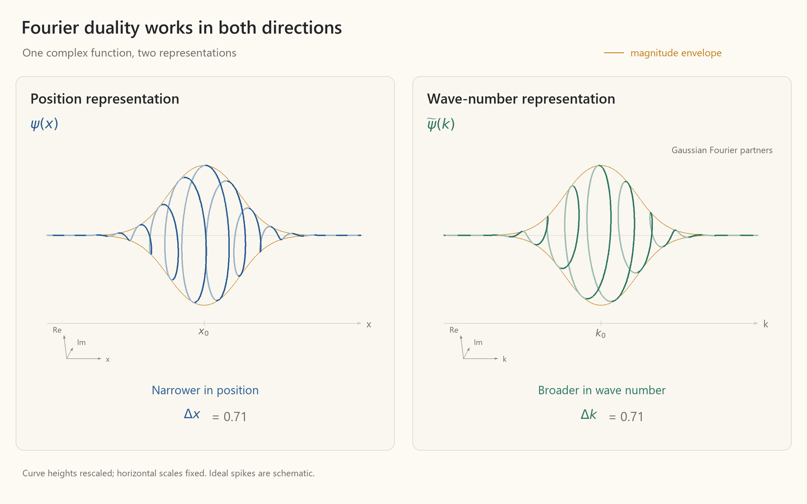

[Open MP4: symmetry-xk-fourier-complex.mp4](../../content/drafts/animations/symmetry-xk-fourier-complex.mp4)

*Trading off spread in position for spread in wave number*

We can easily see this relationship drawn on paper, but we also hear it in music. The precise pitch of a tuning fork requires long sustain, while the percussive clap of a clave has no clear pitch. This tradeoff is the root of the Heisenberg uncertainty principle, or what is known in popular science as "quantum fuzziness."

With this visual understanding of the tradeoff in the spread of the magnitude envelopes in $x$ and $k$ space, we can define the corresponding statistical standard deviation, or uncertainty, in position and wave number.

For simplicity, set the wave's mean position and wave number at their respective origins. Then:

```math
(\sigma_x)^2
=
\int_{-\infty}^{\infty}x^2|\psi(x)|^2\,dx,
```

and likewise for $\sigma_k$.

$\sigma^2$ is a probability-weighted average of squared distances from the distribution’s center. This is the textbook definition of variance.

From the commutation relation

```math
[\hat X,\hat K]=iI,
```

one can derive the position/wave-number "uncertainty relation":

```math
\Delta x\,\Delta k\ge\frac12.
```
This derivation is rather involved, but we can get a feel for the result by plotting the squared magnitude of a wave function and labelling the standard deviation.

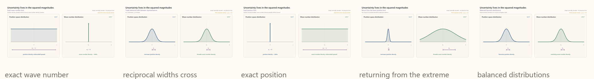

[Open MP4: symmetry-xk-squared-magnitudes.mp4](../../content/drafts/animations/symmetry-xk-squared-magnitudes.mp4)

*Trade-off in uncertainty of position and wave number*

##### Wave Propagation and Interference
Everyone who has taken a high-school physics class knows that given a particular setup, the laws of motion tell us the path an object follows. For example, under constant acceleration:

```math
x = x_0 + v_0t + \frac{1}{2}at^2
```

Such "physically valid" paths in the macroscopic world have a fascinating quality that can be leveraged to find the laws of motion that predict them. They are such that some quantity associated with possible paths, which is called **action**, is minimized or otherwise held **stationary** at the valid path. Waves are not paths. There is no "object" to travel along a path. Rather, there is an amplitude at all locations in space. We will outline a procedure for finding these amplitudes, and with it, we will show what we already know intuitively, that a wave with a wavelength that is much smaller than an opening it passes through behaves like a "ray." We will see that in that limit, the "path" minimizes the accumulated phase along the path. This may make us wonder if a wave that acts like a ray is somehow physically equivalent to a rigid object following a path. Enter quantum mechanics. It calculates measurement probabilities not by assigning objects definite paths, but by equating a wave function's intensity to those probabilities. In the classical regime where our everyday sense of scale resides, the quantum wave function has a tiny wavelength, and all the probability falls on a single path that extremizes the wave function's phase.

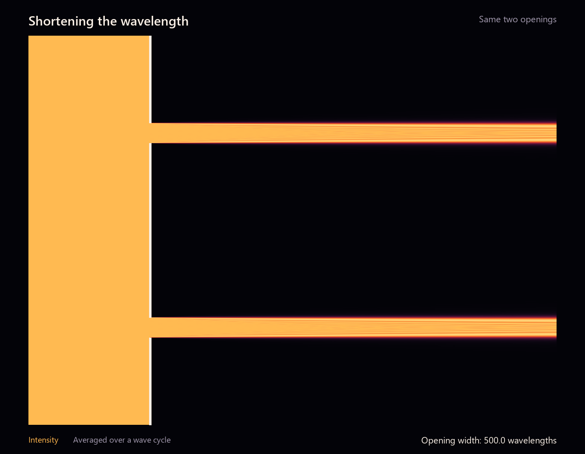

[Open MP4: symmetry-short-wave-beams.mp4](../../content/drafts/animations/symmetry-short-wave-beams.mp4)

*Interference and Rays*

Thus far we have described the symmetry group of a wave with a single translation direction $x$ and wave number, $k$. If the wave is to propagate, we also require that the wave represent time translation. We also need to require that time translation commute with spatial translation, for otherwise, it would change the mode composition over time, and spatial translation would no longer be a symmetry of nature. A single-mode travelling wave is then given by:

```math
M_0e^{i\left[kx-\omega t\right]}.
```

Because time is special, $\omega$ is called (angular) **frequency**, not wave number, but from a mathematical perspective, it is just another wave number.

Let us now ask the question: how do we find the amplitude at some point $B$ from some initial state of a wave? To do this, we can decompose the contributions into those from individual paths, starting with a very simple model. First, let's construct a point source of single-mode spherical waves emanating from $A$. Then let's add a barrier with two slits through which the wave can pass, $C$ and $D$. This setup allows us to calculate the amplitude at $B$ by combining only the amplitudes associated with the two paths $ACB$ and $ADB$.

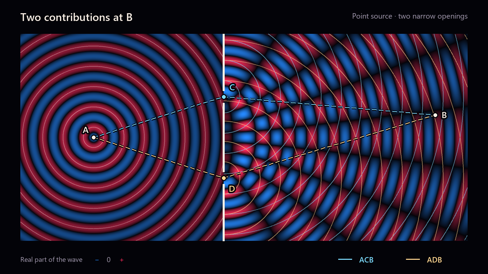

[Open MP4: symmetry-double-slit-candidate-paths-shortwave-arcs.mp4](../../content/drafts/animations/symmetry-double-slit-candidate-paths-shortwave-arcs.mp4)

*Two Path Interference*

First, let's figure out how any one straight segment of a plane wave contributes to the amplitude at its endpoint. From:

```math
e^{i\left[kx-\omega t\right]}.
```

we can identify that:

```math
\Delta\phi
=
k\,\Delta\ell
-
\omega\,\Delta t,
```

where $\Delta\ell$ is distance along the ray. In our setup, the segments combine into two candidate paths from $A$ to $B$:

```math
A \to C \to B
\qquad\text{and}\qquad
A \to D \to B.
```

We can now ask how each path contributes to the amplitude at $B$. The magnitude simply falls off as $1/r$ in accordance with spherical geometry. Also, since all contributions arrive at $B$ at the same observation time, their time-dependent phase is the same. The remaining things to calculate are their path-dependent spatial phases. Let $\ell_{AC}$ be the length of segment $AC$, and likewise for the other segments. The phase advances are:

```math
\begin{aligned}
\phi_{AC}&=k\ell_{AC},
&
\phi_{CB}&=k\ell_{CB},
\\
\phi_{AD}&=k\ell_{AD},
&
\phi_{DB}&=k\ell_{DB}.
\end{aligned}
```

To transform the wave function along the path, we compose, or multiply, the phase actions. Because multiplying phase factors adds the angles in their exponents, we can simply add the phase angle contributions to calculate the total phase advance along $ACB$ and $ADB$, respectively. Letting $\phi_0$ include the original phase at $A$ and the temporal phase advance common to both paths, we have:

```math
\begin{aligned}
\Phi_{ACB}
&=
\phi_0+\phi_{AC}+\phi_{CB}
=
\phi_0+k(\ell_{AC}+\ell_{CB}),
\\
\Phi_{ADB}
&=
\phi_0+\phi_{AD}+\phi_{DB}
=
\phi_0+k(\ell_{AD}+\ell_{DB}).
\end{aligned}
```

If we let $M_{ACB}$ and $M_{ADB}$ denote the magnitudes of the two path contributions, we then have the total contributions of each path at $B$:

```math
\Psi_{ACB}(B)
=
M_{ACB}
e^{i(\phi_0+\phi_{AC}+\phi_{CB})}.
```

```math
\Psi_{ADB}(B)
=
M_{ADB}
e^{i(\phi_0+\phi_{AD}+\phi_{DB})}.
```

What then is the total amplitude at $B$? It is just the sum of the two contributions arriving there. This is the principle of superposition which manifests visually as interference:

```math
\Psi_B
=
M_{ACB}
e^{i(\phi_0+\phi_{AC}+\phi_{CB})}
+
M_{ADB}
e^{i(\phi_0+\phi_{AD}+\phi_{DB})}.
```

Compose phase actions along a route. Add amplitudes across candidate routes.

We can plot the contribution from each path $ACB$ and $ADB$ in the complex plane, showing their sum by drawing them tip-to-tail. The vector from the beginning of the first arrow to the end of the second is the amplitude at $B$. Its length is the magnitude at $B$ and its angle is the phase at $B$.

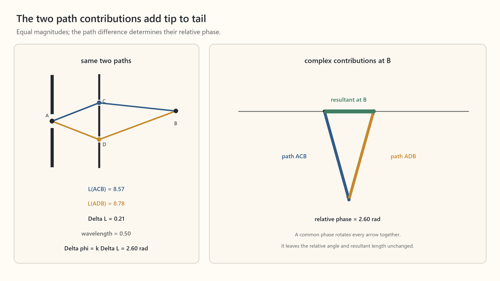

*Amplitude at $B$ is the sum of contributions from $ACB$ and $ADB$*

We can repeat the same procedure with many more paths. As the path deviates more from a straight, minimum length path, it has a greater first-order change in phase. (This is the common result from calculus that near a function's minimum, there is no change to the value of the function in the first order of the argument.) When the candidate paths are far from the stationary value, their phases vary greatly, effectively cancelling out their contributions to the total sum. On the other hand, the phases of the paths near the stationary path align and dominate the sum. The green line in the tip-to-tail pane of the animation shows the sum of each of these contributions, giving the amplitude at $B$. The resulting intensity on the projection screen is the square of this magnitude.

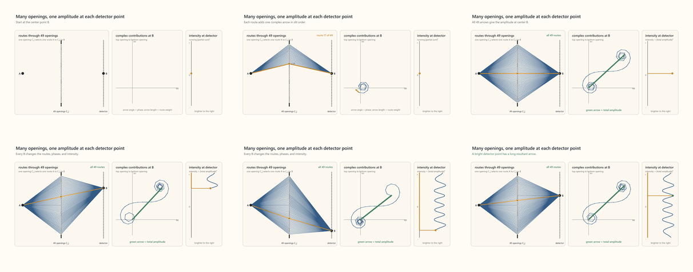

[Open MP4: symmetry-many-slit-paths-phasors-interference.mp4](../../content/drafts/animations/symmetry-many-slit-paths-phasors-interference.mp4)

*Seeing stationarity emerge in closely spaced paths*

We can extend this procedure to its limit and include infinitely many screens with infinitely many slits, and recover unobstructed propagation. In the following animation, we start with a plane wave and recover that same wave. This construction, which is the bridge to the so-called Feynman path integral formulation of quantum mechanics, was articulated by Huygens in the late 1600s!

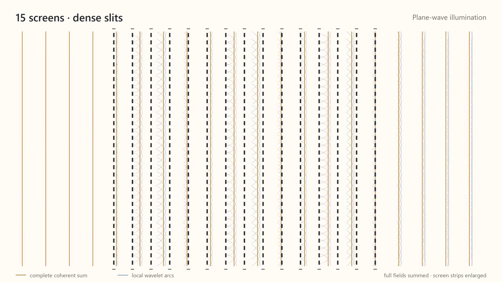

[Open MP4: symmetry-schematic-screens-v3-concise.mp4](../../content/drafts/animations/symmetry-schematic-screens-v3-concise.mp4)

*Huygens' Principle*

Let us now ask one more question. What happens to our tip-to-tail diagram of the path contributions when we vary the wavelength relative to the slit? As the wavelength becomes small, even a slight change in path length can produce a large phase change:

```math
\phi=\frac{2\pi L}{\lambda}=2\pi n+\theta,
\qquad 0\leq\theta<2\pi
```

Away from a stationary path, the phase winds through many cycles over a small range of paths, leaving an effectively random phase remainder so that the contributions from these paths cancel, and only paths near the stationary path combine to contribute to the sum.

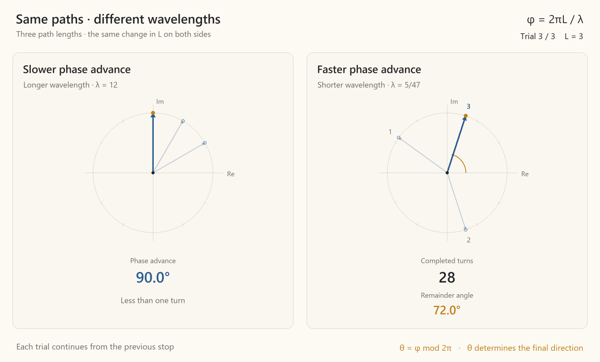

[Open MP4: symmetry-phase-remainder-spinners.mp4](../../content/drafts/animations/symmetry-phase-remainder-spinners.mp4)

In this limit, as waves pass through slits, they behave as rays, just as if you threw a ball from one point through a hole, it could only hit the projection screen in one spot.

Each path shares its color with its contribution to the tip-to-tail sum. As the wavelength shrinks, an increasingly narrow range of paths around the straight path carries the sum forward.

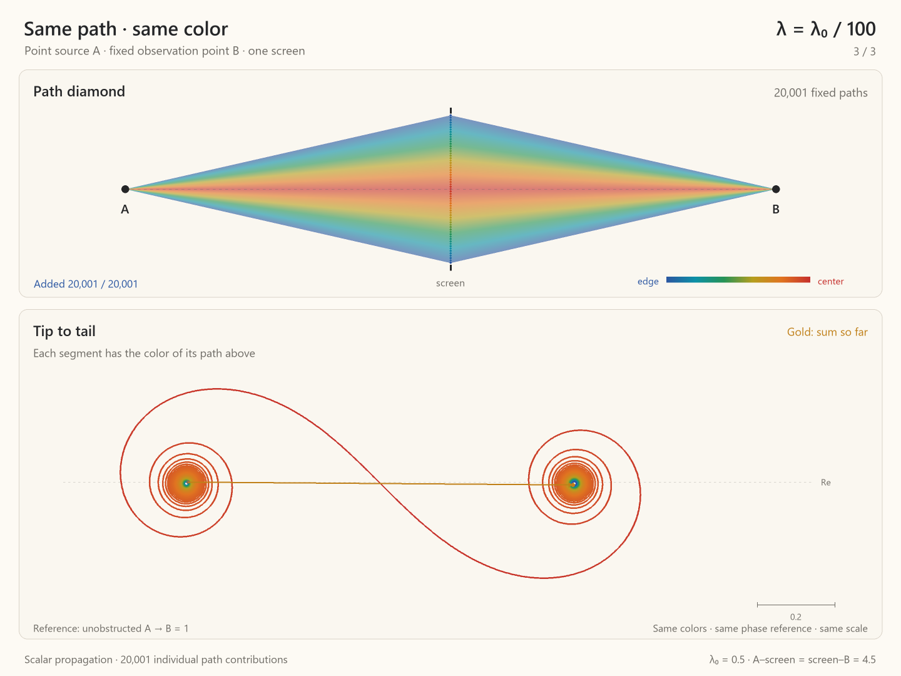

[Open MP4: symmetry-spectrum-path-diamond-wavelength-scan.mp4](../../content/drafts/animations/symmetry-spectrum-path-diamond-wavelength-scan.mp4)

##### From Wave Mechanics to Quantum Mechanics
Quantum mechanics gives wave intensity a new physical interpretation. For a normalized wave function, the squared magnitude gives the probability density for a position measurement:

```math
\rho(x)=|\psi(x)|^2,
\qquad
\int_{-\infty}^{\infty}\rho(x)\,dx=1.
```

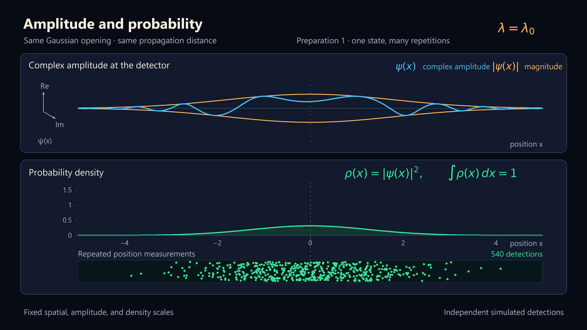

[Open MP4: symmetry-amplitude-probability.mp4](../../content/drafts/animations/symmetry-amplitude-probability.mp4)

*From intensity to position measurement probability density*

To connect our wave description to mechanics, we need to relate phase to action.

The action along a given path, the quantity that is minimized by that path, can be constructed from the structure of **spacetime**, as articulated in the theory of special relativity, which will be the topic of our next chapter. Crudely speaking, because the quantity to be minimized must be agreed upon by all observers, it is natural that it should be an invariant of symmetry actions on spacetime. This leads to the result that the action is, in free motion, proportional to an invariant built from translations — the time elapsed along a path as measured in a body's rest frame — times a dual invariant built from position translation generators. The former quantity is called **proper time** while the latter is **mass**. 

```math
S = -m\tau \qquad(c=1)
```

At the same time, we can calculate how phase advances along a path in spacetime. Introducing $\kappa$, the invariant built from wave function spacetime-translation generators, a single-mode plane wave along its inertial worldline is:

```math
e^{-i\kappa\tau}
```

We then have:

```math
\mathrm{constant} = \frac{S}{\phi} = \frac{m}{\kappa}
```

We can measure this constant in the lab by comparing mass, as measured through collisions, to wavelength, as measured through interference. We then find:

```math
\frac{S}{\phi}:=\hbar\approx 1.055\times10^{-34}\,\mathrm{J\,s}.
```

The smaller $\hbar$ is, the more phase cycles a given action difference produces. For two candidate paths:

```math
\Delta\phi=\frac{\Delta S}{\hbar}.
```

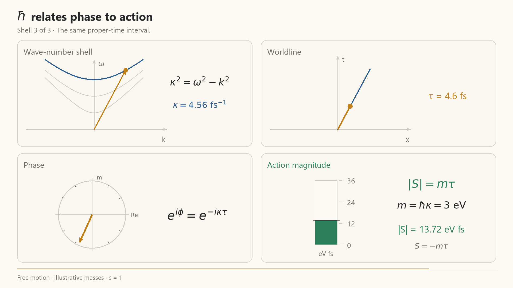

[Open MP4: symmetry-action-phase-desktop.mp4](../../content/drafts/animations/symmetry-action-phase-desktop.mp4)

But this is exactly our condition for the path sum to be dominated by stationary paths. For everyday bodies, $\hbar$ is tiny compared with action differences so that their motion is effectively deterministic. Are we saying that the laws of motion we learn in high school physics are an approximation? Yes, a very good approximation.

We can now express our $H_3$ commutation relation in units of action:

```math
[\hat X,\hat K]=iI
\;\xrightarrow{\times\hbar}\;
[\hat X,\hbar\hat K]=i\hbar I
```

We then have:

```math
\hat P := \hbar\hat K
```
where $\hat P$ generates position translations with the same scaling that relates phase to action. Its eigenvalue is **momentum**, $p$, giving us the quantum **canonical commutation relation**:

```math
[\hat X, \hat P] = i\hbar I
```

Recall that $x$ and $p$ are the eigenvalues of the $\hat X$ and $\hat P$ operators, respectively, acting on the wave function. We then have:

```math
\Delta x\,\Delta k\ge\frac{1}{2}
\;\xrightarrow{\Delta p=\hbar\Delta k}\;
\Delta x\,\Delta p\ge\frac{\hbar}{2}
```

This is the Heisenberg uncertainty relation, which states that a quantum state cannot have perfectly sharp values of both position and momentum, which becomes relevant at subatomic scales.

The canonical commutation relation, along with the definitions of $\hat X$ and $\hat P$, is also useful as a starting point from which to derive quantum theory’s general law of motion.
