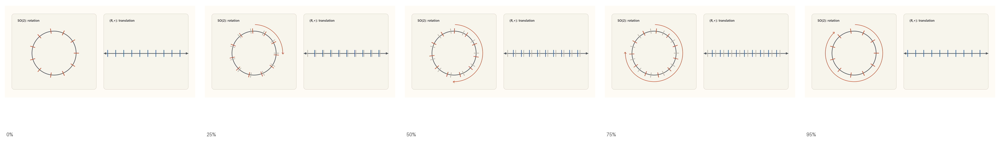
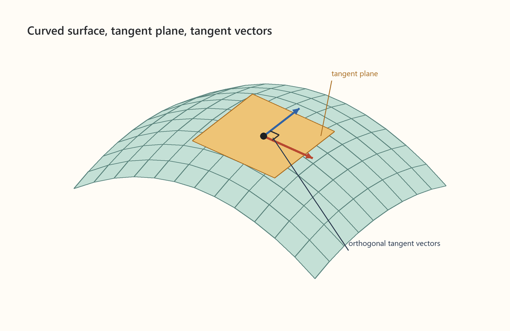
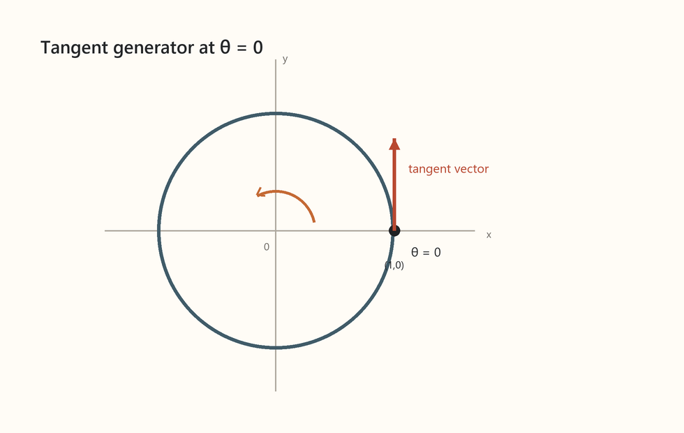
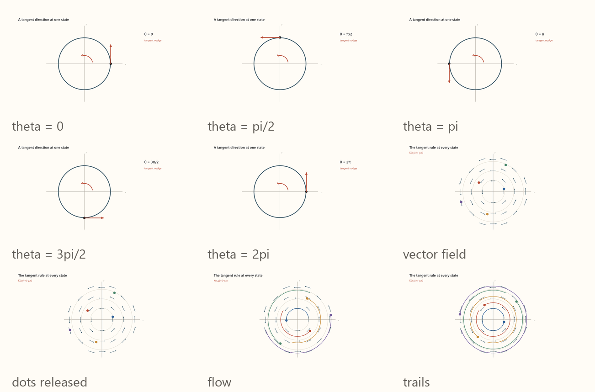
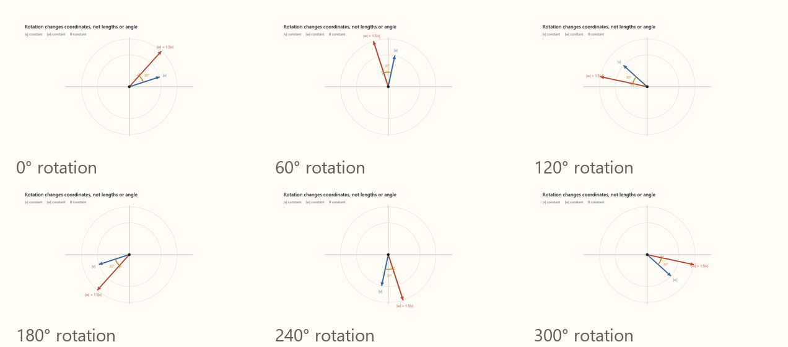
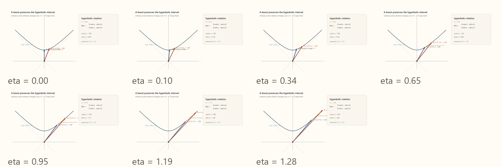
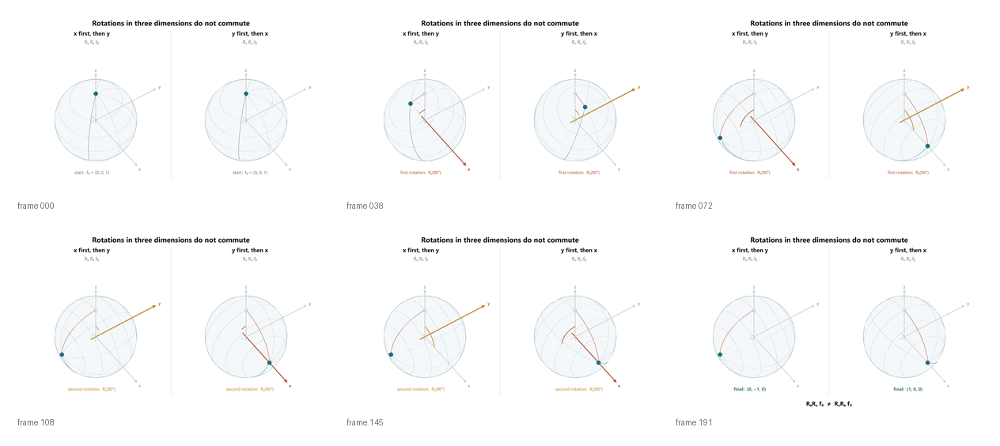
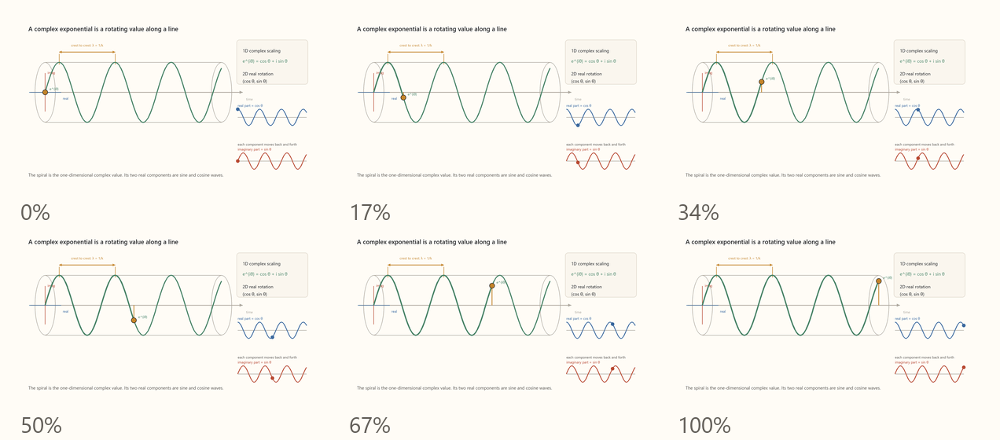
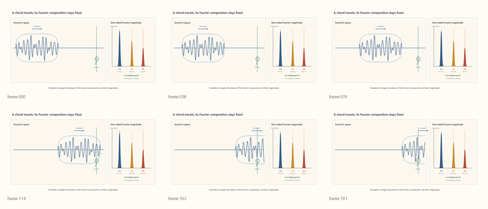
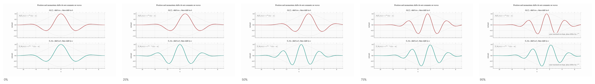

# Symmetry
Strike a pool ball with a cue, and the balls move in an expected way. Move the table over a few feet, and the balls move in recognizably the same way. Wait a few minutes, and the balls move in the same way. Turn the pool table a few degrees, and the balls still move the same way. Put the pool table on a train, and, again, the balls move in the same way. These are the manifest symmetries of the space we live in -- position and time translation, rotation, and velocity "boosts."

The symmetry of physical behavior may be an interesting observeration, but why start our story here? The reason is this. Symmetry constrains patterns of motion and classifies that which moves. One may rightfully say that modern physical theories proceed by identifying what patterns symmetry permits, then honing those possibilities to match what is observed. 

The term "symmetry" in this context may not at first glance seem like the same concept as, say, a triangle's symmetry, but it precisely is. We can leverage this commonality to build up a vocabulary for symmetry from simple, concrete examples that is essential to tell our story.

## Discrete symmetries
Consider a triangle.


An equilateral triangle.

We can see its obvious symmetry. To categorize its symmetry we can write down all the actions that leave it unchanged:
1. Do nothing
2. Rotate 120°
3. Rotate 240°
4. Flip along an axis
5. Flip then rotate 120°
6. Flip then rotate 240°


[Open MP4: symmetry-triangle-actions.mp4](animations/symmetry-triangle-actions.mp4)

We say the triangle "belongs to the $D_3$ symmetry **group**." Any number of objects possess $D_3$ symmetry.


We tend to think of a "triangles's symmetry" not the "symmetry of two rotations and flips about 3 axes," but this latter way of thinking in terms of symmetry groups is more general and is the defintion used in physics, where we ask not "what symmetry does this or that object have?" but "what objects can realize the symmetry evident in nature?"

### Representations
We can plainly "see" the symmetry of the triangle, but what if we want to write it down symbolically? Specifically, what if we want to track how a sequence of symmetry group actions transform an object? For example, suppose we label our triangle's vertices \(A, B, C\) and ask, if we rotate twice, flip once, then rotate again, where is vertex \(A\) sent? Recognizing that the triangle's state has three ordered components, we might guess that we could represent the triangle as a vector with 3 components. We coud then represent 120° rotations as **transformations** that permute the vertices in accordance with the symmetry group actions. 

There is nothing special about the vertices here, we could just as easily have chosen the midpoint of the edges or any other triplet of points on the triangle, and the same matrix the permutes the vertices would permute those vectors. That is, the group actions are represented as **linear** transformations. A **representation** of a symmetry group is a vector space and set of the linear transformations that compose in the same way as the group actions:

$$
D(g_1g_2)=D(g_1)D(g_2).
$$

where $g_1$ and $g_2$ are group actions, such as a rotation and a flip, and $D(g_n)$ is the matrix representing the $g_n$ action, and $D$ itself is the map from symmetry actions to matrices in the representation. This says that the matrix for the composed action \($g_2$ followed by $g_1$\) is the product the matrices for the separate actions.

To construct a 3-dimensional representation of $D_3$, we map the 3 vertices to component of a vector.


We can represent rotations and flips, respectively, with the following matrices:

Rotation:
$$
\begin{pmatrix}
0 & 0 & 1\\
1 & 0 & 0\\
0 & 1 & 0
\end{pmatrix}
$$

Flip:
$$
\begin{pmatrix}
1 & 0 & 0\\
0 & 0 & 1\\
0 & 1 & 0
\end{pmatrix}
$$

For example, a single rotation would be represented as:

$$
\begin{pmatrix}
0 & 0 & 1\\
1 & 0 & 0\\
0 & 1 & 0
\end{pmatrix}
\begin{pmatrix}
1\\
3\\
5
\end{pmatrix}
=
\begin{pmatrix}
5\\
1\\
3
\end{pmatrix}
$$

The matrices that provide a minimal set of transformations from which all other operations can be constructed are they symmetry's **generators**. For example, in the 3-dimesional representation of $D_3$, all operations can be constructed from one rotation matrix and 3 flip matrices, one for each axis.. 

Visually, permutations that correspond to rotations of the triangle are 120-degree rotations about a diagonal axis in this vector space, while those that correspond to flips are flips about planes that contains the diagonal axis.


[Open MP4: symmetry-d3-rotations-vs-flips.mp4](animations/symmetry-d3-rotations-vs-flips.mp4)

Now, notice something about these visualizations. The transformation of any vector lies in a plane as any 3 points do, and all such planes are parallel to one another. Thus, if we subtract off the average of the vectors, that is, if we move the point where the plane intersects the axis of rotation to the origin, we preserve the permutation structure of the transformations. We thus see that the $D_3$ symmetry is just as well represented as 120-degree rotations in the subspace of a 2-dimensional plane.


[Open MP4: symmetry-d3-irrep-collapse.mp4](animations/symmetry-d3-irrep-collapse.mp4)

We also notice that vectors that lie on the axis of rotation itself are left unchanged the transformation. A way to think of this is to allow the triangle's vertices to store some information, like a number or any numerical quantity. If the value they store is the same for all vertices, the symmetry actions have no effect, whereas if they are different, the actions permute those values in a way that can be represented in a 2-dimensional vector space. The 3-dimensional representation space we began with is thus decomposable into 2 subspaces, one 1-dimensional, the other 2-dimensional. These cannot be decomposed further. That is, there is no lower-dimensional space such that an allowable transformation of any state remains in that space. The 1-dimensional and 2-dimensional representations are called **irreducible representations** or **irreps** for short. This is substantially heavy math. Why do we bother? The reason is that, in the story we have to tell of quantum physics, where constituents of matter must abide the symmetry of nature, each consituent, each type of particle such as electron or photon, corresponds an to irreducible representations of nature's symmetry. A particular state of the particle is encoded in a vector in the corresponding irrep.

### Invariants
Once we have chosen a representation for a symmetry, we might well ask, how do we know our transformations preserve the symmetry? If we look at a triangle and rotate by 100 degrees we can "see" that doesn't preserve the symmetry. In a representation, we need some set of mathematical expressions that say "this transformation left the triangle the same." We call these the **invariants** of the transformation. 

In our 2-dimensional irrep of $D_3$, we only need to check how a transformation acts on a single vector. The question "does the triangle overlay itself" becomes "is an arbitrary vector rotated by 120 degrees or flipped along a given axis." And this has a precise answer. Given the coordinates of a vector a transformation cannot change these invariants:

```math
r^2=x^2+y^2
\qquad\text{(the squared length of the vector),}
```

```math
u=x^3-3xy^2=r^3\cos(3\theta)
\qquad\text{(its orientation relative to reference).}
```

These invariants are obscure without seeing the derivation, but the important point for now is that we can write an expression in terms of coordinates that must not change under the symmetry transformation. 

Why should we care about invariants? As we will see, a system’s characteristic physical behavior, the pool ball’s commonality, so to speak, is encoded by assigning a number to each possible history. For a given history, that number is the same for every **inertial** observer whose frame differs in position, time, orientation, or constant velocity.

## Continuous symmetries
What rotations return a circle to itself? All of them, of course! Similarly, all translations return a line to itself. The symmetries of space and time are continuous and can therefore be represented as transformations that depend on continuously varying parameters. 



[Open MP4: symmetry-continuous-so2-translation.mp4](animations/symmetry-continuous-so2-translation.mp4)

### Infinitesimal Generators
As we saw, in the $D_3$ symmetry group, we can build any action from a combination of the elemental actions of rotations and flips about an axis. Now let us ask the question: What is the generator of a continuous transformation? Let's say we want to rotate a circle by 10°. We could compose 10 1° rotations. But what if we want to rotate by 1°. We can see where this is going. The generators must be infinitesimal rotations. Noting that if we zoom in enough, any curved surface appears flat, we see that a continuous symmetry's infinitesimal generators are the vectors in the tangent plane to the symmetry's action. 



*Infinitesimal generators are vectors in the plane tangent to the space of symmetry transformations*

As every high school calculus student learns, a derivative of a function is the tangent line to that function. In the case of a circle, in the 2-dimensional representation, we have a single variable that parameterizes the operator matrix:

```math
R(\theta)
=
\begin{pmatrix}
\cos\theta & -\sin\theta\\
\sin\theta & \cos\theta
\end{pmatrix}.
```

We can take the derivative of the matrix valued function of $\theta$. This is:

```math
\frac{dR}{d\theta}
=
\begin{pmatrix}
-\sin\theta & -\cos\theta\\
\cos\theta & -\sin\theta
\end{pmatrix}.
```

To obtain a single matrix representing this infinitesimal nudge, we evaluate the derivative at $\theta=0$, where $R(0)=I$ is the identity transformation. In that case:

```math
\left.\frac{dR}{d\theta}\right|_{\theta=0}
=
\begin{pmatrix}
-\sin 0 & -\cos 0\\
\cos 0 & -\sin 0
\end{pmatrix}
=
\begin{pmatrix}
0 & -1\\
1 & 0
\end{pmatrix}.
```

This is the infinitesimal generator matrix:

```math
J
=
\begin{pmatrix}
0 & -1\\
1 & 0
\end{pmatrix}.
```

Now apply this tangential nudge to a state vector

```math
\mathbf v(\theta)
=
\begin{pmatrix}
x(\theta)\\
y(\theta)
\end{pmatrix}.
```




*The generator matrix \(J\) acts on the point \((1,0)\) to produce the tangent vector \((0,1)\) shown here.*

$J$ acts on any point on the circle to produce the tangent vector at that point. Putting this into calculus notation:

```math
\frac{d\mathbf v}{d\theta}
=
J\mathbf v.
```

We now have a differential equation for the transformation that uses the generator. We found this by starting with a known transformation and deducing its generator. But we can just well go in the opposite direction. Given this differential equation, we can find the transformation:

```math
\mathbf v(\theta)
=
e^{\theta J}\mathbf v(0).
```

The exponential of a matrix is defined in terms of the Taylor expansion for the an exponential:

```math
e^{\theta J}
=
I
+
\theta J
+
\frac{\theta^2}{2!}J^2
+
\frac{\theta^3}{3!}J^3
+
\cdots .
```

Now we notice something. Since:

```math
J^2=-I,
```

the even powers of $J$ become powers of $I$, while the odd powers become powers of $J$. Therefore

```math
e^{\theta J}
=
\left(
1-\frac{\theta^2}{2!}+\frac{\theta^4}{4!}-\cdots
\right)I
+
\left(
\theta-\frac{\theta^3}{3!}+\frac{\theta^5}{5!}-\cdots
\right)J.
```

These are the the Taylor series for sine and cosine:

```math
e^{\theta J}
=
\cos\theta\,I
+
\sin\theta\,J.
```

Substituting in $J$ gives

```math
e^{\theta J}
=
\begin{pmatrix}
\cos\theta & -\sin\theta\\
\sin\theta & \cos\theta
\end{pmatrix}
=
R(\theta).
```

This is the **exponential map**. It takes the infinitesimal generator $J$ and returns the finite symmetry transformation $R(\theta)$.

#### Symmetry Flows

We can think of a symmetry transform as a "uniform looking" vector field, as illustrated below:



[Open MP4: symmetry-so2-vector-field-flow.mp4](animations/symmetry-so2-vector-field-flow.mp4)

Here we ask not what happens when the transformation is applied to a single set of starting conditions, but what the transformation does to all starting conditions. This view lends itself to seeing the structure in collections of histories. 

#### Invariants and Metrics
What is the invariant of rotation in this representation? It is the length of vectors and the angles between them.



[Open MP4: symmetry-rotation-vector-invariants.mp4](animations/symmetry-rotation-vector-invariants.mp4)

These relationships are expressed by a single invariant, the dot product.

```math
\mathbf u\cdot\mathbf v
=
u_xv_x+u_yv_y.
```

An invariant of this sort, that fixes some notion of placing reliable rulers on the space, is a **metric**. It defines the way to measure the geometric relationships that a symmetry transformation preserves. For normal rotations (and translations), these relationships are intuitive, but a symmetry may preserve a less intuitive metric. If we define invariant length not as \(x^2+y^2\) but as \(t^2-\mathbf{x}^2\), a hyperbolic rotation, or one that stretches out as it approaches assymptotes, leaves the interval unchanged even though the distance between transformed vectors appears to change using our everyday notion of distance. Such a hyperbolic metric, as we will see, encodes the asymptotic limit of light speed in the relativistic geometry **spacetime**.



[Open MP4: symmetry-hyperbolic-rotation.mp4](animations/symmetry-hyperbolic-rotation.mp4)

### Commutators
In the case of a single continuous symmetry transformation, the generator combined with a parameter, like angle in the case of rotation, specifies an arbitrary transformation. However, when there are multiple independent transformations that can be composed, the order of the composition must also be taken into account because it produces different resultant states. For example, in the 3-dimensional rotation group, called $SO(3)$, rotating about the $x$-axis then the $y$-axis leaves a sphere in a different state than applying the same actions in the opposite order.



[Open MP4: symmetry-so3-rotation-order.mp4](animations/symmetry-so3-rotation-order.mp4)

This order-dependence is encoded by the **commutator**:

```math
[X,Y]
=
XY-YX.
```

For example, for $\mathfrak{so}(3)$, the commutators are:

```math
[J_x,J_y]=J_z,
\qquad
[J_y,J_z]=J_x,
\qquad
[J_z,J_x]=J_y.
```
In $SO(3)$, then, we know that rotating about $x$ rotates the $y$ axis into $z$. We would write such a composite action as a product of exponential maps:

```math
e^{aJ_x}e^{bJ_y}.
```

How then do we write this as a single exponential in terms of $J_x$ and $J_y$? For ordinary numbers, and for commuting operators:

```math
e^Ae^B=e^{A+B}.
```

But this identity does *not* hold for noncommuting generators.

```math
e^{aJ_x+bJ_y}
```

generates a rotation about a single axis in the $x$-$y$ plane, which is not the same as performing the two rotations sequentially.

How can we correct the exponent so that the product can again be written as a single exponential? To the lowest nontrivial order, which, by definition, is the order of the generator space:

```math
e^{aJ_x}e^{bJ_y}
=
\exp\!\left(
aJ_x+bJ_y+\frac12ab[J_x,J_y]+\cdots
\right)
=
\exp\!\left(
aJ_x+bJ_y+\frac12abJ_z+\cdots
\right).
```

The commutator supplies $J_z$.

Geometrically, the commutator is a measure of curvature. On a flat plane, the $x$- and $y$-translation generators commute: moving in $x$, then $y$, then undoing each movement returns us exactly to where we began. On a sphere of radius $R$, the corresponding sequence leaves a small rotational gap:

```math
[T_x,T_y]
=
\frac{1}{R^2}\left(xT_y-yT_x\right).
```

The expression $xT_y-yT_x$ generates rotation within the $x$-$y$ plane—the same rotation that an embedding-space description would call rotation about $z$. The factor $1/R^2$ is the curvature, so the gap vanishes as the sphere flattens.

#### Lie Algebra

Taken together, the dimension of the symmetry group and the commutators fully specify a **Lie algebra** that contains the structure of the symmetry group, up to global topological features, such as a symmetry group wrapping around onto itself, that are invisible to local structure. This algebra consists of the vector-space operations and the commutator. Every representation must preserve these commutators. Therefore, if we know the Lie algebra, we can use it to find a valid representation.

#### Invariants and Casimir operators

Lie algebra provides a procedure for finding invariant operators. If we can construct an operator from the generators that commutes with all the algebra's generators, we then know that the operator is an invariant under the symmetry. As an illustration, in 3-dimensional rotation, with generators denoted $L_i$ for angular momentum, we can see that the square of the rotation generators is invariant:

```math
[L_x,L_y]=L_z
\quad\text{(cyclically)},
\qquad
L^2=L_x^2+L_y^2+L_z^2.
```

```math
\begin{aligned}
[L^2,L_x]
&=[L_y^2,L_x]+[L_z^2,L_x]\\
&=L_y[L_y,L_x]+[L_y,L_x]L_y
+L_z[L_z,L_x]+[L_z,L_x]L_z\\
&=-L_yL_z-L_zL_y+L_zL_y+L_yL_z\\
&=0.
\end{aligned}
```

By the same calculation,

```math
[L^2,L_y]=[L^2,L_z]=0.
```

This is common sense: the magnitude of angular momentum is independent of the direction of the axis.

An invariant constructed this way is a **Casimir operator**, and Casimir eigenvalues are crucial in physics because their combined values classify representations of a symmetry. For example, as we will see later, the invariant mass of a particle is the eigenvalue of a Casimir operator built from the generators of time and space translations. In fact, the particles familiar from the Standard Model are classified by combinations of Casimir eigenvalues of the symmetries they represent. To say this again, in the **Standard Model**, particles are modeled using representations of symmetry, and the Casimir eigenvalues identify the representation to which a particle state belongs.


### Translations and Function Representation
Translation is, to the eye, the simplest possible symmetry. It would be natural to think the ideal representation space for a translation is simply a one dimensional vector space, where points move via "sliding a number line." But there is a problem. If an operation is to move $x$ by some amount $a$

```math
x\mapsto x+a,
```

then $0$ is moved to $a$, but the origin must remain fixed in a linear vector space. This is a special case of the rule for linearity. A linear operation $T$ must preserve linear combinations:

```math
T(\alpha u+\beta v)
=
\alpha T(u)+\beta T(v).
```

For translation of points on the number line, the candidate operator is

```math
T_a(x)=x+a.
```

But this does not preserve addition. For two points $x_1$ and $x_2$,

```math
T_a(x_1+x_2)
=
x_1+x_2+a,
```

while

```math
T_a(x_1)+T_a(x_2)
=
(x_1+a)+(x_2+a)
=
x_1+x_2+2a.
```

These are not equal unless $a=0$. Translation does act sensibly on a number line, but it is not a linear operation when acting on this space.


[Open MP4: symmetry-translation-point-linearity-failure.mp4](animations/symmetry-translation-point-linearity-failure.mp4)

On the other hand, the space of functions on a number line do form a linear representation. Instead of translating the point $x$, we translate a function by shifting its argument:

```math
(T_a f)(x)=f(x-a).
```

Now the state is the whole function $f$, and $T_a$ is an **operator** on the vector space of functions. An operator is a generalization of a matrix when applied to continuous functions. A continuous function is as an infinite-dimensional vector, in which its domain values are "axes," or components labels, and its range values are the component values. We can transform one function to another with an infinite dimensional matrix, but in practice, we can condense this into a well-known operation, such as the derivative operation.

Linearity works because function addition is pointwise:

```math
T_a(f+g)(x)
=
(f+g)(x-a)
=
f(x-a)+g(x-a)
=
(T_a f)(x)+(T_a g)(x).
```

So

```math
T_a(f+g)
=
T_a f+T_a g.
```

The zero function is also fixed:

```math
T_a0=0.
```


[Open MP4: symmetry-translation-function-linearity.mp4](animations/symmetry-translation-function-linearity.mp4)

This makes sense. Translational symmetry needs an object to translate, just as $D_3$ symmetry needs a triangly thing to translate. We can think of the function as a shape. If there is translational symmetry, that shape is preserved.


[Open MP4: symmetry-function-translation-shape.mp4](animations/symmetry-function-translation-shape.mp4)


Such a shape is understood as a vector space in the same way that $D_3$ is. Now each point on the number line is like the vertex of a triangle, and it contains the component of a vector. Visually, it is the axis of a coordinate plot. Indeed, the $D_3$ representation is itself a function representation, with a domain that contains only three members and is cyclic. 

#### The Role of Linear Operations on Function Representations
[maybe move this down a bit]
The function representation becomes indispensible when a "state" is thought of not as a single coordinate in state space, or the "state of a particle," but as a function, or distribution, over state space. In that case, treating distributions as vectors we evolve with operators allows us to define their overlap as an inner product. We can then require time evolution to be orthogonal, meaning that it preserves the lengths and angles between distribution vectors just as a rotation preserves the lengths and angles between ordinary vectors. That is:
```math
\langle O\rho_1,O\rho_2\rangle
=
\langle\rho_1,\rho_2\rangle.
```
The distributions may change as they evolve, but their overlap does not, so distinct distributions cannot be compressed together or collapse into the same distribution.

But why, we ask, should we focus on the evolution of a distribution of states rather than on a single state. In one sense, we might say the idea of a single state, an object at a point, is more a storytelling device than a scientifically-framed question. Questions like "how will this storm develop" or "how will voters react to inflation" don't start with a story about an individual air molecule or an indvidual voter, they ask to find patterns over spaces. More concretely, physics has two reasons to focus on te evolution of distributions. First, in the familiar world of "classical" mechanics, the number of individual states is often unfathomably large, so we instead study distributions characterized by aggregate properties. A hot system and a cool system, for example, correspond to different patterns distributed over state space. Their evolution is therefore naturally described as the transformation of one function over state space into another. This makes function representations—and linear operations that preserve the distinction between such functions—the appropriate language. Then, in the deeply unfamiliar world of "quantum" mechanics, individual states themselves become vectors in a function representation. At this point, only a linear operation that preserves inner products in the function space can describe even a single particle's evolution.
   
#### Generator of Translations
We want to find an infinitesimal generator and that acts on functions. We can do so by considering what happens to a function's value under "tiny" displacements. In that case, the new value $f(x-a)$ is close to the old value $f(x)$, and correction is given, in the infinitesimal limit, by the the slope at $x$. This is the same idea that any curve becomes flat when zoomed in sufficiently:


[Open MP4: symmetry-translation-tangent-zoom.mp4](animations/symmetry-translation-tangent-zoom.mp4)

That is the visual version of the first-order **Taylor expansion** that relates a function's derivatives to its value under translation:

```math
f(x-a)
=
f(x)
-
a\frac{df}{dx}
+
O(a^2).
```
As $a$ approaches $0$, the higher order terms vanish and the shift in $f's$ values are produced the operator $d/dx$:

```math
\hat P
=
-
\frac{d}{dx}.
```

#### Eigenfunctions 
Imagine a rubber sheet. We pulls on the corners of the sheet. What does this do to the $x$- and $y$-axes? It rotates them toward each other while stretching them. Now, instead choose $x$ and $y$ to be diagonal axes. Now, when we stretch, the long axis is stretched but not rotated and the short axis is compressed but not rotated. The action of this stretching action on these axes is now simple scalar multiplication of the original vector. Once the basis vectors no longer mix, any other vector, that is, any linear combination of the basis vectors, transforms by having its components scaled independently:


Letting $s$ be the the factor by which the long-axis component is stretched, we can see how the transformation of an arbitrary vector $\mathbf{r}$ simplifies in the using the system's natural basis:

| $(x,y)$ basis: components mix | $(u,v)$ basis: components do not mix |
|---|---|
| $\displaystyle \begin{aligned}\mathbf r&=\frac12\begin{pmatrix}s+s^{-1}&s-s^{-1}\\s-s^{-1}&s+s^{-1}\end{pmatrix}\mathbf r_{\mathrm{in}}\\&=\frac12\left[(s+s^{-1})x+(s-s^{-1})y\right]\hat{\mathbf x}\\&\quad+\frac12\left[(s-s^{-1})x+(s+s^{-1})y\right]\hat{\mathbf y}\end{aligned}$ | $\displaystyle \begin{aligned}\mathbf r&=\begin{pmatrix}s&0\\0&s^{-1}\end{pmatrix}\mathbf r_{\mathrm{in}}\\&=su\hat{\mathbf u}+s^{-1}v\hat{\mathbf v}\end{aligned}$ |

This is readily understood visually:


[Open MP4: symmetry-eigenbasis-stretch.mp4](../../content/drafts/animations/symmetry-eigenbasis-stretch.mp4)

Now for a bunch of terminology. The "natural" basis vectors are the **eigenvectors**, the values a transformation scales these by are the **eigenvalues** and the basis they form is called the **eigenbasis**. When the "vectors" are functions, we call them **eigenfunctions**. As the transformation matrix is diagonal in the eigenbasis, the procedure for finding and eigenbasis is typically called **diagonalization**. 

#### Eigenfunctions of Translational Symmetry
Since a function is but an infinite-dimensional vector and the generator $d/dx$ is a way of writing an infinite-dimensional matrix, we can solve a similar eigenvalue equation here, which now takes the form of a differential equation.

The eigenvalue equation is

```math
\frac{d}{dx}f(x)
=
\lambda f(x).
```

This says we are looking for a function whose derivative returns the same function, scaled by a single number. The solution is

```math
f(x)=Ce^{\lambda x}.
```

The exponent can be, and in most of what we discuss, will be imaginary. The mystery of $i^2=-1$ is less mysterious when we recall that the rotation operator in the two-dimensional representation had the same property:

```math
J^2=-I.
```

In both the cases of real and complex exponents, the scale factor is the eigenvalue of the translation operator. Both cases generate rotation, hyperbolic in the real case and circular in the imaginary case. 

Both real and imaginary exponential functions can act as a generalized eigenbasis, but if we are to have a metric space in which some inner product \(the generalization of a dot product\) measures the similarity of functions, the translation operation must preserve the inner product. This condition is called **unitarity**, and translation is not unitary for the case of real exponentials. The condition of **unitarity** cannot be overstated. It is the property that ensures different states remain *distinguishable* under symmetry transformations and that those transformations are *reversible*. Let

```math
f_k(x)=e^{kx},
\qquad
g_l(x)=e^{lx}.
```

Under translation,

```math
(T_a f_k)(x)
=
f_k(x-a)
=
e^{-ka}f_k(x),
```

and

```math
(T_a g_l)(x)
=
g_l(x-a)
=
e^{-la}g_l(x).
```

Therefore

```math
\langle T_a f_k,T_a g_l\rangle
=
e^{-(k+l)a}
\langle f_k,g_l\rangle.
```

This equals the original inner product only when

```math
e^{-(k+l)a}=1.
```

For real $k$ and $l$, this is not generally true. Thus real exponentials are eigenfunctions of translation, but they are not compatible with translation as an inner-product-preserving symmetry. Thus the eigenfunctions of the translation operator are complex exponentials, that is $e^{ikx}$. Complex exponentials encode circular motion, and, when acted upon a translation symmetry operator, encode waves. Let's see how this works.

::: details Complex exponentials and waves
We asserted above that the complex exponential function describes a plane wave. Let's explain that and generally build some intuition around the complex exponential function. A single parameter complex exponential, $e^itheta$, describes a circle. It is a way to repackage the rotation operator we have aleady seen:

```math
e^{i\theta}
\quad\longleftrightarrow\quad
e^{\theta J}
=
R(\theta)
=
\begin{pmatrix}
\cos\theta & -\sin\theta\\
\sin\theta & \cos\theta
\end{pmatrix},
\qquad
J
=
\begin{pmatrix}
0 & -1\\
1 & 0
\end{pmatrix}.
```

$i$ is the generator of rotation in this 1-dimensional complex representation and plays the role $J$ did in the 2-dimensional representation:

```math
i^2=-1
\quad\longleftrightarrow\quad
J^2
=
\begin{pmatrix}
0 & -1\\
1 & 0
\end{pmatrix}^{\!2}
=
-I.
```
How is it possible to replace a $2x2$ matrix with a single number $i$? The answer is that $i$ has two real-number degrees of freedom. That is, we define a complex number $z$:

```math
z:=x+iy,
```

thus a complex number is mapped to a vector in the complex plane.


What action does multiplication by $i$ have at the identity vector $1$.

Here:

```math
\begin{aligned}
z&=1=1+0i\\
z_{\mathrm{tan}}&=zi=1\cdot i=i=0+1i
\end{aligned}
```

This is a vector in the complex plane that is perpendicular to the identity.


This is exactly the action the $J$ matrix generator had in 2-dimensions, which we already argued exponentiates to rotation. Let's redo that argument here, as it leads to a gratifying result. Since multiplication by $i$ produces the tangent vector at every point and the tangent vector is the geometric version of the derivative, we have:

```math
\frac{dz}{d\theta}=i\,z(\theta)
```

With $z(0)=1$, solving this differential equation we then have:

```math
z(\theta)=e^{i\theta}
```

At $\theta=\pi$, halfway around the unit circle, we then have:
```math
e^{i\pi}=-1
```

This is Euler's identity, magically relating three of nature's most fundamental constants. As Sal Khan said, "if this does not blow your mind, you really have no emotion."

We can map $z$ back to $x,y$ coordinates and obtain Euler's formula:

```math
e^{i\theta}=\cos\theta+i\sin\theta
```

Engineers often represent real sinusoidal waves with complex exponentials using this formula and reading off the real part as multiplying exponentials is algebraically simpler than multiplying trigonometric functions.

Now let us turn from circular motion to a travelling complex wave. Here $\theta$ is given as a function of the direction-of-travel coordinate $x$ and time $t$:

```math
\theta(x,t)=kx-\omega t,
\qquad
z(x,t)=Ae^{i\theta(x,t)}=Ae^{i(kx-\omega t)}.
```
$k$ is the inverse of the wavelength and is called the **wave number**. 

Below, the cylinder axis is time, though the same picture applies to any translation direction. 



[Open MP4: symmetry-complex-exponential-plane-wave.mp4](animations/symmetry-complex-exponential-plane-wave.mp4)

The plane wave's two real components are $\cos\theta$ and $\sin\theta$, so each component moves back and forth like an ordinary wave. Note that unlike the case for the real components considered separately, the amplitude of the complex plane wave is constant. This is the condition for unitarity that we identified earlier.

:::

#### The Importance of Eigenfunctions of Operators in Physics
Why should we care about eigenfunctions of operators? Often, a rot procedure can diagnolize a matrix, making subsequent matrix multiplication problems computationally tractable. This approach is pervasive in countless areas of engineering and data analysis due to its computational efficiency, but our interest is different. As it turns out, in quantum mechanics, a measurement always results in a state "collapsing" to an eigenstate, and the value of the measurement is the corresponding eigenvalue.

To get a feel for this, consider rolling a die. As it tumbles in the air, the value is unknown until the "reveal operator" is applied and the die settles into a single face up. We can represent our "ignorance" by assigning equal probabilities to the six possible faces:

$$
\mathbf p=(p_1,p_2,p_3,p_4,p_5,p_6)
=\left(\frac16,\frac16,\frac16,\frac16,\frac16,\frac16\right).
$$

Next we can define an observable whose eigenvectors represent the possible faces and whose eigenvalues are their numerical values. Writing $|n\rangle$ for the basis vector associated with face $n$:

$$
\hat D=\sum_{n=1}^{6}n|n\rangle\langle n|
=\operatorname{diag}(1,2,3,4,5,6),
\qquad \hat D|n\rangle=n|n\rangle.
$$

The projector associated with outcome $n$ is $P_n=|n\rangle\langle n|$, while the probability of that outcome is simply the corresponding entry in our probability list:

$$
\Pr(n)=p_n=\frac16.
$$

The faces of the die are the eigenvectors of this operator and their value are the eigenvalues. 

This is surely an odd way to describe such a statistical situation, but it is, in fact, the way quantum mechanics formulates its predictions. There, the state is a complex-valued function over the eigenvalues of a given observable \(whose squared magnitude is the probability distribution over that observable.\) The difference between this theory and that of the die is that in the case of the die, thinking of the state as a superposition of possibilities was just a proxy for our ignorance about the "actual" state, whereas, in quantum mechanics, the notion that there is a physically definite state hidden by our ignorance is demonstrably false. The arguments for this are subtle and spectacular, and we will be best served to wait until we turn to quantum mechanics to give them their due, but if we take this idea of "existing in a superposition" on faith for the time being, then we have a compelling reason to study the eigenfunctions of operators in symmetry representations. 

*Things that can be observed take the eigenvalues of operators on representations of nature's complete symmetry.* 

This tells you several things. First, the only admissible questions the theory addresses are those that are represented by operators in a symmetry representation space. We can ask for a state's coordinate value in a symmetry representation and its generator value. Other "physical" questions, say, "is this liquid or solid?" are emergent properties of complex systems. Second, the eigenfunctions of a given operator are a basis for the distribution of amplitudes over possible outcomes. Thus to know that the eigenfunction of the translation operator is a plane wave is to understand the essence of the very state that physics examines evolving over time. If someone were to ask "what is physics about?" we might reply "predicting the future from the current state." If then pressed, "state of what?" our answer would be "the state of a superposition of plane waves." Third, the constituents of that state, **particles**, are categorized by eigenvalues of operators that are invariant under symmetry transformation in a given irreducible representation. That is, to be an "electron" is to inhabit a subspace of the state space carrying a representation of nature's complete symmetry that is labeled by the eigenvalues of Casimir operators(which manifest as characteristic features of the wave packets and their evolution.\) This expresses the truism that, in a theory that only answers questions that can be posed as operators on a symmetry representation, the kind of object something is must invariant under that symmetry.

#### Fourier Decomposition of Wave Packets into Plane Wave Components
If I strike a chord on a piano, some complicated function of time describes how the sound reaches your ear. It starts soft, gets louder, softens again. It has discernible main tones, but also a clutter of overtones that comprise the timbre of the piano. While you hear a clear tonal structure, a plot of the sound pressure level over time reaching your ear would completely obscure that structure. 



  
But we know something about this random-seeming function reaching your ear. We know it is comprised of 3 pitches, and some overtones. If we plot the sound pressure level as a function of these pitches rather than as a function of time, the structure of our plot clearly reveals what we hear with our ear. 

Why is this? It is exactly what we have just learned. Since plane waves, or pitches, are the eigenfunctions of the translation operator, the composition in terms of these **modes** is not altered by translational symmetry transformations. 

If our complicated function of loudness over time can be represented by a linear combination, or **superposition** of wave modes, perhaps any function can be. Well that's almost true. Just as we saw that real exponential functions "blow up" under translation, any function that similarly blows up cannot be decomposed into plane waves, but it is the case that any smooth function that does not blow up can be. Mathematically, "blow up" means that the norm of the function, or the inner product of the function with itself, is finite.

```math
\int_{-\infty}^{\infty}|f(x)|^2\,dx<\infty.
```

Physically, such a function is a **wave packet**. Expressing an arbitrary wave packet as a superposition of its modes is called **Fourier decomposition** and the transformation from an amplitude over translation coordinate to amplitude over wave number coordinate is called a **Fourier transformation**.

[move this to after unitarity ?]
Because nature has time and space translational symmetry, any **free**, or non-interacting, system described as a wave packet retains its Fourier composition over time and space. As we move on to discuss **fields**, or functions over space and time, localized objects will be treated as special cases of wave packets. The through line of the story we want to tell is this: nature's symmetry requires that the world is "musical," that is, that its most elemental constituents are "tones," and that all the complexities that unfold over time are the manifestation of the composition of those tones. Sip some herbal tea, grab your crystals, and ponder -- the unfolding of nature in time is, decomposed into its Fourier modes, a timeless "chord."
[move this to after unitarity]


#### The Symmetry Generators of Physics
[this is all messed up. probably remove. at best try to understand -- we're trying to use complex functions to represent the symmetry, how can that then be an additional symmetry??]
As we have said nature includes translation symmetry in time and position, rotational symmetry, and velocity boost symmetry. This group lives in a complex function representation. In addition, in quantum theory, the complex phase of function representations will be seen to be an extra symmetry as it will be not appear in observables, which are encoded into the complex norm of the representing function, where phase cancels. This extra symmetry is not one of time and space, but rather lives in its own fiber on each point in time and space. Such a construction is called a **fiber bundle**. 

[insert fiber bundle diagram] 

In the full Standard Model, each fiber may have several indepenpendent components.

#### Canonical commutator
In addition to all the palpable symmetry of nature and the fiber bundle structure that arises from the complex function representation, there is another symmetry group with altogether different and pivotal importance. This is symmetry group that stands behind Fourier transformations, known better by its commutator name than the symmetry group, the **canonical commutation relation**. Once we choose a complex wavefunction representation, one set of operators (for translation in $x$, $y$, $z$, and $t$) on the function space act to produce shifts in position and time. But a different set of operators produce shifts in wave number, and these operators do not commute. This failure to commute is not hard to show algebraically, but we will omit it. The effect of the commutator, that is, of shifting a wave in position, then in momentum, the completing the loop by undoing each operation, is to shift the phase of the wavefunction. 

```math
(T(a)\psi)(x)=\psi(x-a),
\qquad
(M(b)\widetilde\psi)(k)=\widetilde\psi(k-b).
```

Choosing the $x$-representation, the translation in $k$ becomes multiplication by a phase:

```math
(M(b)\psi)(x)=e^{ibx}\psi(x).
```

```math
T(a)M(b)T(-a)M(-b)
=
e^{-iab}I,
\qquad
[X,K]=iI.
```

The infinitesimal commutator can be exponentiated to obtain the finite phase advance:

```math
e^{-ab[X,K]}
=
e^{-iab}I.
```

So that:

```math
\left(e^{-iab}I\right)\psi(\bar{x})
=
e^{-iab}A e^{i\bar{k}\cdot\bar{x}}
=
A e^{i(\bar{k}\cdot\bar{x}-ab)}.
```



*Applying position and wave-number shifts in opposite orders leaves a residual phase. The animation compares the inverse ordering, and therefore displays $e^{iab}$ rather than $e^{-iab}$.*

[Open MP4: differential-weyl-order-phase.mp4](animations/differential-weyl-order-phase.mp4)

We can write the phase of a wavefunction in terms of the time and position translation generators.

```math
\psi_{\mathbf k,\omega}(\mathbf x,t)
=
A e^{i(\mathbf k\cdot\mathbf x-\omega t)},
\qquad
-i\nabla\psi=\mathbf k\psi,
\qquad
i\partial_t\psi=\omega\psi.
```

$[X,K]$, then, tells us how phase advances, when applying the $\hat X$ and $\hat K$ operators interact when applied sequentially. But what does this mean? What does it mean to "apply the $\hat X$ operator" other than what we can say here, in the math itself, which is to transform the wavefunction along the $k$ axis. Because time and position translations commute, waves free state is to translate along $x$. However, waves do not freely change wave number over time. Thus "translation in wave number" doesn't freely happen over some time, making it yet harder to say what "applying the $\hat X$ operator" means.  


In quantum mechanics, indeed in wave mechanics in general, the information the wave carries is determined by the relative phases of its components. Shifting $k$ (or $x$ in the position representation) changes these relative phases, and the $[X,K]$ commutator tells us how a shift in $k$, and then in $x$ changes the shape of the wave function. But what, in practice, in physics, does it mean to shift the symmetry transformation's parameter? This is subtle. It is tempting to think that as a system evolves in time it is transformed along some symmetry. And this may we be the case if that symmetry is a symmetry of the system, such as transformation in position for a free particle. But a free wave certainly does not transform in $k$ space over time. The key to understanding the role of the commutator is to understand that the transformations are *hypothetical*. What we will see in a later is that path a system takes in time is the one for which some function on the path is **extremized**, that is, that it is minimized, maximized, or otherwise has a vanishing first derivative. To find the actual, physical path, we consider alternate paths between the same endpoints and ask how much they vary from alternate "wrong" paths. For a wave, as we will see later, this function is precisely the phase advance, and we can see how how rapidly the phase advance changes between candidate path by tiling the area they enclose with infinitesimal loops that contribute the value of the coummator. 


[Open MP4: symmetry-ccr-action-variation.mp4](animations/symmetry-ccr-action-variation.mp4)

What have we said? That for travelling wave packets, the commutator encodes the actual, physical evolution of the packet. Once we have this, we can find the differential **equations of motion** which can be integrated to find the physical path, thus providing an alternate way to arrive at the real path. However, given the position and wave number generators and their commutator, we can directly derive the equations of motion without working out the **variational** procedure, as they are, precisely, the local measure of phase variation.

So much for waves, but why obsess about waves, or wave packets, or wavefunctions. The reason, which some may have guessed, is that in quantum mechanics, or we could say "the best mechanics we know," there are no particles or rigid objects with definite positions, but only probabilities of position and momentum measurements, which are encoded into a wavefunction. Thus in quantum mechanics the canonical commutation relation (CCR) along with the position and momentum (which is associated with wave number through Planck's constant, or $\hbar$) tells us the form of the equations of motion for *any* quantum system. 

...table of definitions...
...close...

#### Generators and Conserved Quantities
[move to function rep section - find a home...]
A generator is an operator. In a representation, it acts on a vector as a linear transformation. In the finite case, it is a matrix. However, in physics we associate generators with numerical quantities, and, in particular, with conserved quantities. For example, the operator $P_x$ generates translations in $x$, and it is associated with the conserved quanity $p_x$ in a system with translation symmetry in the $x$ direction. This relationship is best understood as an eigenvalue problem....

The clean bridge is to treat the possible positions of a point particle exactly as you treated the possible arrangements of cards or vertices of a triangle.

For every possible position $x$, introduce a formal basis vector

```math
|x\rangle.
```

A translation acts by permuting these definite-position vectors:

```math
T(a)|x\rangle=|x+a\rangle.
```

This is already a linear representation: define its action on linear combinations by linearity. Because there is now one coefficient for every possible value of $x$, a general vector has the form

```math
|\psi\rangle
=
\int dx\,\psi(x)|x\rangle.
```

The function $\psi(x)$ is simply the continuous coordinate list of that vector. Nothing quantum has been assumed. We have linearized the action of translations on the set of possible particle positions, just as a permutation representation linearizes the action on a finite set of vertices.

In the function coordinates, translation acts as

```math
(T(a)\psi)(x)=\psi(x-a).
```

Write

```math
T(a)=e^{-iaP}.
```

Differentiating at $a=0$ gives

```math
P=-i\frac{\partial}{\partial x}.
```

Now solve the eigenvalue problem:

```math
P\psi_p=p\psi_p.
```

Its solutions are

```math
\psi_p(x)=e^{ipx}.
```

Under a finite translation,

```math
T(a)\psi_p
=
e^{-iap}\psi_p.
```

So lowercase $p$ has a precise meaning:

> $p$ is the number measuring how a translation eigenvector responds to translation.

That explains why the generator and quantity use the same letter:

```math
P=\text{translation operator},
\qquad
p=\text{its eigenvalue}.
```

Now suppose the law of evolution respects translation symmetry. If $U(t)$ denotes evolution, then

```math
U(t)T(a)=T(a)U(t).
```

It therefore also commutes with the generator $P$. Starting with a $P$-eigenvector,

```math
P\psi_p=p\psi_p,
```

we obtain

```math
\begin{aligned}
P\,U(t)\psi_p
&=
U(t)P\psi_p\\
&=
p\,U(t)\psi_p.
\end{aligned}
```

Thus evolution may change the vector, but it cannot change its translation eigenvalue $p$. The number $p$ is conserved.

This gives the complete bridge using only the mathematics already available:

```math
\text{definite particle positions}
\longrightarrow
\text{basis vectors }|x\rangle
\longrightarrow
\text{function representation}
\longrightarrow
\text{translation operator }P
\longrightarrow
\text{eigenvalue }p
\longrightarrow
\text{conserved translation label}.
```

Physics calls that conserved translation label **momentum**.

One limitation should remain explicit: a definite-position vector $|x\rangle$ is not a momentum eigenvector. It decomposes into all the Fourier modes $\psi_p$. So this construction explains momentum as the conserved eigenvalue of translation, but it does not assign a definite momentum to an instantaneous point using its position alone. Motion or additional physical structure is needed for that.
[move to function rep section]

