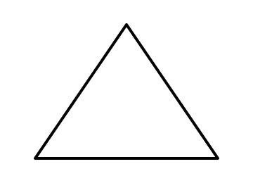
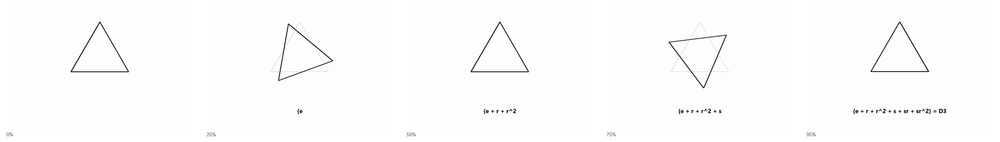
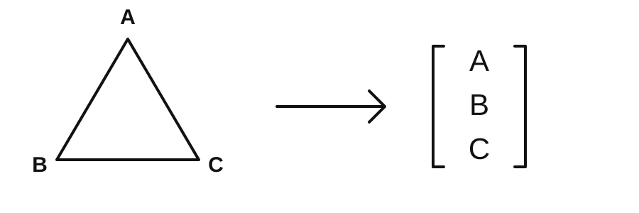
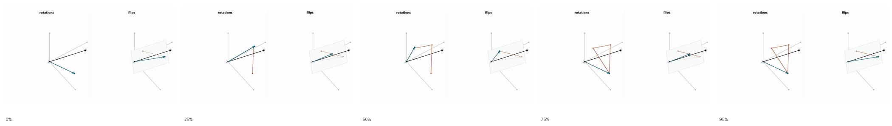
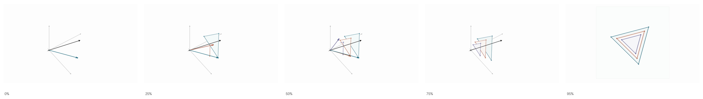

# Symmetry
Strike a pool ball with a cue, and the balls move in an expected way. Move the table over a few feet, and the balls move in recognizably the same way. Wait a few minutes, and the balls move in the same way. Turn the pool table a few degrees, and the balls still move the same way. Put the pool table on a train, and, again, the balls move in the same way. These are the manifest symmetries of the space we live in -- position and time translation, rotation, and velocity "boosts." The term "symmetry" in this context may not at first glance seem like the same concept as, say, a snowflake's symmetry, but it precisely is. We need to be like mathematicians and be very careful about definitions. Why should we take so much care about defining the elements of symmetry? The answer is that 

[?]
As we will see, our model of nature treats 'stuff' itself as an element of symmetry. Attributes of matter are see as values in a mathematical model of nature's symmetry. in This is an uncomfortable shift thet is  One cannot understand modern physics without understanding this vocabulary. It is best to start with simple examples.
[?]

, as we go farther in understanding fundamental physics, the abstractions we use from the math of symmetry are well understood, while the concrete objects those abstractions describe are elusive. We will become lost in a morass of abstract vocabulary if we do not have concrete examples to anchor our understanding.

## Discrete symmetries
Consider a triangle.

An equilateral triangle.

We can see its obvious symmetry. To categorize its symmetry we can write down all the actions that leave it unchanged. These are:
1. Do nothing
2. Rotate 120°
3. Rotate 240°
4. Flip along an axis
5. Flip then rotate 120°
6. Flip then rotate 240°

[Open MP4: symmetry-triangle-actions.mp4](animations/symmetry-triangle-actions.mp4)

We say the triangle "belongs to the $D_3$ symmetry **group**." The group is more general than the triangle itself. Any number of objects possess $D_3$ symmetry.

### Representations
What if we now want to track what a sequence of symmetry actions does to an object carrying the symmetry? For example, suppose we label the vertices \(A, B, C\) and ask, if we rotate twice, flip once, then rotate again, where is vertex \(A\) sent? Recognizing that the triangle's state has three ordered components, we might guess that we could represent the triangle as a three-dimensional vector, and we might then represent the 120° rotations as **transformations** on the vector space that permute the vertices in ways allowed by the symmetry group actions. Since the transformation that takes one vertex into another must also move the edges and interior of the triangle in a uniform way, the transformation must be linear, which means that it can be represented by matrix multiplication. We then say that a **representation** of a group is a vector space in which matrix multiplication composes in a way that mirrors the way group actions compose on a symmetric object.

To construct a 3-dimensional representation of $D_3$, we map the 3 vertices to elements of a vector.

What numerical values do we put in for the vector? The answer is, it does not matter. What matters is only that our transformation matrix permutes them properly. (Notice that in this construction, a transformation of $\begin{pmatrix}0\\0\\0\end{pmatrix}$ is just $\begin{pmatrix}0\\0\\0\end{pmatrix}$, ensuring the property that the origin remains fixed by linear transformations.) We can represent rotations and flips, respectively, with the following matrices:

Rotation:
$$
\begin{pmatrix}
0 & 0 & 1\\
1 & 0 & 0\\
0 & 1 & 0
\end{pmatrix}
$$

Flip:
$$
\begin{pmatrix}
1 & 0 & 0\\
0 & 0 & 1\\
0 & 1 & 0
\end{pmatrix}
$$

We can see how this works in practice:

$$
\begin{pmatrix}
0 & 0 & 1\\
1 & 0 & 0\\
0 & 1 & 0
\end{pmatrix}
\begin{pmatrix}
1\\
3\\
5
\end{pmatrix}
=
\begin{pmatrix}
5\\
1\\
3
\end{pmatrix}
$$

These actions have a nice and, as we will see in a moment, important visualization. Permutations that correspond to rotations of the triangle are 120-degree rotations about a diagonal axis in this vector space, while those that correspond to flips are flips about the plane that contains the diagonal axis.

[Open MP4: symmetry-d3-rotations-vs-flips.mp4](animations/symmetry-d3-rotations-vs-flips.mp4)

Now, notice something about these visualizations. All the transformations leave a given vector in its own plane. Additionally, if we subtract off the average of the vectors, that is, if we move the point where the plane intersects the axis of rotation to the origin, we preserve the permutation structure of the transformations. We thus see that the $D_3$ symmetry is just as well represented as 120-degree rotations in the subspace of a 2-dimensional plane.

[Open MP4: symmetry-d3-irrep-collapse.mp4](animations/symmetry-d3-irrep-collapse.mp4)

We also notice that vectors on the axis of rotation are taken by allowable transformations to themselves. Thus, just as any composition of transformations leaves the starting vector in a plane, for this subset of starting states, any composition leaves them on a line. A way to think of this is to allow the triangle's vertices to store some information, like a number or any numerical quantity. If the value they store is the same for all vertices, the symmetry actions have no effect, whereas if they are different, the actions permute those values in a way that can be represented in a 2-dimensional vector space. The 3-dimensional representation space we began with is thus decomposable into 2 subspaces. These cannot be decomposed further. That is, there is no lower-dimensional space such that an allowable transformation of any state remains in that space. The 1-dimensional and 2-dimensional representations are called **irreducible representations** or **irreps** for short. Why do we care about irreps? Because, in quantum physics, where states must carry the symmetry of nature, our models of those states are vectors in irreps. A "particle species," like an electron or photon, is an irrep of the symmetry, and the state of the particle -- what encodes our knowledge about its position, momentum, etc. -- is a vector in that representation space.

### Invariants
Once we have chosen a representation for a symmetry, we might well ask, how do we know our transformations preserve the symmetry? If we look at a triangle and rotate by 100 degrees we can "see" that doesn't preserve the symmetry. In a representation, we need some set of mathematical expressions that say "this transformation left the triangle the same." We call these the **invariants** of the transformation. 

In our 2-dimensional irrep of $D_3$, we only need to check how a transformation acts on a single vector. The question "does the triangle overlay itself" becomes "is an arbitrary vector rotated by 120 degrees or flipped along a given axis." Let's pick a specific example to make this more concrete:

Rotation:
$$
\begin{bmatrix}
-2.2\\
-0.1
\end{bmatrix}
=
\begin{bmatrix}
\cos(120^\circ) & -\sin(120^\circ)\\
\sin(120^\circ) & \cos(120^\circ)
\end{bmatrix}
\begin{bmatrix}
1\\
2
\end{bmatrix}
$$

Choosing the x-axis, flip:
$$
\begin{bmatrix}
1\\
-2
\end{bmatrix}
=
\begin{bmatrix}
1 & 0\\
0 & -1
\end{bmatrix}
\begin{bmatrix}
1\\
2
\end{bmatrix}
$$

These transformations have two invariants. First, because they are a subclass of rotations and flips generally, they leave the distance to the origin unchanged:

\(r^2=x^2+y^2\)

Then, to limit rotations to 120 degrees and flips to those about the three axes implied by an equilateral triangle, we have an additional invariant:

\(u=x^3-3xy^2\)

It's not hard to show this is the case using the example transformations above, but in the interest of not boring the reader, we will skip it. 

When we move on to deal with symmetries we encounter in physics, the invariants typically turn out to be simpler than this because the symmetries are less restrictive. Specifically, the invariants we will use are variations on the distance invariant above. 

In physics, invariants do more than provide a way to check that a transformation represents an element of a group action. Physics is about finding equations of motion that all observers separated by a symmetry transformation, that is, observers at different places, times, orientations, or velocities, agree on. A way to find these equations, as we will see later, is to build them from invariant quantities of the symmetry action.

## Continuous symmetries
What rotations return a circle to itself? All, of course! Similarly, what translations return a line to itself? This is bit funny because we have to take into account the infinite extent of the line. Allowing that, given that infinite extent, shifting a line leaves it unchanged, the answer is the same -- all translations preserve the symmetry. The symmetries in the physical world -- time and position translations, rotations, and velocity boosts -- are all such continuous symmetries. 

### juicy bits from previous go-around
1. A general principle of geometry is that everything is flat when you zoom in far enough. Since "infinitesimal" is fully zoomed in, such a rotation is "flat," that is, it is a tangent vector.
2. As every calculus student learns, the tangent vector of any function is the derivative of the function. Thus the tangent is ...
3. 
