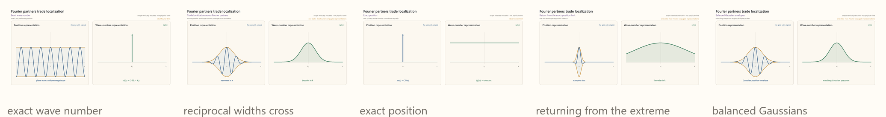
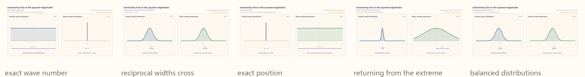

#### Canonical commutator
Once we have a \(wave\) function representation of translational symmetry, we may note that we can translate a function not only in the direction we set out to represent, $x$, but also in the wave number, $k$.


[Open MP4: symmetry-ccr-x-k-translations.mp4](../../content/drafts/animations/symmetry-ccr-x-k-translations.mp4)

Our representation reprepresents a larger symmetry group that includes translation in $k$. However, unlike independent translation directions, $x$ and $k$ translation do *not* commute. To see this, consider the action of traversing a finite loop in $x$-$k$ space. First, write a single mode in the $x$ representation:

```math
\psi_{k_0}(x)
=
e^{ik_0x}.
```

The same mode in the $k$ representation is:

```math
\widetilde\psi_{k_0}(k)
=
\sqrt{2\pi}\,\delta(k-k_0),
```

where $\delta$ means a unit-integral spike at $k_0$.

Define the $x$ translation operator in the $x$ representation:

```math
(T_x(a)\psi_{k_0})(x)
=
\psi_{k_0}(x-a).
```

Define the $k$ translation operator in the $k$ representation:

```math
(T_k(b)\widetilde\psi_{k_0})(k)
=
\widetilde\psi_{k_0}(k-b).
```

In order to carry out the translations, we have to choose either the position or wave number basis. Let's choose position:

```math
(T_k(b)\psi)(x)
=
\left(e^{ib\hat X}\psi\right)(x)
=
e^{ibx}\psi(x).
```
Here $T_x(a)$ shifts $x$ by $a$, while $T_k(b)$ shifts $k$ by $b$. Acting in the two possible orders,

```math
(T_x(a)T_k(b)\psi_k)(x)
=
e^{i(k+b)(x-a)},
```

but

```math
(T_k(b)T_x(a)\psi_k)(x)
=
e^{ibx}e^{ik(x-a)}.
```

Therefore

```math
T_x(a)T_k(b)\psi_k
=
e^{-iab}T_k(b)T_x(a)\psi_k,
```

so the two shifts fail to commute by the phase factor $e^{-iab}$, or simply, $e^{i\phi}$. Here $\phi$ is the phase angle, the parameter of phase transformations. 


[Open MP4: symmetry-ccr-loop-global-phase.mp4](../../content/drafts/animations/symmetry-ccr-loop-global-phase.mp4)

The phase transformation $e^{i\phi}I$ is obtained by exponentiating the generator $iI$. Therefore, the commutator is

```math
[\hat X,\hat K]
=
iI.
```

This commutator compactly expresses the Fourier structure we have discussed. A corollary of that structure is that we cannot know the position and the wave number of a wave simulataneously, for a pure mode extends to infinity in $x$ while a localized function in $x$ has equal components of modes of every $k$. 


This notion is evident in everyday accoustics in the way that a pure pitch, as that of a tuning fork, is hard to pinpoint in time or space, while a percussive clap has a poorly defined pitch. It is also the structural basis for the Heisenberg Uncertainty Principle, which is talked about in populate science as "quantum fuzziness."

To see this, we need to understand how the commutator, or the visual insight above, relates uncertaintity, or statistical spread, in $x$ and $k$. 

Let us impose the condition that the square of our wave function is $1$:

```math
\|\psi\|^2 = \int_{-\infty}^{\infty}|\psi(x)|^2\,dx=1.
```

This condition says that, if we want to treat the square of our wave function as a probability distribution of some set of outcomes, the total area of that square had better equal $1$ since it is the total probability of all such outcomes. But why would associate the square of a wave function with a probability distribution. The answer is that this is exactly what quantum mechanics does, where the square of a particles's wave function is the probability distribution either of that particle having a specific position, or of it having a specific wave number, depending on which basis we view the wave function in.


[talk about: where did momentum come from. It is the generator of physical translation rather than a dimensionless abstract translation]



*Fourier amplitudes.* A wavefunction and its Fourier transform sweep from exact wave number to exact position, then return to balanced Gaussian envelopes. The spikes and flat functions are ideal limits; vertical amplitudes are rescaled for legibility.

[Open MP4: symmetry-xk-fourier-amplitudes.mp4](../../content/drafts/animations/symmetry-xk-fourier-amplitudes.mp4)



*Squared magnitudes.* The corresponding position and wave-number distributions trade standard deviations $\Delta x$ and $\Delta k$, then return to equal Gaussian widths on reciprocal display scales. Every finite Gaussian pair shown satisfies $\Delta x\,\Delta k=\tfrac12$; the endpoint spikes are ideal limits.

[Open MP4: symmetry-xk-squared-magnitudes.mp4](../../content/drafts/animations/symmetry-xk-squared-magnitudes.mp4)
