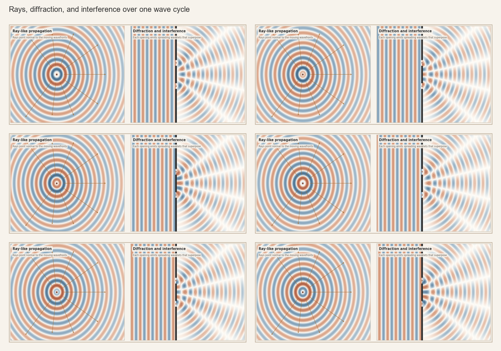
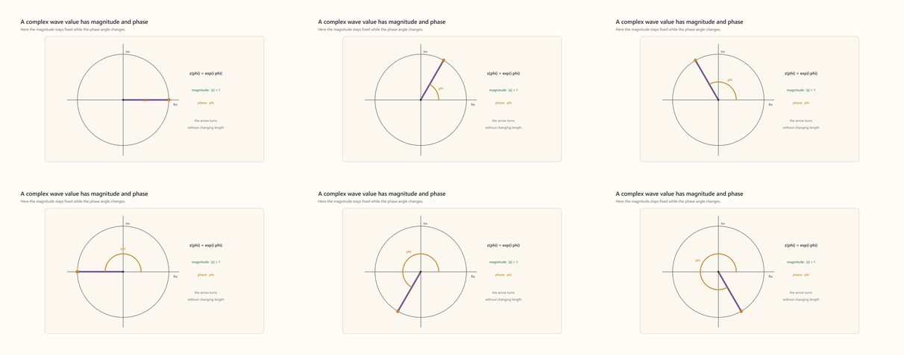
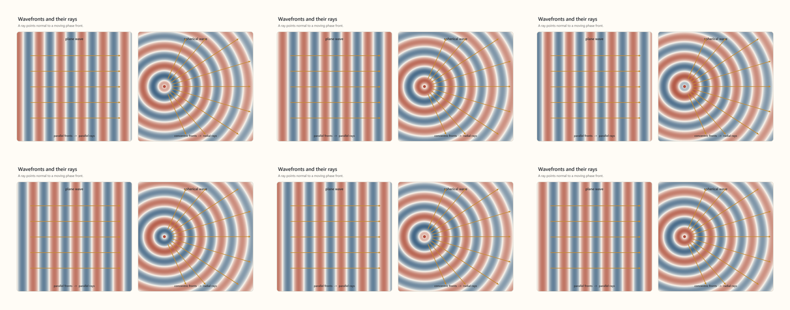
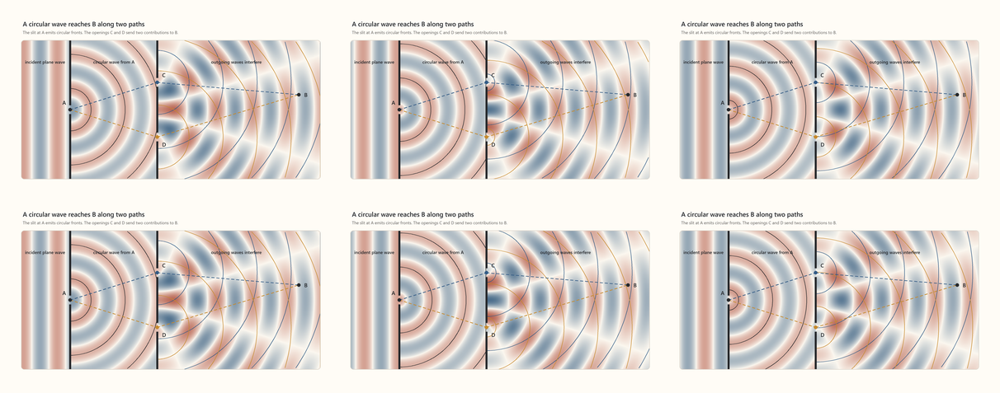
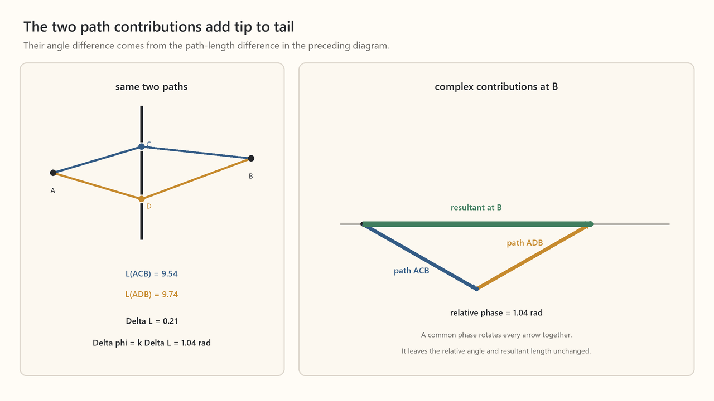
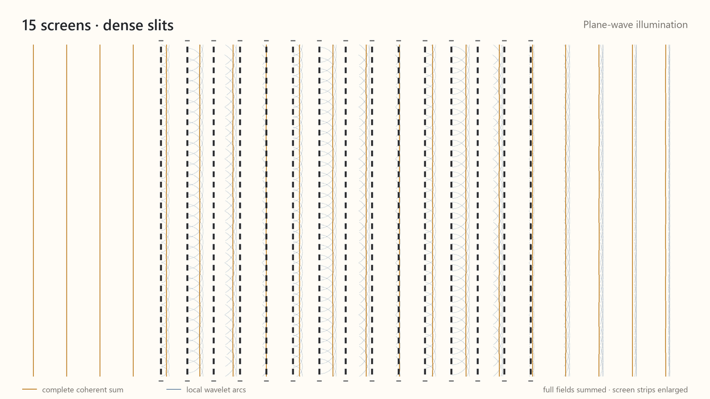

####  Wave Symmetry
Once we have a function representation of translational symmetry, we might be clever and notice that we can translate a function in wave number, $k$ just as well as we can in position, $x$. While shifting the wave number isn't a translation in the familiar physical space we live in, from a mathematical perspective, $k$-space is the dual, or equivalent up to role reversal, of $x$-space. If we want to understand the full symmetry group the wave function represents and the implications it has, we would be wise to take this observation seriously.


[Open MP4: symmetry-ccr-x-k-translations-symmetric.mp4](../../content/drafts/animations/symmetry-ccr-x-k-translations-symmetric.mp4)

By now, we know that a symmetry is defined by what it leaves invariant. We've seen that translations in $x$ leave the inner product of complex wave functions -- intuitively, their "overlap" -- unchanged. We noted that mathematicians call this invariance "unitarity." Translation in $k$-space shares this invariant.

```math
\begin{gathered}
\text{Translation by }a\text{ in }x\\[0.5em]
\langle T_x(a)\psi,T_x(a)\chi\rangle\\
=\langle\psi,\chi\rangle
\end{gathered}
\qquad
\begin{gathered}
\text{Translation by }b\text{ in }k\\[0.5em]
\langle T_k(b)\psi,T_k(b)\chi\rangle\\
=\langle\psi,\chi\rangle
\end{gathered}
```


[Open MP4: symmetry-ccr-unitarity.mp4](../../content/drafts/animations/symmetry-ccr-unitarity.mp4)


In addition to position and wave number, waves have a third independent way of changing. A wave's  **phase**, $\phi$, refers to where it is in its cyclic pattern. For example, a phase shift of $2\pi$, or one full "cycle," returns the wave to its exact initial state. We need to be a bit careful here. For a pure mode, shifting its position is indisguishable from shifting its phase, somewhat in the way the turning of a barbershop sign appears as though its stripes are moving up and down. We might, then, be tempted to think there is no difference between position and phase shifts. But the single mode is an idealization. In the general case, in which the wave function is a composition of modes, position translation shifts the entire function. Phase translation shifts each mode by the same fraction of its cycle, changing the function while leaving its magnitude envelope unchanged.


[Open MP4: symmetry-complex-phase-modes.mp4](../../content/drafts/animations/symmetry-complex-phase-modes.mp4)

We can also discover and define phase directly from our symmetry group's commutation relations, which gives us a very useful algebraic packaging of the group structure. Let's ask the question:

```math
[\hat X, \hat K] = \; ?
```

If the commutator is non-zero \(and linearly independent of  $\hat X$ and $\hat K$\), there must be a third kind of transformation to the complete symmetry group. To find the commutator, we follow the usual procedure of translating the function around a loop in $x$-$k$ space and asking if the function changes. If it does $?$ is nonzero, the commutator is the generator of that change, and the action will be identifiably that of a phase shift.

First, write a single mode in the $x$ and $k$ representations:

```math
\psi_{k_0}(x)
=
e^{ik_0x}.
```

```math
\begin{gathered}
\tilde{\psi}_{k_0}(k)=2\pi\,\delta(k-k_0),\\[0.5em]
\text{where }\delta\text{ is a spike at }k_0\text{ that integrates to }1.
\end{gathered}
```

Define the $x$ and $k$ translation operators in their respective representations:

```math
(T_x(a)\psi_{k_0})(x)
=
\psi_{k_0}(x-a).
```

```math
(T_k(b)\widetilde\psi_{k_0})(k)
=
\widetilde\psi_{k_0}(k-b).
```

Working in the position basis:

```math
(T_k(b)\psi)(x)
=
\left(e^{ib\hat X}\psi\right)(x)
=
e^{ibx}\psi(x).
```

$\hat X$ generates translation in $k$-space just as $\hat K$ generated translations in $x$-space. In $x$-space, it multiplies $\psi$ by $x$ as it weights each component of $\psi$ by its position coordinate.

We can construct a loop by first translating the function by $b$ in $k$ and by $a$ in $x$, then by $-b$ in $k$ and by $-a$ in $x$.

```math
(T_x(a)T_k(b)\psi_{k_0})(x)
=
e^{i(k_0+b)(x-a)},
```

```math
(T_k(b)T_x(a)\psi_{k_0})(x)
=
e^{ibx}e^{ik_0(x-a)}.
```

```math
\bigl(T_x(-a)T_k(-b)T_x(a)T_k(b)\psi_{k_0}\bigr)(x)
=
e^{-ib(x+a)}e^{i(k_0+b)x}
=
e^{-iab}\psi_{k_0}(x).
```

The two shifts fail to commute by the factor $e^{-iab}$. Writing $\phi=-ab$, the loop multiplies the function by $e^{i\phi}$. But this is precisely a phase shift, a rotation in the complex plane that “turns” the whole "spiral" of the wave function.

Phase translation, then, is a third translation symmetry, whose invariant is the inner product under its unitary action, rounding out the group of $x$, $k$, and phase translations coupled through Fourier structure:

```math
\langle T_x(a)\psi,T_x(a)\chi\rangle
=
\langle\psi,\chi\rangle.
```

```math
\langle T_k(b)\psi,T_k(b)\chi\rangle
=
\langle\psi,\chi\rangle.
```

```math
\langle T_\phi(\beta)\psi,T_\phi(\beta)\chi\rangle
=
\langle\psi,\chi\rangle.
```


[Open MP4: symmetry-ccr-loop-complex.mp4](../../content/drafts/animations/symmetry-ccr-loop-complex.mp4)

The infinitesimal closed $x$-$k$ loop is generated by $[\hat X,\hat K]$. Because the finite loop leaves a phase translation, and phase translations are generated by $iI$, we have:

```math
[\hat X,\hat K]
=
iI.
```

Before we close out here, a small amount of house cleaning is needed to keep the picky happy. First, we have not shown explicitly that changes in $\phi$ are linearly independent of change in $x$ and $k$. They are, as evidenced by the fact that shifts in $\phi$ can leave the wave function's position and wave number unchanged. We also did not show that there are *only* 3 generators in the group. This is done by showing that the generators close under commutation:

```math
[\hat X,\hat K]=i\hat\Phi,
\qquad
[\hat X,\hat\Phi]=[\hat K,\hat\Phi]=0.
```

#####  Position Wave Number Uncertainty
This commutation relation compactly expresses the Fourier structure we have discussed. A corollary of that structure is that a wave cannot have both a sharply defined position and a sharply defined wave number, for a pure mode extends to infinity in $x$ while a localized function in $x$ contains a broad range of $k$ modes.


[Open MP4: symmetry-xk-fourier-amplitudes.mp4](../../content/drafts/animations/symmetry-xk-fourier-amplitudes.mp4)

*Trading off localizability in position for localization in wave number*

This notion is evident in everyday acoustics in the way that a sustained pure pitch, such as that of a tuning fork, is spread through time, while a percussive clap has a poorly defined pitch.

It is also the structural basis for the Heisenberg uncertainty principle, which is alluded to in popular science as "quantum fuzziness."

In quantum mechanics, $|\psi(x)|^2$ is the probability density for position, while $|\widetilde\psi(k)|^2$ is the probability density for wave number. These are two representations of the same state.

Set the wave's mean position and mean wave number at $x=0$ and $k=0$.

Now we can say what we mean by "uncertainty," $\Delta x$. Note that this is exactly the same definition as the "standard deviation" more commonly used in statistics.

```math
(\Delta x)^2
=
(\sigma_x)^2
=
\int_{-\infty}^{\infty}x^2|\psi(x)|^2\,dx.
```

The same definition applies to $\Delta k$.

Since $|\psi(x)|^2$ is a measure of likelihood and $x^2$ is the squared distance from the center, the integral is a weighted sum of the squared distances from the center. We don't need to belabor this point, it is standard statistics.

Using this definition of uncertainty along with the commutation relation

```math
[\hat X,\hat K]=iI,
```

one can show the wave version of the uncertainty relation:

```math
\Delta x\,\Delta k\ge\frac12.
```

This derivation is quite involved, but we can get the gist of it simply by showing the tradeoff between position precision and wave-number precision in an animation of the squared magnitude of the wave function.


[Open MP4: symmetry-xk-squared-magnitudes.mp4](../../content/drafts/animations/symmetry-xk-squared-magnitudes.mp4)

*Trade-off in uncertainty of position and wave number*

##### Phase Stationarity
We have an intuitive sense that a travelling wave can be can be thought of as a ray. But we also know this isn't always the case, a wave can bend around and object, or passing through an aperture, it reemerges as a new sperical wave. 



[Open MP4: symmetry-rays-and-double-slit.mp4](../../content/drafts/animations/symmetry-rays-and-double-slit.mp4)

We are going to dive into how these different behaviors are related, not out of specific interest in real-world waves in media, but because, remarkably, the reasoning we use to show that free wave propagation tends toward ray-like behavior is precisely the same reasoning we will use later to derive the laws of motion for any body.

Thus far we have described a wave as having a single translation direction $x$ and wave number, $k$. If the wave is to travel, though, we also require the wave to represent time translation. Time translation must commute with spatial translation, for otherwise, it would change the mode composition over time, and spatial translation would then not be a symmetry of nature. It's worth pointing out here that there are two different ways to picture time parameterization. We can picture a "movie" a wave travelling down a 1-dimensional string, or we can imagine a still diagram in $x$-$t$ space. The former is closer to our experience, but the formalism maps to the latter. With that in mind, we can see that a travelling, sigle-mode wave is given by:

```math
e^{i\left[kx-\omega t\right]}.
```

$\omega$ is commonly called angular **frequency**, even though structurally it is wave number in a different translation direction.

We need to be a bit careful here to remember that we are thinking here of complex waves. As a free plane wave mode travels, unlike a sinusoidal wave, the magnitude is constant and the change in value comes from the change in phase:

```math
\Psi=M_0 e^{i\phi}
```



[Open MP4: symmetry-complex-phasor-rotation.mp4](../../content/drafts/animations/symmetry-complex-phasor-rotation.mp4)

Now, let us ask the question what it means for a wave to travel from one point A to another point B. For simple free waves, the answer is obvious -- it is simply the rays we illustrated above that are perpendicular to the level sets of phase. In the case of a plane wave, the ray through A continues in one direction. In the case of a spherical wave, rays from A extend in every radial direction.



[Open MP4: symmetry-plane-and-spherical-wave-rays.mp4](../../content/drafts/animations/symmetry-plane-and-spherical-wave-rays.mp4)

We place a source at A. When the single-wave-number wave emitted from it reaches the screen the only rays emanating from A that can pass through are at C and D. We therefore have two candidate paths from A to B, ACB and ADB.



[Open MP4: symmetry-double-slit-candidate-paths.mp4](../../content/drafts/animations/symmetry-double-slit-candidate-paths.mp4)

The wave at a point can receive contributions along multiple paths. Knowing the possible paths, how do we calculate the wave's value at B given its source value at A? Along any radial segment, the phase advances as:

```math
\Delta\phi
=
k\,\Delta\ell
-
\omega\,\Delta t,
```

where $\Delta\ell$ is distance along the ray. We can use this relationship to calculate the phase accumulation along any one segment. In the arrangement we are considering, the segments combine into two candidate paths from A to B: AC followed by CB, and AD followed by DB. Because we compare their contributions at B at the same observation time, their time-dependent phase is the same, so we need only track their path-dependent spatial phases. Let $\ell_{AC}$ be the length of segment AC, and likewise for the other segments. The phase advances are:

```math
\begin{aligned}
\phi_{AC}&=k\ell_{AC},
&
\phi_{CB}&=k\ell_{CB},
\\
\phi_{AD}&=k\ell_{AD},
&
\phi_{DB}&=k\ell_{DB}.
\end{aligned}
```

Because multiplying phase factors adds the angles in their exponents, we can simply add these contributions to calculate the total phase advance along ACB and ADB.

But what, then is the amplitude at B? Let $\phi_0$ include the original phase at A and the temporal phase advance common to both paths. Along each path we add the path-dependent phase advance:

```math
\begin{aligned}
\Phi_{ACB}
&=
\phi_0+\phi_{AC}+\phi_{CB}
=
\phi_0+k(\ell_{AC}+\ell_{CB}),
\\
\Phi_{ADB}
&=
\phi_0+\phi_{AD}+\phi_{DB}
=
\phi_0+k(\ell_{AD}+\ell_{DB}).
\end{aligned}
```

What have we computed? It is the phase of the wave contribution arriving at B along each path. What then is the total amplitude at B? It is just the sum of the two contributions arriving there. This is the principle of superposition, which is just the very intuitive idea that wave values add. Let $M_{ACB}$ and $M_{ADB}$ denote the magnitudes of the two path contributions. We can now calculate the value of $\Psi$ at B from its value at A:

```math
\Psi_{ACB}(B)
=
M_{ACB}
e^{i(\phi_0+\phi_{AC}+\phi_{CB})}.
```

```math
\Psi_{ADB}(B)
=
M_{ADB}
e^{i(\phi_0+\phi_{AD}+\phi_{DB})}.
```

The two contributions add at \(B\):

```math
\Psi_B
=
M_{ACB}
e^{i(\phi_0+\phi_{AC}+\phi_{CB})}
+
M_{ADB}
e^{i(\phi_0+\phi_{AD}+\phi_{DB})}.
```

We can plot the contribution from each path ACB and ADB in the complex plane, showing their sum by drawing them tip-to-tail. The vector from the beginning of the first arrow to the end of the second is the amplitude at B, that is its length is the magnitude at B and its angle is the phase at B.



Now let's see what happens when we add many more slits.


[Open MP4: symmetry-many-slit-paths-phasors-interference.mp4](../../content/drafts/animations/symmetry-many-slit-paths-phasors-interference.mp4)

As the path deviates more from a straight, minimum length path, it has a greater first-order change in phase. \(This is the common result from calculus that near a function's minimum, there is no change to the value of the function in the first order of the argument\). When the candidate paths are far from the stationary value their phases vary greatly, effectively cancelling out their contributions to the total sum. On the other hand, the phases of the paths near the stationary path align and dominate the sum. The yellow line in the tip-to-tail pane of the animation shows the sum of each of these contributions and thus gives value of A relative to B. The resulting intensity on the projection screen is the square of this magnitude.

We can extend this procedure to its limit and include infinitely many screens with infinitely many slits, and when doing so, recover a plane wave. The construction, which will be our bridge to a formulation of quantum mechanics, was articulated by Huygens in the late 1600s!



[Open MP4: symmetry-schematic-screens-v3.mp4](../../content/drafts/animations/symmetry-schematic-screens-v3.mp4)

Summing phase advances along infinite paths between point sources is equivalent to globally propagating a wave front. 

Let us ask. What happens when we vary the wavelength relative to the slit? As the wavelength becomes small, even a slight change in path length can produce a large phase change:

```math
\phi=\frac{2\pi L}{\lambda}=2\pi n+\theta,
\qquad 0\leq\theta<2\pi
```

Away from a stationary path, the phase winds through many cycles over a small range of paths, leaving a more or less random phase remainder so that the contribution from these paths cancel, and only paths near the stationary combine to contribute to the sum. 


[Open MP4: symmetry-phase-remainder-spinners.mp4](../../content/drafts/animations/symmetry-phase-remainder-spinners.mp4)

In this regimes, as waves pass through slits, they behave purely as rays, just as if you through a ball from one point through a hole, it could only hit the projection screen in one spot.


[Open MP4: symmetry-spectrum-path-diamond-wavelength-scan.mp4](../../content/drafts/animations/symmetry-spectrum-path-diamond-wavelength-scan.mp4)

##### From Wave Mechanics to Quantum Mechanics
The Fourier structure itself and the relation $\Delta x\,\Delta k\ge\frac12.$ says nothing about behavior in the real world, it is a mathematical abstraction. If we are to use this abstraction to describe the physical world, $x$ and $k$ must be associated with something we can measure, some physical dimension. To apply the Fourier structure to physics two things must be done. First, we assign $x$ the dimension of length \(or time for time translation\). Second, we need a scale that converts the dimensionless phase, encoded by the commutator, into a quantity with physical dimensions. Why? Because, as we will see, the idea of stationarity we discussed above will allow us to find laws of physical evolution, and we must be able to construct the quantity under which different candidate histories are stationary from physical observables.

But we are getting ahead of ourselves -- why should we want to apply the mathematical structure of wave propagation to formulating the laws of physics generally. The answer comes from quantum mechanics \(which is our current working model\). Physics is about saying how systems evolve over time. In quantum mechanics, there is no concept of objects with definite positions and velocities, only a probabilistic distribution over such "observables." But this distribution is given as the square of a wave function, which can be expressed either in position -- $x$ in our Fourier discussion -- or in what we will call momentum -- proportional to $k$ in our Fourier discussion. Note that what was was wave intensity \(the square of the complex magnitude\) is now the *probability* of measuring a point-like object at a particular position or momentum. What evolves over time is not the an object moving through space, but the wave function that encodes this distribution. Therefore, our entire discussion of phase stationariy can be precisely apporpriated for mechanical systems. The link we must discover is how to scale $phi$ to a quantity contructed from physical observables. We will call this quantity **action**, $S$. 

For a candidate history $\gamma$, quantum mechanics gives action the form:

```math
S[\gamma]=\hbar\phi[\gamma],
```

Via the structure of the $[\hat X,\hat K] = iI$ commutation relation, whatever scales $phi$ to action will also scale $k$ to the generator of translations in $x$, which we call **momentum**, $p$.

```math
[\hat X,\hat K]=iI
\;\xrightarrow{\times\hbar}\;
[\hat X,\hbar\hat K]=i\hbar I
\;\xrightarrow{\hat P=\hbar\hat K}\;
[\hat X,\hat P]=i\hbar I
```

This is called the quantum **canonical commutation relation**

Recall the $x$ and $p$ are the eigenvalues of the $\hat X$ and $\hat P$ operators respectively acting on the wave function. We then have:

```math
\Delta x\,\Delta k\ge\frac{1}{2}
\;\xrightarrow{\Delta p=\hbar\Delta k}\;
\Delta x\,\Delta p\ge\frac{\hbar}{2}
```

This is the Heisenberg uncertainty relation, which states that a quantum state cannot have perfectly sharp values of both position and momentum. $\hbar\approx1.055\times10^{-34}\,\mathrm{J\,s}$ is insanely tiny on the scale of everyday action, but governs the world of tiny scales.

The canonical commutation relation, along with the definitions of \(\hat X\) and \(\hat P\), is also sufficient to serve as a starting point from which to derive quantum theory’s general law of motion.

In the limit of the short wavelength, which is tantamount to large momentum or, more intuitively, to large mass or simply being "macroscopic," the stationary path dominates, and we may say \(to an approximation that is so accurate that we can effectively treat is as an identity\) that an object only follows the path that we say abides the "laws of motion." Thus, from symmetry considerations and the tiny value of $\hbar$, we have a procedure with which to derive the derive the laws of motion, up to externally imposed constraints, which will discuss in later chapters.
