####  Wave Symmetry
Once we have a function representation of translational symmetry, we might be clever and notice that we can translate a function in wave number, $k$, just as well as we can in position, $x$. While shifting the wave number isn't a translation in the familiar physical space we live in, from a mathematical perspective, $k$-space is the dual, or equivalent up to role reversal, of $x$-space. If we want to understand the group generated by these translations and the implications it has, we would be wise to take this observation seriously.

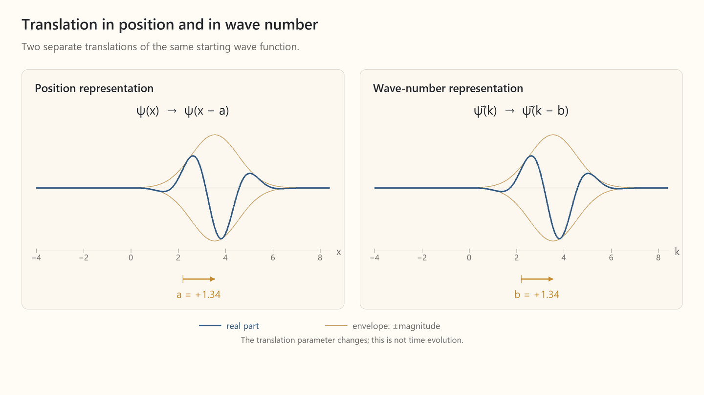

[Open MP4: symmetry-ccr-x-k-translations-symmetric.mp4](../../content/drafts/animations/symmetry-ccr-x-k-translations-symmetric.mp4)

*Wave Packet translated in position and momentum space*

By now, we know that a symmetry is defined by what it leaves invariant. We've seen that translations in $x$ leave the inner product of complex wave functions -- intuitively, their "overlap" -- unchanged. We noted that mathematicians call this invariance "unitarity." Translation in $k$-space shares this invariant.

```math
\begin{gathered}
\text{Translation by }a\text{ in }x\\[0.5em]
\langle T_x(a)\psi,T_x(a)\chi\rangle\\
=\langle\psi,\chi\rangle
\end{gathered}
\qquad
\begin{gathered}
\text{Translation by }b\text{ in }k\\[0.5em]
\langle T_k(b)\psi,T_k(b)\chi\rangle\\
=\langle\psi,\chi\rangle
\end{gathered}
```

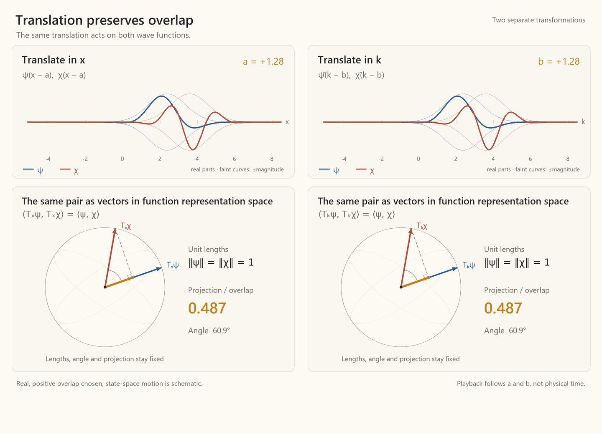

[Open MP4: symmetry-ccr-unitarity.mp4](../../content/drafts/animations/symmetry-ccr-unitarity.mp4)

*Unitarity of position and wave-number translations*

In addition to position and wave number, waves have a third independent way of changing. A wave's **phase**, $\phi$, refers to where it is in its cyclic pattern. For example, a phase shift of $2\pi$, or one full "cycle," returns the wave to its exact initial state. We need to be a bit careful here. For a pure mode, shifting its position is indistinguishable from shifting its phase, somewhat in the way the turning of a barbershop sign appears as though its stripes are moving up and down. We might, then, be tempted to think there is no difference between position and phase shifts. But the single mode is an idealization. In the general case, in which the wave function is a packet composed of modes, position translation shifts the entire function. Phase translation shifts each mode by the same fraction of its cycle, changing the function while leaving its magnitude envelope unchanged.

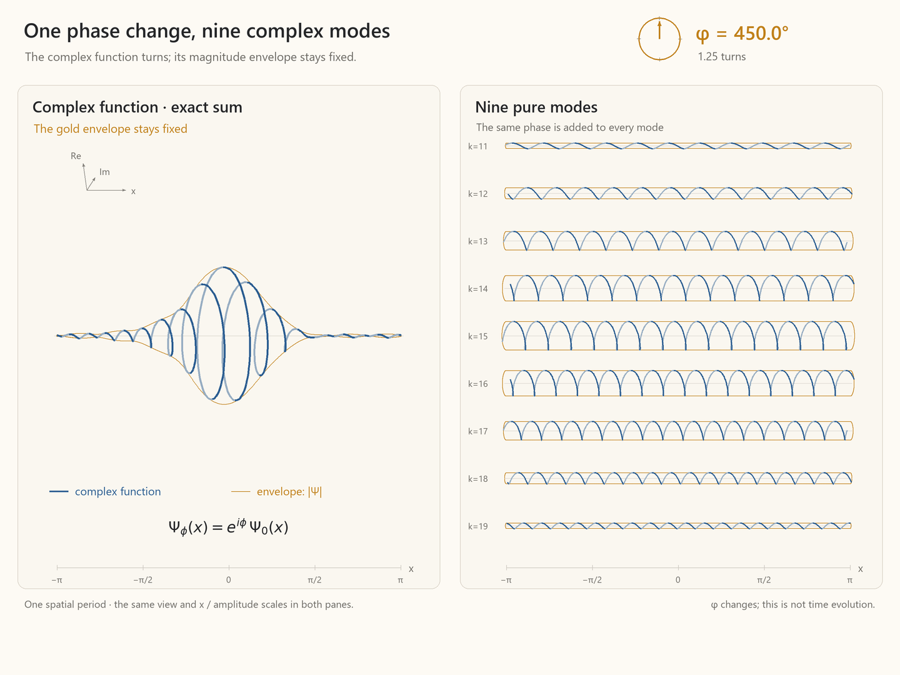

[Open MP4: symmetry-complex-phase-modes.mp4](../../content/drafts/animations/symmetry-complex-phase-modes.mp4)

*Visualizing Phase Change*

We can also discover and define phase directly from our symmetry group's commutation relations, which gives us a useful algebraic packaging of the group structure. Let's ask the question:

```math
[\hat X, \hat K] = \; ?
```

If the commutator is non-zero (and linearly independent of $\hat X$ and $\hat K$), there must be a third kind of transformation in the complete symmetry group. To find the commutator, we follow the usual procedure of translating the function around a loop in $x$-$k$ space and asking if the function changes. If it does, $?$ is nonzero, the commutator is the generator of that change, and the action will be identifiably that of a phase shift.

First, write a single mode in the $x$ and $k$ representations:

```math
\psi_{k_0}(x)
=
e^{ik_0x}.
```

```math
\begin{gathered}
\tilde{\psi}_{k_0}(k)=2\pi\,\delta(k-k_0),\\[0.5em]
\text{where }\delta\text{ is a spike at }k_0\text{ that integrates to }1.
\end{gathered}
```

Define the $x$ and $k$ translation operators in their respective representations:

```math
(T_x(a)\psi_{k_0})(x)
=
\psi_{k_0}(x-a).
```

```math
(T_k(b)\widetilde\psi_{k_0})(k)
=
\widetilde\psi_{k_0}(k-b).
```

Working in the position basis:

```math
(T_k(b)\psi)(x)
=
\left(e^{ib\hat X}\psi\right)(x)
=
e^{ibx}\psi(x).
```

$\hat X$ generates translation in $k$-space just as $\hat K$ generated translations in $x$-space. In $x$-space, it multiplies $\psi$ by $x$ as it weights each component of $\psi$ by its position coordinate.

We can construct a loop by first translating the function by $b$ in $k$ and by $a$ in $x$, then by $-b$ in $k$ and by $-a$ in $x$.

```math
(T_x(a)T_k(b)\psi_{k_0})(x)
=
e^{i(k_0+b)(x-a)},
```

```math
(T_k(b)T_x(a)\psi_{k_0})(x)
=
e^{ibx}e^{ik_0(x-a)}.
```

```math
\bigl(T_x(-a)T_k(-b)T_x(a)T_k(b)\psi_{k_0}\bigr)(x)
=
e^{-ib(x+a)}e^{i(k_0+b)x}
=
e^{-iab}\psi_{k_0}(x).
```

The two shifts fail to commute by the factor $e^{-iab}$. Writing $\phi=-ab$, the loop multiplies the function by $e^{i\phi}$. But this is precisely a phase shift, a rotation in the complex plane that “turns” the whole "spiral" of the wave function.

Because this factor is independent of $k_0$, the same phase shift applies to every mode in a superposition.

Phase translation, then, is a third translation symmetry, whose invariant is the inner product under its unitary action, rounding out the group of $x$, $k$, and $\phi$ coupled through Fourier structure:

```math
\langle T_x(a)\psi,T_x(a)\chi\rangle
=
\langle\psi,\chi\rangle.
```

```math
\langle T_k(b)\psi,T_k(b)\chi\rangle
=
\langle\psi,\chi\rangle.
```

```math
\langle T_\phi(\beta)\psi,T_\phi(\beta)\chi\rangle
=
\langle\psi,\chi\rangle.
```

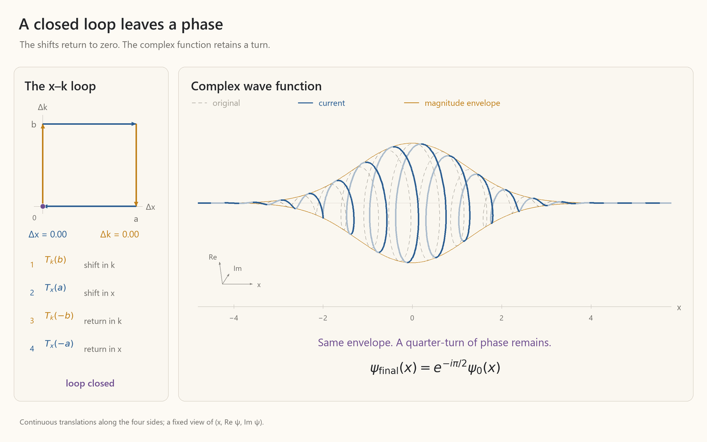

[Open MP4: symmetry-ccr-loop-complex.mp4](../../content/drafts/animations/symmetry-ccr-loop-complex.mp4)

*Phase as the $[\hat X,\hat K]$ commutator*

The infinitesimal closed $x$-$k$ loop is generated by $[\hat X,\hat K]$. Because the finite loop leaves a phase translation, and phase translations are generated by $iI$, we have:

```math
[\hat X,\hat K]
=
iI.
```

Mathematicians love to name groups. Just as we have encountered $D_3$ and $SO(2)$, our new group has a name, the three-dimensional Heisenberg group, or $H_3$. With $n$ spatial dimensions, the group has $2n+1$ dimensions, where the $+1$ is due to the fact that there is only one phase regardless of the number of spatial dimensions.

Before we close out here, a small amount of house cleaning is needed. First, we have not shown explicitly that changes in $\phi$ are linearly independent of changes in $x$ and $k$. They are, as evidenced by the fact that shifts in $\phi$ can leave the wave function's position and wave number unchanged. We also did not show that there are *only* 3 generators in $H_3$. This is done by showing that the generators close under commutation:

```math
[\hat X,\hat K]=iI,
\qquad
[\hat X,I]=[\hat K,I]=0.
```

#####  Position / Wave Number Uncertainty
As we know, a single-mode wave function has a single wave number. But what position does it have? There is no way to answer this as the wave is uniform over all position space. The same statement holds in reverse. A wave packet ideally localized at one position is uniform over all $k$-space. Anywhere in between these extremes, as a wave packet is more localized in one space, it is more spread out in the dual space. 

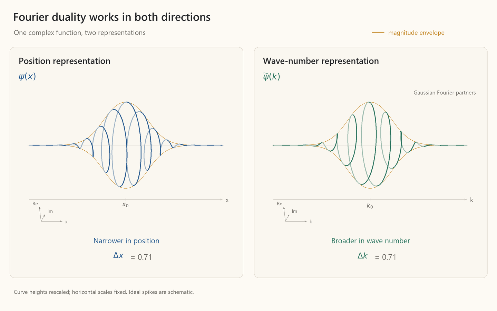

[Open MP4: symmetry-xk-fourier-complex.mp4](../../content/drafts/animations/symmetry-xk-fourier-complex.mp4)

*Trading off spread in position for spread in wave number*

We can easily see this relationship drawn on paper, but we also hear it in music. The precise pitch of a tuning fork requires long sustain, while the percussive clap of a clave has no clear pitch. This tradeoff is the root of the Heisenberg uncertainty principle, or what is known in popular science as "quantum fuzziness."

With this visual understanding of the tradeoff in the spread of the magnitude envelopes in $x$ and $k$ space, we can define the corresponding statistical standard deviation, or uncertainty, in position and wave number.

For simplicity, set the wave's mean position and wave number at their respective origins. Then:

```math
(\sigma_x)^2
=
\int_{-\infty}^{\infty}x^2|\psi(x)|^2\,dx,
```

and likewise for $\sigma_k$.

$\sigma^2$ is a probability-weighted average of squared distances from the distribution’s center. This is the textbook definition of variance.

From the commutation relation

```math
[\hat X,\hat K]=iI,
```

one can derive the position/wave-number "uncertainty relation":

```math
\Delta x\,\Delta k\ge\frac12.
```
This derivation is rather involved, but we can get a feel for the result by plotting the squared magnitude of a wave function and labelling the standard deviation.


[Open MP4: symmetry-xk-squared-magnitudes.mp4](../../content/drafts/animations/symmetry-xk-squared-magnitudes.mp4)

*Trade-off in uncertainty of position and wave number*

##### Wave Propagation and Interference
Everyone who has taken a high-school physics class knows that given a particular setup, the laws of motion tell us the path an object follows. For example, under constant acceleration:

```math
x = x_0 + v_0t + \frac{1}{2}at^2
```

Such "physically valid" paths in the macroscopic world have a fascinating quality that can be leveraged to find the laws of motion that predict them. They are such that some quantity associated with possible paths, which is called **action**, is minimized or otherwise held **stationary** at the valid path. Waves are not paths. There is no "object" to travel along a path. Rather, there is an amplitude at all locations in space. We will outline a procedure for finding these amplitudes, and with it, we will show what we already know intuitively, that a wave with a wavelength that is much smaller than an opening it passes through behaves like a "ray." We will see that in that limit, the "path" minimizes the accumulated phase along the path. This may make us wonder if a wave that acts like a ray is somehow physically equivalent to a rigid object following a path. Enter quantum mechanics. It calculates measurement probabilities not by assigning objects definite paths, but by equating a wave function's intensity to those probabilities. In the classical regime where our everyday sense of scale resides, the quantum wave function has a tiny wavelength, and all the probability falls on a single path that extremizes the wave function's phase.

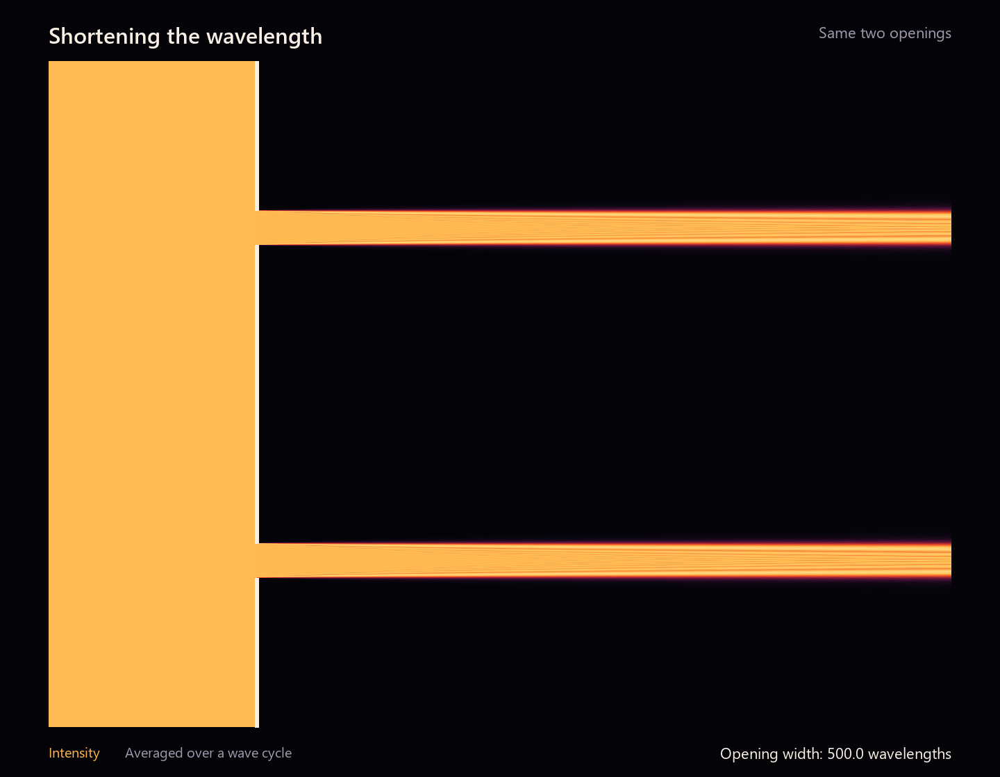

[Open MP4: symmetry-short-wave-beams.mp4](../../content/drafts/animations/symmetry-short-wave-beams.mp4)

*Interference and Rays*

Thus far we have described the symmetry group of a wave with a single translation direction $x$ and wave number, $k$. If the wave is to propagate, we also require that the wave represent time translation. We also need to require that time translation commute with spatial translation, for otherwise, it would change the mode composition over time, and spatial translation would no longer be a symmetry of nature. A single-mode travelling wave is then given by:

```math
M_0e^{i\left[kx-\omega t\right]}.
```

Because time is special, $\omega$ is called (angular) **frequency**, not wave number, but from a mathematical perspective, it is just another wave number.

Let us now ask the question: how do we find the amplitude at some point $B$ from some initial state of a wave? To do this, we can decompose the contributions into those from individual paths, starting with a very simple model. First, let's construct a point source of single-mode spherical waves emanating from $A$. Then let's add a barrier with two slits through which the wave can pass, $C$ and $D$. This setup allows us to calculate the amplitude at $B$ by combining only the amplitudes associated with the two paths $ACB$ and $ADB$.

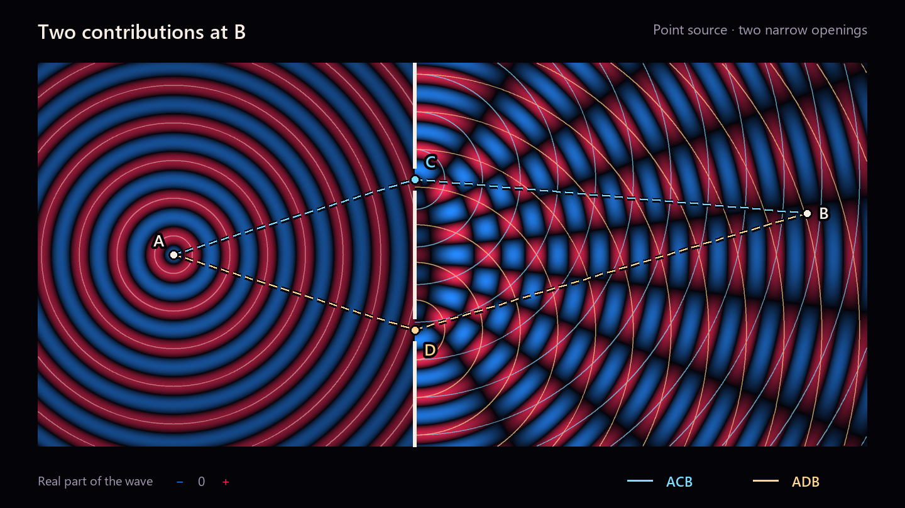

[Open MP4: symmetry-double-slit-candidate-paths-shortwave-arcs.mp4](../../content/drafts/animations/symmetry-double-slit-candidate-paths-shortwave-arcs.mp4)

*Two Path Interference*

First, let's figure out how any one straight segment of a plane wave contributes to the amplitude at its endpoint. From:

```math
e^{i\left[kx-\omega t\right]}.
```

we can identify that:

```math
\Delta\phi
=
k\,\Delta\ell
-
\omega\,\Delta t,
```

where $\Delta\ell$ is distance along the ray. In our setup, the segments combine into two candidate paths from $A$ to $B$:

```math
A \to C \to B
\qquad\text{and}\qquad
A \to D \to B.
```

We can now ask how each path contributes to the amplitude at $B$. The magnitude simply falls off as $1/r$ in accordance with spherical geometry. Also, since all contributions arrive at $B$ at the same observation time, their time-dependent phase is the same. The remaining things to calculate are their path-dependent spatial phases. Let $\ell_{AC}$ be the length of segment $AC$, and likewise for the other segments. The phase advances are:

```math
\begin{aligned}
\phi_{AC}&=k\ell_{AC},
&
\phi_{CB}&=k\ell_{CB},
\\
\phi_{AD}&=k\ell_{AD},
&
\phi_{DB}&=k\ell_{DB}.
\end{aligned}
```

To transform the wave function along the path, we compose, or multiply, the phase actions. Because multiplying phase factors adds the angles in their exponents, we can simply add the phase angle contributions to calculate the total phase advance along $ACB$ and $ADB$, respectively. Letting $\phi_0$ include the original phase at $A$ and the temporal phase advance common to both paths, we have:

```math
\begin{aligned}
\Phi_{ACB}
&=
\phi_0+\phi_{AC}+\phi_{CB}
=
\phi_0+k(\ell_{AC}+\ell_{CB}),
\\
\Phi_{ADB}
&=
\phi_0+\phi_{AD}+\phi_{DB}
=
\phi_0+k(\ell_{AD}+\ell_{DB}).
\end{aligned}
```

If we let $M_{ACB}$ and $M_{ADB}$ denote the magnitudes of the two path contributions, we then have the total contributions of each path at $B$:

```math
\Psi_{ACB}(B)
=
M_{ACB}
e^{i(\phi_0+\phi_{AC}+\phi_{CB})}.
```

```math
\Psi_{ADB}(B)
=
M_{ADB}
e^{i(\phi_0+\phi_{AD}+\phi_{DB})}.
```

What then is the total amplitude at $B$? It is just the sum of the two contributions arriving there. This is the principle of superposition which manifests visually as interference:

```math
\Psi_B
=
M_{ACB}
e^{i(\phi_0+\phi_{AC}+\phi_{CB})}
+
M_{ADB}
e^{i(\phi_0+\phi_{AD}+\phi_{DB})}.
```

We can plot the contribution from each path $ACB$ and $ADB$ in the complex plane, showing their sum by drawing them tip-to-tail. The vector from the beginning of the first arrow to the end of the second is the amplitude at $B$. Its length is the magnitude at $B$ and its angle is the phase at $B$.

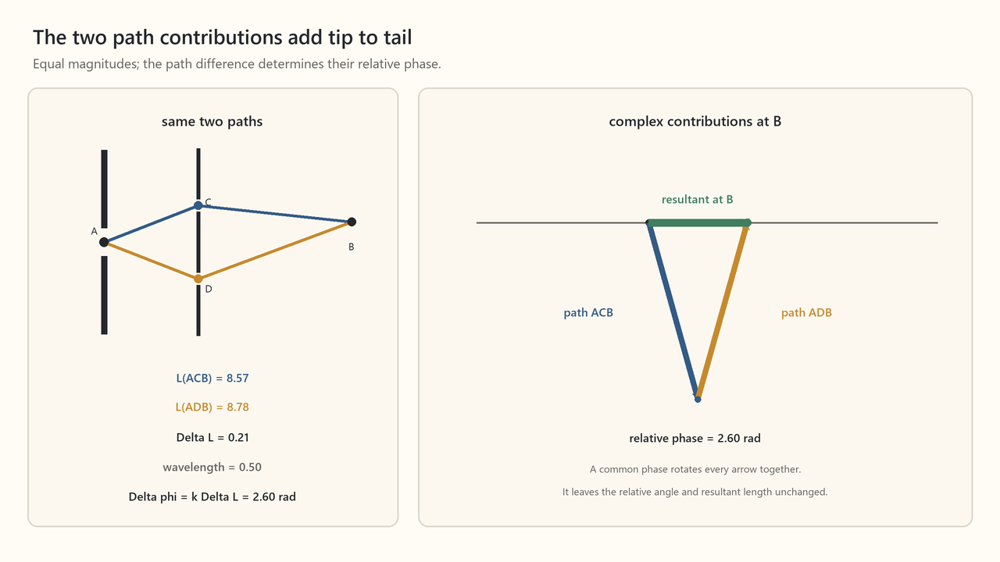

*Amplitude at $B$ is the sum of contributions from $ACB$ and $ADB$*

We can repeat the same procedure with many more paths. As the path deviates more from a straight, minimum length path, it has a greater first-order change in phase. (This is the common result from calculus that near a function's minimum, there is no change to the value of the function in the first order of the argument.) When the candidate paths are far from the stationary value, their phases vary greatly, effectively cancelling out their contributions to the total sum. On the other hand, the phases of the paths near the stationary path align and dominate the sum. The green line in the tip-to-tail pane of the animation shows the sum of each of these contributions, giving the amplitude at $B$. The resulting intensity on the projection screen is the square of this magnitude.

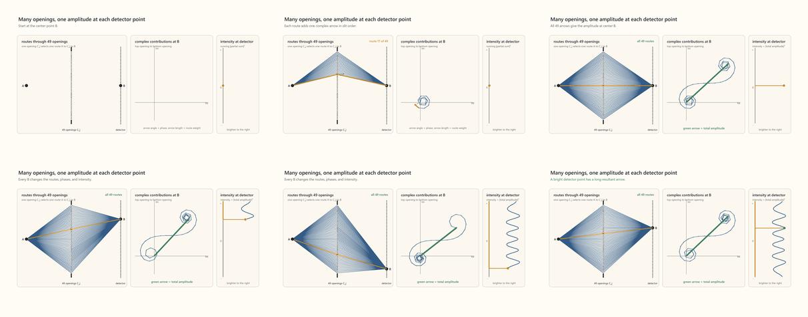

[Open MP4: symmetry-many-slit-paths-phasors-interference.mp4](../../content/drafts/animations/symmetry-many-slit-paths-phasors-interference.mp4)

*Seeing stationarity emerge in closely spaced paths*

We can extend this procedure to its limit and include infinitely many screens with infinitely many slits, and recover unobstructed propagation. In the following animation, we start with a plane wave and recover that same wave. This construction, which is the bridge to the so-called Feynman path integral formulation of quantum mechanics, was articulated by Huygens in the late 1600s!

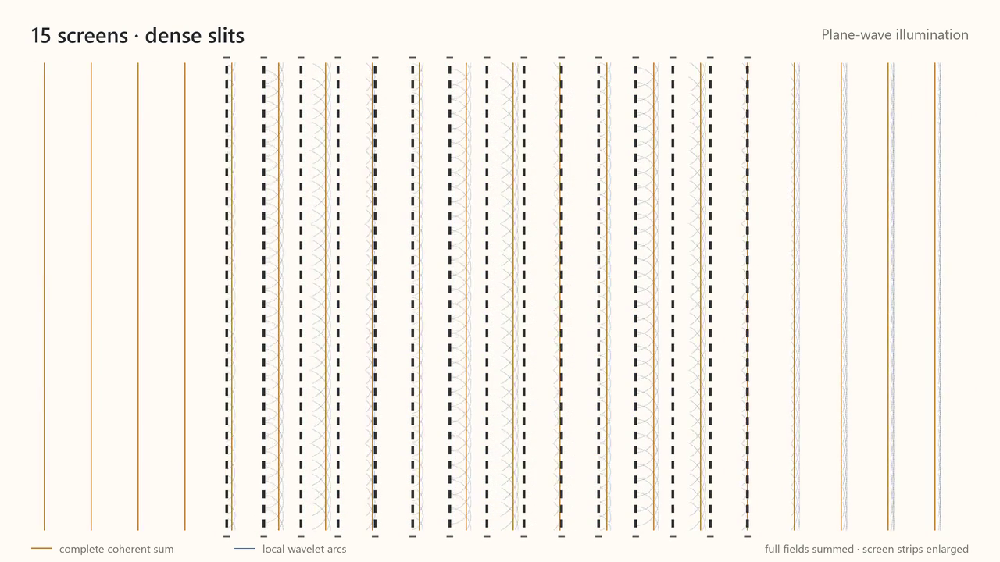

[Open MP4: symmetry-schematic-screens-v3-concise.mp4](../../content/drafts/animations/symmetry-schematic-screens-v3-concise.mp4)

*Huygens' Principle*

Let us now ask one more question. What happens to our tip-to-tail diagram of the path contributions when we vary the wavelength relative to the slit? As the wavelength becomes small, even a slight change in path length can produce a large phase change:

```math
\phi=\frac{2\pi L}{\lambda}=2\pi n+\theta,
\qquad 0\leq\theta<2\pi
```

Away from a stationary path, the phase winds through many cycles over a small range of paths, leaving an effectively random phase remainder so that the contributions from these paths cancel, and only paths near the stationary combine to contribute to the sum.

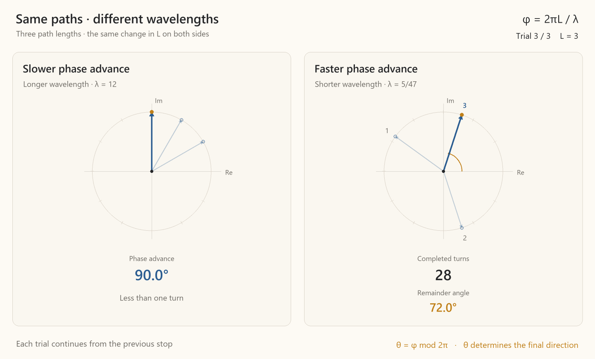

[Open MP4: symmetry-phase-remainder-spinners.mp4](../../content/drafts/animations/symmetry-phase-remainder-spinners.mp4)

In this limit, as waves pass through slits, they behave as rays, just as if you threw a ball from one point through a hole, it could only hit the projection screen in one spot.

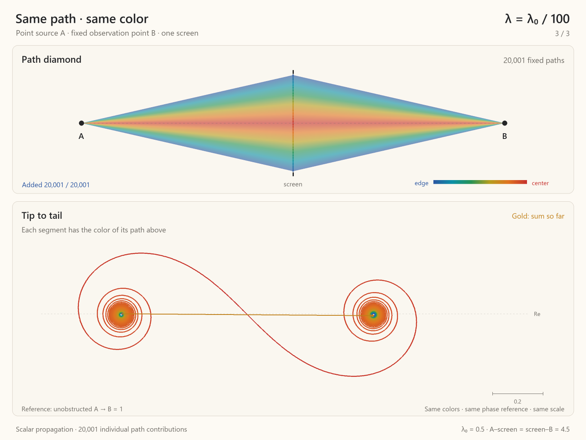

[Open MP4: symmetry-spectrum-path-diamond-wavelength-scan.mp4](../../content/drafts/animations/symmetry-spectrum-path-diamond-wavelength-scan.mp4)

##### From Wave Mechanics to Quantum Mechanics
The action along a given path, the quantity that is minimized by that path, can be constructed from the structure of **spacetime**, as articulated in the theory of special relativity, which will be the topic of our next chapter. Crudely speaking, because the quantity to be minimized must be agreed upon by all observers, it is natural that it should be an invariant of symmetry actions on spacetime. This leads to the result that the action is, in simple cases, proportional to an invariant built from translations — the time elapsed along a path as measured in a body's rest frame — times a dual invariant built from translation generators. The former quantity is called **proper time** while the latter is **mass**.

```math
S = -m\tau
```

At the same time, we can calculate how phase advances along a path in spacetime. Introducing $\kappa$, the invariant built from wave function spacetime-translation generators, a single-mode plane wave in spacetime is:

```math
e^{-i\kappa\tau}
```

We then have:

```math
\mathrm{constant} = \frac{S}{\phi} = \frac{m}{\kappa}
```

We can measure this constant in the lab by comparing mass, as measured through collisions, to wavelength, as measured through interference. We then find:

```math
\frac{S}{\phi}:=\hbar\approx 1.055\times10^{-34}\,\mathrm{J\,s}.
```

The smaller $\hbar$ is, the more a wave function's phase cycles for a given amount of path variation. But this is exactly our condition for possible paths being dominated by the stationary path. $\hbar$ sets the mass scale at which bodies behave deterministically. Because $1.055\times10^{-34}\,\mathrm{J\,s}$ is tiny relative to human scale, we see no quantum stochasticity in everyday life. Are we saying that the laws of motion we learn in high school physics are an approximation? Yes, a very good approximation.

We can now express our $H_3$ commutation relation in units of action:

```math
[\hat X,\hat K]=iI
\;\xrightarrow{\times\hbar}\;
[\hat X,\hbar\hat K]=i\hbar I
```

We then have:

```math
\hat P := \hbar\hat K
```
where $\hat P$ generates translations from a mechanical collision perspective. Its eigenvalue is **momentum**, $p$, giving us the quantum **canonical commutation relation**:

```math
[\hat X, \hat P] = i\hbar I
```

Recall that $x$ and $p$ are the eigenvalues of the $\hat X$ and $\hat P$ operators, respectively, acting on the wave function. We then have:

```math
\Delta x\,\Delta k\ge\frac{1}{2}
\;\xrightarrow{\Delta p=\hbar\Delta k}\;
\Delta x\,\Delta p\ge\frac{\hbar}{2}
```

This is the Heisenberg uncertainty relation, which states that a quantum state cannot have perfectly sharp values of both position and momentum, which becomes relevant at subatomic scales.

The canonical commutation relation, along with the definitions of $\hat X$ and $\hat P$, is also sufficient to serve as a starting point from which to derive quantum theory’s general law of motion.