# From the Canonical Commutator to Euler--Lagrange Through Wave Mechanics

This is a worked, dependency-preserving account of the argument developed in conversation. It is not yet manuscript prose. Its purpose is to keep every change of meaning visible, especially the disappearance and later reintroduction of the packet centers.

The mathematical spine is

```math
\text{wave representation of translation}
\longrightarrow
\text{closed }x\text{-}k\text{ loop phase}
\longrightarrow
\text{a selected relation between two Fourier labels}
\longrightarrow
\text{linear wave propagation}
\longrightarrow
\text{a sum over joint candidates}
\longrightarrow
\text{stationary phase}
\longrightarrow
\text{ray equations}
\longrightarrow
\text{narrow-packet center}
\longrightarrow
\text{Euler--Lagrange form}.
```

The canonical commutator supplies one indispensable piece of this chain, but not the entire chain. In particular, it does not choose the function $\omega(k)$, create an evolution parameter, or by itself establish stationary motion.

## Four guardrails

1. The closed $x$-$k$ commutator loop is a hypothetical composition of operators. It is not an evolving history.
2. The full wave sum is exact. Replacing it by stationary rays is an approximation appropriate when neighboring phases run through many cycles.
3. From Step 8 through Step 12, $x(s)$ and $k(s)$ are integration histories. They are not packet centers.
4. A narrow packet's centers are reintroduced only after the stationary history has been derived and independently matched to the packet's Fourier evolution.

## Symbol roles through the argument

| Stage | Symbols | Meaning |
|---|---|---|
| Early packet picture | $\bar x,\bar k$ | Spatial and spectral centers of a packet |
| Displacement family | $a,b$ | Amounts by which one reference packet is shifted in $x$ and $k$ |
| Joint Fourier mode | $x,s;k,q$ | Two translation coordinates and their Fourier labels |
| Segment kernel | $\mathcal K_j$ | Complex sum of every mode contribution across segment $j$ |
| Segmented kernel | $x_j,k_j$ | Intermediate coordinate and Fourier-integration label on segment $j$ |
| Continuum candidate | $x(s),k(s)$ | One joint integration history in the kernel expansion |
| Stationary candidate | $x_*(s),k_*(s)$ | A joint history at which the first-order phase variation vanishes |
| Packet reintroduced | $\bar x(s),\bar k(s)$ | Narrow-packet centers, approximately identified with $x_*,k_*$ in the ray regime |
| Reduced phase theory | $L_\phi(x,\dot x)$ | Phase-rate Lagrangian obtained after eliminating $k$ |

The same letters must not be allowed to slide silently from one row to another.

## Summary table

Two inserted bridges now make the bookkeeping explicit without renumbering the later animations. Step 8.5 constructs one segment kernel by summing the complex contributions of all its modes. Step 9.5 reconstructs the product of those kernels by summing every complete assignment of one mode to each segment.

| Friendly sentence | Visualization | Cumulative equation |
|---|---|---|
| **Step 1.** One packet contains several Fourier modes; it does not possess one exact wave number. | [One packet contains several wave numbers](../../content/drafts/animations/symmetry-step1-packet-has-k-spectrum.mp4) | $\displaystyle \psi(x)=\sum_{n=1}^{3}c_ne^{ik_nx}$ |
| **Step 2.** We may summarize the whole packet by its spatial center and spectral center without pretending that it contains only one $k$. | [Summarize one fixed packet by $(\bar x,\bar k)$](../../content/drafts/animations/symmetry-step2-packet-summary-point.mp4) | $\displaystyle \psi(x)=\sum_n c_ne^{ik_nx}\longmapsto z=(\bar x,\bar k)$ |
| **Step 3.** Repeating this summary for a one-parameter family of packet slices traces a curve in the $x$-$k$ plane. | [Packet slices trace a curve in the $x$-$k$ plane](../../content/drafts/animations/symmetry-step3-packet-slices-trace-xk-curve.mp4) | $\displaystyle \lambda\mapsto\psi_\lambda\mapsto z(\lambda)=\bigl(\bar x(\lambda),\bar k(\lambda)\bigr),\quad\gamma:\lambda\mapsto z(\lambda)$ |
| **Step 4.** Two hypothetical packet-summary histories may have the same beginning and end while taking different intermediate routes. | [Same boundary summaries, different candidate histories](../../content/drafts/animations/symmetry-step4-alternate-packet-summary-histories.mp4) | $\displaystyle \gamma_r(\lambda)=\bigl(\bar x_r(\lambda),\bar k_r(\lambda)\bigr),\ r\in\{1,2\},\quad\gamma_1(0)=\gamma_2(0)=z_0,\quad\gamma_1(1)=\gamma_2(1)=z_1$ |
| **Step 5.** We restrict those candidates to position and wave-number shifts of one fixed-shape reference packet. | [Restrict candidates to $x$- and $k$-shifts of one packet](../../content/drafts/animations/symmetry-step5-displacement-only-packet-family.mp4) | $\displaystyle (T_a\psi)(x)=\psi(x-a),\quad(M_b\psi)(x)=e^{ibx}\psi(x),\quad\psi_{a,b}=M_bT_a\psi_0=e^{ibx}\psi_0(x-a)$ |
| **Step 6.** Following one displacement history forward and the other backward produces a closed comparison loop. | [Overlay two candidates to make one closed $x$-$k$ loop](../../content/drafts/animations/symmetry-step6-two-candidates-form-closed-xk-loop.mp4) | $\displaystyle \gamma_r(\lambda)=\bigl(a_r(\lambda),b_r(\lambda)\bigr),\quad\Gamma=\gamma_1\circ\gamma_2^{-1}=\partial R$ |
| **Step 7.** Each small commutator cell closes in $x$ and $k$ but leaves a common phase; multiplying the cells adds their oriented areas. | [Tile the $x$-$k$ region with commutator cells](../../content/drafts/animations/symmetry-step7-commutator-cells-sum-phase.mp4) | $\displaystyle T_{\delta x}M_{\delta k}T_{-\delta x}M_{-\delta k}=e^{-i\delta x\delta k}I,\quad\prod_c e^{-i\delta x_c\delta k_c}\to e^{-iA_{xk}},\quad A_{xk}=\iint_Rdx\wedge dk$ |
| **Step 8.** Introduce a second translation coordinate $s$. Across one $x$-$s$ segment, each Fourier mode supplies its own phase contribution. | [Find one mode's phase across one candidate segment](../../content/drafts/animations/symmetry-step8-one-segment-two-phase-terms.mp4) | $\displaystyle q_n=-\omega(k_n),\quad u_{k_n}=e^{i[k_nx-\omega(k_n)s]},\quad\Delta\phi_{j,n}=k_n\Delta x_j-\omega(k_n)\Delta s_j$ |
| **Step 8.5.** On one fixed segment, add the mode phasors—not their phase angles—to obtain the segment kernel. | [Modes form one segment kernel](../../content/drafts/animations/symmetry-step8-5-modes-form-segment-kernel.mp4) | $\displaystyle \mathcal K_j=\int\frac{dk}{2\pi}\,e^{i\Delta\phi_j(k)},\qquad\Delta\phi_j(k)=k\Delta x_j-\omega(k)\Delta s_j$ |
| **Step 9.** Expand the product of the segment kernels and select one mode contribution from each. Along that one complete assignment, the segment phases add. | [Multiply one selected mode factor from each segment](../../content/drafts/animations/symmetry-step9-segments-to-candidate-phase.mp4) | $\displaystyle \prod_j\mathcal K_j=\int\!\left[\prod_j\frac{dk_j}{2\pi}\right]e^{i\Phi_N[x;\mathbf k]},\qquad\Phi_N[x;\mathbf k]=\sum_j[k_j\Delta x_j-\omega(k_j)\Delta s_j]$ |
| **Step 9.5.** Sum every complete mode assignment for the fixed spatial polygon; this reconstructs the product of its segment kernels. | [Keep the path fixed; sum its mode assignments](../../content/drafts/animations/symmetry-step9-5-mode-sum-bridge.mp4) | $\displaystyle \mathcal A_N[x]=\int\!\left[\prod_j\frac{dk_j}{2\pi}\right]e^{i\Phi_N[x;\mathbf k]}=\prod_j\mathcal K_j\longrightarrow\mathcal A[x]=\int\mathcal Dk\,e^{i\Phi[x;k]}$ |
| **Step 10.** Now allow every intermediate spatial polygon to contribute its already mode-summed amplitude. | [Linear wave propagation adds candidate terms](../../content/drafts/animations/symmetry-step10-add-candidate-terms.mp4) | $\displaystyle \mathcal K(B,A)=\int\mathcal Dx\,\mathcal A[x]=\int\mathcal Dx\int\mathcal Dk\,\exp\!\left\{i\int_{s_0}^{s_1}[k(s)\dot x(s)-\omega(k(s))]ds\right\}$ |
| **Step 11.** Near a stationary joint history, neighboring contributions differ only at second order and remain aligned; elsewhere they largely cancel. | [Stationary phase makes a neighborhood reinforce](../../content/drafts/animations/symmetry-step11-stationary-phase-neighborhood.mp4) | $\displaystyle x_\epsilon=x_*+\epsilon\eta,\quad k_\epsilon=k_*+\epsilon\kappa,\quad\Phi(\epsilon):=\Phi[x_\epsilon;k_\epsilon],\quad\Phi'(0)=0,\quad\Phi(\epsilon)=\Phi(0)+\tfrac12\Phi''(0)\epsilon^2+O(\epsilon^3)$ |

The full display equations and every substitution appear below.

---

## Step 1 -- One packet contains several wave numbers

On one fixed slice, write a simple three-mode packet as

```math
\psi(x)
=
\sum_{n=1}^{3}c_ne^{ik_nx}.
```

The index $n$ labels a Fourier mode. The complex coefficient $c_n$ gives that mode's magnitude and phase. The three-mode animation is schematic: a finite sum of exact plane waves on the whole real line is periodic rather than square-integrable and localized. A genuine localized packet normally contains a continuum, or an effectively continuous band, of modes,

```math
\psi(x)
=
\frac{1}{\sqrt{2\pi}}
\int
\widetilde\psi(k)e^{ikx}
\,dk.
```

A pure plane wave has one $k$ but no spatial center. A localized packet has a spatial center precisely because it contains a range of wave numbers.

The words *narrow packet* later in this note therefore mean narrow relative to the macroscopic scales of interest, not arbitrarily narrow in both $x$ and $k$.

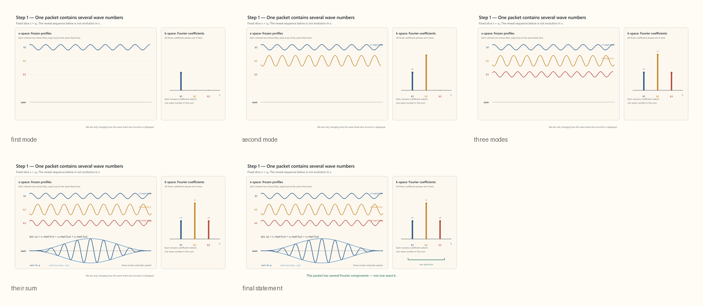

[Open MP4: one packet contains several wave numbers](../../content/drafts/animations/symmetry-step1-packet-has-k-spectrum.mp4)

## Step 2 -- Summarize one packet by two centers

When the relevant moments exist, one convenient definition of the spatial center is

```math
\bar x
=
\frac{\int x|\psi(x)|^2\,dx}
{\int |\psi(x)|^2\,dx},
```

and the corresponding spectral center is

```math
\bar k
=
\frac{\int k|\widetilde\psi(k)|^2\,dk}
{\int |\widetilde\psi(k)|^2\,dk}.
```

Thus the summary map is

```math
\psi
\longmapsto
z=(\bar x,\bar k).
```

The point $z$ does not replace the packet. It records only two of its properties. In particular, $\bar k$ is the center of a spectrum, not the packet's one and only wave number.

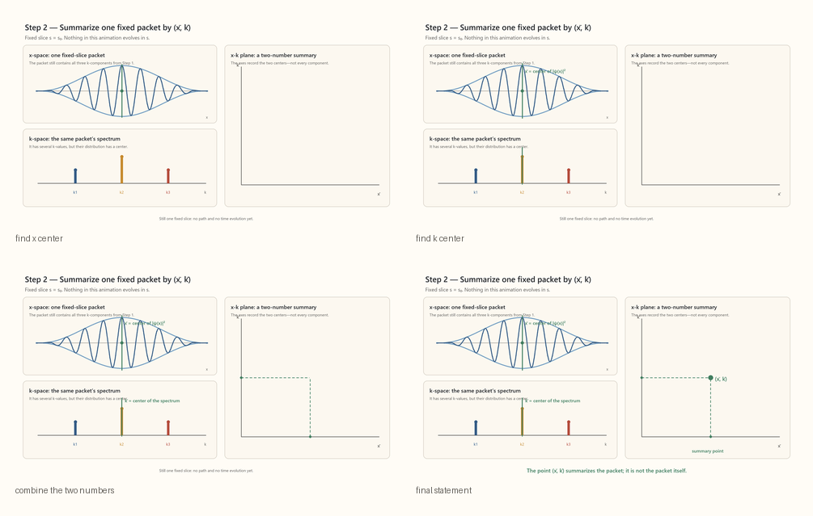

[Open MP4: summarize one fixed packet](../../content/drafts/animations/symmetry-step2-packet-summary-point.mp4)

## Step 3 -- A family of summaries traces a curve

Let $\lambda$ parameterize a family of packets. Then

```math
\lambda
\longmapsto
\psi_\lambda
\longmapsto
z(\lambda)
=
\bigl(\bar x(\lambda),\bar k(\lambda)\bigr)
```

traces a curve

```math
\gamma:\lambda\longmapsto z(\lambda)
```

in the summary plane. The parameter $\lambda$ merely orders the family. It is not yet time, and the curve is not yet a physical trajectory.

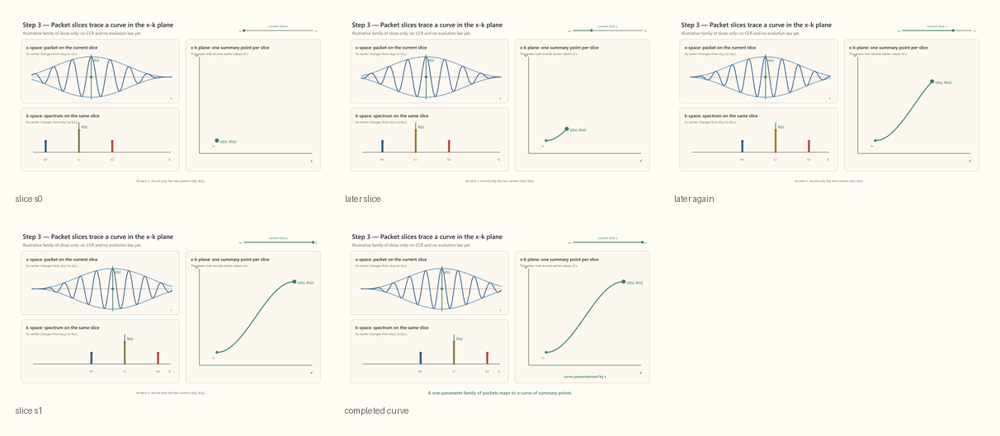

[Open MP4: packet slices trace a curve](../../content/drafts/animations/symmetry-step3-packet-slices-trace-xk-curve.mp4)

## Step 4 -- Compare alternate summary histories

Consider two hypothetical curves with the same endpoints:

```math
\gamma_r(\lambda)
=
\bigl(\bar x_r(\lambda),\bar k_r(\lambda)\bigr),
\qquad
r\in\{1,2\},
```

```math
\gamma_1(0)=\gamma_2(0)=z_0,
\qquad
\gamma_1(1)=\gamma_2(1)=z_1.
```

They agree at the beginning and end but generally differ in between. We have still supplied no law that calls either curve physical.

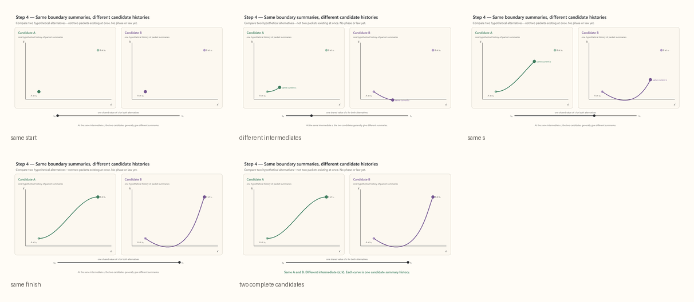

[Open MP4: alternate packet-summary histories](../../content/drafts/animations/symmetry-step4-alternate-packet-summary-histories.mp4)

## Step 5 -- Restrict the family to displacement-only packets

Now choose one reference packet $\psi_0$. Let

```math
(T_a\psi)(x)
=
\psi(x-a)
```

shift it in $x$, and let

```math
(M_b\psi)(x)
=
e^{ibx}\psi(x)
```

shift its spectrum in $k$. The two-parameter packet family is

```math
\psi_{a,b}(x)
=
M_bT_a\psi_0(x)
=
e^{ibx}\psi_0(x-a).
```

If the reference centers are $(\bar x_0,\bar k_0)$, then

```math
\bar x_{a,b}=\bar x_0+a,
\qquad
\bar k_{a,b}=\bar k_0+b.
```

The packet's spatial and spectral shapes are held fixed. Only their centers move. The common phase is not visible in a plot of either magnitude.

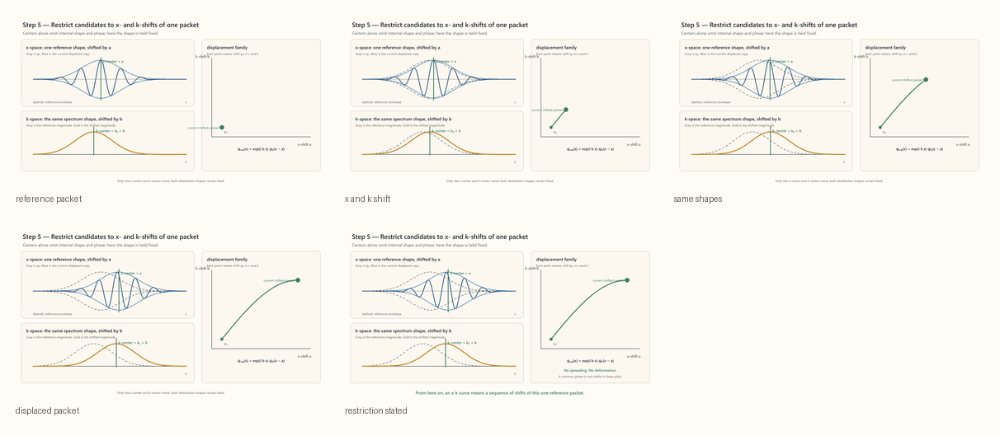

[Open MP4: displacement-only packet family](../../content/drafts/animations/symmetry-step5-displacement-only-packet-family.mp4)

## Step 6 -- Two displacement routes make one closed loop

Write the displacement histories as

```math
\gamma_r(\lambda)
=
\bigl(a_r(\lambda),b_r(\lambda)\bigr).
```

Follow $\gamma_1$ forward and $\gamma_2$ backward. Their composition

```math
\Gamma
=
\gamma_1\circ\gamma_2^{-1}
=
\partial R
```

is the oriented boundary of a region $R$ in the displacement plane. This is a loop through a family of operators acting on the same reference packet, not a history through time.

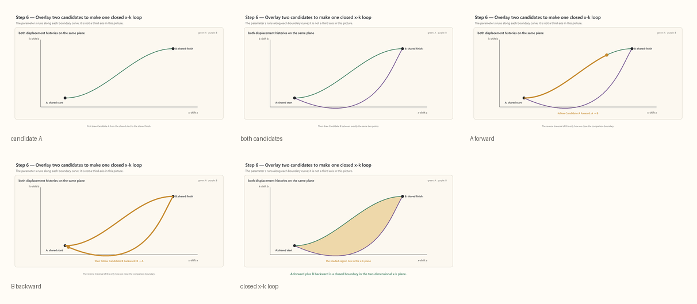

[Open MP4: two candidates make a closed loop](../../content/drafts/animations/symmetry-step6-two-candidates-form-closed-xk-loop.mp4)

## Step 7 -- The commutator loop leaves a phase

The two shifts obey

```math
T_aM_b
=
e^{-iab}M_bT_a.
```

Equivalently, completing the operator loop gives

```math
T_aM_bT_{-a}M_{-b}\psi
=
e^{-iab}\psi.
```

The packet returns to the same spatial distribution and the same $k$-distribution. What remains is a common phase multiplying the complete function.

That common phase is invisible if this is the only state under consideration. It becomes a relative phase when the result of this route is compared or superposed with the result of another route.

Infinitesimally, with

```math
(\hat X\psi)(x)=x\psi(x),
\qquad
(\hat K\psi)(x)=-i\frac{d\psi}{dx},
```

the same structure is

```math
[\hat X,\hat K]=iI.
```

For a small cell,

```math
T_{\delta x}M_{\delta k}T_{-\delta x}M_{-\delta k}
=
e^{-i\delta x\delta k}I.
```

Tiling the enclosed region gives

```math
\prod_c
e^{-i\delta x_c\delta k_c}
=
e^{-i\sum_c\delta x_c\delta k_c}
\longrightarrow
e^{-iA_{xk}},
```

where

```math
A_{xk}
=
\iint_Rdx\wedge dk
```

is the oriented area. Reversing the loop reverses the sign.

This establishes a local conversion from oriented $x$-$k$ area to phase. It does **not** yet establish evolution, a path through $s$, a stationary phase, or an equation of motion.

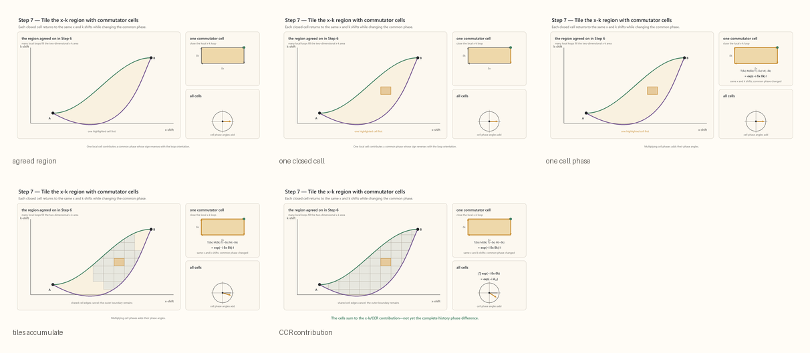

[Open MP4: commutator cells sum phase](../../content/drafts/animations/symmetry-step7-commutator-cells-sum-phase.mp4)

---

## The deliberate change of meaning after Step 7

The packet-center picture has now done its first job: it made the closed commutator loop concrete.

From Step 8 through Step 12, put the packet centers aside. The unbarred symbols have new meanings:

- $x$ is a coordinate at which a wave is evaluated;
- $k$ is a Fourier-mode label;
- $x(s)$ is a candidate sequence of intermediate coordinates in a composed kernel;
- $k(s)$ is a candidate assignment of local Fourier labels to those segments.

None of these is $\bar x$ or $\bar k$. The bars return only in Step 13.

---

## Step 8 -- Add a second translation coordinate and select a flow

Introduce a second translation coordinate $s$ without calling it time. The unconstrained joint Fourier modes are

```math
u_{k,q}(x,s)
=
e^{i(kx+qs)}.
```

The two translation generators satisfy

```math
\hat K u_{k,q}=k u_{k,q},
\qquad
\hat Q u_{k,q}=q u_{k,q},
```

with

```math
\hat K=-i\partial_x,
\qquad
\hat Q=-i\partial_s.
```

At this point, $k$ and $q$ are independent. Supply the additional relation

```math
\boxed{
q=-\omega(k).
}
```

Neither translation symmetry nor the canonical commutator determines the real function $\omega(k)$. The displayed minus sign is likewise a chosen orientation and Fourier convention at this stage.

The selected modes are

```math
u_k(x,s)
=
e^{i[kx-\omega(k)s]}.
```

The same relation gives the slice equation

```math
i\frac{\partial f}{\partial s}
=
\omega(-i\partial_x)f,
```

or

```math
f(\,\cdot\,,s+\sigma)
=
e^{-i\sigma\omega(\hat K)}
f(\,\cdot\,,s).
```

This says that one complete $x$-slice determines another. When $\omega(k)$ is real and the resulting operator is self-adjoint on the chosen domain, the slice flow is unitary. It still does not say that $s$ is physical time.

### What the selected phase does to a mode and to a packet

For one pure mode,

```math
u_k(x,s+\sigma)
=
e^{-i\omega(k)\sigma}u_k(x,s).
```

The factor rotates the mode's complex value everywhere by the same angle. Its amplitude and repeating shape do not change. A pure mode has no packet center to move.

For a packet, each Fourier component acquires its own factor:

```math
\widetilde\psi(k,s+\sigma)
=
e^{-i\omega(k)\sigma}
\widetilde\psi(k,s).
```

Three cases distinguish global from relative phase:

```math
\omega(k)=\omega_0
\quad\Longrightarrow\quad
\psi(x,s)
=
e^{-i\omega_0s}\psi(x,0),
```

so every component receives the same global phase and the packet remains fixed;

```math
\omega(k)=vk+\omega_0
\quad\Longrightarrow\quad
\psi(x,s)
=
e^{-i\omega_0s}\psi(x-vs,0),
```

so the relative phase changes linearly in $k$ and the packet translates rigidly; while a nonlinear $\omega(k)$ changes the relative phases nonlinearly and generally makes the packet spread or distort.

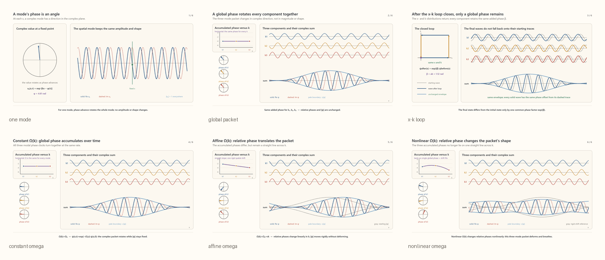

[Open MP4: global and relative phase for a three-component packet](../../content/drafts/animations/symmetry-phase-advance-three-component-packet-v4.mp4)

Now consider one segment $j$ with

```math
\Delta x_j=x_{j+1}-x_j,
\qquad
\Delta s_j=s_{j+1}-s_j.
```

For mode $n$, the segment factor is

```math
e^{ik_n\Delta x_j}
e^{-i\omega(k_n)\Delta s_j}
=
e^{i\Delta\phi_{j,n}},
```

where

```math
\boxed{
\Delta\phi_{j,n}
=
k_n\Delta x_j
-
\omega(k_n)\Delta s_j.
}
```

This is one mode's phase across one coordinate segment. There is no packet center here.

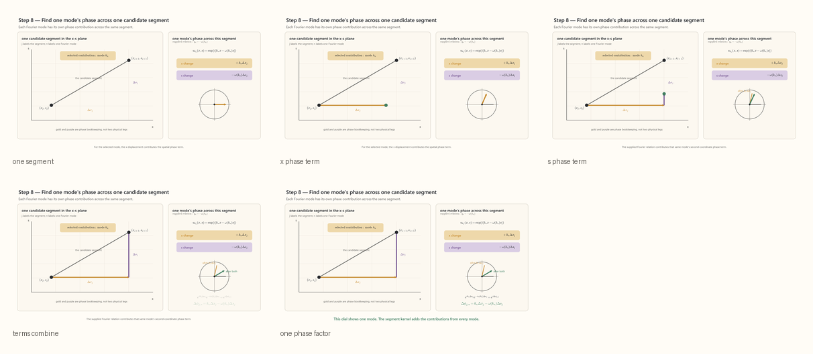

[Open MP4: one mode across one candidate segment](../../content/drafts/animations/symmetry-step8-one-segment-two-phase-terms.mp4)

## Step 8.5 -- Sum the modes within one segment to obtain its kernel

Different modes on the same segment do not form successive parts of one journey. Their phase angles must therefore **not** be added. Their complex contributions are added as phasors:

```math
\boxed{
\mathcal K_j
=
\int\frac{dk}{2\pi}
e^{i\Delta\phi_j(k)},
\qquad
\Delta\phi_j(k)
=
k\Delta x_j
-
\omega(k)\Delta s_j.
}
```

Thus

```math
\mathcal K_j
\neq
\exp\!\left[
i\int\Delta\phi_j(k)\,dk
\right].
```

The mode sum produces one complex number for the segment. If it is nonzero, it can of course be written

```math
\mathcal K_j
=
|\mathcal K_j|e^{i\theta_j},
```

but $\theta_j=\arg\mathcal K_j$ is the angle of the phasor resultant, not the sum of the individual mode phases.

For a complete interval of length $\sigma$, the same segment kernel is

```math
\boxed{
\mathcal K_\sigma(x',x)
=
\frac{1}{2\pi}
\int
e^{i[k(x'-x)-\omega(k)\sigma]}
\,dk,
}
```

where $\sigma$ is the interval in $s$, $x$ is an input coordinate on the first slice, and $x'$ is an output coordinate on the second. It acts as a continuous matrix:

```math
f_1(x')
=
\int
\mathcal K_\sigma(x',x)
f_0(x)
\,dx.
```

Here $f_0$ is the complete function on the first slice and $f_1$ is the complete function on the second. The $k$-integral sums modes. It is not yet a sum over paths; intermediate coordinate histories appear only when kernels are composed in Step 10.

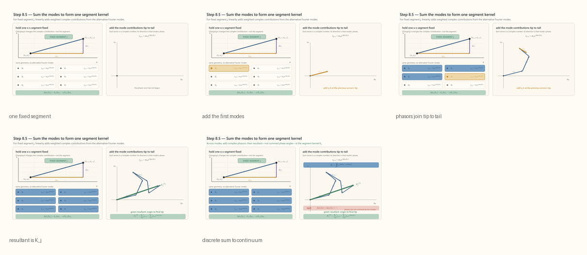

[Open MP4: modes add to form one segment kernel](../../content/drafts/animations/symmetry-step8-5-modes-form-segment-kernel.mp4)

## Step 9 -- Expand the product of segment kernels

To expose the bookkeeping that repeated kernel composition will produce, choose a partition

```math
s_0<s_1<\cdots<s_N.
```

For the moment, hold one sequence of intermediate coordinates $x_0,x_1,\ldots,x_N$ fixed. Step 10 will explain why linear composition requires summing those coordinates.

For that fixed polygon, the segment kernels multiply:

```math
\prod_{j=0}^{N-1}\mathcal K_j
=
\prod_{j=0}^{N-1}
\left[
\int\frac{dk_j}{2\pi}
e^{i\Delta\phi_j(k_j)}
\right].
```

Expanding this product means choosing one mode contribution from every bracket.

The index $j$ labels a segment. The index $n_j$ records which discrete Fourier mode was chosen on segment $j$. Thus $k_{n_j}$ means the wave number of the mode chosen on that particular segment.

For one complete assignment

```math
\mathbf n
=
(n_0,n_1,\ldots,n_{N-1}),
```

the segment factors multiply:

```math
\prod_{j=0}^{N-1}
e^{i[k_{n_j}\Delta x_j-\omega(k_{n_j})\Delta s_j]}
=
e^{i\Phi_N[x;\mathbf n]},
```

with

```math
\boxed{
\Phi_N[x;\mathbf n]
=
\sum_{j=0}^{N-1}
\left[
k_{n_j}\Delta x_j
-
\omega(k_{n_j})\Delta s_j
\right].
}
```

There is no mode sum in this particular phasor. It is one term in the expanded product of segment kernels: one selected mode per segment and hence one complete mode assignment along the spatial polygon. The integrations over all such choices have not yet been carried out.

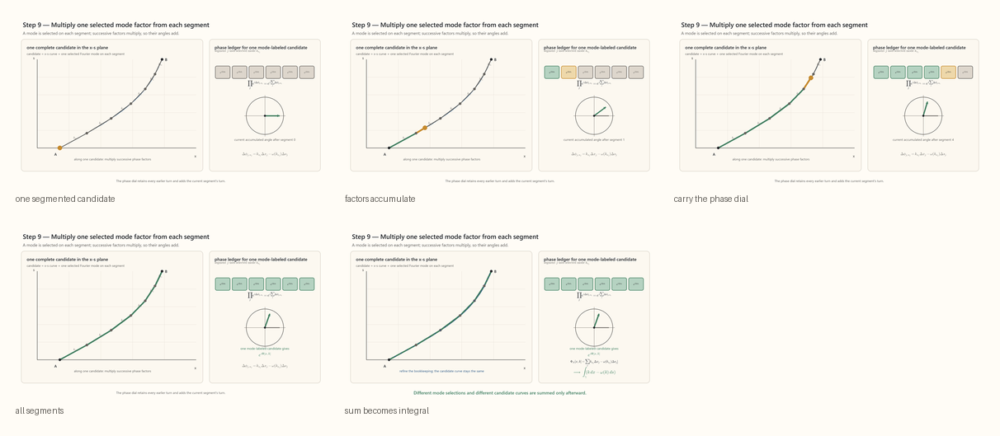

[Open MP4: segment phases accumulate](../../content/drafts/animations/symmetry-step9-segments-to-candidate-phase.mp4)

## Step 9.5 -- Sum the mode assignments for one fixed spatial polygon

Now hold the coordinate sequence

```math
x_0,x_1,\ldots,x_N
```

fixed and sum over the mode choices. This is not a new operation unrelated to Step 8.5; it reconstructs the product of the segment kernels. In a discrete schematic, suppressing the individual mode weights,

```math
\mathcal A_N[x]
=
\prod_{j=0}^{N-1}\mathcal K_j
=
\sum_{\mathbf n}
e^{i\Phi_N[x;\mathbf n]}.
```

For continuous Fourier labels, make the substitutions

```math
k_{n_j}\rightsquigarrow k_j,
\qquad
\sum_{\mathbf n}
\rightsquigarrow
\prod_{j=0}^{N-1}
\int\frac{dk_j}{2\pi}.
```

Here $k_j$ is a dummy Fourier-integration variable on segment $j$. Then

```math
\boxed{
\mathcal A_N[x]
=
\prod_{j=0}^{N-1}\mathcal K_j
=
\left[
\prod_{j=0}^{N-1}
\int\frac{dk_j}{2\pi}
\right]
\exp\!\left{
i\sum_{j=0}^{N-1}
\left[
k_j\Delta x_j
-
\omega(k_j)\Delta s_j
\right]
\right}.
}
```

In continuum notation,

```math
\Phi[x;k]
=
\int_{s_0}^{s_1}
\left[
k(s)\dot x(s)
-
\omega(k(s))
\right]ds,
\qquad
\dot x=\frac{dx}{ds},
```

and

```math
\boxed{
\mathcal A[x]
=
\int\mathcal Dk\,
e^{i\Phi[x;k]}.
}
```

The integrand is one complete $k(s)$ assignment. The functional integral sums all such assignments for the fixed $x(s)$ candidate.

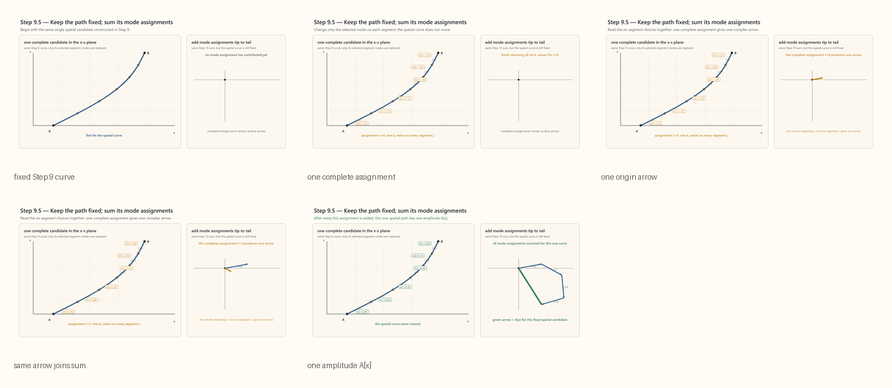

[Open MP4: sum mode assignments for one path](../../content/drafts/animations/symmetry-step9-5-mode-sum-bridge.mp4)

## Step 10 -- Sum the spatial candidates

Why is there another sum? Linear propagation composes like continuous matrix multiplication. With one intermediate slice,

```math
\mathcal K(B,A)
=
\int
\mathcal K(B,x_1)
\mathcal K(x_1,A)
\,dx_1.
```

Each value of $x_1$ contributes one two-segment term. Adding more slices introduces more intermediate coordinates.

Let

```math
A=(x_A,s_0),
\qquad
B=(x_B,s_N),
```

so that $x_0=x_A$ and $x_N=x_B$. These are endpoints in the $x$-$s$ base space, not endpoints of the earlier $x$-$k$ operator loop.

The nested finite expression is

```math
\boxed{
\mathcal K_N(B,A)
=
\left[
\prod_{\ell=1}^{N-1}
\int dx_\ell
\right]
\left[
\prod_{j=0}^{N-1}
\int\frac{dk_j}{2\pi}
\right]
\exp\!\left{
i\sum_{j=0}^{N-1}
\left[
k_j(x_{j+1}-x_j)
-
\omega(k_j)(s_{j+1}-s_j)
\right]
\right}.
}
```

For real translation-invariant $\omega(k)$, this time-sliced composition is an exact rewriting of the Fourier kernel. The $k$-integrals are often oscillatory integrals or distributions rather than absolutely convergent ordinary integrals.

The index $\ell$ counts the interior $x$-values being integrated; $j$ counts the segments. In continuum shorthand,

```math
\boxed{
\mathcal K(B,A)
=
\int_{x(s_0)=x_A}^{x(s_N)=x_B}
\mathcal Dx
\int\mathcal Dk\,
\exp\!\left{
i\int_{s_0}^{s_N}
\left[
k\dot x-\omega(k)
\right]ds
\right}.
}
```

The polygonal candidates are terms produced by composing the wave operator. They are not hidden trajectories secretly followed by pieces of the wave.

Before the integrations are performed, each segment carries an independent dummy label $k_j$. Integration over the intermediate $x_j$ in the uniform case enforces agreement among neighboring labels; this is the exact integral counterpart of the later stationary result $\dot k=0$.

Schematically,

```math
\int
\left[
\prod_{j=1}^{N-1}dx_j
\right]
e^{i\sum_jk_j(x_{j+1}-x_j)}
\propto
\prod_{j=1}^{N-1}
\delta(k_j-k_{j-1}).
```

Therefore a uniform system can equivalently be calculated by propagating each single global $k$ mode through the complete interval and summing those modes afterward. The independent $k_j$ labels belong to the expanded, pre-integration bookkeeping.

Steps 8.5 and 9.5 expose the full nesting:

```math
\underbrace{
\int\frac{dk_j}{2\pi}
}_{
\text{form segment kernel }\mathcal K_j
}
\longrightarrow
\underbrace{
\prod_j\mathcal K_j
}_{
\text{fixed-polygon amplitude }\mathcal A_N[x]
}
\longrightarrow
\underbrace{
\int\mathcal Dx\,\mathcal A[x]
}_{
\text{sum the spatial candidates}
}.
```

The existing Step 10 animation predates the inserted bridges and visually collapses these levels into one joint sum. The mathematics above gives the more explicit reading.

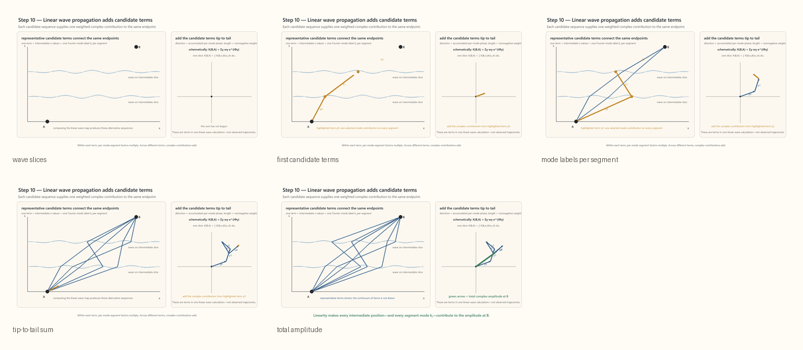

[Open MP4: linear propagation adds candidate terms](../../content/drafts/animations/symmetry-step10-add-candidate-terms.mp4)

## How the closed-loop commutator reappears in the open-history phase

The phase along one open candidate is

```math
\Phi[\gamma]
=
\int_\gamma\alpha,
\qquad
\alpha
=
k\,dx-\omega(x,k)\,ds.
```

It is not itself a commutator loop. Compare it with a nearby candidate $\gamma'$ sharing the same $x$-$s$ endpoints. Following one forward and the other backward gives a closed comparison, so

```math
\Phi[\gamma']-\Phi[\gamma]
=
\oint\alpha.
```

If the comparison bounds a ribbon $R$ in the extended $(s,x,k)$ bookkeeping space, then

```math
\boxed{
\Phi[\gamma']-\Phi[\gamma]
=
\iint_Rd\alpha.
}
```

For a local function $\omega(x,k)$,

```math
\boxed{
d\alpha
=
dk\wedge dx
-
\frac{\partial\omega}{\partial x}
dx\wedge ds
-
\frac{\partial\omega}{\partial k}
dk\wedge ds.
}
```

The first term,

```math
dk\wedge dx,
```

is the canonical phase curvature encoded by the $x$-$k$ commutator. The terms containing $ds$ are supplied by the selected relation $q=-\omega(k)$, or its local extension. The complete phase variation balances all of them. An $x$-$k$ tiling by itself is only the CCR contribution, not the whole evolving-history variation.

This is the precise connection between the closed commutator loop and the phase differences among open candidates.

## Step 11 -- Stationary phase makes a neighborhood reinforce

Every joint candidate contributes a complex number. Its angle is $\Phi[x;k]$. When those contributions are added:

- away from stationarity, small candidate changes alter the phase to first order, so the arrows turn rapidly and largely cancel;
- near stationarity, the first-order phase change vanishes, so neighboring arrows remain approximately aligned and reinforce.

Strictly, stationary-phase reasoning is first applied to the finite-dimensional sliced integral and only then expressed in continuum notation. Using stationary candidates to approximate the full integral requires a rapidly varying phase, a sufficiently slowly varying amplitude, and suitable behavior away from boundaries and caustics.

Choose one stationary candidate $(x_*,k_*)$ and a one-parameter family of nearby candidates

```math
x_\epsilon(s)
=
x_*(s)+\epsilon\eta(s),
\qquad
k_\epsilon(s)
=
k_*(s)+\epsilon\kappa(s),
```

with fixed spatial endpoints

```math
\eta(s_0)=\eta(s_N)=0.
```

The variation $\kappa(s)$ is otherwise free; the phase functional contains no $\dot k$ term that would require fixed $k$-endpoints.

Define the scalar function

```math
\Phi(\epsilon)
:=
\Phi[x_\epsilon;k_\epsilon]
=
\int_{s_0}^{s_N}
\left[
\bigl(k_*+\epsilon\kappa\bigr)
\bigl(\dot x_*+\epsilon\dot\eta\bigr)
-
\omega\bigl(k_*+\epsilon\kappa\bigr)
\right]ds.
```

Stationarity means

```math
\boxed{
\left.
\frac{d\Phi}{d\epsilon}
\right|_{\epsilon=0}
=
0
}
```

for every allowed pair $(\eta,\kappa)$. Therefore

```math
\Phi(\epsilon)
=
\Phi(0)
+
\frac12\Phi''(0)\epsilon^2
+
O(\epsilon^3).
```

There is no linear term. This is why a neighborhood, not merely one isolated arrow, can reinforce.

The animation draws only the $x$-projection of each candidate for legibility. Every pictured candidate is understood also to carry a complete set of segment labels $\{k_j\}$. Each phasor in Step 11 therefore represents one joint $(x,\mathbf k)$ candidate, not one Fourier mode.

The complete wave sum remains the exact description. Keeping only stationary neighborhoods is the short-wave, ray, WKB, or stationary-phase approximation. There may be several stationary neighborhoods.


[Open MP4: stationary-phase neighborhood](../../content/drafts/animations/symmetry-step11-stationary-phase-neighborhood.mp4)

---

## Step 12 -- Calculate the stationary joint history

Continue to use unbarred $x$ and $k$. Packet centers have not yet returned.

To reduce clutter, drop the stars while performing the variation:

```math
x_\epsilon=x+\epsilon\eta,
\qquad
k_\epsilon=k+\epsilon\kappa.
```

Expand the product to first order:

```math
(k+\epsilon\kappa)
(\dot x+\epsilon\dot\eta)
=
k\dot x
+
\epsilon
(\kappa\dot x+k\dot\eta)
+
O(\epsilon^2).
```

For the translation-uniform case,

```math
\omega(k+\epsilon\kappa)
=
\omega(k)
+
\epsilon\kappa\omega'(k)
+
O(\epsilon^2).
```

Hence

```math
\left.
\frac{d\Phi}{d\epsilon}
\right|_{\epsilon=0}
=
\int_{s_0}^{s_N}
\left[
\kappa\dot x
+
k\dot\eta
-
\kappa\omega'(k)
\right]ds.
```

Collect the $\kappa$ terms:

```math
\delta\Phi
=
\int_{s_0}^{s_N}
\left[
\kappa
\bigl(\dot x-\omega'(k)\bigr)
+
k\dot\eta
\right]ds.
```

Integrate the last term by parts:

```math
\int_{s_0}^{s_N}k\dot\eta\,ds
=
\left[k\eta\right]_{s_0}^{s_N}
-
\int_{s_0}^{s_N}\dot k\eta\,ds.
```

The boundary term vanishes because $\eta(s_0)=\eta(s_N)=0$. Therefore

```math
\delta\Phi
=
\int_{s_0}^{s_N}
\left[
\kappa
\bigl(\dot x-\omega'(k)\bigr)
-
\eta\dot k
\right]ds.
```

The variations $\eta$ and $\kappa$ are independent. Their coefficients must vanish pointwise:

```math
\boxed{
\dot x
=
\omega'(k),
\qquad
\dot k
=
0.
}
```

This is a result about the stationary integration history $(x_*,k_*)$. At this point, $\omega'(k)$ has not yet been called a packet velocity, and $(x_*,k_*)$ has not yet been called a packet center.

## Step 13 -- Reintroduce the packet centers and justify the identification

Now return to a localized packet. Let its spectrum be concentrated near $\bar k$, and let its initial spatial center be $x_0$:

```math
\psi(x,s_0)
=
\int
c(k)e^{ik(x-x_0)}
\,dk.
```

After an interval

```math
\sigma=s-s_0,
```

the selected flow gives

```math
\psi(x,s)
=
\int
c(k)
e^{i[k(x-x_0)-\omega(k)\sigma]}
\,dk.
```

Linearize $\omega$ over the narrow occupied range:

```math
\omega(k)
\approx
\omega(\bar k)
+
\omega'(\bar k)(k-\bar k).
```

Writing $k=\bar k+\xi$ and collecting the carrier phase gives

```math
\psi(x,s)
\approx
e^{i[\bar k(x-x_0)-\omega(\bar k)\sigma]}
F\!\left(
x-x_0-\omega'(\bar k)\sigma
\right),
```

where $F$ is the initial envelope. Its center therefore obeys

```math
\boxed{
\bar x(s)
\approx
x_0
+
\omega'(\bar k)(s-s_0).
}
```

Consequently,

```math
\boxed{
\dot{\bar x}
=
\omega'(\bar k),
\qquad
\dot{\bar k}
=
0.
}
```

These are the same equations obtained for the stationary integration history. In the narrow, coherent ray regime we may therefore make the approximate identification

```math
x_*(s)\approx\bar x(s),
\qquad
k_*(s)\approx\bar k(s).
```

This is the legitimate reintroduction of the packet centers.

For the uniform flow, the spectral magnitude $|c(k)|$ does not change, so $\bar k$ is exactly constant whenever the moment exists. The identification of the spatial center with the stationary ray is the leading narrow-band result; more exactly, $d\bar x/ds$ is the spectral average of $\omega'(k)$ under the usual regularity assumptions.

The identification is not universal. A broad packet, a splitting packet, or a strongly dispersing packet may not possess one enduring center-ray description. Nonlinear terms such as $\omega''(\bar k)$ govern spreading that the linearized expression suppresses.

## Step 14 -- Allow a locally changing relation $\omega(x,k)$

The exact kernel above assumed strict $x$-translation symmetry and hence $\omega=\omega(k)$. To describe a slowly varying or locally nonuniform setting, extend the phase rate to

```math
\Phi[x,k]
=
\int_{s_0}^{s_N}
\left[
k\dot x
-
\omega(x,k)
\right]ds.
```

This is a local wave or WKB extension, not a consequence of global translation symmetry. At the exact operator level, a nonuniform $\omega(x,k)$ also requires an ordering or discretization convention. Interpreting the result as packet-center motion requires a smooth real local symbol, slow variation on the packet scale, and a packet that remains localized rather than splitting or crossing a caustic.

Varying $x$ and $k$ now gives

```math
\delta\Phi
=
\int_{s_0}^{s_N}
\left[
\left(
\dot x
-
\frac{\partial\omega}{\partial k}
\right)\delta k
-
\left(
\dot k
+
\frac{\partial\omega}{\partial x}
\right)\delta x
\right]ds.
```

Thus the stationary ray equations are

```math
\boxed{
\dot x
=
\frac{\partial\omega}{\partial k},
\qquad
\dot k
=
-
\frac{\partial\omega}{\partial x}.
}
```

For a sufficiently narrow local packet, reinsert the bars:

```math
\boxed{
\dot{\bar x}
\approx
\frac{\partial\omega}{\partial k}
(\bar x,\bar k),
\qquad
\dot{\bar k}
\approx
-
\frac{\partial\omega}{\partial x}
(\bar x,\bar k).
}
```

The first equation gives the local slope of the packet's central ray. The second says that local $x$-dependence changes its central Fourier label and bends the ray.

## Step 15 -- Eliminate $k$ and obtain Euler--Lagrange

The first-order phase rate is already a Lagrangian on the joint variables:

```math
\ell_\phi(x,k,\dot x)
=
k\dot x
-
\omega(x,k),
\qquad
\Phi[x,k]
=
\int\ell_\phi\,ds.
```

Applying the Euler--Lagrange equations separately to $x$ and $k$ reproduces the two first-order ray equations.

To obtain a Lagrangian involving the coordinate history alone, begin with

```math
\dot x
=
\frac{\partial\omega}{\partial k}.
```

If this relation can be solved locally for

```math
k
=
k(x,\dot x).
```

then the reduction below is available.

In one dimension, a sufficient local condition is

```math
\frac{\partial^2\omega}{\partial k^2}
\neq
0.
```

Only local invertibility is needed for the local Euler--Lagrange construction; a global, single-valued Legendre transform requires stronger conditions.

Define the phase-rate Lagrangian by the Legendre transform

```math
\boxed{
L_\phi(x,\dot x)
=
k(x,\dot x)\dot x
-
\omega\!\left(x,k(x,\dot x)\right).
}
```

Then

```math
\Phi[x]
=
\int_{s_0}^{s_N}
L_\phi(x,\dot x)
\,ds.
```

Because the solved $k$ satisfies $\dot x=\partial\omega/\partial k$, differentiation gives

```math
\frac{\partial L_\phi}{\partial\dot x}
=
k,
\qquad
\frac{\partial L_\phi}{\partial x}
=
-
\frac{\partial\omega}{\partial x}.
```

Therefore

```math
\boxed{
\frac{d}{ds}
\left(
\frac{\partial L_\phi}{\partial\dot x}
\right)
-
\frac{\partial L_\phi}{\partial x}
=
0.
}
```

This is the Euler--Lagrange equation. It is equivalent to the first-order ray equations whenever the Legendre relation is locally invertible. If it is not invertible, the first-order equations remain meaningful even though an ordinary one-coordinate Lagrangian may be singular.

At this point the mathematical argument is complete:

```math
\boxed{
\text{translation waves}
+
\text{canonical phase curvature}
+
q=-\omega(k)
+
\text{linear composition}
\longrightarrow
\text{stationary packet-center rays}
\longrightarrow
\text{Euler--Lagrange form}.
}
```

## What each ingredient actually contributed

| Ingredient | What it supplies | What it does not supply |
|---|---|---|
| Plane-wave translation representation | Fourier labels and displacement phases | A relation between $k$ and $q$ |
| Canonical commutator | Closed-loop phase curvature $dk\wedge dx$ | The function $\omega(k)$ or an evolution law |
| Second translation coordinate $s$ | Another Fourier pair $(s,q)$ | An interpretation as time |
| Selected relation $q=-\omega(k)$ | A slice-to-slice flow and the phase $k\Delta x-\omega\Delta s$ | Its own physical origin |
| Linear wave composition | Nested sums over modes and intermediate coordinates | A literal trajectory followed by a wave fragment |
| Stationary-phase regime | Why neighborhoods of some candidates reinforce | Exact replacement of the complete wave by one path |
| Variation | First-order stationary-ray equations | The complete wave equation |
| Narrow-packet approximation | The identification of the stationary ray with packet centers | A ray for every possible wave |
| Legendre transform | An ordinary Euler--Lagrange form when invertible | A guarantee that every $\omega$ has a regular reduced Lagrangian |

## Later physical identification, not used in the derivation

Nothing above required that $s$ be time or that $\Phi$ be mechanical action. If a later physical argument identifies

```math
s=t,
\qquad
p=\chi k,
\qquad
H=\chi\omega,
\qquad
S=\chi\Phi,
```

then

```math
S
=
\int
\left[
p\dot x-H(x,p)
\right]dt
=
\int L\,dt.
```

Multiplication by the nonzero scale $\chi$ does not change the stationary histories:

```math
\delta\Phi=0
\quad\Longleftrightarrow\quad
\delta S=0.
```

Quantum mechanics later sets $\chi=\hbar$, giving $e^{i\Phi}=e^{iS/\hbar}$. That physical identification is a later interpretation of the phase structure, not a premise of the wave-mechanical derivation above.

## Final compact statement

The CCR does not itself dictate the motion of a packet. It fixes the canonical phase curvature that contributes when neighboring wave histories are compared. A separately supplied relation between the Fourier labels tells each mode how to advance through a second translation coordinate. Linear wave composition then builds a sum over joint coordinate and mode histories. In the stationary-phase regime, the histories whose first-order phase variation vanishes organize the propagation of a narrow packet, and their first-order ray equations reduce, when the Legendre map is invertible, to the Euler--Lagrange equation.
