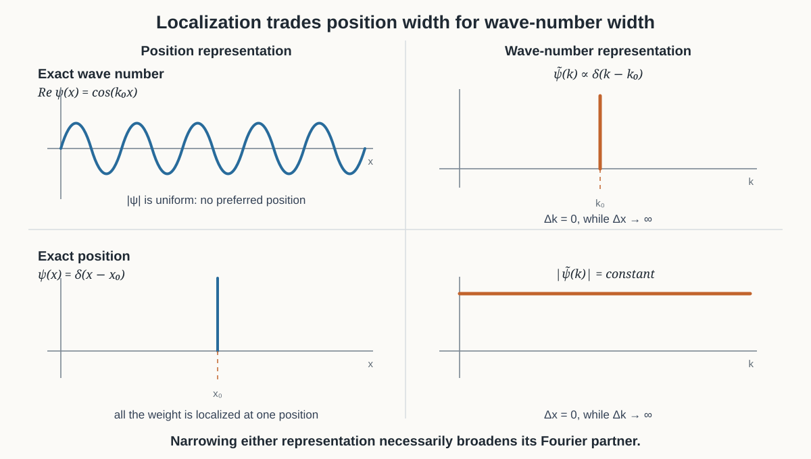

# From the $x$-$k$ Commutator to the Heisenberg Uncertainty Principle

The $x$-$k$ commutator is the operator form of the structure behind the Heisenberg uncertainty principle. One often hears this described as "quantum fuzziness": a particle cannot have an arbitrarily definite position and momentum at the same time. More precisely, no normalized wavefunction can be made arbitrarily narrow in both position and wave number. Once wave number is associated with momentum, this becomes the physical position-momentum uncertainty relation.

The basic insight is already visible before doing any operator algebra. A pure plane wave has one exact wave number, but it extends uniformly through all of position space and therefore has no definite position. At the other extreme, an ideal spike has one exact position, but it must be assembled from every wave number and therefore has no definite wave number. These are ideal limiting cases rather than normalizable wavefunctions, but they make the tradeoff vivid.

```math
\psi_{k_0}(x)=Ae^{ik_0x}
\quad\Longleftrightarrow\quad
\widetilde\psi(k)\propto\delta(k-k_0),
```

while

```math
\psi_{x_0}(x)=\delta(x-x_0)
\quad\Longleftrightarrow\quad
\widetilde\psi(k)\propto e^{-ikx_0}.
```

The second Fourier transform has the same magnitude at every $k$. Thus exactness in one representation means complete spread in the other.



The sinusoid in the diagram is the real projection of the complex plane wave; the magnitude of the full complex wave is constant everywhere.

The commutator encodes this same Fourier tradeoff in operator form:

```math
[\hat X,\hat K]=iI.
```

It does not add a second, unrelated cause of uncertainty. It compresses the position-wave-number relationship already present in the Fourier representation into one algebraic identity.

## What the width $\Delta x$ means

Take a normalized function:

```math
\int_{-\infty}^{\infty}|\psi(x)|^2\,dx=1.
```

Divide the $x$-axis into narrow bins. For a bin centered at $x_i$,

```math
w_i
\approx
|\psi(x_i)|^2\,\delta x_{\mathrm{bin}}
```

is the area of the narrow rectangle under $|\psi|^2$. Because the function is normalized,

```math
\sum_i w_i=1.
```

Thus $w_i$ is that bin's share of the total area. If the function is centered at zero, its squared width is obtained by multiplying each bin's squared distance from zero by its share of the area and adding:

```math
(\Delta x)^2
\approx
\sum_i x_i^2w_i.
```

For example, if half the area lies at $x=-2$ and half at $x=2$,

```math
(\Delta x)^2
=
\frac12(-2)^2+
\frac12(2)^2
=4,
\qquad
\Delta x=2.
```

Making the bins infinitesimally narrow turns the sum into

```math
(\Delta x)^2
=
\int_{-\infty}^{\infty}
x^2|\psi(x)|^2\,dx.
```

For a function not centered at zero, first define its mean position,

```math
\bar x
=
\langle\hat X\rangle
=
\int_{-\infty}^{\infty}
x|\psi(x)|^2\,dx,
```

and measure every distance from $\bar x$:

```math
(\Delta x)^2
=
\int_{-\infty}^{\infty}
(x-\bar x)^2|\psi(x)|^2\,dx.
```

Since the position operator acts as

```math
(\hat X\psi)(x)=x\psi(x),
```

the same definition can be written

```math
\Delta x
=
\left\|
(\hat X-\bar x I)\psi
\right\|.
```

This does **not** say that $\hat X$ generates the displacement $\Delta x$. It says that multiplying the function by its displacement from the mean and taking the norm calculates the function's width.

In the wave-number representation, the parallel definitions are

```math
\bar k
=
\int_{-\infty}^{\infty}
k|\widetilde\psi(k)|^2\,dk
```

and

```math
(\Delta k)^2
=
\int_{-\infty}^{\infty}
(k-\bar k)^2|\widetilde\psi(k)|^2\,dk.
```

Because

```math
\hat K=-i\frac{d}{dx}
```

in the position representation, and because the Fourier transform preserves the norm, the same width is

```math
\Delta k
=
\left\|
(\hat K-\bar k I)\psi
\right\|.
```

## Deriving the $x$-$k$ uncertainty relation

The following derivation applies to normalized packets for which both widths are finite. The exact plane wave and exact spike above are limiting pictures, not ordinary normalizable packets.

Define the centered operators

```math
\hat A:=\hat X-\bar x I,
\qquad
\hat B:=\hat K-\bar k I.
```

Then

```math
\Delta x=\|\hat A\psi\|,
\qquad
\Delta k=\|\hat B\psi\|.
```

The Cauchy--Schwarz inequality gives

```math
\Delta x\,\Delta k
=
\|\hat A\psi\|\,\|\hat B\psi\|
\ge
\left|
\langle\hat A\psi,\hat B\psi\rangle
\right|.
```

The magnitude of a complex number is at least as large as the magnitude of its imaginary part, so

```math
\Delta x\,\Delta k
\ge
\left|
\operatorname{Im}
\langle\hat A\psi,\hat B\psi\rangle
\right|.
```

Let

```math
z:=\langle\hat A\psi,\hat B\psi\rangle.
```

Then

```math
2i\operatorname{Im}z
=
z-z^*.
```

Because $\hat A$ and $\hat B$ are self-adjoint,

```math
\begin{aligned}
z-z^*
&=
\langle\psi,\hat A\hat B\psi\rangle
-
\langle\psi,\hat B\hat A\psi\rangle
\\
&=
\langle\psi,[\hat A,\hat B]\psi\rangle.
\end{aligned}
```

Subtracting constants does not change a commutator, so

```math
[\hat A,\hat B]
=
[\hat X,\hat K].
```

Therefore

```math
\Delta x\,\Delta k
\ge
\frac12
\left|
\langle\psi,[\hat X,\hat K]\psi\rangle
\right|.
```

In the position representation,

```math
\hat X=x,
\qquad
\hat K=-i\frac{d}{dx}.
```

Acting on $\psi$,

```math
\begin{aligned}
[\hat X,\hat K]\psi
&=
x(-i\psi')
-
\left(-i\frac{d}{dx}\right)(x\psi)
\\
&=
-ix\psi'
+
i(\psi+x\psi')
\\
&=
i\psi.
\end{aligned}
```

Hence

```math
[\hat X,\hat K]=iI.
```

For a normalized function,

```math
\left|
\langle\psi,iI\psi\rangle
\right|
=1,
```

and therefore

```math
\boxed{
\Delta x\,\Delta k
\ge
\frac12.
}
```

A Gaussian packet reaches equality. Every other admissible shape has a larger product of widths.

## From wave number to physical momentum

The wave-number operator generates spatial translations:

```math
T_x(a)
=
e^{-ia\hat K},
\qquad
(T_x(a)\psi)(x)=\psi(x-a).
```

In mechanics, momentum is the quantity associated with spatial translation symmetry: it is the physical generator of translations. Thus $\hat P$ and $\hat K$ express the same generator with different units. Introduce a scale constant $\alpha$ and require both descriptions to produce the same translation for every $a$:

```math
T_x(a)
=
e^{-ia\hat K}
=
e^{-ia\hat P/\alpha}.
```

Their infinitesimal generators must therefore satisfy

```math
\hat P=\alpha\hat K,
\qquad
p=\alpha k.
```

The constant $\alpha$ must have units of momentum times length, which are units of action. Symmetry fixes the proportionality in form, but not its numerical scale. The experimentally observed Planck--de Broglie relation fixes that scale as

```math
\alpha=\hbar,
```

so

```math
\hat P=\hbar\hat K,
\qquad
p=\hbar k.
```

The $x$-$k$ commutator consequently becomes the canonical position-momentum commutation relation:

```math
[\hat X,\hat P]
=
\hbar[\hat X,\hat K]
=
i\hbar I.
```

Because

```math
\Delta p=\hbar\Delta k,
```

the wave uncertainty relation becomes

```math
\boxed{
\Delta x\,\Delta p
\ge
\frac{\hbar}{2}.
}
```

For a nonrelativistic particle of fixed mass, $p=mv$, so this can also be translated into a position-velocity tradeoff. The fundamental relation, however, is between position and momentum.

## What quantum mechanics adds

The relation

```math
\Delta x\,\Delta k\ge\frac12
```

is a fact about Fourier-conjugate wave descriptions and applies to classical waves as well. Quantum mechanics adds the claim that the wavefunction is the state and that $\hat X$ and $\hat P$ represent physical observables. The widths $\Delta x$ and $\Delta p$ then describe the spreads of possible measurement outcomes, turning a wave-localization theorem into the Heisenberg uncertainty principle.

In canonical quantum mechanics, the canonical commutation relation can also be adopted as one of the theory's foundational postulates:

```math
[\hat X_i,\hat P_j]
=
i\hbar\delta_{ij}I,
```

with

```math
[\hat X_i,\hat X_j]=0,
\qquad
[\hat P_i,\hat P_j]=0.
```

Together with the Hilbert-space description of states, the probability rule, and a law of time evolution, these relations generate much of the familiar operator formalism. The commutator alone does not determine the Hamiltonian or supply the entire theory, but it can serve as a foundational entry point rather than merely as a consequence calculated afterward.
