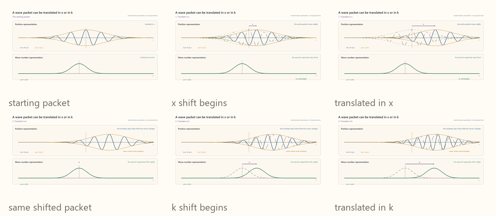
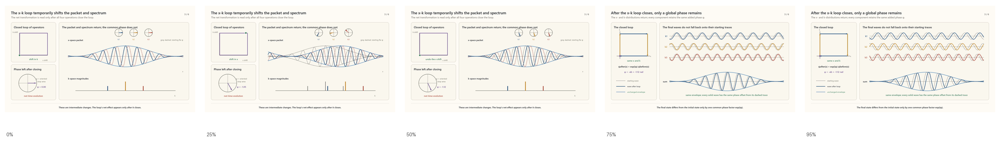
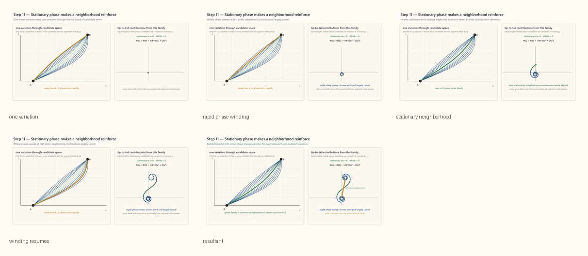

#### Canonical commutator
Once we have a \(wave\) function representation of translational symmetry, we may note that we can translate a function not only in the direction we set out to represent, $x$, but also in the wave number, $k$.



[Open MP4: symmetry-ccr-x-k-translations.mp4](../../content/drafts/animations/symmetry-ccr-x-k-translations.mp4)

Our representation reprepresents a larger symmetry group that includes translation in $k$. However, unlike independent translation directions, $x$ and $k$ translation do *not* commute. To see this, consider the action of traversing a finite loop in $x$-$k$ space. First, write a single mode in the $x$ representation:

```math
\psi_{k_0}(x)
=
e^{ik_0x}.
```

The same mode in the $k$ representation is:

```math
\widetilde\psi_{k_0}(k)
=
\sqrt{2\pi}\,\delta(k-k_0),
```

where $\delta$ means a unit-integral spike at $k_0$.

Define the $x$ translation operator in the $x$ representation:

```math
(T_x(a)\psi_{k_0})(x)
=
\psi_{k_0}(x-a).
```

Define the $k$ translation operator in the $k$ representation:

```math
(T_k(b)\widetilde\psi_{k_0})(k)
=
\widetilde\psi_{k_0}(k-b).
```

In order to carry out the translations, we have to choose either the position or wave number basis. Let's choose position:

```math
(T_k(b)\psi)(x)
=
\left(e^{ib\hat X}\psi\right)(x)
=
e^{ibx}\psi(x).
```
Here $T_x(a)$ shifts $x$ by $a$, while $T_k(b)$ shifts $k$ by $b$. Acting in the two possible orders,

```math
(T_x(a)T_k(b)\psi_k)(x)
=
e^{i(k+b)(x-a)},
```

but

```math
(T_k(b)T_x(a)\psi_k)(x)
=
e^{ibx}e^{ik(x-a)}.
```

Therefore

```math
T_x(a)T_k(b)\psi_k
=
e^{-iab}T_k(b)T_x(a)\psi_k,
```

so the two shifts fail to commute by the phase factor $e^{-iab}$, or simply, $e^{i\phi}$. Here $\phi$ is the phase angle, the parameter of phase transformations. 



[Open MP4: symmetry-ccr-loop-global-phase.mp4](../../content/drafts/animations/symmetry-ccr-loop-global-phase.mp4)

The phase transformation $e^{i\phi}I$ is obtained by exponentiating the generator $iI$. Therefore, the commutator is

```math
[\hat X,\hat K]
=
iI.
```

This is the $x$-$k$ **canonical commutator**. 


#### Phase advance and stationarity
The **action principle** provides a method for finding paths, or histories, a system will take in reality by considering all possible paths and finding the one for which some quantity -- we call it action, and it is constructed from elements of physical symmetry -- is **staionary**, that is, is some extreme, typically a minimum. Specifically, a stationary path is the one for which neighboring paths do not vary action to first order. In quantum mechanics we will associate wave with phase as:

```math
\Phi[\gamma]
=
\frac{S[\gamma]}{\hbar},
\qquad
\mathcal A[\gamma]
\propto
e^{iS[\gamma]/\hbar}.
```

But before we justify that association, waves provide a ready-made method for finding the stationary path. We can find the phase accumulation along a path, and for the path that is stationary, the waves phases interfere constructively, whereas away from the stationary they tend to cancel out. Every possible path is taken, but those that cancel contribute less to overall "ray" describing the wave propagation. If we take the wave to be complex valued, and assign each possible path some complex value, we see that ray that persists is precisely the stationary path, as illustrated in the by plotting the complex contributions from each candidate path:



[Open MP4: candidate paths and their tip-to-tail complex contributions](../../content/drafts/animations/symmetry-step11-stationary-phase-neighborhood.mp4)

This insight is the basis Huyghen's principle formulated in the 1600s and for ray optics. But it's real importance emerges in quantum mechanics in Feynmans "path integral formulation" where every possible path, even for what behaves as a particle, has some probability of being obeserved, and the most likely path is the stationary one. The fact that macroscopic objects only appear to take one physically allowable path is then seen merely as the limit when:

```math
\frac{S_{\mathrm{characteristic}}}{\hbar}
\sim
\frac{mvL}{\hbar}
\gg
1.
```


If we transform one state into another under a unitary transformation, we may deform $x$-$k$ space so as to preclude a distance metric, but the canonical commutator remains remains the *area* invariant that describles all **canonical transformations**. This concept of an invariant area appears in classical mechanics when describing the evolution of ensembles of states.

In quantum mechanics, where the wave function is not a familiar wave in a medium that can have any amplitude but is an encoding of the probability of measuring a particle-like entity, we make the association that the action a particle would have along a given path is related to the wave function phase by:

[S = hphi] 

from which it follows that:

[P-hat = hK-hat]

the canonical commutation relation becomes:

```math
[\hat X,\hat P]
=
i\hbar I.
```

This encodes both the form of Schroedinger's equation for the time evolution of a state and the Heisenberg uncertainty principle that forbids perfect resolution of position and momentum simultaneously. 

These are applications of the CCR that we will dive into in much greater depth. The essential point at the moment is that, because waves are the natural representation of translational symmetry, the canonical commutator that relates the full translation/wave-number/phase symmetry group constitutes a geometric structure that pervades theories of mechanics.
