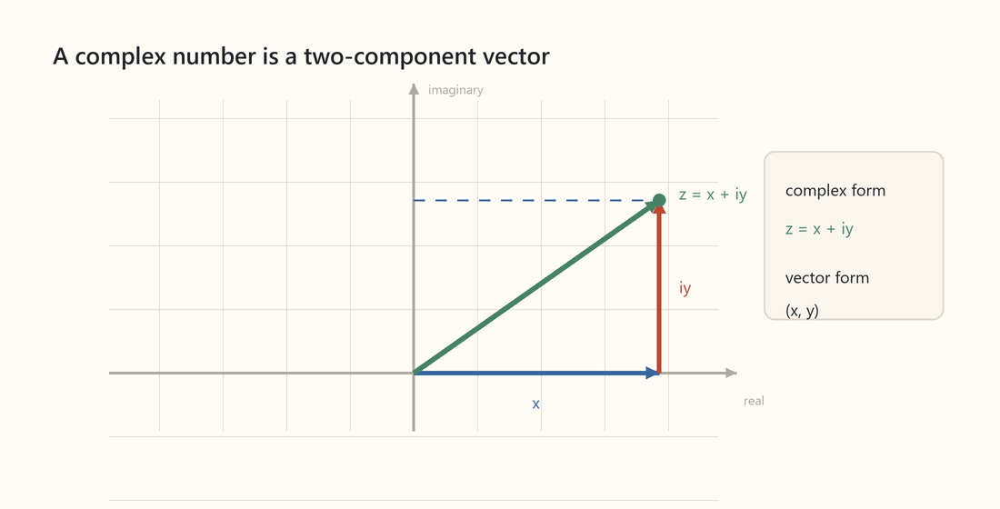
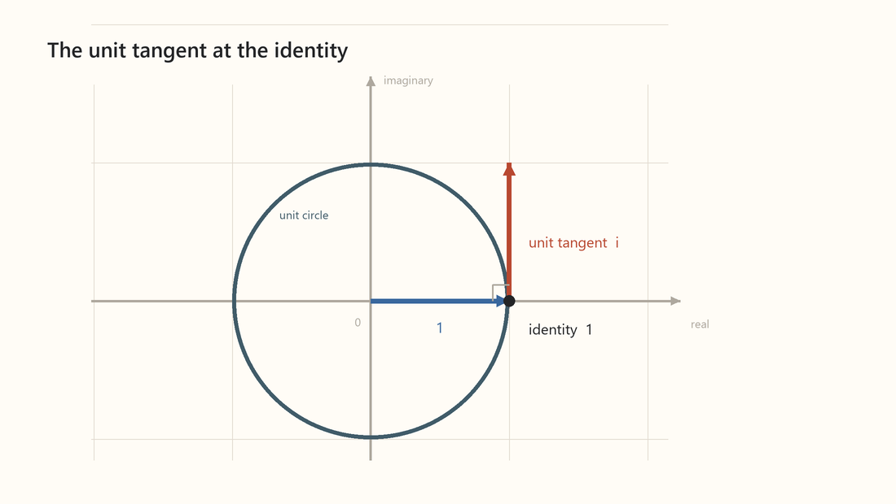

#### Complex exponential and waves
We asserted above that the complex exponential function describes a plane wave. Let's explain that and generally build some intuition around the complex exponential function. A single parameter complex exponential, $e^itheta$, describes a circle. It is a way to repackage the rotation operator we have aleady seen:

```math
e^{i\theta}
\quad\longleftrightarrow\quad
e^{\theta J}
=
R(\theta)
=
\begin{pmatrix}
\cos\theta & -\sin\theta\\
\sin\theta & \cos\theta
\end{pmatrix},
\qquad
J
=
\begin{pmatrix}
0 & -1\\
1 & 0
\end{pmatrix}.
```

$i$ is the generator of rotation in this 1-dimensional complex representation and plays the role $J$ did in the 2-dimensional representation:

```math
i^2=-1
\quad\longleftrightarrow\quad
J^2
=
\begin{pmatrix}
0 & -1\\
1 & 0
\end{pmatrix}^{\!2}
=
-I.
```
How is it possible to replace a $2x2$ matrix with a single number $i$? The answer is that $i$ has two real-number degrees of freedom. That is, we define a complex number $z$:

```math
z:=x+iy,
```

thus a complex number is mapped to a vector in the complex plane.



What action does multiplication by $i$ have at the identity vector $1$.

Here:

```math
\begin{aligned}
z&=1=1+0i\\
z_{\mathrm{tan}}&=zi=1\cdot i=i=0+1i
\end{aligned}
```

This is a vector in the complex plane that is perpendicular to the identity.



This is exactly the action the $J$ matrix generator had in 2-dimensions, which we already argued exponentiates to rotation. Let's redo that argument here, as it leads to a gratifying result. Since multiplication by $i$ produces the tangent vector at every point and the tangent vector is the geometric version of the derivative, we have:

```math
\frac{dz}{d\theta}=i\,z(\theta)
```

With $z(0)=1$, solving this differential equation we then have:

```math
z(\theta)=e^{i\theta}
```

At $\theta=\pi$, halfway around the unit circle, we then have:
```math
e^{i\pi}=-1
```

This is Euler's identity, magically relating three of nature's most fundamental constants. As Sal Khan said, "if this does not blow your mind, you really have no emotion."

We can map $z$ back to $x,y$ coordinates and obtain Euler's formula:

```math
e^{i\theta}=\cos\theta+i\sin\theta
```

Engineers often represent real sinusoidal waves with complex exponentials using this formula and reading off the real part as multiplying exponentials is algebraically simpler than multiplying trigonometric functions.

Now let us turn from circular motion to a travelling complex wave. Here $\theta$ is given as a function of the direction-of-travel coordinate $x$ and time $t$:

```math
\theta(x,t)=kx-\omega t,
\qquad
z(x,t)=Ae^{i\theta(x,t)}=Ae^{i(kx-\omega t)}.
```
