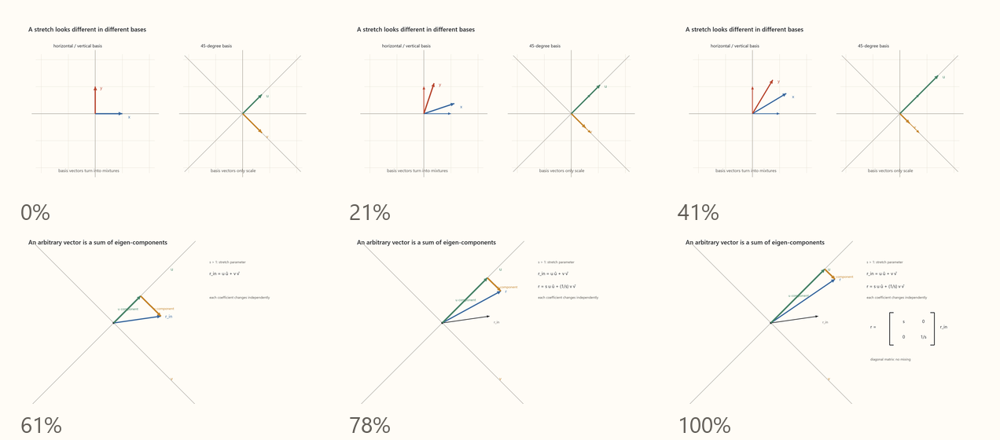

# Eigenbasis Section — Working Stabs

## Preferred Compression

#### Eigenfunctions of Translation

Imagine a rubber sheet. We pulls on the corners of the sheet. What does this do to the $x$- and $y$-axes? It rotates them toward each other while stretching them. Now, instead choose $x$ and $y$ to be diagonal axes. Now, when we stretch, the long axis is stretched but not rotated and the short axis is compressed but not rotated. The action of this stretching action on these axes is now simple scalar multiplication of the original vector. Once the basis vectors no longer mix, any other vector, that is, any linear combination of the basis vectors, transforms by having its components scaled independently:

Letting $s$ be the the factor by which the long-axis component is stretched, we can see how the transformation of an arbitrary vector $\mathbf{r}$ simplifies in the using the system's natural basis:

| $(x,y)$ basis: components mix | $(u,v)$ basis: components do not mix |
|---|---|
| $\displaystyle \begin{aligned}\mathbf r&=\frac12\begin{pmatrix}s+s^{-1}&s-s^{-1}\\s-s^{-1}&s+s^{-1}\end{pmatrix}\mathbf r_{\mathrm{in}}\\&=\frac12\left[(s+s^{-1})x+(s-s^{-1})y\right]\hat{\mathbf x}\\&\quad+\frac12\left[(s-s^{-1})x+(s+s^{-1})y\right]\hat{\mathbf y}\end{aligned}$ | $\displaystyle \begin{aligned}\mathbf r&=\begin{pmatrix}s&0\\0&s^{-1}\end{pmatrix}\mathbf r_{\mathrm{in}}\\&=su\hat{\mathbf u}+s^{-1}v\hat{\mathbf v}\end{aligned}$ |

This is readily understood visually:

[Open MP4: symmetry-eigenbasis-stretch.mp4](../../content/drafts/animations/symmetry-eigenbasis-stretch.mp4)

Now for a bunch of terminology. The "natural" bassis vectors are the **eigenvectors**, the values a transformation scales these by are the **eigenvalues** and the basis they form is called the **eigenbasis**. When the "vectors" are functions, we call them **eigenfunctions**. As the transformation matrix is diagonal in the eigenbasis, the procedure for finding and eigenbasis is typically called **diagonalization**. Often, a rot procedure can diagnolize a matrix, making subsequent matrix multiplication problems computationally tractable. This approach is pervasive in countless areas of engineering and data analysis due to its computational clarity, but our interest is different. 

##### The Importance of Eigenfunctions of Operators in Physics
Consider rolling a die. As it tumbles in the air, the value is unknown until the "reveal operator" is applied and the die settles into a single face up. We can represent our "ignorance" by assigning equal probabilities to the six possible faces:

$$
\mathbf p=(p_1,p_2,p_3,p_4,p_5,p_6)
=\left(\frac16,\frac16,\frac16,\frac16,\frac16,\frac16\right).
$$

Next we can define an observable whose eigenvectors represent the possible faces and whose eigenvalues are their numerical values. Writing $|n\rangle$ for the basis vector associated with face $n$:

$$
\hat D=\sum_{n=1}^{6}n|n\rangle\langle n|
=\operatorname{diag}(1,2,3,4,5,6),
\qquad \hat D|n\rangle=n|n\rangle.
$$

The projector associated with outcome $n$ is $P_n=|n\rangle\langle n|$, while the probability of that outcome is simply the corresponding entry in our probability list:

$$
\Pr(n)=p_n=\frac16.
$$

The faces of the die are the eigenvectors of this operator and their value are the eigenvalues. 

This is surely an odd way to describe such a statistical situation, but it is, in fact, the way modern physics \(quantum mechanics specifically\) formulates its predictions. There, the state is a complex-valued function over the eigenvalues of a given observable \(whose squared magnitude is the probability distribution over that observable.\) The difference between this theory and that of the die is that in the case of the die, thinking of the state as a superposition of possibilities was just a proxy for our ignorance about the "actual" state, whereas, in quantum mechanics, the notion that there is a physically definite state hidden by our ignorance is demonstrably false. The arguments for this are subtle and spectacular, and we will be best served to wait until we turn to quantum mechanics to give them their due, but if we take this idea of "existing in a superposition" on faith for the time being, then we have a compelling reason to study the eigenfunctions of operators in symmetry representations. 

*Things that can be observed take the eigenvalues of operators on representations of nature's complete symmetry.* 

This tells you several things. First, the only admissible questions the theory addresses are those that are represented by operators in a symmetry representation. We can ask for a state's coordinate value in a symmetry representation and its generator value. Other "physical" questions, say, "is this liquid or solid?" are emergent properties of complex systems. Second, the eigenfunctions of a given operator are a basis for the distribution of amplitudes over possible outcomes. Thus to know that the eigenfunction of the translation operator is a plane wave is to understand the essence of the very state that physics examines evolving over time. If someone were to ask "what is physics about?" we might reply "predicting the future from the current state." If then pressed, "state of what?" our answer would be "a superposition of plane waves into packets." Third, the constituents of that state, **particles**, are categorized by eigenvalues of operators that are invariant under symmetry transformation. That is, to be an "electron" is to inhabit a subspace of the state space carrying a representation of nature's complete symmetry that is labeled by the eigenvalues of Casimir operators(which manifest as characteristic features of the wave packets and their evolution.\) This expresses the truism that, in a theory that only answers questions that can be posed as operators on a symmetry representation, the kind of object something is must invariant under that symmetry.
