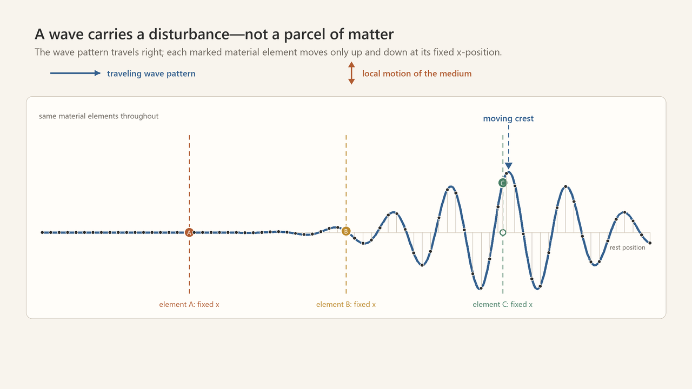
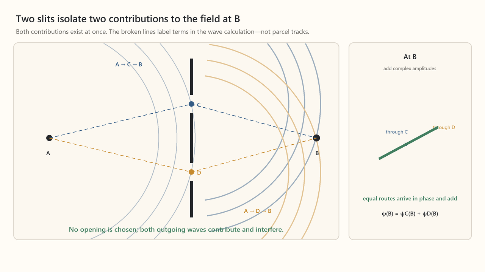
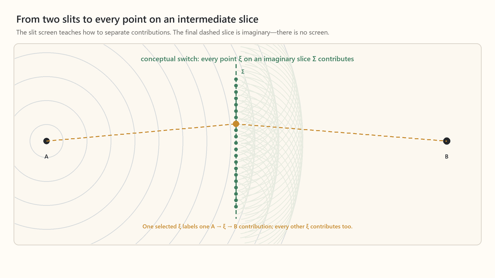
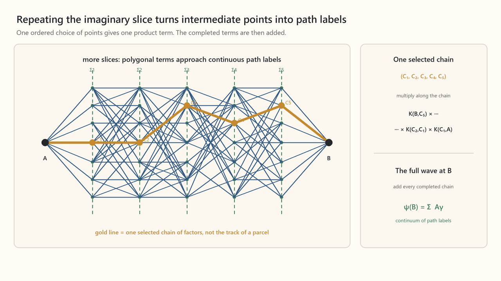
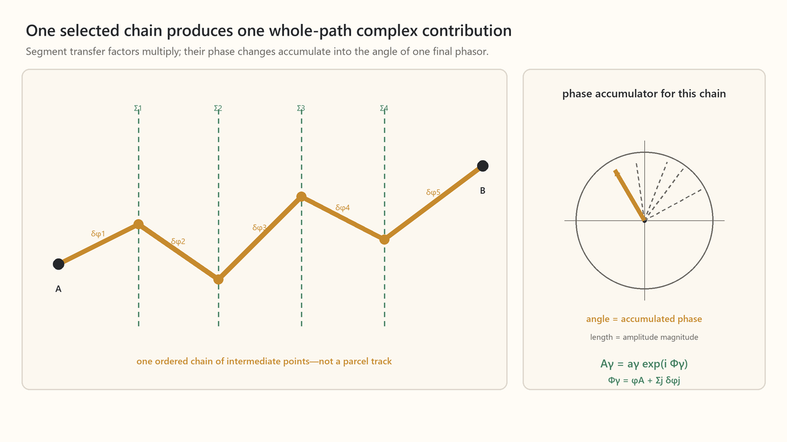
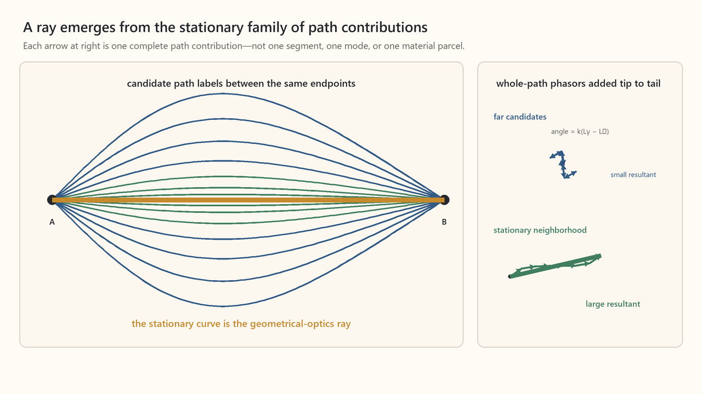

# What an “Alternate Path” Means for a Wave

This note is meant to resolve one sticking point before the manuscript proceeds from travelling waves to Huygens, interference, stationary phase, and rays.

The answer in one sentence is:

> A wave path is not the route followed by a parcel of matter. It is an ordered choice of intermediate locations that labels one term in a repeated wave-propagation calculation.

Everything below is an attempt to make that sentence visible.

## First remove the parcel picture

Consider a pulse travelling along a string. Each marked piece of the string moves mostly up and down while remaining at the same horizontal coordinate. The crest travels from left to right, but the material located at the crest continually changes.



[Open MP4: the disturbance travels, not a parcel of matter](../../content/drafts/animations/symmetry-wave-paths-1-disturbance-not-parcel.mp4)

Sound works similarly. A region of the medium is set oscillating by its neighbors and then drives its later neighbors. A molecule near the source does not ordinarily travel all the way to the listener. What propagates is a disturbance, together with its amplitude, phase, and energy. For an electromagnetic wave there is not even a material medium whose parcels could make the journey.

Therefore, when we later draw

```math
A\longrightarrow C\longrightarrow B,
```

we must not read it as “a little bit of wave matter left $A$, visited $C$, and arrived at $B$.”

## Hold one frequency fixed

To avoid mixing two different kinds of sums, begin with a monochromatic scalar wave. Its real disturbance can be written

```math
u(\mathbf r,t)
=
\operatorname{Re}\!\left[
\psi(\mathbf r)e^{-i\omega t}
\right].
```

The shared time oscillation $e^{-i\omega t}$ has been separated out. The complex function $\psi(\mathbf r)$ now records the amplitude magnitude and phase at every spatial point for this one frequency.

This note will sum contributions associated with different intermediate **locations**. We will not separately Fourier-decompose the field into spatial modes here; the transfer rule already contains the spatial wave-number and direction content needed for diffraction. The mode sum and the location sum are different decompositions and can be considered separately.

## Two slits give the first concrete meaning of “alternate”

Let $A$ be a source, let $C$ and $D$ be two narrow openings, and let $B$ be a point where we ask for the resulting field.

The incident wave reaches both openings. Both openings then contribute an outgoing wave. At $B$, the two complex contributions are added:

```math
\psi(B)
=
\mathcal A_C(B)
+
\mathcal A_D(B).
```



[Open MP4: two slits, two contributions](../../content/drafts/animations/symmetry-wave-paths-2-two-slits-two-contributions.mp4)

No slit is chosen. The two outgoing disturbances exist simultaneously and interfere.

The animation places $B$ on the symmetry axis, so the two equal-length routes arrive there with equal phase and add constructively. At another observation point their phases would generally differ, but the rule would be the same: add both complete complex contributions.

The broken lines $A\to C\to B$ and $A\to D\to B$ merely label the two terms. They tell us which intermediate opening was used when factoring each contribution. They are not tracks left by matter.

### What is being factored

For the cleanest version of the argument, assume a forward-propagating scalar-wave model in which the wave data on one transverse surface determine the wave on the next through a linear transfer rule. More general classical wave equations require slightly richer surface data, but the meaning of a path label remains the same.

Let $K(Q,P)$ mean the complex transfer factor that carries a wave contribution from point $P$ to point $Q$. It includes both a magnitude change and a phase change. Then

```math
\mathcal A_C(B)
=
K(B,C)K(C,A)\psi(A),
```

and

```math
\mathcal A_D(B)
=
K(B,D)K(D,A)\psi(A).
```

Along either route, the transfer factors are **multiplied** because successive propagation maps compose: the second transfer acts on the result of the first. Across the two alternative openings, the completed complex contributions are **added** because waves superpose.

That distinction will remain in force:

```math
\boxed{
\begin{aligned}
\text{along one selected chain:}&\quad\text{multiply},\\
\text{across alternative chains:}&\quad\text{add}.
\end{aligned}
}
```

The useful Feynman-style provocation is: if two slits isolate two alternatives, why stop at two? Why not three slits, then every possible slit? That question is exactly the bridge from familiar interference to Huygens and, after one further repetition, to path labels.

## From two slits to Huygens

Now add more openings. Each opening produces another outgoing wave, and all of them overlap at $B$.



[Open MP4: from slits to an imaginary Huygens slice](../../content/drafts/animations/symmetry-wave-paths-3-slits-to-huygens-slice.mp4)

The equation that records this picture is:

```math
\psi(B)
\approx
\sum_j
K(B,C_j)K(C_j,A)\psi(A)\,\Delta C_j.
```

Here $\Delta C_j$ is the small width, or area in three dimensions, represented by opening $C_j$. Making the openings more numerous makes the discrete sum resemble an integral over intermediate locations.

But this is only the pedagogical route to the integral, not its logical derivation. Free propagation already has an integral over every point of an intermediate surface. In this model, a thin screen is represented by a transmission function $m(\xi)$ inserted into that integral:

```math
\psi(B)
=
\int_\Sigma
K(B,\xi)m(\xi)K(\xi,A)\psi(A)
\,d\xi.
```

For two narrow slits, $m(\xi)$ vanishes almost everywhere except near $C$ and $D$, so the integral reduces approximately to the two contributions shown above. With no screen, $m(\xi)=1$, and every intermediate point contributes. The slits therefore select a small number of terms in this intermediate-point decomposition; they do not create the decomposition or prove its existence by becoming infinitely numerous.

In homogeneous free space, those contributions are ordinarily not visible as separate tracks. We see only their resulting field. Away from the ray limit, diffraction and spreading make their collective interference visible; in the short-wavelength limit, contributions away from a stationary route largely cancel when they are added at the observation point, leaving a ray-like result. Distinct routes become separately legible only when apertures, boundaries, variations in the medium, or the source geometry separate them. The cancellation is therefore not something that happens “instantly” along each route. It is a property of the complex sum used to obtain the field at a specified endpoint.

At this point we make an explicit conceptual switch. We do **not** claim that a physical screen literally turns into empty space merely by acquiring infinitely many slits. We remove the screen and introduce an imaginary intermediate surface $\Sigma$ solely to organize the calculation. The wave passes through this surface whether or not we draw it.

Every point $\xi$ on $\Sigma$ carries some local complex field and contributes in turn to $B$:

```math
\psi(B)
=
\int_\Sigma
K(B,\xi)\psi(\xi)
\,d\xi.
```

For a source at $A$,

```math
\psi(\xi)
=
K(\xi,A)\psi(A),
```

so

```math
\psi(B)
=
\int_\Sigma
K(B,\xi)K(\xi,A)\psi(A)
\,d\xi.
```

This is the useful content of the Huygens picture: treat every intermediate point as contributing a secondary wave to the later field. The physical wave is still one continuous field. The separation into contributions through the different points of $\Sigma$ is our way of calculating it.

With only one intermediate surface, each $\xi$ labels a two-segment contribution

```math
A\longrightarrow\xi\longrightarrow B.
```

This is already “all slits,” but it is not yet “all paths.”

## Repeating the imaginary surface produces path labels

Insert several imaginary surfaces $\Sigma_1,\Sigma_2,\ldots,\Sigma_N$ between $A$ and $B$. On each surface, integrate over every possible intermediate point:

```math
\begin{aligned}
\psi(B)
=
\int_{\Sigma_N}\!dC_N
\cdots
\int_{\Sigma_1}\!dC_1
\;&K(B,C_N)
K(C_N,C_{N-1})
\cdots\\
&\cdots
K(C_2,C_1)
K(C_1,A)
\psi(A).
\end{aligned}
```

One ordered tuple

```math
\gamma
=
(C_1,C_2,\ldots,C_N)
```

selects one term from these nested integrals. Connecting the selected points makes a polygonal line:

```math
A
\longrightarrow
C_1
\longrightarrow
C_2
\longrightarrow
\cdots
\longrightarrow
C_N
\longrightarrow
B.
```

That polygonal line is what we call one candidate path. More precisely, it is a visual label for one ordered product of propagation factors.



[Open MP4: repeated slices create path labels](../../content/drafts/animations/symmetry-wave-paths-4-repeated-slices-create-paths.mp4)

As the surfaces become more numerous and more closely spaced, the polygonal labels approach continuous curves. In this one-way construction, the phrase “sum over all paths” is shorthand for the continuum limit of the repeated integrals over all forward-going paths admitted by the chosen slices.

This is the key logical step:

```math
\boxed{
\text{repeated linear wave propagation}
\quad\longrightarrow\quad
\text{a sum whose terms are indexed by paths}.
}
```

We have not discovered tiny objects secretly following those lines. We have expanded one wave-propagation calculation into terms, and ordered sequences of intermediate locations happen to be the labels of those terms.

## What one complete path contributes

Set

```math
C_0=A,
\qquad
C_{N+1}=B.
```

The contribution labeled by one path $\gamma$ is

```math
\mathcal A_\gamma
=
\psi(A)
\prod_{j=0}^{N}
K(C_{j+1},C_j).
```

Each segment factor is a complex number. Write it as

```math
K(C_{j+1},C_j)
=
r_j e^{i\delta\phi_j}.
```

Also write the source value as

```math
\psi(A)
=
a_Ae^{i\phi_A}.
```

Multiplying the successive segment factors gives

```math
\begin{aligned}
\mathcal A_\gamma
&=
a_Ae^{i\phi_A}
\prod_j
r_j e^{i\delta\phi_j}
\\
&=
a_A\left(\prod_j r_j\right)
e^{i\left(\phi_A+\sum_j\delta\phi_j\right)}
\\
&=
a_\gamma e^{i\Phi_\gamma},
\end{aligned}
```

where

```math
a_\gamma
=
a_A\prod_jr_j,
```

and

```math
\Phi_\gamma
=
\phi_A
+
\sum_j\delta\phi_j.
```

The source phase $\phi_A$ is common to every candidate and may be set to zero as our phase reference. With that choice, the segment phases accumulate along one path as

```math
\Phi_\gamma
=
\sum_j\delta\phi_j.
```



[Open MP4: one selected path produces one complete complex contribution](../../content/drafts/animations/symmetry-wave-paths-5-one-path-one-phasor.mp4)

The full complex contribution $\mathcal A_\gamma$ is one arrow in the complex plane:

- its length is the amplitude magnitude $a_\gamma$;
- its angle is the accumulated phase $\Phi_\gamma$.

Across different paths, we do **not** add the phase angles $\Phi_\gamma$. We add the complete complex arrows:

```math
\psi(B)
=
\sum_\gamma
\mathcal A_\gamma
=
\sum_\gamma
a_\gamma e^{i\Phi_\gamma}.
```

In the exact continuum construction, the sum symbol becomes a multiple integral or a path-integral notation. The idea is unchanged.

## How a ray emerges

In a uniform isotropic medium, propagation through a segment of length $\ell$ contributes a phase proportional to that length. Schematically,

```math
K(Q,P)
\sim
r(Q,P)e^{ik\ell(Q,P)}.
```

Therefore a polygonal path of total length $L_\gamma$ has accumulated phase

```math
\Phi_\gamma
=
kL_\gamma,
```

apart from endpoint and convention-dependent terms.

When the wavelength is short compared with the scale of the setup, even modest changes in path length cause large changes in phase. Provided the amplitude weights vary slowly by comparison, the arrows belonging to most neighboring paths point in rapidly changing directions and largely cancel. Near a stationary path $\gamma_\star$, the phase does not change to first order:

```math
\delta\Phi[\gamma_\star]
=
0.
```

The arrows from that narrow neighborhood remain comparatively aligned and reinforce. The stationary curve $\gamma_\star$ is the geometrical-optics ray from $A$ to $B$; its neighborhood supplies a leading contribution to the wave.



[Open MP4: whole-path phases interfere into a ray](../../content/drafts/animations/symmetry-wave-paths-6-path-phases-form-ray.mp4)

The ray is therefore not the trajectory of a material parcel. It is the stationary path whose neighborhood supplies a leading contribution to the wave in the short-wavelength approximation.

## The complete ladder

The conceptual progression is

```math
\begin{aligned}
\text{two slits}
&\longrightarrow
\text{two complex contributions at }B,
\\
\text{many slits}
&\longrightarrow
\text{many complex contributions at }B,
\\
\text{one imaginary surface}
&\longrightarrow
\text{all two-segment contributions},
\\
\text{many imaginary surfaces}
&\longrightarrow
\text{contributions indexed by polygonal paths},
\\
\text{continuous limit}
&\longrightarrow
\text{a sum over forward-going continuous paths},
\\
\text{short-wavelength stationary phase}
&\longrightarrow
\text{a ray}.
\end{aligned}
```

Or, in plain English:

> The double slit teaches a strictly wave-mechanical fact: the field at $B$ is a sum of phase-bearing contributions through intermediate locations. Repeating that decomposition turns the locations into path labels. A ray is the stationary path whose neighboring contributions reinforce.

## What this does and does not share with Feynman’s construction

In the optical picture above, the imaginary surfaces are usually ordered along a direction of propagation. In Feynman’s construction they are successive time slices, and a history specifies a position on every time slice. The algebraic move is the same:

```math
\text{compose through intermediate slices}
\quad+
\text{sum over the intermediate possibilities}.
```

The phase factor attached to a quantum history is later written

```math
e^{iS[\gamma]/\hbar}.
```

That later physical identification is not needed to understand what a path label is. The classical slit and Huygens pictures already supply the essential logic: interference is the addition of complex contributions associated with alternative intermediate routes.

The analogy should not be pushed into an ontological claim. In ordinary classical wave mechanics, paths are a decomposition of a field calculation. The quantum path integral likewise does not assert that one of its integration paths is an observed intermediate trajectory.

## Questions this note should now make answerable

**Did a parcel of matter travel along $A\to C\to B$?**

No. Material elements oscillate locally. The line labels a factored contribution to the field at $B$.

**Did the wave choose $C$ rather than $D$?**

No. Both contributions exist and are added.

**Are we literally adding paths?**

No. We add complete complex amplitudes. Paths label the terms being added.

**Why does a path appear at all?**

Because repeatedly composing propagation through intermediate surfaces requires one intermediate location on every surface. An ordered choice of those locations has the geometry of a polygonal path.

**Are the phases of different paths added?**

No. Segment phases add *within* one path because the segment factors multiply. Complete complex amplitudes add *across* different paths.

**Is this the same as summing the Fourier modes of a packet?**

No. This note held one temporal frequency fixed and did not separately perform a spatial-mode sum. The propagation kernel already contains the spatial-mode content needed for diffraction. A mode sum and a path sum are different decompositions and should not be blended while learning what either one means.

**What is a ray?**

It is the stationary path whose neighborhood supplies a leading contribution in the short-wavelength approximation—not the route of a persisting piece of wave matter.

## A technical guardrail for later

The compact surface equation used above is exact for suitable one-way or first-order propagation kernels. Within that setting, geometric and “obliquity” factors can be absorbed into the schematic transfer factor $K$. More generally, the propagated data may have to include both the field and its normal derivative. This changes the weights and form of the transfer rule, not the path-label logic or the distinction between multiplication along a chain and addition across chains.

## Possible bridge from the present manuscript text

> Now let us ask how a disturbance originating at point $A$ contributes to the wave amplitude observed at point $B$. Picture first a barrier with two openings, $C$ and $D$. The wave reaches both, and each opening contributes a new wave at $B$; the two contributions add with their phases. If we remove the screen and treat every point on an imaginary intermediate surface as contributing, and then repeat that surface many times, each ordered choice of intermediate points labels one candidate path through the wave calculation.
