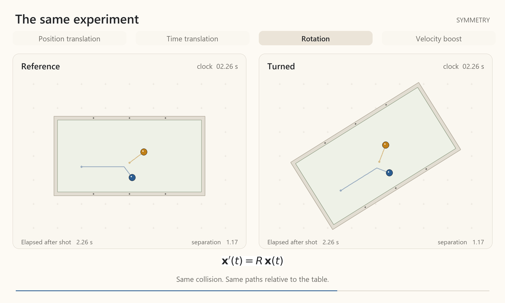

# Symmetry
Strike a pool ball with a cue, and the balls move in an expected way. Move the table over a few feet, and the balls move in recognizably the same way. Wait a few minutes, and the balls move in the same way. Turn the pool table a few degrees, and the balls still move the same way. Put the pool table on a train at constant velocity, and, again, the balls move in the same way. These are the manifest "symmetries" of the world we live in -- position and time translation, rotation, and velocity "boosts."

[Open MP4: symmetry-pool-table.mp4](../../../content/drafts/animations/symmetry-pool-table.mp4)

*Symmetry transforms don't change how pool balls behave*

Our pool game illustrates what we mean by symmetries of physical behavior, but why should we start our story here? We will argue that symmetry constrains both the laws that govern physical evolution and the classification of the objects that undergo that evolution.

Perhaps the notion that the pool balls behave "in the same way" could be quantified, and such a quantification might figure into the equations that describe a system's evolution. In fact, we will see that whenever a symmetry is present there are quantifiable *invariants* that express what is left the same by the symmetry. Setting aside symmetry for a moment, there is a principle of classical mechanics that associates a quantity, called **action**, with each candidate history of a physical system. The physically valid history makes this quantity stationary -- often a minimum, but not necessarily.[^1] We might imagine this quantity would itself be an invariant of our symmetry, and in the relativistic theories we will study, it is.[^2] In ideal cases, it is minus the time measured by a clock following the object's candidate path times the object's mass times the speed of light squared.[^3] However, the classical description is not fundamental. Quantum mechanics generally predicts probabilities for possible outcomes rather than a single certain outcome. What we observe as the predictable behavior of pool balls is the regime in which those probabilities are concentrated very narrowly around the classical predictions.[^4] Quantum mechanics replaces the evolution of an "object following a path" with a new object that is something like a wave. For an isolated system, a given initial wave function and laws of evolution determine a single wave-function history. This history can itself be obtained by making an action stationary. In relativistic quantum theory, this action can be written as an invariant of space and time symmetry.[^5]

Symmetry not only constrains physical behavior but also the form that the "things" behaving can take. We suggested above that in quantum mechanics, the state that evolves is a "wave function." Several aspects of the way this function transforms under different symmetry actions will classify the "thing" in question, or, in the parlance of modern physics, the kind of **particle**, such as an electron or photon. (We will have to wait until later to delve into the curiosity of how a function can be associated with particles.) These transformation properties serve to specify the **mass**, **spin**, **charge** and other related quantities that together provide a particle's classification. Mass appears in the characteristic relationship between a free particle's spatial and temporal frequencies -- its wave's rates of repetition in space and time. Relativistic spacetime symmetry, including boosts, dictates the form of this relationship, while the mass value is determined empirically. Spin characterizes how the type of value returned by the wave function, such as a vector, transforms under rotations.[^6] Charge labels how a particle's state transforms under additional symmetries that are not manifest in our pool table example.[^7]

The term "symmetry" in this context may not at first glance seem like the same concept as, say, a triangle's symmetry, but it is precisely the same concept, as we will see. Let's then start with the humble triangle and build up the vocabulary about symmetry we need to tell the rest of our story.

[^1]: "Stationary" means that the first-order change in action vanishes under small changes to the candidate history. For a particle path, its starting and ending positions and times are held fixed. A minimum or maximum satisfies this condition, but a stationary history can also be neither.

[^2]: Observers moving at different constant velocities calculate different Newtonian free-particle actions. Their answers differ by the same amount for every candidate path connecting the same starting and ending events. They therefore agree on which paths make the action stationary. The relativistic actions used here can instead be written as invariants.

[^3]: The time measured along a candidate path is its **proper time**. This expression applies to a free particle with mass and to its motion in a fixed gravitational field. Other interactions generally add terms.

[^4]: This concerns quantum theory's predictions. Whether definite paths underlie those predictions is a separate question of interpretation, which we are leaving open here.

[^5]: This action belongs to a history of the whole quantum state, rather than one particle path. In quantum field theory, the wave function becomes a wave functional, a function of entire arrangements of fields. A field specifies a physical quantity at each point in space.

[^6]: Some particles' wave functions change sign after a full rotation, and return after two. This sign change is observable only through comparison with an unrotated contribution. Spin describes the full rotation behavior, not just this sign change.

[^7]: For electric charge, the relevant transformations change the wave function's phase -- its complex angle -- along with the electromagnetic field's mathematical description. Observable predictions stay the same. An unobservable phase shift of the wave function alone does not explain charge, since neutral particles have that freedom too.
