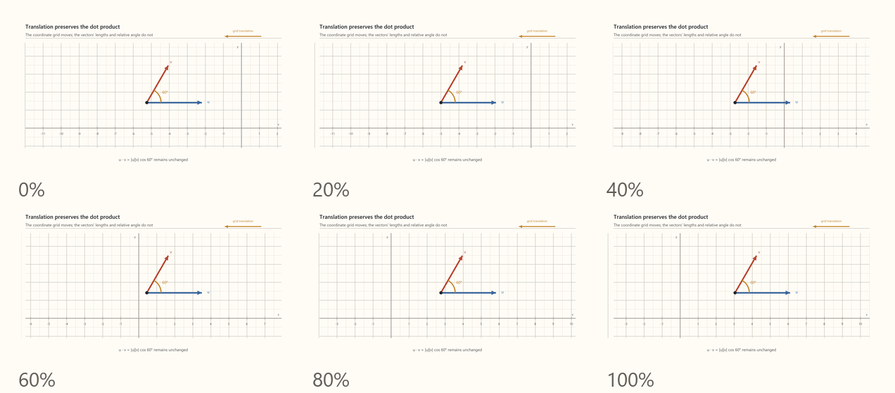

Let's use these new mathematical tools and find the eigenfunctions of translational symmetry. The general form of the eigenvalue equation is:

```math
M\mathbf v
=
\lambda\mathbf v.
```

Generalizing this to the infinite dimensional case:

```math
\hat O f
=
\lambda f.
```
where hat signifies an operator.

For translational symmetry, then, we have:
```math
\frac{d}{dx}f(x)
=
\lambda f(x).
```

This is the first, simplest differential equation one learns in calculus, whose solution is the exponential function:

```math
f(x)
=
Ce^{\lambda x}.
```

Check that:

```math
\frac{d}{dx}\left(Ce^{\lambda x}\right)
=
\lambda Ce^{\lambda x}
=
\lambda f(x).
```

Now, there is an ambiguity here in the choice of the constant $\lambda$. We can divide that choice into two cases, real and imaginary. To settle this, we'll take a different tack. Something we know about translation, is that it preserves the dot product between vectors:



[Open MP4: symmetry-translation-inner-product.mp4](../../content/drafts/animations/symmetry-translation-inner-product.mp4)

Since functions are but infinite dimensional vectors, we can extend this idea to functions. For a vector, we write the dot product in terms of components:

```math
\mathbf u\cdot\mathbf v
=
\sum_{j=1}^{n}u_jv_j.
```

As we add more and more components, this sum simply becomes an integral, making one more generalization to extend the dot product to complex-valued vectors/functions, we then have the definition of the **inner product**

```math
\langle f,g\rangle
=
\int_{-\infty}^{\infty}
f^*(x)g(x)\,dx,
\qquad
\|f\|^2
=
\langle f,f\rangle.
```

Because the translation operator preserves the inner product of functions, the magnitude of its finite-translation eigenvalue must be $1$:

```math
\begin{aligned}
\langle T_a f,T_a g\rangle
&=
\int_{-\infty}^{\infty}
f^*(x-a)g(x-a)\,dx
\\
&=
\int_{-\infty}^{\infty}
f^*(u)g(u)\,du
\\
&=
\langle f,g\rangle,
\end{aligned}
\qquad u=x-a.
```

For the eigenfunction $f$, translation by $a$ gives

```math
T_a
=
e^{-a\frac{d}{dx}},
\qquad
T_a f
=
e^{-a\lambda}f.
```

Therefore

```math
\begin{aligned}
\langle f,f\rangle
&=
\langle T_a f,T_a f\rangle
\\
&=
\left\langle e^{-a\lambda}f,e^{-a\lambda}f\right\rangle
\\
&=
\left|e^{-a\lambda}\right|^2
\langle f,f\rangle.
\end{aligned}
```

For nonzero $f$,

```math
\left|e^{-a\lambda}\right|
=
1.
```

Writing $\lambda=\alpha+ik$, where $\alpha$ and $k$ are real,

```math
\left|e^{-a\lambda}\right|
=
e^{-a\alpha}
=
1
\quad\text{for every }a
\quad\Longrightarrow\quad
\alpha=0
\quad\Longrightarrow\quad
\lambda=ik.
```

This in turns requires $\lambda$ to be imaginary. and the eigenfunctions of the translation operator are complex exponentials:

```math
f_k(x)
=
Ce^{ikx},
\qquad
(T_a f_k)(x)
=
e^{-ika}f_k(x).
```

These results have several important implications.
- Complex exponential functions are, as engineers well know, a way to encode everyday waves. That plane waves are eigenfunctions of translation makes sense: one can "see" that their uniform periodicity means translation changes them only by a phase.
- The idea that, by thinking in terms of symmetry representation, "waves," rather than "tiny rigid bodies" are the "constituents of state" is the view adopted by modern physics.
- In the complex function representation, translation acts as a unitary transformation—the complex analogue of a rotation. It preserves inner products and therefore preserves the norms and distinguishability of states, while remaining reversible. When squared norm is later interpreted as total probability, this means that a normalized state retians a total probability of $1$ as it evolves.
